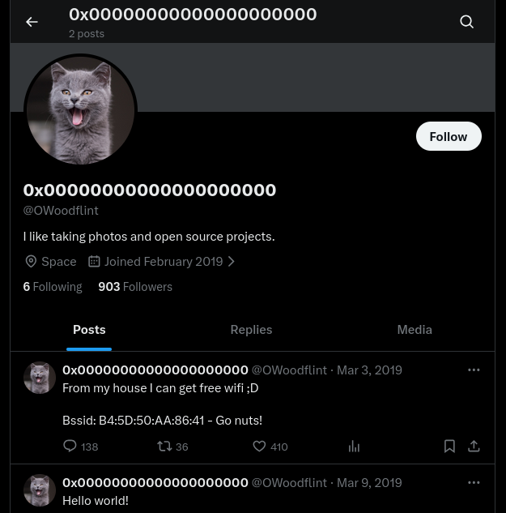
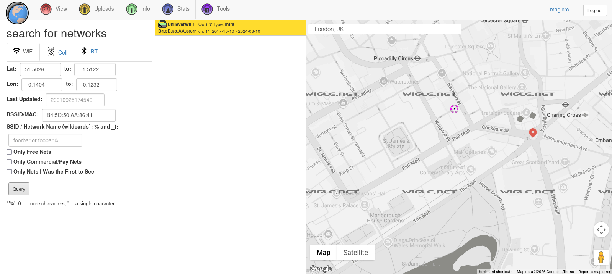

| Category          | Details                                     |
|-------------------|---------------------------------------------|
| 📝 **Name**       | [OhSINT](https://tryhackme.com/room/ohsint) |  
| 🏷 **Type**       | THM Challenge                               |
| 🖥 **OS**         | Linux                                       |
| 🎯 **Difficulty** | Easy                                        |
| 📁 **Tags**       | OSINT                                       |

## Task 1: OhSINT

### What is this user's avatar of?

#### Download image attached to challenge


#### Read `WindowsXP_1551719014755.jpg` metadata 
```
┌──(magicrc㉿perun)-[~/attack/THM OhSINT]
└─$ exiftool -a -u -g1 WindowsXP_1551719014755.jpg 
---- ExifTool ----
ExifTool Version Number         : 13.25
---- System ----
File Name                       : WindowsXP_1551719014755.jpg
Directory                       : .
File Size                       : 234 kB
File Modification Date/Time     : 2026:01:25 13:47:09+01:00
File Access Date/Time           : 2026:01:25 13:48:57+01:00
File Inode Change Date/Time     : 2026:01:25 13:47:09+01:00
File Permissions                : -rw-rw-r--
---- File ----
File Type                       : JPEG
File Type Extension             : jpg
MIME Type                       : image/jpeg
Image Width                     : 1920
Image Height                    : 1080
Encoding Process                : Baseline DCT, Huffman coding
Bits Per Sample                 : 8
Color Components                : 3
Y Cb Cr Sub Sampling            : YCbCr4:2:0 (2 2)
---- XMP-x ----
XMP Toolkit                     : Image::ExifTool 11.27
---- XMP-exif ----
GPS Latitude                    : 54 deg 17' 41.27" N
GPS Longitude                   : 2 deg 15' 1.33" W
---- XMP-tiff ----
Copyright                       : OWoodflint
---- Composite ----
Image Size                      : 1920x1080
Megapixels                      : 2.1
GPS Latitude Ref                : North
GPS Longitude Ref               : West
GPS Position                    : 54 deg 17' 41.27" N, 2 deg 15' 1.33" W
```
We can see that `OWoodflint` is author of this image.

#### Check `OWoodflint` [X account](https://x.com/OWoodflint)


`OWoodflint` is using `cat` as his avatar.

### What city is this person in?

#### Access `OWoodfl1nt` GitHub `people_finder` repository
GitHub repository has been found with [Google query](https://www.google.com/search?q=OWoodflint).
```
┌──(magicrc㉿perun)-[~/attack/THM OhSINT]
└─$ curl https://raw.githubusercontent.com/OWoodfl1nt/people_finder/refs/heads/master/README.md
# people_finder

Hi all, I am from London, I like taking photos and open source projects. 

Follow me on twitter: @OWoodflint

This project is a new social network for taking photos in your home town.

Project starting soon! Email me if you want to help out: OWoodflint@gmail.com

https://oliverwoodflint.wordpress.com/
```
Bio states that this user is from `London`.

### What is the SSID of the WAP he connected to?

#### Discover BSSID in X post
BSSID of WiFi used by `OWoodflint` has been posted by him on X.
> From my house I can get free wifi ;D
> 
> Bssid: B4:5D:50:AA:86:41 - Go nuts!

#### Use `wigle.net` locate WiFI
We know already that `OWoodflint` is from London, thus we could narrow down search area to that city.



SSID of this WiFi is `UnileverWiFi`.

### What is his personal email address?
We already discovered this in GitHub repo

> Project starting soon! Email me if you want to help out: OWoodflint@gmail.com

### What site did you find his email address on?
We have found this in bio at `GitHub`.

### Where has he gone on holiday?

#### Visit `https://oliverwoodflint.wordpress.com/` mentioned in `people_finder` bio


> Im in New York right now [...]

### What is the person's password?
Password has been 'hidden' with `style="color:#ffffff;"` and it's visible previous screen, `pennYDr0pper.!`.
